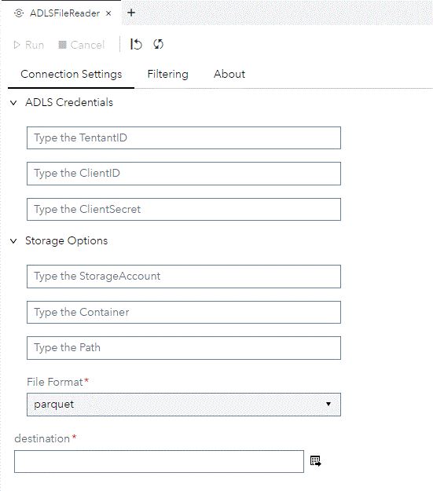
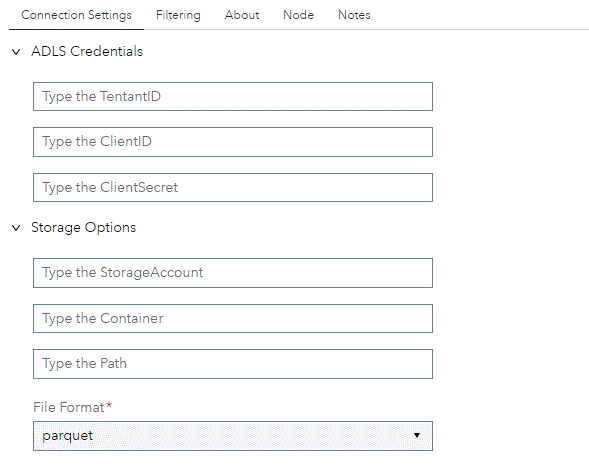
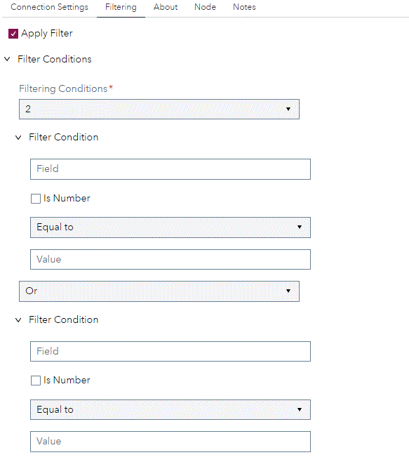
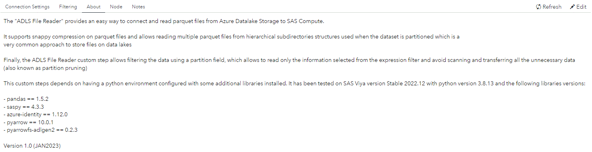

# ADLS File Reader

## Description

The "ADLS File Reader" provides an easy way to connect and read parquet files from Azure Datalake Storage to SAS Compute or CAS.

It supports snappy compression on parquet files and allows reading multiple parquet files from hierarchical subdirectories structures used when the dataset is partitioned which is a 
very common approach to store files on data lakes

Finally, the ADLS File Reader custom step allows filtering the data using a partition field, which allows to read only the information selected from the expression filter and avoid scanning and transferring all the unnecessary data (also known as partition pruning)

Version 1.0 (JAN2023)

## User Interface

* ### Options tab ###

   | Standalone mode | Flow mode |
   | --- | --- |                
   |   |  |

* ### Filtering tab ###

   

* ### About tab ###

   

## Requirements

This customs step depends on having a python environment configured with the following libraries installed: 
> - pandas
> - saspy
> - azure-identity
> - pyarrow
> - pyarrowfs-adlgen2

Tested on Viya version Stable 2022.12 with python environment version 3.8.13 and the libraries versions:
> - pandas == 1.5.2
> - saspy == 4.3.3
> - azure-identity == 1.12.0
> - pyarrow == 10.0.1
> - pyarrowfs-adlgen2 == 0.2.3

## Usage

## Change Log

* Version 1.0 (JAN2023)
    * Initial version