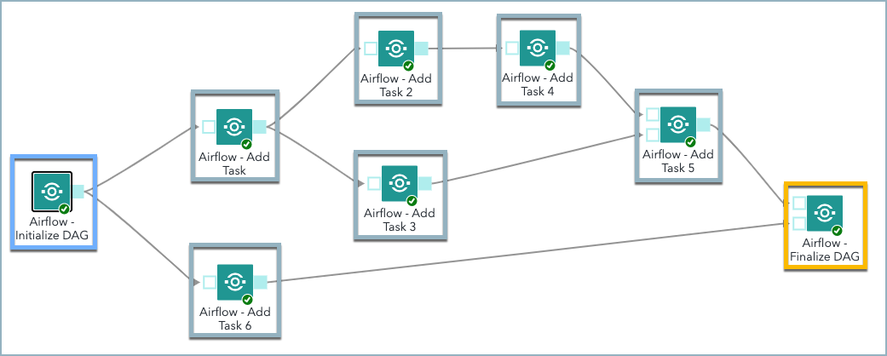
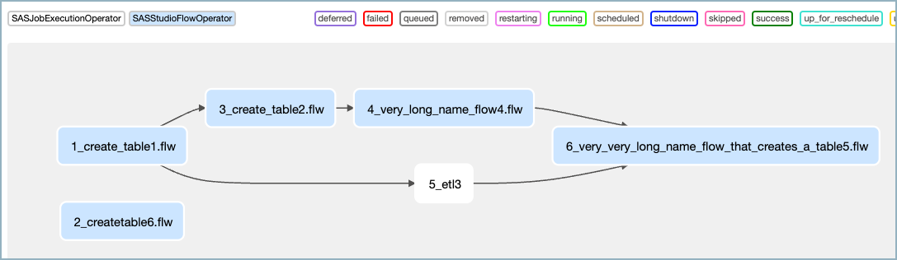
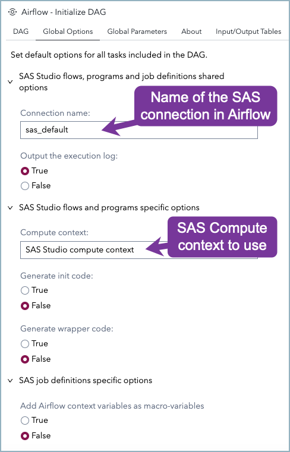
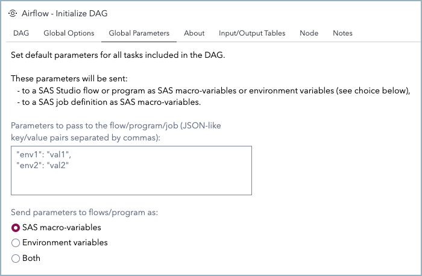
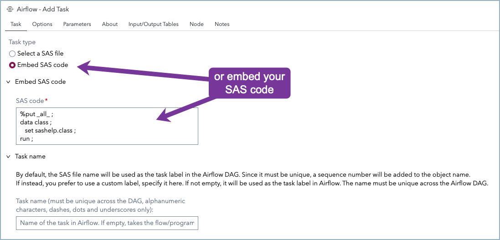
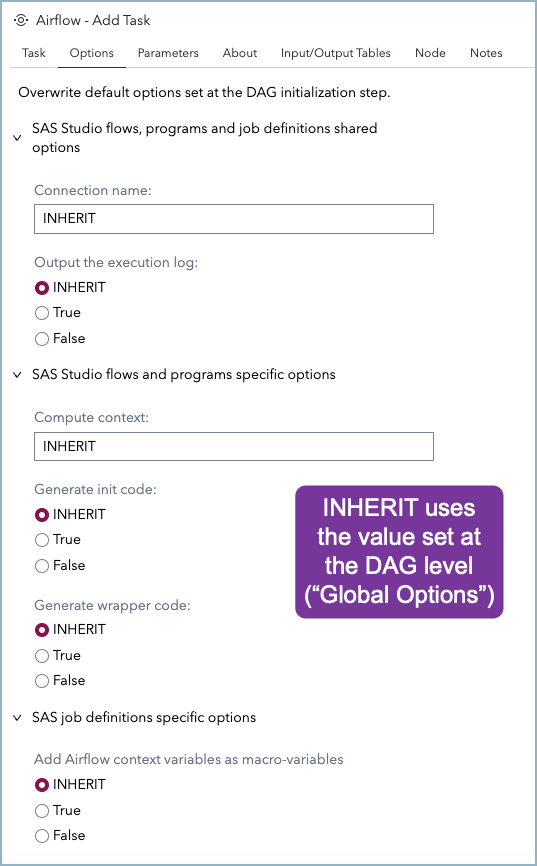
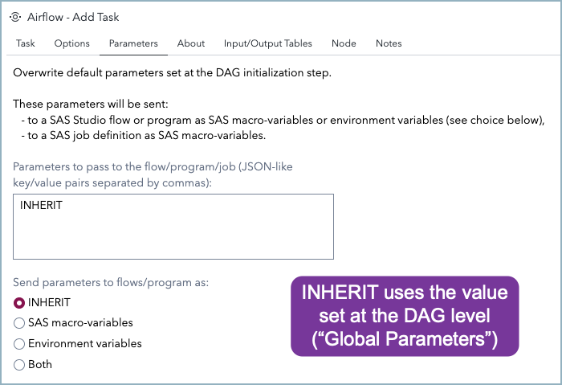

# Generate Airflow DAG

## Description

The "**Airflow - Generate DAG**" tool is a set of three Custom Steps that enables SAS Studio Flow users to create an **Airflow DAG** (Directed Acyclic Graph) directly from a SAS Studio Flow, by including and orchestrating **SAS Studio Flows** and **SAS Job Definitions**. The generated Airflow DAG contains references to Airflow providers that are part of the [SAS Airflow Provider](https://github.com/sassoftware/sas-airflow-provider).

"***In Airflow, a DAG is a collection of all the tasks you want to run, organized in a way that reflects their relationships and dependencies.***

***A DAG is defined in a Python script, which represents the DAGs structure (tasks and their dependencies) as code.***"

The three steps used together allow the creation of the Python script that represents a DAG. The Python script needs to be copied in Airflow's DAG folder.

See below for an example of a Python script that defines a DAG.

## User Interface

These three custom steps must be used in "Flow" mode. They are not designed to work in "Standalone" mode.

### Setup

The creation of a proper DAG from these 3 custom steps relies on the following principles:

* One SAS Studio Flow creates one DAG by writing a Python script required by Airflow
* There is only ONE "**Airflow - Initialize DAG**" step per flow
* There is at least one and potentially many "**Airflow - Add Task**" steps per flow
* There is only ONE "**Airflow - Finalize DAG**" step per flow
* "**Airflow - Initialize DAG**" must be the first step, doesn't accept any input, accepts one or more outputs
* "**Airflow - Add Task**" must have at least one input and one output even if it is the first task of a DAG or the last (if first or last then they have to be linked to "Initialize" or "Finalize")
* "**Airflow - Add Task**" allows a user to choose a Studio flow, a SAS program, a job definition or to write his own code
* "**Airflow - Add Task**" can have multiple inputs and multiple outputs
* "**Airflow - Finalize DAG**" must be the last step, accepts one or more inputs, doesn't accept any output
* The sequence of tasks (Studio flows, SAS programs, embedded code and/or job definitions) will be reflected in the Airflow DAG
* All steps in the flow are linked together

SAS Studio Flow creating an Airflow DAG Example:



Corresponding DAG in Airflow:



### "Airflow - Initialize DAG" Step

#### DAG Tab

Main properties of the DAG:


#### Global Options tab

Global options for all tasks in the DAG:



#### Global Parameters tab

Global parameters for all tasks in the DAG:



### "Airflow - Add Task" Step

#### Task tab

Main properties of the task:




#### Options tab

Local options for this task:



#### Parameters tab

Local parameters for this task:



### "Airflow - Finalize DAG" Step

There is nothing to set in the "Airflow - Finalize DAG" step.

## Usage


## Change Log and Requirements

| Version | Date      | Updates                                                          | Built on SAS Viya | SAS Airflow Provider Release |
| ------- | --------- | ---------------------------------------------------------------- | ----------------- | ---------------------------- |
| 1.3     | 30AUG2023 | New features provided by latest SAS Airflow Provider Release     | Stable 2023.07    | 0.0.7                        |
|         |           | Run SAS programs, embed SAS code, reuse SAS compute sessions,    |                   |                              |
|         |           | provide macro-variables, provide Airflow context variables, etc. |                   |                              |
| 1.2     | 26JUL2023 | Page rearrangement                                               | Stable 2023.07    | 0.0.5                        |
| 1.1     | 05APR2023 | UI standardization                                               | Stable 2023.03    | 0.0.1                        |
|         |           | DAG and task name validation                                     |                   |                              |
| 1.0     | 31MAR2023 | Initial version                                                  | Stable 2023.03    | 0.0.1                        |

## Installation

Download the latest three [Airflow - Generate DAG](./extras/Airflow_Generate_DAG_v1.3.zip) custom steps. Unzip it and upload them in a SAS Content Folder.

See [older versions](./extras/).

## Sample Airflow DAG

```python
# Licensed to the Apache Software Foundation (ASF) under one
# or more contributor license agreements.  See the NOTICE file
# distributed with this work for additional information
# regarding copyright ownership.  The ASF licenses this file
# to you under the Apache License, Version 2.0 (the
# "License"); you may not use this file except in compliance
# with the License.  You may obtain a copy of the License at
#
#   http://www.apache.org/licenses/LICENSE-2.0
#
# Unless required by applicable law or agreed to in writing,
# software distributed under the License is distributed on an
# "AS IS" BASIS, WITHOUT WARRANTIES OR CONDITIONS OF ANY
# KIND, either express or implied.  See the License for the
# specific language governing permissions and limitations
# under the License.

from datetime import datetime
from airflow import DAG, Dataset
from sas_airflow_provider.operators.sas_studioflow import SASStudioFlowOperator
from sas_airflow_provider.operators.sas_jobexecution import SASJobExecutionOperator

dag = DAG(dag_id="mydag",
          description="mydag's description",
          start_date=datetime(2023,3,27),
          tags=["demo","SAS Viya"],
          catchup=False)

task1 = SASStudioFlowOperator(task_id="1_create_table1.flw",
                              flow_path_type="content",
                              flow_path="/Public/flows/create_table1.flw",
                              compute_context="SAS Studio compute context",
                              connection_name="sas_default",
                              flow_exec_log=True,
                              flow_codegen_init_code=False,
                              flow_codegen_wrap_code=False,
                              dag=dag)

task2 = SASStudioFlowOperator(task_id="2_createtable6.flw",
                              flow_path_type="content",
                              flow_path="/Public/flows/cre?ate t#abl!e 6.flw",
                              compute_context="SAS Studio compute context",
                              connection_name="sas_default",
                              flow_exec_log=True,
                              flow_codegen_init_code=False,
                              flow_codegen_wrap_code=False,
                              dag=dag)

task3 = SASStudioFlowOperator(task_id="3_create_table2.flw",
                              flow_path_type="content",
                              flow_path="/Public/flows/create_table2.flw",
                              compute_context="SAS Studio compute context",
                              connection_name="sas_default",
                              flow_exec_log=True,
                              flow_codegen_init_code=False,
                              flow_codegen_wrap_code=False,
                              dag=dag)

task4 = SASStudioFlowOperator(task_id="4_very_long_name_flow4.flw",
                              flow_path_type="content",
                              flow_path="/Public/flows/very_long_name_flow4.flw",
                              compute_context="SAS Studio compute context",
                              connection_name="sas_default",
                              flow_exec_log=True,
                              flow_codegen_init_code=False,
                              flow_codegen_wrap_code=False,
                              dag=dag)

task5_params = {
   "env1": "val1"
}

task5 = SASJobExecutionOperator(task_id="5_etl3",
                              job_name="/Public/jobs/etl3",
                              connection_name="sas_default",
                              parameters=task5_params,
                              dag=dag)

task6 = SASStudioFlowOperator(task_id="6_very_very_long_name_flow_that_creates_a_table5.flw",
                              flow_path_type="content",
                              flow_path="/Public/flows/very_very_long_name_flow_that_creates_a_table5.flw",
                              compute_context="SAS Studio compute context",
                              connection_name="sas_default",
                              flow_exec_log=True,
                              flow_codegen_init_code=False,
                              flow_codegen_wrap_code=False,
                              dag=dag)

task1 >> task3
task3 >> task4
task1 >> task5
task4 >> task6
task5 >> task6
```
