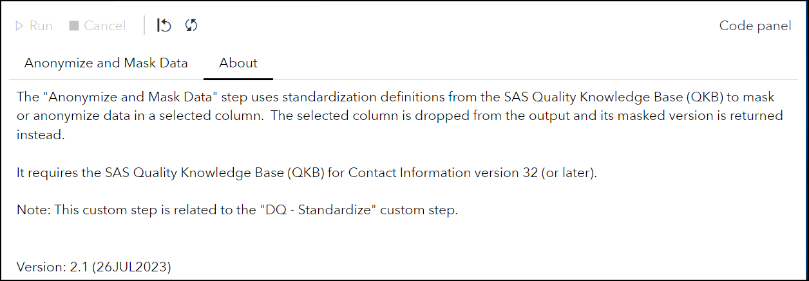
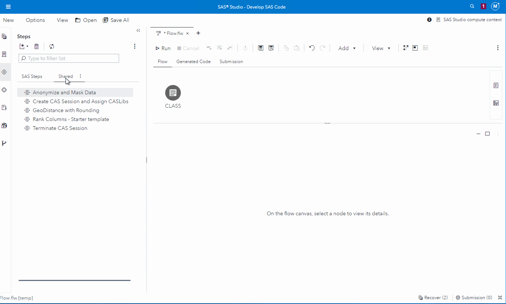

# Anonymize and Mask Data

## Description

The **Anonymize and Mask Data** custom step enables SAS Studio users to select a standardization definition from the [SAS Quality Knowledge Base (QKB)](https://support.sas.com/en/software/quality-knowledge-base-support.html#documentation) to mask or anonymize data in a selected column.  The selected column is dropped from the output and its masked version is returned instead.  For more information on how this custom step was built refer to [this blog](https://communities.sas.com/t5/SAS-Communities-Library/SAS-Viya-Using-a-SAS-Quality-Knowledge-QKB-Reference-Table-in-a/ta-p/886106)

Note: This custom step is related to the [DQ - Standardize](https://github.com/sassoftware/sas-studio-custom-steps/tree/main/DQStandardize) custom step.

## User Interface

* ### **Anonymize and Mask Data** tab ###

 * ### **About** tab ###

   

&nbsp;
## Requirements

* SAS Viya 2023.06 or later
* SAS Quality Knowledge Base for Contact Information version 32 or later

## Usage

## Change Log

* Version 2.1 (26JUL2023)
    * Updated Program code to create SASDQREF library if needed
* Version 2.0 (17JUL2023)
    * Updated step to use **DM_MKDEF** table from the **SASDQREF** library to populate drop-down lists for QKB locale and definition (SASDQREF library containing QKB metadata is available since SAS Viya 2023.06)
    * Drops the column that is being masked
* Version 1.1 (27SEP2022)
    * Made New Column control required
* Version 1.0 (15SEP2022)
    * Initial version
