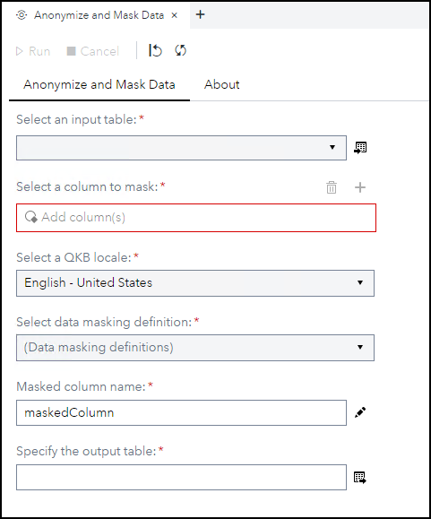
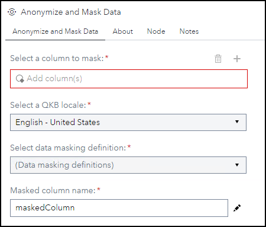

# Anonymize and Mask Data

## Description

The **Anonymize and Mask Data** custom step enables SAS Studio users to select a standardization definition from the [SAS Quality Knowledge Base (QKB)](https://support.sas.com/en/software/quality-knowledge-base-support.html#documentation) to mask or anonymize data in a selected column.  [This blog](https://communities.sas.com/t5/SAS-Communities-Library/Viya-2020-1-5-April-2021-Introducing-Custom-Steps-in-SAS-Studio/ta-p/744463) describes the creation of this custom step.  Note: The *About* tab was added after this blog was written.

## User Interface

* ### **Anonymize and Mask Data** tab ###

   | Standalone mode | Flow mode |
   | --- | --- |
   |  |  |

* ### **About** tab ###

   

## Requirements

* SAS Viya 2020.1.5 or later
* SAS Quality Knowledge Base for Contact Information version 32 or later

## Usage

## Change Log

* Version 1 (15SEP2022)
    * Initial version
