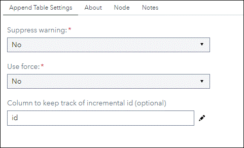
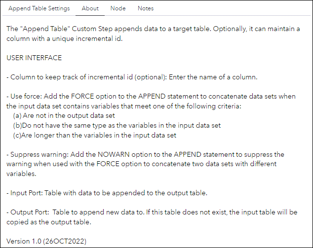

# Append Table

## Description

The "**Append Table**" Custom Step appends data to a target table. Optionally, it can maintain a column with a unique incremental id.

Version: 1.0 (26OCT2022)

## User Interface

* ### Append Table tab ###
   |

* ### About tab ###

   |

## Requirements

No special requirements. 
  
## Usage

### Append Table Settings

- **Column to keep track of incremental id (optional):** 
Enter the name of a column.

- **Use force:**
Add the FORCE option to the APPEND statement to concatenate data sets when the input data set contains variables that meet one of the following criteria:
   - Are not in the output data set
   - Do not have the same type as the variables in the input data set
   - Are longer than the variables in the input data set
###
- **Suppress warning :**
Add the NOWARN option to the APPEND statement to suppress the warning when used with the FORCE option to concatenate two data sets with different variables.

### Input Port
Table with data to be appended to the result table.

### Output Port
Table to append new data to. If this table does not exist, the input table will be copied as the result table.

## Change Log

* Version 1 (26OCT2022)
    * Initial version
