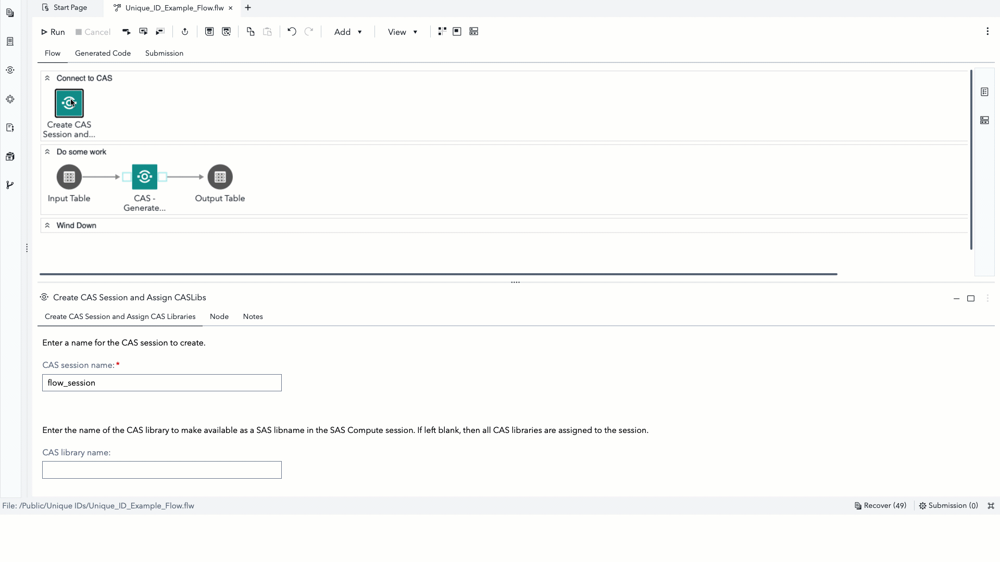
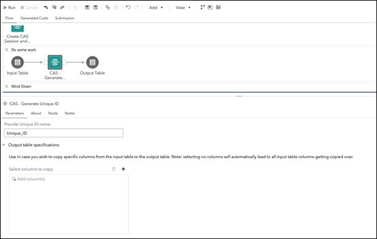

# CAS - Generate Unique ID

This custom step generates a new column containing a unique identifier (ID) per observation for a given input CAS table.

Since Cloud Analytics Services (CAS) processes across multiple threads, the conventional method of using the \_n\_  automatic variable (as used in SAS Compute) does not ensure uniqueness. 

There exists both a [workaround](https://communities.sas.com/t5/SAS-Communities-Library/Creating-a-unique-ID-with-CAS-DATA-Step/ta-p/644592) (concatenating the thread id with the \_n\_ variable) and a CAS action (included in all Viya offerings) to create a unique ID column.  This custom step makes use of the CAS action ([textmanagement.generateIds](https://go.documentation.sas.com/doc/en/pgmsascdc/default/casvtapg/n0qdvvymlj69d7n18dfvh6ipjn2k.htm#p1rs825m6ue07wn1tusdtru2vrc5)) to generate a unique ID.

**Here's a general idea of how this custom step works (the below is an animated GIF)**

## SAS Viya Version Support
Tested in Viya 4, Stable 2022.11

## Requirements

1. A SAS Viya 4 environment (monthly release 2022.11 or later) with SAS Studio Flows.

2. **At runtime: an active connection to CAS:** This custom step requires Cloud Analytics Services. Ensure you have an active CAS connection available prior to running the same.

## User Interface

### Parameters

1. Input port: connect an input CAS table to the input port.
2. Name desired for the unique ID column.
3. Optionally, select specific input table columns to copy to the output table.  If no columns are selected, note that all columns are copied.
4. Output port: connect an output table (which needs to be a CAS table) to the output port.

## Documentation
1. The [textmanagement.generateIds](https://go.documentation.sas.com/doc/en/pgmsascdc/default/casvtapg/n0qdvvymlj69d7n18dfvh6ipjn2k.htm#p1rs825m6ue07wn1tusdtru2vrc5) CAS action.
2. Even though it dates a while back, this [SGF 2009 paper](http://support.sas.com/resources/papers/proceedings09/022-2009.pdf) proved useful in drafting some string substitution code within the custom step.  It helps answer the question: which is the best way to check if a macro variable is blank? 
3. This [SAS Communities article](https://communities.sas.com/t5/SAS-Communities-Library/Creating-a-unique-ID-with-CAS-DATA-Step/ta-p/644592) provides the workaround mentioned earlier. 

## Installation & Usage
1. Refer to the [steps listed here](https://github.com/sassoftware/sas-studio-custom-steps#getting-started---making-a-custom-step-from-this-repository-available-in-sas-studio).

## Change Log
Version : 1.0.   (02FEB2023)

