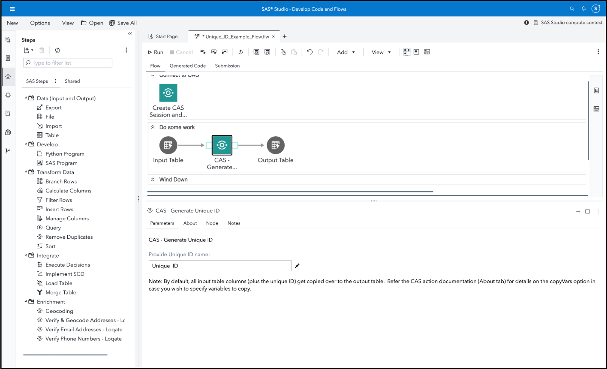

# CAS - Generate Unique ID

This custom step generates a new column containing a unique identifier (ID) per observation for a given input CAS table.

Since Cloud Analytics Services (CAS) processes across multiple threads, the conventional method of using the \_N\_  automatic variable (as used in SAS Compute) does not ensure uniqueness. 

There exists both a [workaround](https://communities.sas.com/t5/SAS-Communities-Library/Creating-a-unique-ID-with-CAS-DATA-Step/ta-p/644592) (concatenating the thread id with the \_N\_ variable) and a CAS action (included in all Viya offerings) to create a unique ID column.  This custom step makes use of the CAS action ([textmanagement.generateIds](https://go.documentation.sas.com/doc/en/pgmsascdc/default/casvtapg/n0qdvvymlj69d7n18dfvh6ipjn2k.htm#p1rs825m6ue07wn1tusdtru2vrc5)) to generate a unique ID.

**Here's a general idea of how this custom step works (the below is an animated GIF)**


## SAS Viya Version Support
Tested in Viya 4, Stable 2022.11

## Requirements

1. A SAS Viya 4 environment (monthly release 2022.11 or later) with SAS Studio Flows.

2. **At runtime: an active connection to CAS:** This custom step requires Cloud Analytics Services. Ensure you have an active CAS connection available prior to running the same.

## User Interface

### Parameters



1. Input port: connect an input CAS table to the input port.
2. Name desired for the unique ID column.
3. Output port: connect an output table (which needs to be a CAS table) to the output port.

Note that all columns are copied over to the output table.

#### Run-time control

**Note that this is optional.**  In some scenarios, you may wish to dynamically control whether this custom step runs or simply "passes through" without doing anything, in a SAS Studio session. The following macro variable is set to initialize with a value of 1 by default, indicating an "enabled" status and allowing the custom step to run.

Refer this [blog](https://communities.sas.com/t5/SAS-Communities-Library/Switch-on-switch-off-run-time-control-of-SAS-Studio-Custom-Steps/ta-p/885526) for more details on the concept.

```sas
/* To demonstrate the default value of the trigger macro variable */;

&_gui_run_trigger.=1;
```

If you wish to control execution of this custom step programmatically (within a session, including execution of a SAS Studio Flow), make sure that an upstream SAS program sets the macro variable to 0.  Setting the value to 0 "disables" the execution of this custom step.

For example, to "disable" this step, run the following code upstream:

```sas
%global _gui_run_trigger;
%let _gui_run_trigger=0;
```

To "enable" this step again, run the following (it's assumed that this has already been set as a global variable):

```sas
%let _gui_run_trigger=1;
```

**Important:** Be aware that disabling this step means that none of its main execution code will run, and any  downstream code which was dependent on this code may fail.  Change this setting only if it aligns with the objective of your SAS Studio program.


## Documentation
1. The [textmanagement.generateIds](https://go.documentation.sas.com/doc/en/pgmsascdc/default/casvtapg/n0qdvvymlj69d7n18dfvh6ipjn2k.htm#p1rs825m6ue07wn1tusdtru2vrc5) CAS action. 
2. This [SAS Communities article](https://communities.sas.com/t5/SAS-Communities-Library/Creating-a-unique-ID-with-CAS-DATA-Step/ta-p/644592) provides the workaround mentioned earlier. 
3. This [SAS Communities article](https://communities.sas.com/t5/SAS-Communities-Library/Switch-on-switch-off-run-time-control-of-SAS-Studio-Custom-Steps/ta-p/885526) mentioned earlier, suggests an approach through which execution of this custom step is controlled during run time.

## Installation & Usage
1. Refer to the [steps listed here](https://github.com/sassoftware/sas-studio-custom-steps#getting-started---making-a-custom-step-from-this-repository-available-in-sas-studio).

## Change Log

Version: 1.2    (15AUG2023)   - Added trigger variable to control run-time execution, plus stylistic changes. 

Version: 1.1.   (07FEB2023)   - Feedback incorporation

Version: 1.0.   (02FEB2023)   - Unpublished on GitHub; copyVars option
