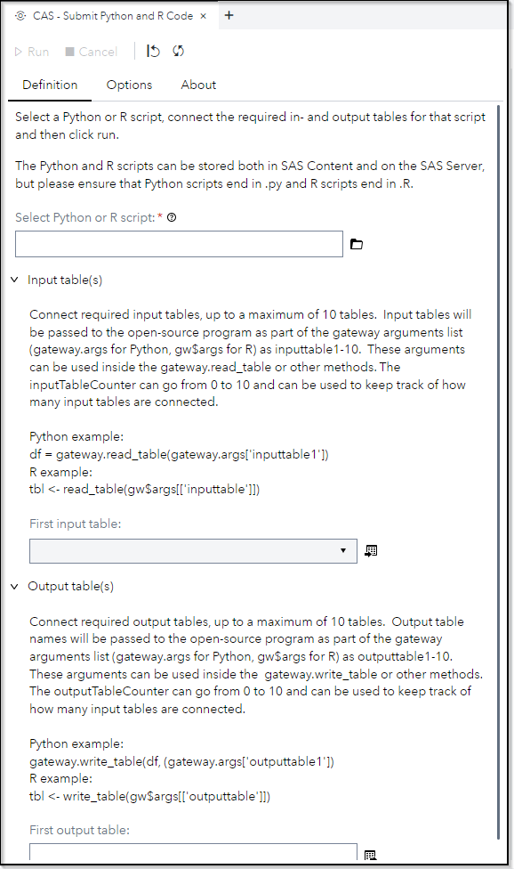
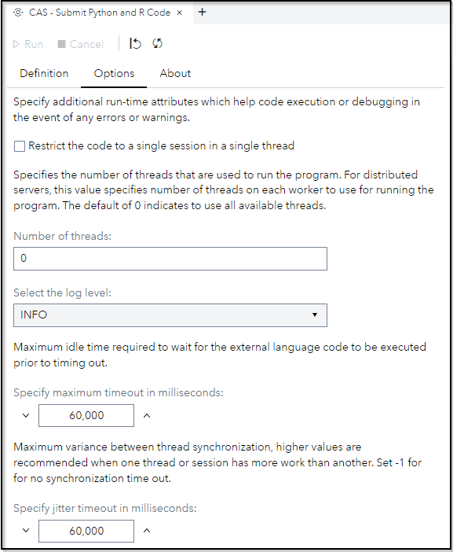

# CAS - Submit Python and R Code

## Description

The "**CAS - Submit Python and R Code**" provides a wrapping for the CAS action *gateway.runLang*.

Use this custom step to execute open-source programs, taking advantage of parallelization, multiple threads and fast data exchange mechanisms (backed by the Apache Arrow in-memory data format).

The step supports up to 10 input tables and up to 10 output tables (It's a limitation of the custom step definition, not a limitation of the CAS action). You can access those tables in Python/R script as follows

**Python example:** 
```python
# Read from input table 1
df = gateway.read_table(gateway.args['inputtable1'])
 
# Write to output table1
gateway.write_table(df, (gateway.args['outputtable1'])
 ```
 
**R example:**
```r
# Read from input table 1
tbl <- read_table(gw$args[['inputtable1']])

# Write to output table1
tbl <- write_table(gw$args[['outputtable1']])
```


Additionally, there are two variables, named *inputTableCounter* and *outputTableCounter*, representing how many input and output tables are connected to the step. 

## User Interface

* ### Definition tab ###

   

* ### Options tab ###

   

## Requirements

SAS Viya 2023.11 or later

Ensure that Python and R are configured correctly according to the [SAS documentation](https://go.documentation.sas.com/doc/en/pgmsascdc/default/caspg/p1l6rncqa8tu8jn1pd05x8r1nwop.htm#n0c4rig8h837zhn1dm5yj6dpc7k0).

## Usage

Find a demonstration of this step in this YouTube video: [CAS - Submit Python and R Code | Custom Step](https://youtu.be/DFhVVVonkB4)

## Change Log

* Version 1.01 (11JAN2024)
    * Updated readme
      
* Version 1.0 (19NOV2023)
    * Initial version
