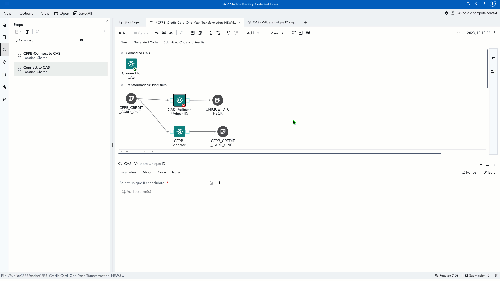

# CAS - Validate Unique ID

This custom step validates if a specified unique ID candidate column for a SAS Cloud Analytics Services (CAS) table is indeed unique. 

You may like to use this in tandem with the [CAS - Generate Unique ID custom step](https://github.com/SundareshSankaran/sas-studio-custom-steps/blob/main/CAS%20-%20Generate%20Unique%20ID/README.md).  For example, if this step indicates that a candidate ID is not unique, make use of CAS - Generate Unique ID to generate a new identifier.

This custom step makes use of the CAS action (textmanagement.validateIds).

**Here's a general idea of how this custom step works (the below is an animated GIF)**

## SAS Viya Version Support
Tested in Viya 4, Stable 2023.06

## Requirements

1. A SAS Viya 4 environment (monthly release 2023.06 or later) with SAS Studio Flows.

2. **At runtime: an active connection to CAS:** This custom step requires Cloud Analytics Services(CAS). Ensure you have an active CAS connection available prior to running the same.

## User Interface

### Parameters

Note that this action requires an active CAS connection to run successfully.  Ensure you are connected to CAS before running this step.

1. Input port: connect an input CAS table to the input port.

2. Select a desired column from the input table for validation as a candidate unique ID.

3. Output port: connect an output table (which needs to be a CAS table) to the output port.  This is called the validation table and will contain information on any duplicate occurrences of the candidate input ID.

## Documentation
- The [textmanagement.validateIds CAS action](https://go.documentation.sas.com/doc/en/pgmsascdc/default/casvtapg/cas-textmanagement-validateids.htm)

## Installation & Usage
- Refer to the [steps listed here](https://github.com/sassoftware/sas-studio-custom-steps#getting-started---making-a-custom-step-from-this-repository-available-in-sas-studio).

## Change Log
Version : 1.0.   (11JUL2023)  