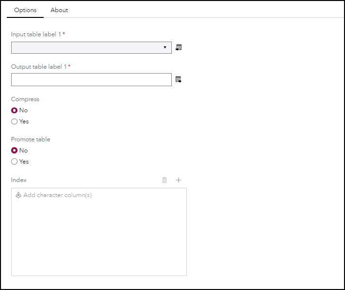
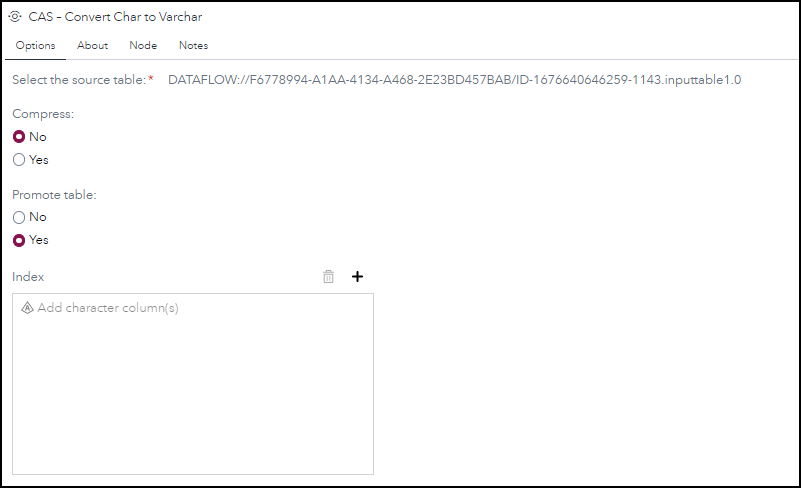
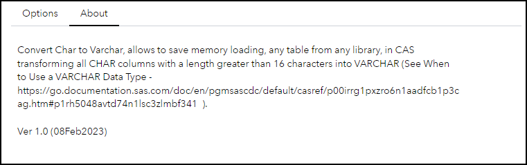
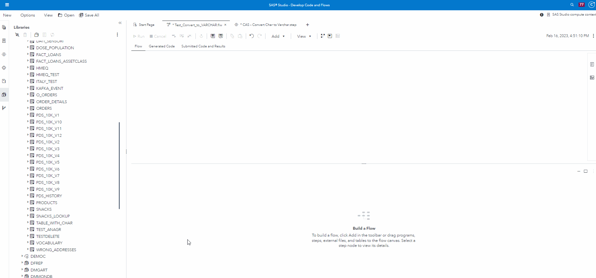

# CAS – Convert Char to Varchar	 

## Description

This step creates a copy of a table, and if the table has char variables with a length greater than 16, those variables are converted to varchar.
*	The user can specify that the output table should be compressed and/or promoted
*	The user can specify which columns of the output table should be indexed 
*	Existing output tables will be overwritten
   

## User Interface

<mark>Note that this Custom Step is intended to output Cloud Analytics Services (CAS) tables. Ensure you have a connection to CAS established before running this step. References to output table names and locations below should be interpreted as referring to CAS Tables and caslibs. </mark>

### Options tab ###

   | Standalone mode | Flow mode |
   | --- | --- |                  
   |  |  |

* Compress - No to not compress the table, Yes otherwise

* Promote  - No to not promote the table, Yes otherwise

* (Optional) Select columns to use for index - Provide the column(s) to create index

### About tab 

   

## Requirements

Tested on Viya version Stable 2023.01, No specific Viya version requirements

## Usage

## Change Log

* Version 1.0 (08FEB2023)
    * Initial version

