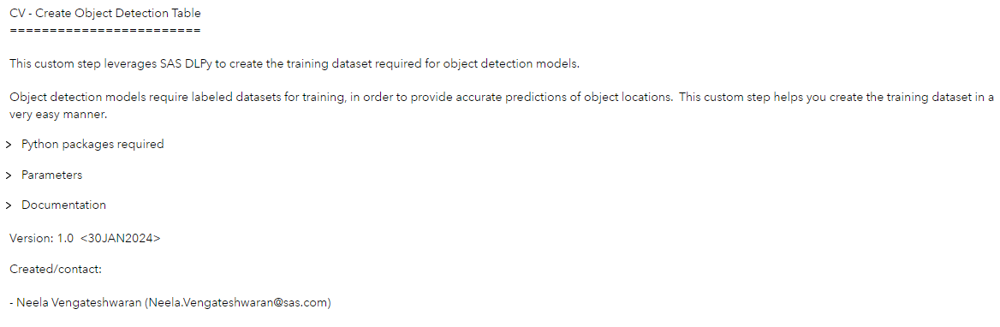
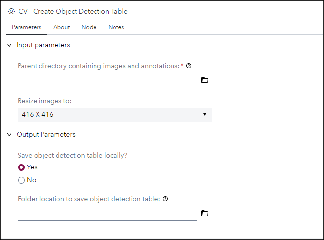

# CV - Create Object Detection Table

## Description
Object Detection models require labeled datasets for training, in order to provide accurate predictions of object locations. This custom step leverages SAS DLPy to create the training dataset in a very easy manner.

## Features
- Create training dataset with object locations and labels.
- Save generated training dataset to disk.

## User Interface
#### About Tab:

#### Parameters Tab:

## SAS Viya Version Support

Tested on Viya 4, Stable 2024.01

## Requirements

#### Ensure:

- SAS Viya has access to an active Python environment.  Proc Python makes use of this Python environment.

- Required Python packages (see section "Python packages") are installed.

- Preferable / recommended:  Administrators could make use of the SAS Configurator for Open Source (also commonly known as sas-pyconfig) to install and configure Python access from SAS Viya.  Refer SAS Viya Deployment Guide (monthly stable 2023.08 onwards) for instructions on the same. Documentation provided below.

- Input image files and annotation (XML) files generated from the labeling process are stored within the same folder. There must be an XML file for every input image, with the same filename. (eg) For an input image named 0001.png, there must be a corresponding annotation file named 0001.xml

### Python packages

- swat (1.13.3)
- python-DLPy (1.2.1-dev)
- pandas
- matplotlib

Refer documentation link below for package details. 

### Parameters

#### Input:
1. Parent directory containing images and annotations (Required): provide a valid path to folder containing the images and object annotation files.

2.  Resize images to (Optional): provide the size to which the training images need to be resized. By default, images are resized to 416 x 416 when creating the object detection table. 

#### Output:
1. Save object detection table locally (Optional): choose if you want to save the created object detection table to your local machine. By default, the option is set to "No".

2. Folder to save object detection table (Optional): Provide folder location to which you want to save the object detection table. This option appears only if you choose to save the detection table. 

3. Output table (output port, Required):  select / attach a CAS table to this output port, to store the created object detection table. 

## Documentation:
1. Documentation on the swat package: https://sassoftware.github.io/python-swat/

2. Documentation on python-dlpy package:
https://github.com/sassoftware/python-dlpy

3. Documentation on SAS callback object and methods:  https://go.documentation.sas.com/doc/da/pgmsascdc/default/proc/p0z7ahqmabxu6kn193kdojjhc477.htm

4. The pandas package: https://pypi.org/project/pandas/

5. Matplotlib package: https://matplotlib.org/stable/index.html

6. This SAS Communities article provides details on the environment variables which facilitate connecting to CAS using the swat package within SAS Studio: https://communities.sas.com/t5/SAS-Communities-Library/Hotwire-your-SWAT-inside-SAS-Studio/ta-p/835956

7. Peter Styliadis provides this helpful post (SAS documentation link contained therein) on how to identify a current active CAS session: https://communities.sas.com/t5/SAS-Viya/Programmatically-detect-an-active-CAS-session/m-p/890914#M1985

## Created / contact:

- Neela Vengateshwaran (Neela.Vengateshwaran@sas.com)

## Change Log
- Version 1.0 (31JAN2024)
    - Initial version
