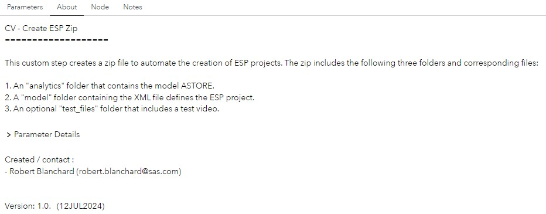
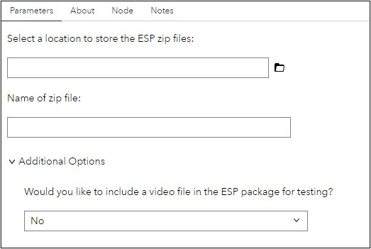

# CV - ESP Zip Creation

## Description
In many Computer Vision(CV) applications, real-time detection is important. This custom step creates a zip file to automate the creation of Event Stream Processing (ESP) projects. Users can import the zip created by this custom step into ESP Studio to automatically generate an ESP pipeline for testing and deployment. Cureently, this step is only functional for object detection computer vision task.

## Features
The zip includes the following three folders and corresponding files:

1. An "analytics" folder that contains the model ASTORE.
2. A "model" folder containing the XML file defines the ESP project.
3. An optional "test_files" folder that includes a test video.

## User Interface
#### About Tab:

#### Parameters Tab:

## SAS Viya Version Support

Tested on Viya 4, Stable 2024.05

## Requirements

#### Ensure:

- SAS Viya is installed with a minimum of a SAS Studio Analyst license.  
- The CV - Save Model custom step preceeds this custom step.

### Parameters Details

#### Input:
1. Select a location to store the ESP zip files (Required): provide a valid path to a folder located in the SAS Server Where the zip file will be stored.

2.  Name of zip file (Required): provide the name of the zip file. 

#### Additional Option Details:
1. Would you like to include a video file in the ESP package for testing (Optional)? users can optionally include a video file for testing in ESP. The user will need to select a video file if “yes” is answered from the drop-down list.

## Created / contact:

- Robert Blanchard (robert.blanchard@sas.com)
- Rik de Ruiter (Rik.deRuiter@sas.com)

## Change Log
- Version 1.0 (16JULY2024)
    - Initial version
