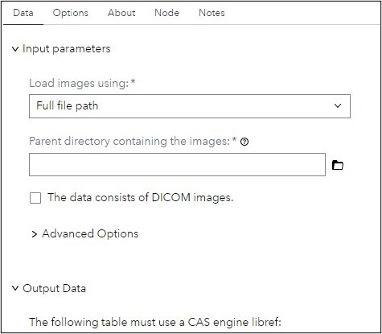
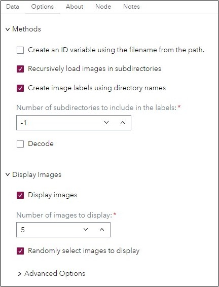

# CV - Load Images

## Description
This custom step helps you load images to a SAS Cloud Analytics Services (CAS) table in SAS Viya for purposes of carrying out image analytics.  It uses a CAS action, image.loadImages, from the Image action set, which is provided with the SAS Viya (formerly known as SAS Viya Machine Learning) offering.

Use this to create an Analytical Base Table (ABT) for computer vision manipulation and prediction activities. For example, you may like to train a deep learning model for object identification.

This custom step enables you to load even images inside subfolders contained within the specified root folder.  In addition, you may also choose to create a label (represented by a _label_ variable)  containing the folder name from which the image was extracted (often used as the target variable for image classification).

This custom step uses a CAS action which requires a SAS Visual Data Mining and Machine Learning (VDMML) license. VDMML is available with the SAS Viya (formerly known as SAS Viya Machine Learning), SAS Viya Advanced, or SAS Viya Enterprise offering.

## Features
- Loads images into SAS.
- Creates an Analytical Base Table (ABT) that includes images and optional labels.
- Can create an identifier column that contains the filename.

## User Interface
#### Data Tab:

#### Options Tab:

#### About Tab:

## SAS Viya Version Support

Tested on Viya 4, Stable 2024.05

## Requirements

#### Ensure:

- SAS Viya is installed with a minimum of a SAS Studio Analyst license.  
- This custom step runs on data loaded to SAS Cloud Analytics Services (CAS). Ensure you are connected to CAS before running this step.
- Ensure that the root folder containing your images (which may be distributed among different subfolders) is relative to an existing caslib.

### Parameters

#### Input:
1. Caslib name (text field, required): provide a valid caslib name.
2. Relative path (relative to the caslib): provide a path to a root folder containing the images.  A blank value starts at the base location of the caslib.
3. Recurse through subdirectories (checked by default): uncheck this box if you do not want to load images which may be contained within subfolders.
4. Create label(unchecked by default, optional): check this if you would like to create an additional column called _label_ which contains the name of the folder in which the image resides.

#### Options:

##### Methods:
1. Create an ID variable using the filename from the path: select to create an ID variable using the filename from the path. This option is valuable when merging labels with images. IMPORTANT: if merging images with labels from a csv file or other table, the variable name (specified in the Name of ID variable option) and length (specified in the Length of ID variable option) should match the name and length of the variable in the labels table.  

2. Name of ID variable (Required): specifies the name of the ID variable that will contain the filename for each imported image.

3. Length of ID variable (Required): specifies the length of the ID variable that will contain the filename for each imported image.
Recursively load images in subdirectories: select to load images in subdirectories recursively.

4. Create image labels using directory names: select to create a new variable called _label_ that will contain the name of the folder for which the image was extracted. This option is often used to create a label for images classification when images are stored in respective class folders.

5. Number of subdirectories to include in the labels: specifies the maximum number of directory levels to include in the label.
Decode: select to include decoded images and metadata to the output table.

##### Display Images:
1. Display images: select to display images.

2. Number of images to display: select the number of images to display.

3. Randomly select images to display: select to randomly select images to display. If not selected, the images displayed will rely on the data order.

###### Advanced Options:
1. Number of columns in layout: choose the number of columns when printing images.

2. Image width (pixels): specifies the width of the printed image in terms of the number of pixels. Note, this option is not resizing the image in the output table. The image in the output table remains the same as the original image.

3. Image height (pixels): specifies the height of the printed image in terms of the number of pixels. Note, this option is not resizing the image in the output table. The image in the output table remains the same as the original image.

4. Font size (pt): specifies the size of the text font when printing the image ID or label.

#### Output:
1. Output table (output port, required): connect a CAS table to the output port, to hold the loaded image data.

IMPORTANT: Do not attempt to view the output table, since it contains binary data which will often cause the system to hang. Instead, view the message in the results window to understand if images were loaded or not.

## Documentation:
- The loadImages CAS action : https://go.documentation.sas.com/doc/en/pgmcdc/default/casactml/cas-image-loadimages.htm

## Created / contact:

- Robert Blanchard (robert.blanchard@sas.com)

- Sundaresh Sankaran (sundaresh.sankaran@sas.com)

## Change Log
- Version : 2.0.   (16JUL2024)