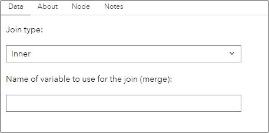
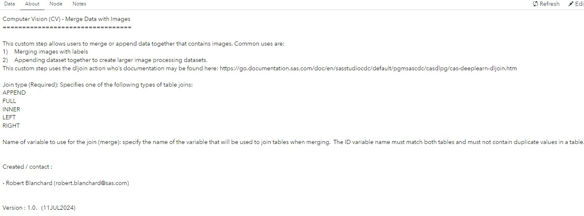

# CV - Merge Data with Images

## Description
This custom step allows users to merge or append data together that contains images. Common uses are:
1)	Merging images with labels
2)	Appending dataset together to create larger image processing datasets.

## Features
- Merges or appends tables that may contain images.

## User Interface
#### Data Tab:

#### About Tab:

## SAS Viya Version Support

Tested on Viya 4, Stable 2024.05

## Requirements

#### Ensure:

- SAS Viya is installed with a minimum of a SAS Studio Analyst license.  
- This custom step runs on data loaded to SAS Cloud Analytics Services (CAS). Ensure you are connected to CAS before running this step.

### Parameters

#### Input:
1. Two input CAS tables are required. Each table should be connected to one of the input table ports.

2. Join type (Required): Specifies one of the following types of table joins:
APPEND
FULL
INNER
LEFT
RIGHT

3. Name of variable to use for the join (merge): specify the name of the variable that will be used to join tables when merging.  The ID variable name must match both tables and must not contain duplicate values in a table. 

#### Output:
1. Output table (output port, required): connect a CAS table to the output port, to hold the loaded image data.

IMPORTANT: Do not attempt to view the output table, since it contains binary data which will often cause the system to hang. Instead, view the message in the results window to understand if images were loaded or not.

## Documentation:
This custom step uses the dljoin action who’s documentation may be found here: https://go.documentation.sas.com/doc/en/sasstudiocdc/default/pgmsascdc/casdlpg/cas-deeplearn-dljoin.htm

## Created / contact:

- Robert Blanchard (robert.blanchard@sas.com)

## Change Log
- Version : 2.0.   (16JUL2024)