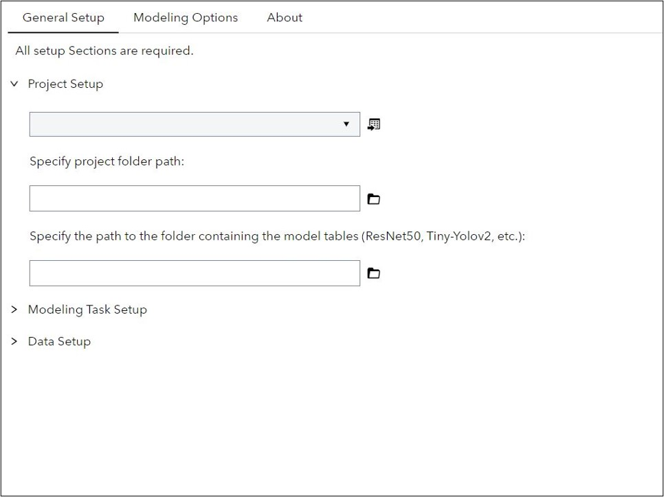
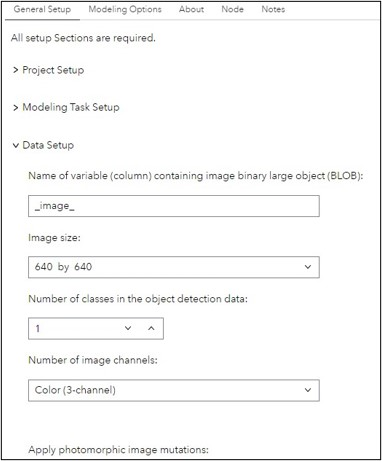
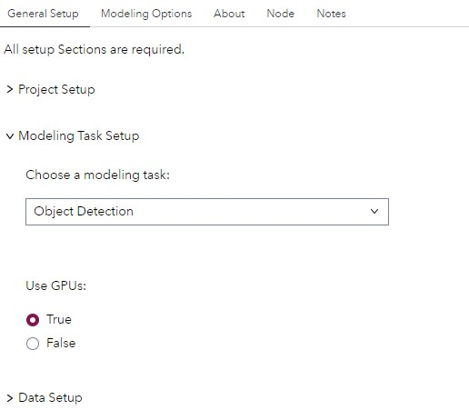
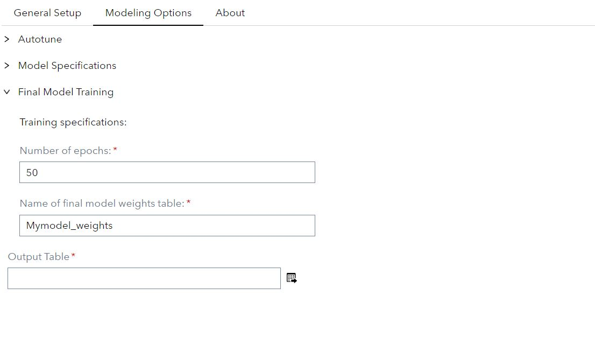
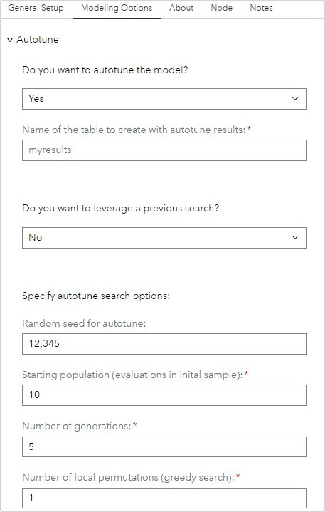
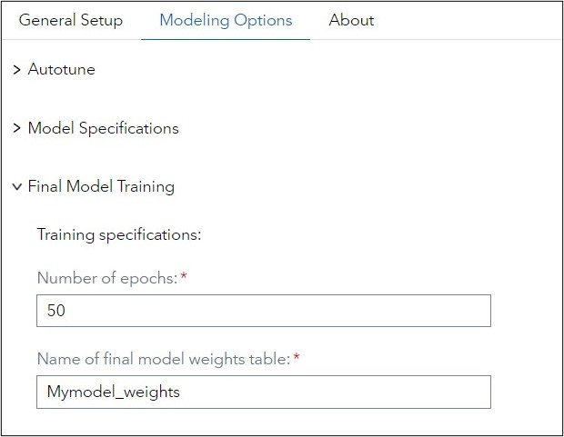
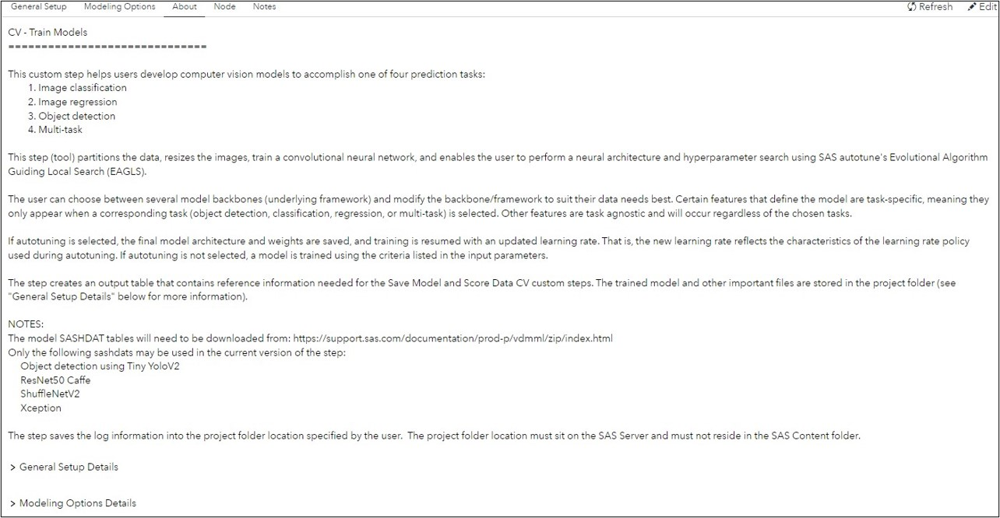

# CV - Train Models

## Description
This custom step helps users develop computer vision models to accomplish one of four prediction tasks:
	1. Image classification
	2. Image regression
	3. Object detection
	4. Multi-task

This step (tool) partitions the data, resizes the images, train a convolutional neural network, and enables the user to perform a neural architecture and hyperparameter search using SAS autotune's Evolutional Algorithm Guiding Local Search (EAGLS). 

The user can choose between several model backbones (underlying framework) and modify the backbone/framework to suit their data needs best. Certain features that define the model are task-specific, meaning they only appear when a corresponding task (object detection, classification, regression, or multi-task) is selected. Other features are task agnostic and will occur regardless of the chosen tasks.    

If autotuning is selected, the final model architecture and weights are saved, and training is resumed with an updated learning rate. That is, the new learning rate reflects the characteristics of the learning rate policy used during autotuning. If autotuning is not selected, a model is trained using the criteria listed in the input parameters.  

The step creates an output table that contains reference information needed for the Save Model and Score Data CV custom steps. The trained model and other important files are stored in the project folder (see "General Setup Details" below for more information).

The step saves the log information into the project folder location specified by the user.  The project folder location must sit on the SAS Server and must not reside in the SAS Content folder.

## Features
- Trains a computer vision model.
- Can perform neural architecture and hyperparameter search.

## User Interface
#### General Setup:

##### General Setup (Data):

##### General Setup (Modeling Setup):

#### Modeling Options:

##### Modeling Options (Autotuning):

##### Modeling Options (Model Specifications):

##### Modeling Options (Final Model Training):

#### About:

#### Parameters Tab:

## SAS Viya Version Support

Tested on Viya 4, Stable 2024.05

## Requirements

#### Ensure:
- SAS Viya is installed with a minimum of a SAS Studio Analyst license.  
- The model SASHDAT tables will need to be downloaded from: https://support.sas.com/documentation/prod-p/vdmml/zip/index.html
Only the following sashdats may be used in the current version of the step: 
     Object detection using Tiny YoloV2
     ResNet50 Caffe 
     ShuffleNetV2
     Xception

### General Setup Details
#### Project Setup Parameters:
1. Specify project folder path (Required): provide a valid path to a folder located in the SAS Server that will be used to store important files generated from the step. 
These files include:

- Autotuning results in html format.
- Autotuned weights (autotune_bestweights_.sashdat) and attributes (autotune_bestweights_.ATTRS.sashdat) in sashdat format. 
- Model table sashdat.
- Model weights sashdat derived from final model training.
- Model weight attributes sashdat derived from final model training.  
- Folder containing a sample of holdout data detections for human-in-the-loop inspection (object detection only).
- Log files for each autotuned evaluation and "global" log file containing all other SAS log information. 

2. Specify the path to the folder containing the model tables (Required): provide a valid path to a folder located in the SAS Server that contains the following case-sensitive sashdat files (can be downloaded from the Git repository):

- resnet50_caffe.sashdat
- resnet50_caffe_weights.sashdat
- resnet50_caffe_weights_attr.sashdat

- Tiny-Yolov2.sashdat
- Tiny-Yolov2_weights.sashdat
- Tiny-Yolov2_weights_attr.sashdat

- ShuffleNetV2.sashdat
- ShuffleNetV2_weights.sashdat
- ShuffleNetV2_weights_attr.sashdat

#### Modeling Task Setup Parameters:
1. Choose a modeling task (Required): select from one of the four modeling task. Choices are object detection, classification, regression, or multi-task. 

2. Choose the error function to use for regression estimation (Required, regression task only): select from one of the five error functions. Choices are Normal, Poisson, Gamma, L1, and Cross-entropy.

3. Choose the activation (inverse link) function to use for regression estimation (Required, regression task only): select from one of the four inverse link functions. Choices are identity, exponential, logistic, and sine.

4. Use GPUs: select whether to use GPUs for model training. Ensure you have one or more Nvidia GPUs installed with the appropriate drivers. See SAS documentation, "Requirements for GPU Support" for more details.

####  Data Setup Parameters:
1. Name of target variable (Required for regression and classification task only): provide the name of the target variable column.

2. Number of target (outcome) variables for multi-task learning (Required for multi-task only): provide the number of target outcomes. The number must reside within the range of 2 and 21, inclusive. 

3. Name of target variable 0 to 20 (Required for multi-task only): provide the names of the target variable columns in each respective text box.

4. Name of variable (column) containing image binary large object (BLOB) (Required): provide the name of the variable column containing the image BLOB.

5. Image size (Required): provide the input image size relative to the number of pixels. The step will resize the images to the specified size. For object detection task, the user must choose an image size from a drop-down with values of 224, 416, 640, or 1280. For classification, regression and multi-task problems, users can specify a customized size as long as the image width and height  is greater than or equal to 64 pixels.

6. Number of classes in the object detection data (Required for object detection task only): specify the number of classes present in your data.  

7. Number of image channels (Required): select the number of channels present in your image data. Choices are 3-channel for color images or single channel for greyscale images. The image data does not have to naturally conform the selected channel. The step will apply a transformation based on the user's selection for this parameter.

8. Apply photomorphic image mutations (Required): specify whether or not to apply random photomorphic mutations to mini-batches during the training process. If “random” is selected, SAS will mutate images using one of the following methods chosen at random: color jittering, sharpening, or lightening. Approximately half of the input data is subject to the photomorphic mutations. 

9. Apply random flipping (Required): specify whether or not to apply random “flip” mutations to mini-batches during the training process. Choices are none, horizontal, vertical, or both horizontal and vertical. Approximately half of the input data is subject to flipping.

10. Apply random cropping mutations (Required): specify whether or not to apply a cropping mutation. If “Resize then crop” is chosen from the drop-down list, SAS resizes images to 115% of the size of the input layer while maintaining the image aspect ratio. The smaller dimension (width or height) of the original input image size is resized to 115% of the input layer size, then the remaining dimension is resized to match the original image aspect ratio. The last step extracts a random crop (equal to the size of the input layer) from the interim image. No further resizing is required.

11. Specify the maximum number of possible bounding box anchors (Required for object detection only): specifies the maximum number of clusters to be searched when determining the optimal number of anchor boxes.

12. Specify the criterion to be used to estimate the number of appropriate bounding box anchors to use (Required for object detection only): specifies the criterion to be used to estimate the number of anchor boxes that use the statistics obtained by the ABC method. PROC KCLUS is used to apply clustering to the width and height of the ground truth bounding boxes. The user selects one of the following options from the drop-down list. “First peak” uses the first peak value among the peak values in gap statistics. “First maximum with standardization” uses the smallest k such that the gap value for that k is greater than the one-standard-error adjusted gap value for k+1. “Global peak” uses the maximum peak value among all the peak values in gap statistics. “All - majority selects” selects the number of anchor boxes based on which number of anchor boxes is chosen the most often from all methods included in the drop-down list. If each option selects a different number of anchor boxes, then the number selected by “Global peak” is used.

13. Percentage of validation cases (Required): specify the percentage of data to be allocated to the holdout data.

14. Name of partition variable (designates training vs. holdout) (Required): specify the name of partition indicator that will be added to the data.

15. Random partition seed (Required): specifies an integer that is used to start the pseudorandom number generator. If you do not specify a seed or you specify a value less than or equal to 0, the seed is generated from reading the time of day from the computer’s clock. 

### Modeling Options Details:
#### Autotune Parameters:
1. Do you want to autotune the model (Required)? user specifies whether to use SAS autotune's Evolutional Algorithm Guiding Local Search (EAGLS).

2. Name of the table to create with autotune results (Required): specifies the name of the sashdat table that will contain the results from autotuning. The table is saved in the project folder.

3. Do you want to leverage a previous search (Required)? user specifies whether to use a previous search in the current execution. Leveraging previous autotune executions is valuable in computer vision modeling because evaluations may take long periods of time. In addition, breaking up the search across executions enables the user to examine the results and make adjustments to the search, meaning human-in-the-loop neural architecture search is supported by this step. 

4. Name of the table to create with previous autotune results (Required): specifies the name of the sashdat table that contains results from a previous autotuning execution. The table should be stored/located in the project folder.

5. Specify the number of previous strong performing evaluations to use in (seed) the next search (Required): specifies the number of previous strong performing evaluations to use in the current search. That is, the number indicates how many best performing evaluations will be retrained and used to influence the current EAGLS search. For example, a value of “3” will retrain the three best performers included in the previous search table.  

6. Random seed for autotune (Required): specifies the random seed to use when autotuning. It is very important to change the random seed if the user is leveraging a previous autotune search.

7. Starting population (evaluations in initial sample) (Required):  specifies the initial number of samples to be drawn from a Latin hypercube sample.  

8. Number of generations (Required):  specifies the number of generations used by EAGLS. Each generation will perform the following steps, selection, crossover, mutation and generating set search. Selection, crossover and mutation are natural elements of the genetic algorithm. The generating set search is a greedy algorithm that searches from the current best performing evaluations. 

9. Number of local permutations (greedy search) (Required): specifies the number of permutations created from the generating set search. These evaluations are considered a local, greedy search. Increasing this value will cause the population to more aggressively become homogenous.  

10. Number of epochs per evaluation (Required): specifies the number of epochs to train each evaluation during the autotuning process.

11. Maximum number of seconds to spend on search (Required): specifies the number of seconds to execute autotune. 

12. Name of HTML file containing autotune results (Required): specify the name of the HTML file that will contain the results. The results HTML file will be stored in the project folder.

#### Model Specifications Parameters:
1. Number of threads to use (Required): specifies the number of threads to use when training the mode. Increasing threads may increase training speed but will also increase memory usage and can cause failed executions when the system memory is exceeded. Suggested values are 4, 8 or 12.

2. Search weight for object's presence error (Required for object detection only): specifies whether to use SAS Autotune to search for an optimal value.

3. Object present scalar (Required for object detection only): specifies the scalar value to use for determining if an object is present in a cell. That is, this value influences the “value” the corresponding partial error has over the weight updates. 

4. Object present, lower bound scalar (Required for object detection only): specifies the lower bound scalar for SAS autotune’s search of the object’s presence scalar.

5. Object present, upper bound scalar (Required for object detection only): specifies the upper bound scalar for SAS autotune’s search of the object’s presence scalar.
	
6. Search weight for object's absence error (Required for object detection only): specifies whether to use SAS Autotune to search for an optimal value.

7. No Object present scalar (Required for object detection only): specifies the scalar value to use for determining if an object is not present (absent) in a cell. That is, this value influences the “value” the corresponding partial error has over the weight updates. 

8. No object present, lower bound scalar (Required for object detection only): specifies the lower bound scalar for SAS autotune’s search of the object’s absence scalar.

9. No object present, upper bound scalar (Required for object detection only): specifies the upper bound scalar for SAS autotune’s search of the object’s absence scalar.

10. Search weight for object's coordinate error (Required for object detection only): specifies whether to use SAS Autotune to search for an optimal value.

11. Object coordinate scalar (Required for object detection only): specifies the scalar value to use for determining an object’s location in the image and bounding box size (offsets from the anchor boxes). That is, this value influences the “value” the corresponding partial error has over the weight updates.

12. Object coordinate, lower bound scalar (Required for object detection only): specifies the lower bound scalar for SAS autotune’s search of the object’s location in the image and bounding box size estimation.

13. Object coordinate, upper bound scalar (Required for object detection only): specifies the upper bound scalar for SAS autotune’s search of the object’s location in the image and bounding box size estimation.

14. Search weight for classification error (Required for object detection only): specifies whether to use SAS Autotune to search for an optimal value.

15. Object classification scalar (Required for object detection only): specifies the scalar value to use for determining an object’s classification. That is, this value influences the “value” the corresponding partial error has over the weight updates.

16. Object classification, lower bound scalar (Required for object detection only): specifies the lower bound scalar for SAS autotune’s search of the object’s classification.

17. Object classification, upper bound scalar (Required for object detection only): specifies the upper bound scalar for SAS autotune’s search of the object’s classification.

18. Search detection threshold (Required for object detection only): specifies whether to use SAS Autotune to search for an optimal value.

19. Detection threshold (Required for object detection only): specifies the threshold for probability in object detection. 

20. Detection threshold, lower bound (Required for object detection only): specifies the lower bound threshold for SAS autotune’s search of the detection threshold.

21. Detection threshold, upper bound (Required for object detection only): specifies the upper bound threshold for SAS autotune’s search of the detection threshold.

22. Search intersection over union (IoU) threshold (Required for object detection only): specifies whether to use SAS Autotune to search for an optimal value.

23. IoU threshold (Required for object detection only): specifies the scalar value to use for determining the IoU threshold for maximum suppression in object detection. That is, this value influences the “value” the corresponding partial error has over the weight updates.

24. IoU threshold, lower bound (Required for object detection only): specifies the lower bound threshold for SAS autotune’s search of the IoU threshold for maximum suppression.

25. IoU threshold, upper bound (Required for object detection only): specifies the upper bound threshold for SAS autotune’s search of the IoU threshold for maximum suppression.

26. Search training intersection over union (IoU) threshold (Required for object detection only): specifies whether to use SAS Autotune to search for an optimal value.

27. Train IoU threshold (Required for object detection only): specifies the scalar value to use for determining the IoU threshold to determine a positive sample for training in object detection. That is, this value influences the “value” the corresponding partial error has over the weight updates.

28. Train IoU threshold, lower bound (Required for object detection only): specifies the lower bound threshold for SAS autotune’s search of the IoU threshold to determine a positive sample for training in object detection.

29. Train IoU threshold, upper bound (Required for object detection only): specifies the upper bound threshold for SAS autotune’s search of the IoU threshold to determine a positive sample for training in object detection.

30. Add a projection layer (1 by 1 convolutional) before the output layer(s) (Required for classification, regression and multi-task): specifies whether to insert a projection layer in between the tensor and the final model output.  Projection layers are used for tensor compression or expansion. If set to “yes”, options will appear that allow the user to choose the number of convolutional filters and nonlinear activation function to use.

31. Select a model backbone (Required): selects the backbone to use as a baseline for model development.  Choices include: 
     Resnet50, 
     Tiny-Yolov2 (VGG16-style), 
     ShuffleNetV2, 
     ShuffleNetV2_x1.5, 
     ShuffleNetV2_x2.0, 
     ShuffleNetV2_x2.5, 
     or users can select Autotune to search all backbones.
See https://arxiv.org/abs/1807.11164 for more details regarding the different variations of ShuffleNetV2.

32. Search the first convolutional layer filter size: select to have SAS autotune search for the optimal filter size.

33. Select filter size for first convolution layer from the following sizes (width by height):
	- 3 by 3
	- 3 by 5
	- 5 by 3
	- 5 by 5
	- 5 by 7
	- 7 by 5
	- 7 by 7

34. Search the nonlinear activation function to use in model backbone: allows the user to use SAS autotune to search for the best fitting nonlinear activation function.
     
35. Model backbone nonlinear activation function (Required): specifies the nonlinear activation function to use in the model backbone. If SAS autotuning is selected to search the nonlinear activation function, then the nonlinear activation function specified in this option will be used as an inital value in one of the samples.
     - Rectified linear unit (ReLU)
     - Leaky rectified linear unit
     - Softplus
     - Exponential linear unit (ELU)
     - Hyperbolic tangent (TanH)

##### Multi-task target # properties (Required for multi-task only):  :
1. Target variable is nominal: specifies whether the target outcome is nominal. If nominal, cross-entropy error with SoftMax activation is used. If interval, mean squared error with identity activation is used. 

2. Search scalar value for target # loss: specifies to use autotune to search for a scalar value for the corresponding error function. The greater the value the more weight (or attention) the model places predicting the outcome.
  
3. Scalar loss value for target #: the scalar value for the corresponding error function. If “Search scalar value for target # loss” is set to true (checked), then this specified value is used in the first iteration. The greater the value the more weight (or attention) the model places predicting the outcome.

4. Scalar loss value for target #, lower bound: specifies the lower search bound for the scalar value for the corresponding error function.

5. Scalar loss value for target #, upper bound: specifies the upper search bound for the scalar value for the corresponding error function.

6. Search dimension of projection layer for target #: specifies to use autotune to search for the number of one by one convolution filters to use in the projection layer.

7. Number of filters in projection layer for target #: specifies the number of one-by-one convolution filters to use in the projection layer.

8. Number of filters in projection layer, lower bound: specifies the lower search bound when searching one-by-one convolution filters.

9. Number of filters in projection layer, upper bound: specifies the upper search bound when searching one-by-one convolution filters.

#### Final Model Training Parameters:
1. Number of epochs (Required): specifies the number of epochs the final model will be trained. The final model’s full training horizon is equal to the number of epochs each trained during autotune plus the number of epochs specified in this parameter.

2. Name of final model weights table (Required): provide the name of the sashdat table that will contain the model’s final weights, as well as the table containing the weight attributes. That is, the value in the text box will be used for both the weights and attributes table with he attributes table having an additional suffix indicating the table contains attributes. Both tables will be stored in the project folder.

3. Percentage of holdout data to view (Required for object detection only): specifies the percentage of holdout data that will have the model’s prediction superimposed and printed for viewing.  

## Created / contact:

- Robert Blanchard (robert.blanchard@sas.com)

## Change Log
- Version 1.0 (16JULY2024)
    - Initial version
