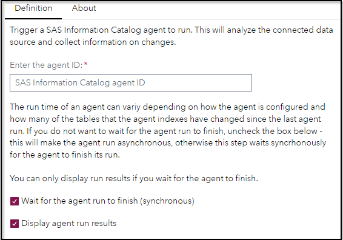

# Catalog - Run Agent

## Description

The "**Catalog - Run Agent**" triggers the run of a SAS Information Catalog agent. The run can be triggered asynchronously or synchronously, if you choose the later you can also get a result output, including a link to the agent run to review.

This steps requires the ID of a SAS Information Catalog agent as input, these can be retrieved using the Custom Step Catalog - List Agents.

## User Interface

* ### Definition tab ###

   

## Requirements

SAS Viya 2023.12 or later

You need to part of the SAS Administrator group or a Custom Group that can maintain the SAS Information Catalog agents, 
see this documentation page for more details: [SAS Information Catalog: Administrator's Guide -  Control Access to Features](https://go.documentation.sas.com/doc/en/infocatcdc/default/infocatag/n1xniiffqq05c9n1n31o997vvdwu.htm?requestorId=1c9d26e9-68e7-4041-bb09-d33447b2d3ca#n0kvrjp9o1ntfen1hqeaec4cwidz)

## Usage

Find a demonstration of this step in this YouTube video: [Catalog - List and Run Agent | Custom Step](https://youtu.be/0kEpeqTuXZE).

## Change Log

* Version 1.0 (15JAN2024)
    * Initial version
