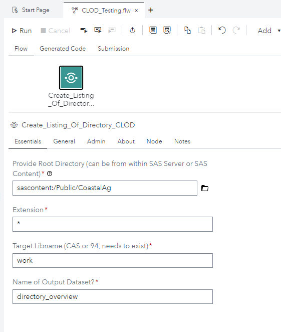
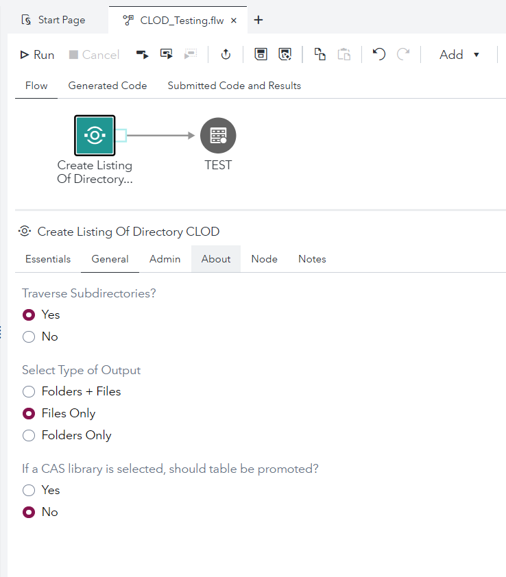
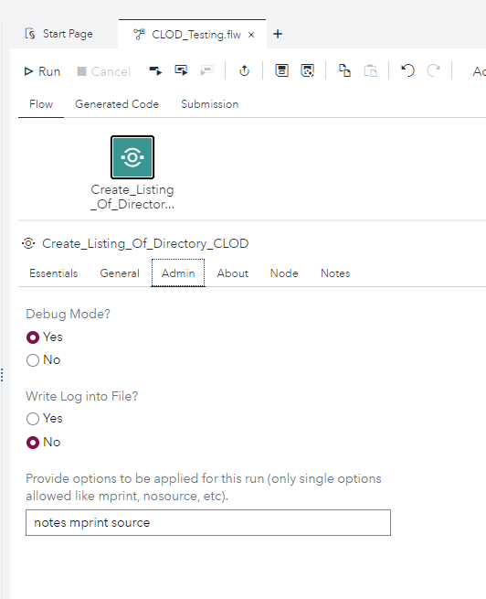
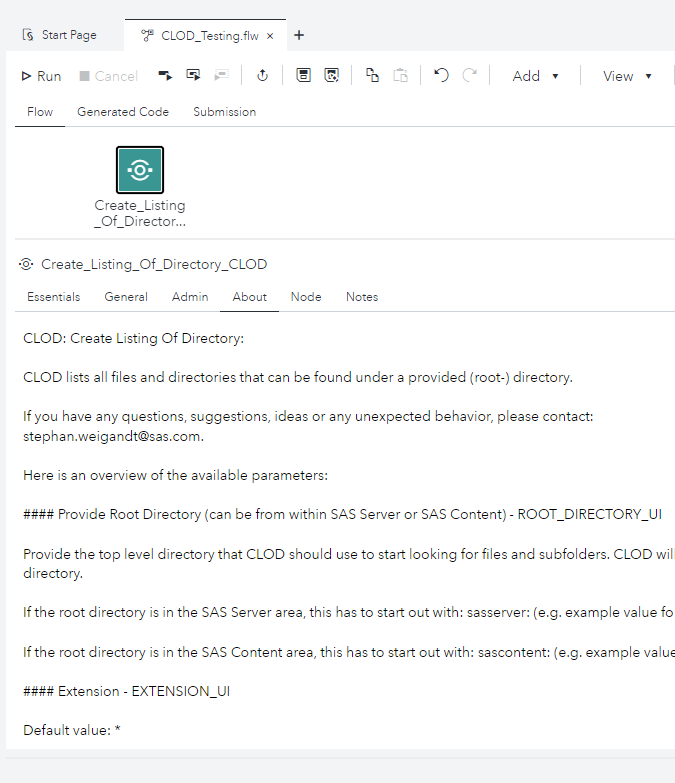

# Create Listing Of Directory CLOD

- [Description](#description)
- [SAS Viya Version Support](#sas-viya-version-support)
- [User Interface](#user-interface)
- [Requirements](#requirements)
- [Usage](#usage)

## Description

The "**Create Listing Of Directory CLOD**" Custom Step provides a full listing of what is all in a directory.
Just chooose the parent/root directory and CLOD will create a dataset that then can be used for further processing.

### **Output Table Structure**

The structure of the output table is as follows:

- DIRECTORY_PATH: path of the object found
- FILE_NAME: object name (is either a file or a directory)
- FULL_FILE_NAME: concatenation of DIRECTORY_PATH and FILE_NAME
- OBJECT_TYPE: when the option "INCLUDES_DIRECTORY_IN_OUTPUT" is set to YES, then this field is included and is either set to "folder" or "file", depending on object type.
- IS_IN_SAS_CONTENT_FLAG: is either 0 (if object is found in SAS Server) or 1 (if object is found in SAS Content)

### **Parameter Overview**

#### **_Provide Root Directory (can be from within SAS Server or SAS Content) - ROOT_DIRECTORY_UI_**

Provide the top level directory that CLOD should use to start looking for files and subfolders. CLOD will then traverse through the whole directory structure and find all the files and folders below this top level directory.

If the root directory is in the SAS Server area, this has to start out with: sasserver: (e.g. example value for root_directory: sasserver:/mnt/desired/path/for/files_to_be_readin/from/SASServer/).

If the root directory is in the SAS Content area, this has to start out with: sascontent: (e.g. example value for root_directory: sascontent:/Public/desired_path_for/files/in/SASContent/).

#### **_Extension - EXTENSION_UI_**

Default value: \*

if \* is provided, all files are captured in the output.
Otherwise, any text string can provided, which will be used as a filter for the ending of the files. So only files will be captured that fall into this filter.

#### **_Target Libname (CAS or 94, needs to exist) - TARGET_LIBNAME_UI_**

This can be any existing library accessible to SAS Studio.
If it is a CASLIB, the table will NOT be promoted or saved to disk.
If that is desired, this would need to happen outside the custom step.

#### **_Name of Output Dataset? - OUTPUT_DATASET_NAME_UI_**

Provide the output table name.

#### **_Traverse Subdirectories? - CLOD_TRAVERSE_DIRECTORIES_UI_**

Suggested default value: Yes (1)

If Yes is selected, CLOD will traverse all directories that can be found under directory provided in "Root Directory" parameter.
If No is selected, CLOD will only look for files in selected directory.

#### **_Select Type of Output - OUTPUT_SELECTION_UI_**

Suggested default value: "Files Only" (0)

If "Files Only" is selected, the output dataset only contains files that could be found.
If "Folders + Files" (1) is selected, the output dataset contains the folder names and the file names.
If "Folders Only" (2) is selected, the output dataset only contains the names of the folders that could be found.

#### **_If a CAS library is selected, should table be promoted? - CAS_PROMOTE_UI_**

Suggested default value: No (0)
This selection is only applied if selected target library is a CAS library.
If No is selected, the table is not promoted and stays only active for the local session.
If Yes is selected, CLOD will promote the table.

#### **_Should promoted table be saved on disk? - CAS_SAVE_ON_DISK_UI_**

Suggested default value: No (0)
This selection is only applied if selected target library is a CAS library and output table is promoted.
If No is selected, the table is not saved on disk.
If Yes is selected, CLOD will save table on disk and make it persistent.

#### **_Debug Mode? - DEBUG_MODE_UI_**

Suggested default value: No (0)

If set to 1, CLOD writes out more information out to the log, that might be helpful for further investigations.

If set to 0, CLOD just writes out the default SAS log output, depending on the settings of the options mprint, source and notes.

#### **_Path for logfile creation - LOG_FILE_PATH_UI_**

suggested default value: empty/missing.

This parameter is only relevant when the parameter "WRITE_LOG_INTO_FILE_UI" is set to 1.

Provide a default path for all runs: as soon as a path is provided, this path is being used for ALL runs.

If the log directory is in the SAS Server area, this has to start out with: sasserver: (e.g. example value for provide_default_log_path: sasserver:/mnt/desired/path/for/log_files_to_be_saved/on/SASServer/).

If the log directory is in the SAS Content area, this has to start out with: sascontent: (e.g. example value for provide_default_log_path: sascontent:/Public/desired_path_for/logfiles/in/SASContent/).

#### **_Write Log into File? - WRITE_LOG_INTO_FILE_UI_**

Suggested default value: No (0)

If set to 0, log is written into default SAS log location.

If set to 1, log is written to location as provided under the parameter "LOG_FILE_PATH_UI".

#### **_Provide options to be applied for this run (only single options allowed like mprint, nosource, etc). - OPTIONS_SEQ_UI_**

If provided those options will be applied to the execution of the code.

## SAS Viya Version Support

Tested with 2020.1.5

## User Interface

### **Essential Tab**

If you are happy with all the default settings, only adjust the parameters in the "Essentials" tab, e.g. select the fully automated mode (1) and provide the top level directory either from within SAS Server or now also from SAS Content (here only CSV or TXT files are processed in the fully automated mode) and click "Run" to start the journey.

### **General Tab**

### **Admin Tab**

### **About Tab**

## Requirements

## Usage

### **How to Run CLOD**

## Change Log

 * Version 3.1.1 (05SEP2024):
   - fixing an issue when folders are not shown when traversing is set to no and displaying directories is set to yes.
   - adding functionality to select between the 3 following output styles: Files Only/Folders Only/Folders + Files
   
 * Version 3.1 (14SEP2022)
   - published on GitHub
   