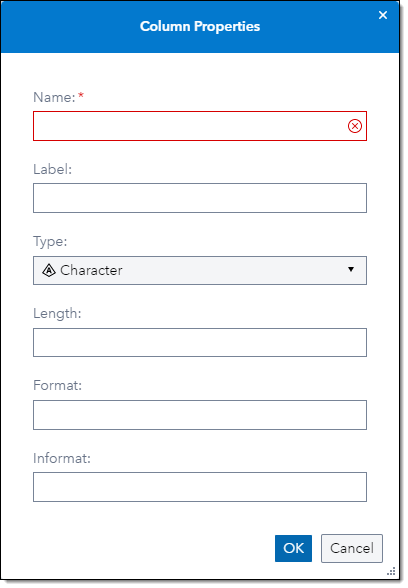

# DQ - Change Case

## Description

>[!NOTE]
**Note**: The **Clean Data** step in the **Data Quality** group in the Steps pane in SAS Studio, introduced in release 2024.01, provides the same functionality, and it is highly recommended to use that step going forward.

The **DQ - Change Case** step allows you to specify data and logic that can be used to uppercase, lowercase, or propercase a text string. A case definition can be helpful in situations where casing rules are not straightforward. For example, consider the following German word: 
Straße. When uppercasing this word, it is desirable to transform the "ß" character to a double "S": STRASSE. A case definition for uppercasing German data can be used to perform this type of special processing.
  * The step will add an extra output column for each cased input column.
  * You can change up to 5 columns in this step.
  * This version supports the following locales: ENUSA, ENGBR, FRFRA, DEDEU, ITITA and ESESP
  * For information about Change Case search the QKB documentation for “Definitions by Locale/Case Definitions”: [SAS Quality Knowledge Base for Contact Information](https://support.sas.com/documentation/onlinedoc/qkb/32/QKBCI32/Help/qkb-help.html)
  
## User Interface  

* ### Change Case Options tab ###

   | Standalone mode | Flow mode |
   | --- | --- |                  
   |  |  |
1. **Locale** - Set Locale to be used to in ths step to case column values.  
2. **Select column** - Select column from input table to be changed.  
3. **Cased column** - Specify name for output column that contains changed value. If left empty, a new column will be created using the name of input column suffixed with **_CS**. The default length of the output column is 150 characters. 
4. **Definition** - Set Case Definition to be used changed the value of the selected input column. 

#### Set output column properties ####
   | Cased column properties | 
   | --- | 
   |  |
   
You can set the output column properties when pressing the pencil icon next to the **Cased column** edit line. 
* In field **Name** set the name of the output column.
* You can use a wildcard in the **Name** field. A leading percent sign (%) followed by any caracters allowed for column names will set the output column name to the input column name followed by the characters. E.g. if input column is ADDRESS and the Name for the output column is set to %_CASE the output column name will be ADDRESS_CASE.
* If you set the **Name** value to % only, the step will use the input column name fuffixed with **_CS**. 
* In field **Length** you can overwrite the default 150 character length. 

## Requirements  
2023.01 or later  
* This custom step requires a SAS Quality Knowledge Base (QKB) to be installed and configured. More details can be found in the documentation that is available [here](https://support.sas.com/en/software/quality-knowledge-base-support.html) 

## Usage  


Copy/paste and run the following SAS code into SAS Studio for sample input data.
```sas
data NAMES;
    length NAME $100;
    infile cards dlm="," ;
    input NAME $;
    cards;
KATRINA POHL
SUBHASHINI JAMUNA POHL
KATHLEEN FLORENCE WAUGH
PHILIP CHARLES WAUGH
BRUCE WAUGH
W C KHOURY
CHRISTOPHER OCONNOR
LENG OCONNOR
GOVIND RAMJI SMITH
SMITH
GOVIND RAMJI SMITH
JOHN E SMITH
ETHEL ANNE GODWIN
GARY CHARLES GODWIN
B LEIGH
JANET SARA HYDE
D MORROW
DOROTHY ANN BEATRICE KINGHAM
JAMES WYLLIE TYRIE
GLEN TYRIE
M TYRIE
TIM TYRIE
EDITH CORNES
LYNN L BARON
THOMAS WILLIAM BARON
AMY YANG
YVONNE MARSHALL
JOHN MARSHALL
IRENE BAKER
ANNE DUFFEY
HEATHER HAWTHORNE
RM HAWTHORNE
LORRAINE ELLEN RILEY
MARY AGNES RILEY
AMANDA KOUMIOTIS
JOHN PETER ANTONY FLETCHER
KATHERINE MEG FLETCHER
RONALD WILLIAM JESSOP
YVONNE JESSOP
YVONNE ALESI
MARGARET KING
DANIEL KING
JACQUELINE ALISON MORRIS
J MCCORMICK
;
```
## Change Log  
Version 1.0 (15MAR2023)
 * Initial version 
