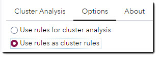

# Example Data #
Copy/paste and run the following SAS code into SAS Studio for sample input data.<br> 
The code will crerate a dataset with clustered data. All clusters in the dataset are multi clsuters with more than one records per cluster.<br>
When clustering the the data the following cluster rules were used:
* Cluster rule 1:
  * CONTACT_MC85
  * ADDRESS_MC85
  * CITY_MC85
* Cluster rule 2:
  * Family_Name_MC85
  * ADDRESS_MC85
* Cluster rule 3:
  * Family_Name_MC95
  * CITY_MC95
 
You can use these rules when testing option: *Use rules as cluster rules*<br>
    


```sas
data CONTACTS_CLUSTER;
    length CID 4;
	length ID $10.;
	length COMPANY $45.;
	length CONTACT $45.;
	length ADDRESS CITY $45.;
	length STATE $35.;
	length Family_Name $45.;
    length PHONE $35.;
	length ADDRESS_MC85 CITY_MC85 CONTACT_MC85 Family_Name_MC85 Family_Name_MC95 CITY_MC95 $100.;
	infile cards dlm='09'x;
	input CID ID $ COMPANY $ CONTACT $ ADDRESS $ CITY $ STATE $ Family_Name $ PHONE $ ADDRESS_MC85 $ CITY_MC85 $ CONTACT_MC85 $ Family_Name_MC85 $ Family_Name_MC95 $ CITY_MC95 $;
	cards;
1	4	First Merit	Jim Briggs	19 E. BROAD ST.	St Louis	Mizzou	Briggs	717-977-1810	$$$$$$$$$$$$$$Z-$$$$$$$$$$$$MY&&~$$$$$$$$$$$$$$$$$$$$$$$$$$$$$$$$$$$$$$$$$$$$$$$$$	4P~W4$$$$$$$$$$	MY&F$$$$$$$$$$$C&B_4$$$$$$$	MY&F$$$$$$$$$$$$$$$$$$$$$$$	MY7F$$$$$$$$$$$$$$$$$$$$$$$	4P~W4$$$$$$$$$$
1	1	First Merit Bank	James E. Briggs	19 East Broad Street	Saint Louis	Missouri	Briggs	450-157-0772	$$$$$$$$$$$$$$Z-$$$$$$$$$$$$MY&&~$$$$$$$$$$$$$$$$$$$$$$$$$$$$$$$$$$$$$$$$$$$$$$$$$	4P~W4$$$$$$$$$$	MY&F$$$$$$$$$$$C&B_4$$$$$$$	MY&F$$$$$$$$$$$$$$$$$$$$$$$	MY7F$$$$$$$$$$$$$$$$$$$$$$$	4P~W4$$$$$$$$$$
1	3	1st Merit Bank	Mr James Brigs	19 E Broad St	St. Louis	MO.	Brigs	950-886-6346	$$$$$$$$$$$$$$Z-$$$$$$$$$$$$MY&&~$$$$$$$$$$$$$$$$$$$$$$$$$$$$$$$$$$$$$$$$$$$$$$$$$	4P~W4$$$$$$$$$$	MY&F$$$$$$$$$$$C&B_4$$$$$$$	MY&F$$$$$$$$$$$$$$$$$$$$$$$	MY7F$$$$$$$$$$$$$$$$$$$$$$$	4P~W4$$$$$$$$$$
2	8074	DATAFLUX INC.	Mr. Robert J. Brauer	6512 6 Forks Rd Suite 404B	Raleigh	NC	Brauer	 	$$$$$$$$$$$$$$65ZH$$$$$$$$$$M$$$$$$$$$$$$$$$$$$$6$$$$$$$$$$$$$$$$$$$$$$$$$$$$$$$$$	YW$$$$$$$$$$$$$	MY&L&Y$$$$$$$$$M@M$$$$$$$$$	MY&L&Y$$$$$$$$$$$$$$$$$$$$$	MY@L_Y$$$$$$$$$$$$$$$$$$$$$	YW$$$$$$$$$$$$$
2	9054	SAS	Robert Brauer	6512 Six Frks Road Ste 404B	Raliegh	N.C.	Brauer	 	$$$$$$$$$$$$$$65ZH$$$$$$$$$$4&XGY3$$$$$$$$$$$$$$MS0S$$$$$$$$$$$$$$$$$$$$$$$$$$$$$$	YW$$$$$$$$$$$$$	MY&L&Y$$$$$$$$$M@M$$$$$$$$$	MY&L&Y$$$$$$$$$$$$$$$$$$$$$	MY@L_Y$$$$$$$$$$$$$$$$$$$$$	YW$$$$$$$$$$$$$
2	11267	SAS	Bob Brauer	6512 Six Forks #404B	Raleigh	NC	Brauer	 	$$$$$$$$$$$$$$65ZH$$$$$$$$$$4&X$$$$$$$$$$$$$$$$$MS0S$$$$$$$$$$$$$$$$$$$$$$$$$$$$$$	YW$$$$$$$$$$$$$	MY&L&Y$$$$$$$$$M@M$$$$$$$$$	MY&L&Y$$$$$$$$$$$$$$$$$$$$$	MY@L_Y$$$$$$$$$$$$$$$$$$$$$	YW$$$$$$$$$$$$$
2	10	DataFlux Corporation	Bob Brauer	6512 Six Forks Road - 404B	Raleigh	North Carolina	Brauer	323-198-3282	$$$$$$$$$$$$$$65ZH$$$$$$$$$$4&XG&Y3$$$$$$$$$$$$$MS0S$$$$$$$$$$$$$$$$$$$$$$$$$$$$$$	YW$$$$$$$$$$$$$	MY&L&Y$$$$$$$$$M@M$$$$$$$$$	MY&L&Y$$$$$$$$$$$$$$$$$$$$$	MY@L_Y$$$$$$$$$$$$$$$$$$$$$	YW$$$$$$$$$$$$$
3	103	Jaxson Data Corporation	DONALD WILLIAMS	25670 W HEDGE WOOD DR.	DANBURY	CT	WILLIAMS	332-829-6230	$$$$$$$$$$$$$$H56I0$$$$$$$$$2&8FL&~$$$$$$$$$$$$$$$$$$$$$$$$$$$$$$$$$$$$$$$$$$$$$$$	8PMY$$$$$$$$$$$	L&W&&B$$$$$$$$$8@P$$$$$$$$$	L&W&&B$$$$$$$$$$$$$$$$$$$$$	L7W7&B$$$$$$$$$$$$$$$$$$$$$	8PMY$$$$$$$$$$$
3	102	Jackson Data Co.	DON WILLIAMS	25670 W HEDGEWOOD DR	DANBURY	CT	WILLIAMS	717-977-1810	$$$$$$$$$$$$$$H56I0$$$$$$$$$2&C&L&~$$$$$$$$$$$$$$$$$$$$$$$$$$$$$$$$$$$$$$$$$$$$$$$	8PMY$$$$$$$$$$$	L&W&&B$$$$$$$$$8@P$$$$$$$$$	L&W&&B$$$$$$$$$$$$$$$$$$$$$	L7W7&B$$$$$$$$$$$$$$$$$$$$$	8PMY$$$$$$$$$$$
3	106	Jackson Data Inc.	DONNY WILLIAMS	25670 W. HEDGEWOOD DR.	DANBURY	CT	WILLIAMS	819-267-9279	$$$$$$$$$$$$$$H56I0$$$$$$$$$2&C&L&~$$$$$$$$$$$$$$$$$$$$$$$$$$$$$$$$$$$$$$$$$$$$$$$	8PMY$$$$$$$$$$$	L&W&&B$$$$$$$$$8@P$$$$$$$$$	L&W&&B$$$$$$$$$$$$$$$$$$$$$	L7W7&B$$$$$$$$$$$$$$$$$$$$$	8PMY$$$$$$$$$$$
3	104	The Jackson Data Corp.	DONALD F. WILLIAMS	25670 WEST HEDGEWOOD DR	DAN BURY	CT	WILLIAMS	493-956-8728	$$$$$$$$$$$$$$H56I0$$$$$$$$$2&C&L&~$$$$$$$$$$$$$$$$$$$$$$$$$$$$$$$$$$$$$$$$$$$$$$$	8PMY$$$$$$$$$$$	L&W&&B$$$$$$$$$8@P$$$$$$$$$	L&W&&B$$$$$$$$$$$$$$$$$$$$$	L7W7&B$$$$$$$$$$$$$$$$$$$$$	8PMY$$$$$$$$$$$
3	105	Jackson Data	MR DON F WILLIAMS	25670 W HEDGEWOOD DRIVE	DANBURY	CT	WILLIAMS	756-490-5685	$$$$$$$$$$$$$$H56I0$$$$$$$$$2&C&L&~$$$$$$$$$$$$$$$$$$$$$$$$$$$$$$$$$$$$$$$$$$$$$$$	8PMY$$$$$$$$$$$	L&W&&B$$$$$$$$$8@P$$$$$$$$$	L&W&&B$$$$$$$$$$$$$$$$$$$$$	L7W7&B$$$$$$$$$$$$$$$$$$$$$	8PMY$$$$$$$$$$$
4	130	Kaiser Permanente	John Doe	75 Columbus Ave	Five Points Hts	Michigan	Doe	536-204-2725	$$$$$$$$$$$$$$I5$$$$$$$$$$$$3&W&BM#$$$$$$$$$$$$$$$$$$$$$$$$$$$$$$$$$$$$$$$$$$$$$$$	5NP~42~$$$$$$$$	8@$$$$$$$$$$$$$C@P$$$$$$$$$	8@$$$$$$$$$$$$$$$$$$$$$$$$$	8@$$$$$$$$$$$$$$$$$$$$$$$$$	5NP~42~$$$$$$$$
4	141	Kaiser Permanente	John O. Doe	75 Columbus Avenue	Five Pts. Hts.	MI	Doe	543-927-6948	$$$$$$$$$$$$$$I5$$$$$$$$$$$$3&W&BM#$$$$$$$$$$$$$$$$$$$$$$$$$$$$$$$$$$$$$$$$$$$$$$$	5NP~2~$$$$$$$$$	8@$$$$$$$$$$$$$C@P$$$$$$$$$	8@$$$$$$$$$$$$$$$$$$$$$$$$$	8@$$$$$$$$$$$$$$$$$$$$$$$$$	5NP~2~$$$$$$$$$
4	134	Kaiser Permanente	John Doe	75 Columbus Avenue	5 Point Hts	Mich	Doe	355-070-7303	$$$$$$$$$$$$$$I5$$$$$$$$$$$$3&W&BM#$$$$$$$$$$$$$$$$$$$$$$$$$$$$$$$$$$$$$$$$$$$$$$$	5NP~2~$$$$$$$$$	8@$$$$$$$$$$$$$C@P$$$$$$$$$	8@$$$$$$$$$$$$$$$$$$$$$$$$$	8@$$$$$$$$$$$$$$$$$$$$$$$$$	5NP~2~$$$$$$$$$
4	132	Kaiser Permanente	John Doe	75 Columbus Ave	Five Points Hts	MI	Doe	446-298-0734	$$$$$$$$$$$$$$I5$$$$$$$$$$$$3&W&BM#$$$$$$$$$$$$$$$$$$$$$$$$$$$$$$$$$$$$$$$$$$$$$$$	5NP~42~$$$$$$$$	8@$$$$$$$$$$$$$C@P$$$$$$$$$	8@$$$$$$$$$$$$$$$$$$$$$$$$$	8@$$$$$$$$$$$$$$$$$$$$$$$$$	5NP~42~$$$$$$$$
4	139	Kaiser Permanente	Johnathan Doe	75 Columbus Avenue	Five Points Heights	MI	Doe	461-963-9732	$$$$$$$$$$$$$$I5$$$$$$$$$$$$3&W&BM#$$$$$$$$$$$$$$$$$$$$$$$$$$$$$$$$$$$$$$$$$$$$$$$	5NP~42~4$$$$$$$	8@$$$$$$$$$$$$$C@P$$$$$$$$$	8@$$$$$$$$$$$$$$$$$$$$$$$$$	8@$$$$$$$$$$$$$$$$$$$$$$$$$	5NP~42~4$$$$$$$
4	137	Kaiser Permanente	Mr. John Doe	75 Columbus Avenue	Five Points Heights	Mich	Doe	300-464-0726	$$$$$$$$$$$$$$I5$$$$$$$$$$$$3&W&BM#$$$$$$$$$$$$$$$$$$$$$$$$$$$$$$$$$$$$$$$$$$$$$$$	5NP~42~4$$$$$$$	8@$$$$$$$$$$$$$C@P$$$$$$$$$	8@$$$$$$$$$$$$$$$$$$$$$$$$$	8@$$$$$$$$$$$$$$$$$$$$$$$$$	5NP~42~4$$$$$$$
4	135	Kaiser Permanente	John Doe	75 Columbus Avenue	Five Points Heights	Mich	Doe	598-342-2348	$$$$$$$$$$$$$$I5$$$$$$$$$$$$3&W&BM#$$$$$$$$$$$$$$$$$$$$$$$$$$$$$$$$$$$$$$$$$$$$$$$	5NP~42~4$$$$$$$	8@$$$$$$$$$$$$$C@P$$$$$$$$$	8@$$$$$$$$$$$$$$$$$$$$$$$$$	8@$$$$$$$$$$$$$$$$$$$$$$$$$	5NP~42~4$$$$$$$
4	133	Kaiser Permanente	John Doe	75 Columbus   Avenue	Five Points	Mich	Doe	914-216-6377	$$$$$$$$$$$$$$I5$$$$$$$$$$$$3&W&BM#$$$$$$$$$$$$$$$$$$$$$$$$$$$$$$$$$$$$$$$$$$$$$$$	5NP~4$$$$$$$$$$	8@$$$$$$$$$$$$$C@P$$$$$$$$$	8@$$$$$$$$$$$$$$$$$$$$$$$$$	8@$$$$$$$$$$$$$$$$$$$$$$$$$	5NP~4$$$$$$$$$$
4	140	Kaiser Permanente	Johnathon Doe	75 Columbus Aven.	Five Pts Hts	MG	Doe	420-241-8279	$$$$$$$$$$$$$$I5$$$$$$$$$$$$3&W&BM#$$$$$$$$$$$$$$$$$$$$$$$$$$$$$$$$$$$$$$$$$$$$$$$	5NP~2~$$$$$$$$$	8@$$$$$$$$$$$$$C@P$$$$$$$$$	8@$$$$$$$$$$$$$$$$$$$$$$$$$	8@$$$$$$$$$$$$$$$$$$$$$$$$$	5NP~2~$$$$$$$$$
4	142	Kaiser Permanente	Jon Doe	75 Columbus Avenue	Five   Points	MI	Doe	925-551-8862	$$$$$$$$$$$$$$I5$$$$$$$$$$$$3&W&BM#$$$$$$$$$$$$$$$$$$$$$$$$$$$$$$$$$$$$$$$$$$$$$$$	5NP~4$$$$$$$$$$	8@$$$$$$$$$$$$$C@P$$$$$$$$$	8@$$$$$$$$$$$$$$$$$$$$$$$$$	8@$$$$$$$$$$$$$$$$$$$$$$$$$	5NP~4$$$$$$$$$$
4	129	Kasier Permanente	John Doe	75 Columbus Avenue	Five Points Heights	MI	Doe	859-464-7451	$$$$$$$$$$$$$$I5$$$$$$$$$$$$3&W&BM#$$$$$$$$$$$$$$$$$$$$$$$$$$$$$$$$$$$$$$$$$$$$$$$	5NP~42~4$$$$$$$	8@$$$$$$$$$$$$$C@P$$$$$$$$$	8@$$$$$$$$$$$$$$$$$$$$$$$$$	8@$$$$$$$$$$$$$$$$$$$$$$$$$	5NP~42~4$$$$$$$
4	138	Kaiser Permanente	John O Doe	75 Columbus Avenue	Five Points Heights	Mich	Doe	638-021-5650	$$$$$$$$$$$$$$I5$$$$$$$$$$$$3&W&BM#$$$$$$$$$$$$$$$$$$$$$$$$$$$$$$$$$$$$$$$$$$$$$$$	5NP~42~4$$$$$$$	8@$$$$$$$$$$$$$C@P$$$$$$$$$	8@$$$$$$$$$$$$$$$$$$$$$$$$$	8@$$$$$$$$$$$$$$$$$$$$$$$$$	5NP~42~4$$$$$$$
4	136	Kaiser Permanente	john doe	75 Columbus Avenue	Five Points Heights	Mich	doe	431-151-8371	$$$$$$$$$$$$$$I5$$$$$$$$$$$$3&W&BM#$$$$$$$$$$$$$$$$$$$$$$$$$$$$$$$$$$$$$$$$$$$$$$$	5NP~42~4$$$$$$$	8@$$$$$$$$$$$$$C@P$$$$$$$$$	8@$$$$$$$$$$$$$$$$$$$$$$$$$	8@$$$$$$$$$$$$$$$$$$$$$$$$$	5NP~42~4$$$$$$$
4	131	Kaiser Permanente	John Doe	75 Columbus Ave.	Five Points Hts.	Michigan	Doe	835-996-5433	$$$$$$$$$$$$$$I5$$$$$$$$$$$$3&W&BM#$$$$$$$$$$$$$$$$$$$$$$$$$$$$$$$$$$$$$$$$$$$$$$$	5NP~42~$$$$$$$$	8@$$$$$$$$$$$$$C@P$$$$$$$$$	8@$$$$$$$$$$$$$$$$$$$$$$$$$	8@$$$$$$$$$$$$$$$$$$$$$$$$$	5NP~42~$$$$$$$$
5	6	5th 3rd Bank	Ms. Shelly Speers	250 Mower Avenue # 100	Cleveland	oh	Speers	493-956-8728	$$$$$$$$$$$$$$H50$$$$$$$$$$$B&L&Y$$$$$$$$$$$$$$$Z00$$$$$$$$$$$$$$$$$$$$$$$$$$$$$$$	3WVWP~$$$$$$$$$	4M&Y$$$$$$$$$$$B7J2$$$$$$$$	4M&Y$$$$$$$$$$$$$$$$$$$$$$$	4M_Y$$$$$$$$$$$$$$$$$$$$$$$	3WVWP~$$$$$$$$$
5	2	Fifth Third Bank	Shellie Spears	250 Mauer Avenue, Suite 100	Cleveland	OH	Spears	651-245-7905	$$$$$$$$$$$$$$H50$$$$$$$$$$$B&L&Y$$$$$$$$$$$$$$$Z00$$$$$$$$$$$$$$$$$$$$$$$$$$$$$$$	3WVWP~$$$$$$$$$	4M&Y$$$$$$$$$$$B7J2$$$$$$$$	4M&Y$$$$$$$$$$$$$$$$$$$$$$$	4M7Y$$$$$$$$$$$$$$$$$$$$$$$	3WVWP~$$$$$$$$$
6	51	Fifth 3rd Bank	Mr Tony Smith	 	Naoma	NV	Smith	675-143-4472	 	PB$$$$$$$$$$$$$	4B&~2$$$$$$$$$$~@PR$$$$$$$$	4B&~2$$$$$$$$$$$$$$$$$$$$$$	4B7~2$$$$$$$$$$$$$$$$$$$$$$	PB$$$$$$$$$$$$$
6	46	5th Third Bank	Tony Smith	 	Mc Donough	NV	Smith	693-752-0252	 	B38PF$$$$$$$$$$	4B&~2$$$$$$$$$$~@PR$$$$$$$$	4B&~2$$$$$$$$$$$$$$$$$$$$$$	4B7~2$$$$$$$$$$$$$$$$$$$$$$	B38PF$$$$$$$$$$
6	50	Fifth 3rd Bank	Anthony Smith	 	Widener	NV	Smith	920-648-5663	 	L8PY$$$$$$$$$$$	4B&~2$$$$$$$$$$~@PR$$$$$$$$	4B&~2$$$$$$$$$$$$$$$$$$$$$$	4B7~2$$$$$$$$$$$$$$$$$$$$$$	L8PY$$$$$$$$$$$
7	122	KAISER PERMANTA	JOHN DOE	14109 WOODWORTH RD	Cleveland	CA	DOE	203-838-7951	$$$$$$$$$$$$$$ZSZ0-$$$$$$$$$L&8L&Y~2$$$$$$$$$$$$$$$$$$$$$$$$$$$$$$$$$$$$$$$$$$$$$$	3WVWP~$$$$$$$$$	8@$$$$$$$$$$$$$C@P$$$$$$$$$	8@$$$$$$$$$$$$$$$$$$$$$$$$$	8@$$$$$$$$$$$$$$$$$$$$$$$$$	3WVWP~$$$$$$$$$
7	121	KAISER PERMANETTE	JOHN DOE	13106 LIBERTY AVE	Cleveland	CA	DOE	516-861-8151	$$$$$$$$$$$$$$ZKZ06$$$$$$$$$W&M&Y~R$$$$$$$$$$$$$$$$$$$$$$$$$$$$$$$$$$$$$$$$$$$$$$$	3WVWP~$$$$$$$$$	8@$$$$$$$$$$$$$C@P$$$$$$$$$	8@$$$$$$$$$$$$$$$$$$$$$$$$$	8@$$$$$$$$$$$$$$$$$$$$$$$$$	3WVWP~$$$$$$$$$
7	109	KAISER PERMANENTE	JOHN DOE	14312 EDGEWOOD AVE	Cleveland	CA	DOE	623-598-8386	$$$$$$$$$$$$$$ZSKZH$$$$$$$$$_C&L&~$$$$$$$$$$$$$$$$$$$$$$$$$$$$$$$$$$$$$$$$$$$$$$$$	3WVWP~$$$$$$$$$	8@$$$$$$$$$$$$$C@P$$$$$$$$$	8@$$$$$$$$$$$$$$$$$$$$$$$$$	8@$$$$$$$$$$$$$$$$$$$$$$$$$	3WVWP~$$$$$$$$$
7	108	KAISER PERMANENTE	JOHN DOE	2 DAISY LN	Cleveland	CA	DOE	323-198-3282	$$$$$$$$$$$$$$H$$$$$$$$$$$$$8&&4R$$$$$$$$$$$$$$$$$$$$$$$$$$$$$$$$$$$$$$$$$$$$$$$$$	3WVWP~$$$$$$$$$	8@$$$$$$$$$$$$$C@P$$$$$$$$$	8@$$$$$$$$$$$$$$$$$$$$$$$$$	8@$$$$$$$$$$$$$$$$$$$$$$$$$	3WVWP~$$$$$$$$$
7	113	KAISER PERMANENTE	JOHN DOE	3424 E 110TH ST	Cleveland	CA	DOE	682-735-2166	$$$$$$$$$$$$$$KSHS$$$$$$$$$$ZZ0$$$$$$$$$$$$$$$$$$$$$$$$$$$$$$$$$$$$$$$$$$$$$$$$$$$	3WVWP~$$$$$$$$$	8@$$$$$$$$$$$$$C@P$$$$$$$$$	8@$$$$$$$$$$$$$$$$$$$$$$$$$	8@$$$$$$$$$$$$$$$$$$$$$$$$$	3WVWP~$$$$$$$$$
7	125	KAISER PERMANTE OF OHIO	JOHN DOE	9010 KENMORE	Cleveland	CA	DOE	330-214-0381	$$$$$$$$$$$$$$-0Z0$$$$$$$$$$3&PB&Y$$$$$$$$$$$$$$$$$$$$$$$$$$$$$$$$$$$$$$$$$$$$$$$$	3WVWP~$$$$$$$$$	8@$$$$$$$$$$$$$C@P$$$$$$$$$	8@$$$$$$$$$$$$$$$$$$$$$$$$$	8@$$$$$$$$$$$$$$$$$$$$$$$$$	3WVWP~$$$$$$$$$
8	7	1st Merit Bank Corp	Cathy Dossy	19 E Broad St	Cleveland	Ohio	Dossy	756-490-5685	$$$$$$$$$$$$$$Z-$$$$$$$$$$$$MY&&~$$$$$$$$$$$$$$$$$$$$$$$$$$$$$$$$$$$$$$$$$$$$$$$$$	3WVWP~$$$$$$$$$	8&47$$$$$$$$$$$J&~2$$$$$$$$	8&47$$$$$$$$$$$$$$$$$$$$$$$	8@47$$$$$$$$$$$$$$$$$$$$$$$	3WVWP~$$$$$$$$$
8	5	First Marret Bank	Kathy Dossie	19 E. Broad	Saint Louis	MO	Dossie	332-829-6230	$$$$$$$$$$$$$$Z-$$$$$$$$$$$$MY&&~$$$$$$$$$$$$$$$$$$$$$$$$$$$$$$$$$$$$$$$$$$$$$$$$$	4P~W4$$$$$$$$$$	8&47$$$$$$$$$$$J&~2$$$$$$$$	8&47$$$$$$$$$$$$$$$$$$$$$$$	8@47$$$$$$$$$$$$$$$$$$$$$$$	4P~W4$$$$$$$$$$
9	127	KAISER PERMENENTE	JOHN DOE	10610 SHERWOOD TRL	N Royalton	CA	DOE	438-769-8261	$$$$$$$$$$$$$$Z06Z0$$$$$$$$$42&YL&~$$$$$$$$$$$$$$$$$$$$$$$$$$$$$$$$$$$$$$$$$$$$$$$	PY~2YW~P$$$$$$$	8@$$$$$$$$$$$$$C@P$$$$$$$$$	8@$$$$$$$$$$$$$$$$$$$$$$$$$	8@$$$$$$$$$$$$$$$$$$$$$$$$$	PY~2YW~P$$$$$$$
9	112	KAISER PERMANENTE	JOHN DOE	9612 STATE RD	N Royalton	CO	DOE	503-697-6590	$$$$$$$$$$$$$$-6ZH$$$$$$$$$$4~&~$$$$$$$$$$$$$$$$$$$$$$$$$$$$$$$$$$$$$$$$$$$$$$$$$$	PY~2YW~P$$$$$$$	8@$$$$$$$$$$$$$C@P$$$$$$$$$	8@$$$$$$$$$$$$$$$$$$$$$$$$$	8@$$$$$$$$$$$$$$$$$$$$$$$$$	PY~2YW~P$$$$$$$
10	28	Ernst and Young	Mr. William Jackson	515 E. Broad St., Suite 12	Atlantic Bch	NV	Jackson	956-586-4147	$$$$$$$$$$$$$$5Z5$$$$$$$$$$$MY&&~$$$$$$$$$$$$$$$ZH$$$$$$$$$$$$$$$$$$$$$$$$$$$$$$$$	&~WP~3M3$$$$$$$	C&X&B$$$$$$$$$$M7WW$$$$$$$$	C&X&B$$$$$$$$$$$$$$$$$$$$$$	C&X@B$$$$$$$$$$$$$$$$$$$$$$	&~WP~3M3$$$$$$$
10	19	Ernst & Young	Mr Bill Preston Jackson	515 E Broad St., Suite 12	Minneapolis	NV	Jackson	587-959-7179	$$$$$$$$$$$$$$5Z5$$$$$$$$$$$MY&&~$$$$$$$$$$$$$$$ZH$$$$$$$$$$$$$$$$$$$$$$$$$$$$$$$$	BPNW4$$$$$$$$$$	C&X&B$$$$$$$$$$M7WW$$$$$$$$	C&X&B$$$$$$$$$$$$$$$$$$$$$$	C&X@B$$$$$$$$$$$$$$$$$$$$$$	BPNW4$$$$$$$$$$
10	27	Ernst and Young	Mr. William Jackson	515 E. Broad St., Suite 12	S.W. Madison	NV	Jackson	330-214-0381	$$$$$$$$$$$$$$5Z5$$$$$$$$$$$MY&&~$$$$$$$$$$$$$$$ZH$$$$$$$$$$$$$$$$$$$$$$$$$$$$$$$$	4LB84P$$$$$$$$$	C&X&B$$$$$$$$$$M7WW$$$$$$$$	C&X&B$$$$$$$$$$$$$$$$$$$$$$	C&X@B$$$$$$$$$$$$$$$$$$$$$$	4LB84P$$$$$$$$$
10	20	Ernst & Young	William Jaackson	515 E Broad St., Suite 12	Havilah	CA	Jaackson	765-245-7921	$$$$$$$$$$$$$$5Z5$$$$$$$$$$$MY&&~$$$$$$$$$$$$$$$ZH$$$$$$$$$$$$$$$$$$$$$$$$$$$$$$$$	2VW$$$$$$$$$$$$	C&X&B$$$$$$$$$$M7WW$$$$$$$$	C&X&B$$$$$$$$$$$$$$$$$$$$$$	C&X@B$$$$$$$$$$$$$$$$$$$$$$	2VW$$$$$$$$$$$$
10	18	Ernst & Young	William P. Jackson	515 East Broad St., Suite 12	Santa Monica	NV	Jackson	562-764-8201	$$$$$$$$$$$$$$5Z5$$$$$$$$$$$MY&&~$$$$$$$$$$$$$$$ZH$$$$$$$$$$$$$$$$$$$$$$$$$$$$$$$$	4P~BP3$$$$$$$$$	C&X&B$$$$$$$$$$M7WW$$$$$$$$	C&X&B$$$$$$$$$$$$$$$$$$$$$$	C&X@B$$$$$$$$$$$$$$$$$$$$$$	4P~BP3$$$$$$$$$
10	26	ernst and young	bill jackson	515 e broad st., suite 12	Peotone	NV	jackson	918-233-7701	$$$$$$$$$$$$$$5Z5$$$$$$$$$$$MY&&~$$$$$$$$$$$$$$$ZH$$$$$$$$$$$$$$$$$$$$$$$$$$$$$$$$	N~P$$$$$$$$$$$$	C&X&B$$$$$$$$$$M7WW$$$$$$$$	C&X&B$$$$$$$$$$$$$$$$$$$$$$	C&X@B$$$$$$$$$$$$$$$$$$$$$$	N~P$$$$$$$$$$$$
10	25	Ernst and Young	Bill F. Jackson	515 E. Broad St., Suite 12	Mt Hermon	NV	Jackson	937-728-4724	$$$$$$$$$$$$$$5Z5$$$$$$$$$$$MY&&~$$$$$$$$$$$$$$$ZH$$$$$$$$$$$$$$$$$$$$$$$$$$$$$$$$	BP~2YBP$$$$$$$$	C&X&B$$$$$$$$$$M7WW$$$$$$$$	C&X&B$$$$$$$$$$$$$$$$$$$$$$	C&X@B$$$$$$$$$$$$$$$$$$$$$$	BP~2YBP$$$$$$$$
10	17	Ernst & Young	Bill -jaxon	515 E. Broad St., Suite 12	Plains Township	CA	Bill -jaxon	759-535-2042	$$$$$$$$$$$$$$5Z5$$$$$$$$$$$MY&&~$$$$$$$$$$$$$$$ZH$$$$$$$$$$$$$$$$$$$$$$$$$$$$$$$$	NWP4~LP42N$$$$$	C&X&B$$$$$$$$$$$$$$$$$$$$$$	C&X&B$$$$$$$$$$$$$$$$$$$$$$	M7WC&X@B$$$$$$$$$$$$$$$$$$$	NWP4~LP42N$$$$$
10	23	Ernest & Young	William P Jackson	515 E. Broad St., Ste 12	Heth	NV	Jackson	516-861-8151	$$$$$$$$$$$$$$5Z5$$$$$$$$$$$MY&&~$$$$$$$$$$$$$$$ZH$$$$$$$$$$$$$$$$$$$$$$$$$$$$$$$$	2~2$$$$$$$$$$$$	C&X&B$$$$$$$$$$M7WW$$$$$$$$	C&X&B$$$$$$$$$$$$$$$$$$$$$$	C&X@B$$$$$$$$$$$$$$$$$$$$$$	2~2$$$$$$$$$$$$
10	16	Ernst & Young	William Jackson	515 E. Broad St., Suite 12	Vanadium	NV	Jackson	747-866-4267	$$$$$$$$$$$$$$5Z5$$$$$$$$$$$MY&&~$$$$$$$$$$$$$$$ZH$$$$$$$$$$$$$$$$$$$$$$$$$$$$$$$$	VP8B$$$$$$$$$$$	C&X&B$$$$$$$$$$M7WW$$$$$$$$	C&X&B$$$$$$$$$$$$$$$$$$$$$$	C&X@B$$$$$$$$$$$$$$$$$$$$$$	VP8B$$$$$$$$$$$
10	22	Ernst & Young	Billy Jackson	515 E. Broad St., Ste. 12	North Brewer	NV	Jackson	645-545-1986	$$$$$$$$$$$$$$5Z5$$$$$$$$$$$MY&&~$$$$$$$$$$$$$$$ZH$$$$$$$$$$$$$$$$$$$$$$$$$$$$$$$$	PY~2MYLY$$$$$$$	C&X&B$$$$$$$$$$M7WW$$$$$$$$	C&X&B$$$$$$$$$$$$$$$$$$$$$$	C&X@B$$$$$$$$$$$$$$$$$$$$$$	PY~2MYLY$$$$$$$
10	24	Ernstein Young	Mr. Bill Jackson	515 East Broad Street Suite 12	Braceville	NV	Jackson	203-838-7951	$$$$$$$$$$$$$$5Z5$$$$$$$$$$$MY&&~$$$$$$$$$$$$$$$ZH$$$$$$$$$$$$$$$$$$$$$$$$$$$$$$$$	MY4VW$$$$$$$$$$	C&X&B$$$$$$$$$$M7WW$$$$$$$$	C&X&B$$$$$$$$$$$$$$$$$$$$$$	C&X@B$$$$$$$$$$$$$$$$$$$$$$	MY4VW$$$$$$$$$$
10	36	ERNST & YOUNG	BILLY JACKSON	515 East Broad St., Suite 12	Berlin Hts	NV	JACKSON	355-070-7303	$$$$$$$$$$$$$$5Z5$$$$$$$$$$$MY&&~$$$$$$$$$$$$$$$ZH$$$$$$$$$$$$$$$$$$$$$$$$$$$$$$$$	MYWP2~$$$$$$$$$	C&X&B$$$$$$$$$$M7WW$$$$$$$$	C&X&B$$$$$$$$$$$$$$$$$$$$$$	C&X@B$$$$$$$$$$$$$$$$$$$$$$	MYWP2~$$$$$$$$$
10	34	Ernt and Young	Will Jackson	515 E. Broad St., Suite 12	Lansing	NV	Jackson	446-298-0734	$$$$$$$$$$$$$$5Z5$$$$$$$$$$$MY&&~$$$$$$$$$$$$$$$ZH$$$$$$$$$$$$$$$$$$$$$$$$$$$$$$$$	WP4PF$$$$$$$$$$	C&X&B$$$$$$$$$$M7WW$$$$$$$$	C&X&B$$$$$$$$$$$$$$$$$$$$$$	C&X@B$$$$$$$$$$$$$$$$$$$$$$	WP4PF$$$$$$$$$$
10	33	Ernst and Young LLT	Mr. William P Jackson	515 E. Broad St., Suite 12	Kasiesville	NV	Jackson	835-996-5433	$$$$$$$$$$$$$$5Z5$$$$$$$$$$$MY&&~$$$$$$$$$$$$$$$ZH$$$$$$$$$$$$$$$$$$$$$$$$$$$$$$$$	344VW$$$$$$$$$$	C&X&B$$$$$$$$$$M7WW$$$$$$$$	C&X&B$$$$$$$$$$$$$$$$$$$$$$	C&X@B$$$$$$$$$$$$$$$$$$$$$$	344VW$$$$$$$$$$
10	32	Ernst and Young	Mr. William Jackson	515 E. Broad St., Suite 12	Charlotte	NV	Jackson	536-204-2725	$$$$$$$$$$$$$$5Z5$$$$$$$$$$$MY&&~$$$$$$$$$$$$$$$ZH$$$$$$$$$$$$$$$$$$$$$$$$$$$$$$$$	J2YW~$$$$$$$$$$	C&X&B$$$$$$$$$$M7WW$$$$$$$$	C&X&B$$$$$$$$$$$$$$$$$$$$$$	C&X@B$$$$$$$$$$$$$$$$$$$$$$	J2YW~$$$$$$$$$$
10	21	Ernst & Young	Bill Jackson	515 E. Broad St., Suite 12	Kokomo	NV	Jackson	416-379-0019	$$$$$$$$$$$$$$5Z5$$$$$$$$$$$MY&&~$$$$$$$$$$$$$$$ZH$$$$$$$$$$$$$$$$$$$$$$$$$$$$$$$$	33B$$$$$$$$$$$$	C&X&B$$$$$$$$$$M7WW$$$$$$$$	C&X&B$$$$$$$$$$$$$$$$$$$$$$	C&X@B$$$$$$$$$$$$$$$$$$$$$$	33B$$$$$$$$$$$$
10	31	Ernst and Young	Bill Jackson	515 E. Broad St., Suite 12	N Cleveland	NV	Jackson	859-464-7451	$$$$$$$$$$$$$$5Z5$$$$$$$$$$$MY&&~$$$$$$$$$$$$$$$ZH$$$$$$$$$$$$$$$$$$$$$$$$$$$$$$$$	PY~23WVWP~$$$$$	C&X&B$$$$$$$$$$M7WW$$$$$$$$	C&X&B$$$$$$$$$$$$$$$$$$$$$$	C&X@B$$$$$$$$$$$$$$$$$$$$$$	PY~23WVWP~$$$$$
10	30	Ernst and Young	Mr. William Jackson	515 E. Broad St., Suite 12	Clearmont	NV	Jackson	277-688-4540	$$$$$$$$$$$$$$5Z5$$$$$$$$$$$MY&&~$$$$$$$$$$$$$$$ZH$$$$$$$$$$$$$$$$$$$$$$$$$$$$$$$$	3WYBP~$$$$$$$$$	C&X&B$$$$$$$$$$M7WW$$$$$$$$	C&X&B$$$$$$$$$$$$$$$$$$$$$$	C&X@B$$$$$$$$$$$$$$$$$$$$$$	3WYBP~$$$$$$$$$
10	29	Ernst and Young	Mr. William Jacksonn	515 E. Broad St., Suite 12	Purcell	NV	Jacksonn	438-769-8261	$$$$$$$$$$$$$$5Z5$$$$$$$$$$$MY&&~$$$$$$$$$$$$$$$ZH$$$$$$$$$$$$$$$$$$$$$$$$$$$$$$$$	NY4W$$$$$$$$$$$	C&X&B$$$$$$$$$$M7WW$$$$$$$$	C&X&B$$$$$$$$$$$$$$$$$$$$$$	C&X@B$$$$$$$$$$$$$$$$$$$$$$	NY4W$$$$$$$$$$$
11	79	Branstein Services	Mr. Jacob L. Branstein	912 Amy Way	Highland	NV	Branstein	488-408-8431	$$$$$$$$$$$$$$-ZH$$$$$$$$$$$&BR$$$$$$$$$$$$$$$$$$$$$$$$$$$$$$$$$$$$$$$$$$$$$$$$$$$	2WP~$$$$$$$$$$$	MY&B4~&B$$$$$$$C&3_$$$$$$$$	MY&B4~&B$$$$$$$$$$$$$$$$$$$	MY&B4~7B$$$$$$$$$$$$$$$$$$$	2WP~$$$$$$$$$$$
11	82	Branstien Services Inc	Jacob Branstein	912 Amy Way	N. Olmsted	CA	Branstein	757-394-3194	$$$$$$$$$$$$$$-ZH$$$$$$$$$$$&BR$$$$$$$$$$$$$$$$$$$$$$$$$$$$$$$$$$$$$$$$$$$$$$$$$$$	PY~2WB4~~$$$$$$	MY&B4~&B$$$$$$$C&3_$$$$$$$$	MY&B4~&B$$$$$$$$$$$$$$$$$$$	MY&B4~7B$$$$$$$$$$$$$$$$$$$	PY~2WB4~~$$$$$$
11	81	Branstein Service	Jake Bransteen	912 Amy Way	East Claridon	 	Bransteen	953-358-4345	$$$$$$$$$$$$$$-ZH$$$$$$$$$$$&BR$$$$$$$$$$$$$$$$$$$$$$$$$$$$$$$$$$$$$$$$$$$$$$$$$$$	_4~3WY8P$$$$$$$	MY&B4~&B$$$$$$$C&3_$$$$$$$$	MY&B4~&B$$$$$$$$$$$$$$$$$$$	MY&B4~_B$$$$$$$$$$$$$$$$$$$	_4~3WY8P$$$$$$$
11	78	Bransteen Svcs	Howard Bransteen	912 Amy Way	Colebrookdale	NV	Bransteen	558-128-4970	$$$$$$$$$$$$$$-ZH$$$$$$$$$$$&BR$$$$$$$$$$$$$$$$$$$$$$$$$$$$$$$$$$$$$$$$$$$$$$$$$$$	3WMY38W$$$$$$$$	MY&B4~&B$$$$$$$2&L&Y8$$$$$$	MY&B4~&B$$$$$$$$$$$$$$$$$$$	MY&B4~_B$$$$$$$$$$$$$$$$$$$	3WMY38W$$$$$$$$
11	83	Branstein Services Inc.	Howard Branstein	912 Amy Way	Little Rock	HI	Branstein	646-752-5196	$$$$$$$$$$$$$$-ZH$$$$$$$$$$$&BR$$$$$$$$$$$$$$$$$$$$$$$$$$$$$$$$$$$$$$$$$$$$$$$$$$$	W~WY3$$$$$$$$$$	MY&B4~&B$$$$$$$2&L&Y8$$$$$$	MY&B4~&B$$$$$$$$$$$$$$$$$$$	MY&B4~7B$$$$$$$$$$$$$$$$$$$	W~WY3$$$$$$$$$$
12	251	First Merit Corp	Janet Heinicke	 	Ray Brook	CA	Heinicke	201-219-9832	 	YMY3$$$$$$$$$$$	2&B&3$$$$$$$$$$C&P$$$$$$$$$	2&B&3$$$$$$$$$$$$$$$$$$$$$$	27B73$$$$$$$$$$$$$$$$$$$$$$	YMY3$$$$$$$$$$$
12	2344	California Federal Bank	Chad Hammack	 	Colorado Springs	CA	Hammack	691-225-0045	 	3WY~4NYPF4$$$$$	2&B&3$$$$$$$$$$J2&8$$$$$$$$	2&B&3$$$$$$$$$$$$$$$$$$$$$$	2&B&3$$$$$$$$$$$$$$$$$$$$$$	3WY~4NYPF4$$$$$
13	1196	Farmers Insurance Group Inc.	Sarah Ciotti	3145 East Flamingo Road #1007	Callahan	CA	Ciotti	287-473-4617	$$$$$$$$$$$$$$KZS5$$$$$$$$$$GW&B&PF@$$$$$$$$$$$$Z00I$$$$$$$$$$$$$$$$$$$$$$$$$$$$$$	3WP$$$$$$$$$$$$	4&&~7$$$$$$$$$$4&Y&$$$$$$$$	4&&~7$$$$$$$$$$$$$$$$$$$$$$	47@~7$$$$$$$$$$$$$$$$$$$$$$	3WP$$$$$$$$$$$$
13	1182	Farmers Insurance Group Inc.	Sara Siotti	3145 E Flamingo Rd Ste 1007	Callahan	CA	Siotti	(287) 473-4617	$$$$$$$$$$$$$$KZS5$$$$$$$$$$GW&B&PF@$$$$$$$$$$$$Z00I$$$$$$$$$$$$$$$$$$$$$$$$$$$$$$	3WP$$$$$$$$$$$$	4&&~7$$$$$$$$$$4&Y&$$$$$$$$	4&&~7$$$$$$$$$$$$$$$$$$$$$$	47@~7$$$$$$$$$$$$$$$$$$$$$$	3WP$$$$$$$$$$$$
14	2380	St. Mary's Hospital	Bob Joachim	2525 Dupont Dr	Norfolk	NE	Joachim	566-435-2965	$$$$$$$$$$$$$$H5H5$$$$$$$$$$8&N&P~$$$$$$$$$$$$$$$$$$$$$$$$$$$$$$$$$$$$$$$$$$$$$$$$	PYGW3$$$$$$$$$$	C&&J2&B$$$$$$$$M@M$$$$$$$$$	C&&J2&B$$$$$$$$$$$$$$$$$$$$	C@&J27B$$$$$$$$$$$$$$$$$$$$	PYGW3$$$$$$$$$$
14	2379	St. Marys Hospital	Robert Joachim	15 W Alhambra Rd	Norfolk	NE	Joachim	779-711-6088	$$$$$$$$$$$$$$Z5$$$$$$$$$$$$&W&BY&$$$$$$$$$$$$$$$$$$$$$$$$$$$$$$$$$$$$$$$$$$$$$$$$	PYGW3$$$$$$$$$$	C&&J2&B$$$$$$$$M@M$$$$$$$$$	C&&J2&B$$$$$$$$$$$$$$$$$$$$	C@&J27B$$$$$$$$$$$$$$$$$$$$	PYGW3$$$$$$$$$$
15	52	Fifth 3rd Bank	Mr. Robert E Beckett	392 S. Main St. Box 2270	Edith	NV	Beckett	845-249-6512	$$$$$$$$$$$$$$K-H$$$$$$$$$$$B&&P$$$$$$$$$$$$$$$$$$$$$$NHHI0$$$$$$$$$$$$$$$$$$$$$$$	_8~2$$$$$$$$$$$	M&3&~$$$$$$$$$$M@M$$$$$$$$$	M&3&~$$$$$$$$$$$$$$$$$$$$$$	M_3_~$$$$$$$$$$$$$$$$$$$$$$	_8~2$$$$$$$$$$$
15	41	Fifth Third Bank	Bob Beckett	392 S. Main St. PO Box 2270	Crooked Lake	NV	Beckett	461-963-9732	$$$$$$$$$$$$$$K-H$$$$$$$$$$$B&&P$$$$$$$$$$$$$$$$$$$$$$NHHI0$$$$$$$$$$$$$$$$$$$$$$$	3Y3~W3$$$$$$$$$	M&3&~$$$$$$$$$$M@M$$$$$$$$$	M&3&~$$$$$$$$$$$$$$$$$$$$$$	M_3_~$$$$$$$$$$$$$$$$$$$$$$	3Y3~W3$$$$$$$$$
15	40	Fifth Third Bank	Bobby Becket	392 S. Main St. PO Box 2270	Turlock	NV	Becket	638-021-5650	$$$$$$$$$$$$$$K-H$$$$$$$$$$$B&&P$$$$$$$$$$$$$$$$$$$$$$NHHI0$$$$$$$$$$$$$$$$$$$$$$$	~YW3$$$$$$$$$$$	M&3&~$$$$$$$$$$M@M$$$$$$$$$	M&3&~$$$$$$$$$$$$$$$$$$$$$$	M_3_~$$$$$$$$$$$$$$$$$$$$$$	~YW3$$$$$$$$$$$
15	39	Fifth Third Bank	Rob Beckett	392 S. Main St. PO Box 2270	Whitetown	NV	Beckett	300-464-0726	$$$$$$$$$$$$$$K-H$$$$$$$$$$$B&&P$$$$$$$$$$$$$$$$$$$$$$NHHI0$$$$$$$$$$$$$$$$$$$$$$$	L~~LP$$$$$$$$$$	M&3&~$$$$$$$$$$M@M$$$$$$$$$	M&3&~$$$$$$$$$$$$$$$$$$$$$$	M_3_~$$$$$$$$$$$$$$$$$$$$$$	L~~LP$$$$$$$$$$
15	38	Fifth Third Bank	Robert E. Beckett	392 S. Main St. PO Box 2270	Lake St Louis	NV	Beckett	431-151-8371	$$$$$$$$$$$$$$K-H$$$$$$$$$$$B&&P$$$$$$$$$$$$$$$$$$$$$$NHHI0$$$$$$$$$$$$$$$$$$$$$$$	W34P~W4$$$$$$$$	M&3&~$$$$$$$$$$M@M$$$$$$$$$	M&3&~$$$$$$$$$$$$$$$$$$$$$$	M_3_~$$$$$$$$$$$$$$$$$$$$$$	W34P~W4$$$$$$$$
15	37	Fifth Third Bank	Bob Beckett	392 S. Main St. PO Box 2270	Springfield	NV	Beckett	598-342-2348	$$$$$$$$$$$$$$K-H$$$$$$$$$$$B&&P$$$$$$$$$$$$$$$$$$$$$$NHHI0$$$$$$$$$$$$$$$$$$$$$$$	4NYPFGW~$$$$$$$	M&3&~$$$$$$$$$$M@M$$$$$$$$$	M&3&~$$$$$$$$$$$$$$$$$$$$$$	M_3_~$$$$$$$$$$$$$$$$$$$$$$	4NYPFGW~$$$$$$$
16	64	First Merit Bank	Ann R. Kaufman	642 Arizona Street	East Freetown	NV	Kaufman	785-375-9843	$$$$$$$$$$$$$$6SH$$$$$$$$$$$&Y&4&P&$$$$$$$$$$$$$$$$$$$$$$$$$$$$$$$$$$$$$$$$$$$$$$$	_4~GY~LP$$$$$$$	3&&MB&B$$$$$$$$&PP$$$$$$$$$	3&&MB&B$$$$$$$$$$$$$$$$$$$$	3&#MB&B$$$$$$$$$$$$$$$$$$$$	_4~GY~LP$$$$$$$
16	63	1st Merit	Anne Kaufmann	642 Arizona St	Ft Myers	NV	Kaufmann	694-799-0274	$$$$$$$$$$$$$$6SH$$$$$$$$$$$&Y&4&P&$$$$$$$$$$$$$$$$$$$$$$$$$$$$$$$$$$$$$$$$$$$$$$$	GY~BY4$$$$$$$$$	3&&MB&B$$$$$$$$&PP$$$$$$$$$	3&&MB&B$$$$$$$$$$$$$$$$$$$$	3&#MB&B$$$$$$$$$$$$$$$$$$$$	GY~BY4$$$$$$$$$
16	61	1st Merit	Annie Kauffman	642 arizona	Skelley	NV	Kauffman	318-812-9270	$$$$$$$$$$$$$$6SH$$$$$$$$$$$&Y&4&P&$$$$$$$$$$$$$$$$$$$$$$$$$$$$$$$$$$$$$$$$$$$$$$$	43W$$$$$$$$$$$$	3&&MB&B$$$$$$$$&PP$$$$$$$$$	3&&MB&B$$$$$$$$$$$$$$$$$$$$	3&#MB&B$$$$$$$$$$$$$$$$$$$$	43W$$$$$$$$$$$$
17	88	Americon Red Cross, Inc.	ROBERT TOTH	9901 GAYLORD AVE	Cleveland	NM	TOTH	554-454-3284	$$$$$$$$$$$$$$--0Z$$$$$$$$$$F&&W&Y~$$$$$$$$$$$$$$$$$$$$$$$$$$$$$$$$$$$$$$$$$$$$$$$	3WVWP~$$$$$$$$$	~&~2$$$$$$$$$$$M@M$$$$$$$$$	~&~2$$$$$$$$$$$$$$$$$$$$$$$	~@~2$$$$$$$$$$$$$$$$$$$$$$$	3WVWP~$$$$$$$$$
17	87	THE AMERICAN RED CROSS CORP.	BOB TOTH	9901 GAYLORD AVE	Cleveland	CA	TOTH	942-490-4667	$$$$$$$$$$$$$$--0Z$$$$$$$$$$F&&W&Y~$$$$$$$$$$$$$$$$$$$$$$$$$$$$$$$$$$$$$$$$$$$$$$$	3WVWP~$$$$$$$$$	~&~2$$$$$$$$$$$M@M$$$$$$$$$	~&~2$$$$$$$$$$$$$$$$$$$$$$$	~@~2$$$$$$$$$$$$$$$$$$$$$$$	3WVWP~$$$$$$$$$
;
run;
```
