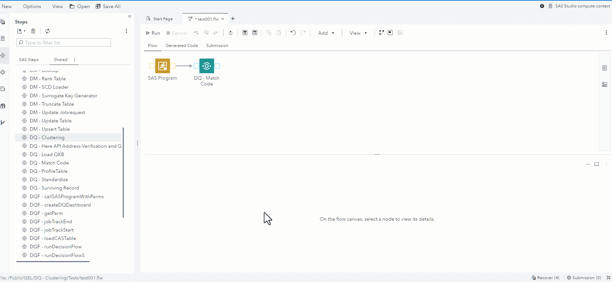

# DQ - Clustering  

## Description  

The **DQ - Clustering** step allows you to create a Cluster ID based on defined clustering rules.
 * Each clustering rule can contain one or more columns.
 * There is an implied "AND" between each column in a clustering rule.
 * There is an implied "OR" between each clustering rule.
 * This step will execute on the SAS Compute Server using proc dqmatch.
 * This version supports up to five clustering rules.    

## User Interface

* ### Match and Cluster tab ###

   | Standalone mode | Flow mode |
   | --- | --- |                  
   |  |  |

1. **Cluster records based on following rule(s).** - Defines up to five rules for creating the cluster, several columns can be inserted in each rule.  

* ### Options tab ###

   

## Requirements

2021.1.1 or later  

## Usage

   

## Change Log

Version 1.2 (05AUG2024)
 * fixed issue where disabled clustering rules still resulted in conditions being generated (GitHub Issue #154)

Version 1.1 (05DEC2022)
 * expanded support from three clustering rules to five clustering rules
 * expanded documentation in the About tab

Version 1.0 (14SEP2022)
 * Initial version