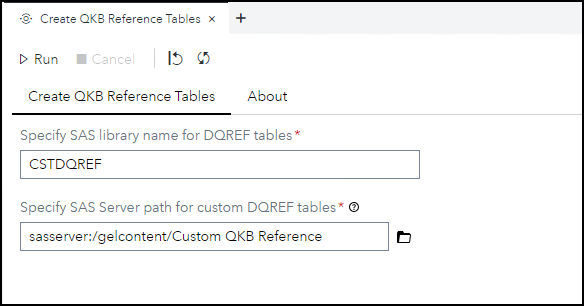
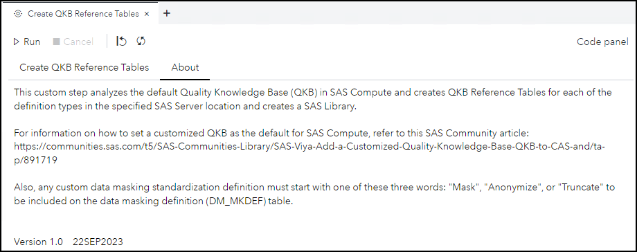
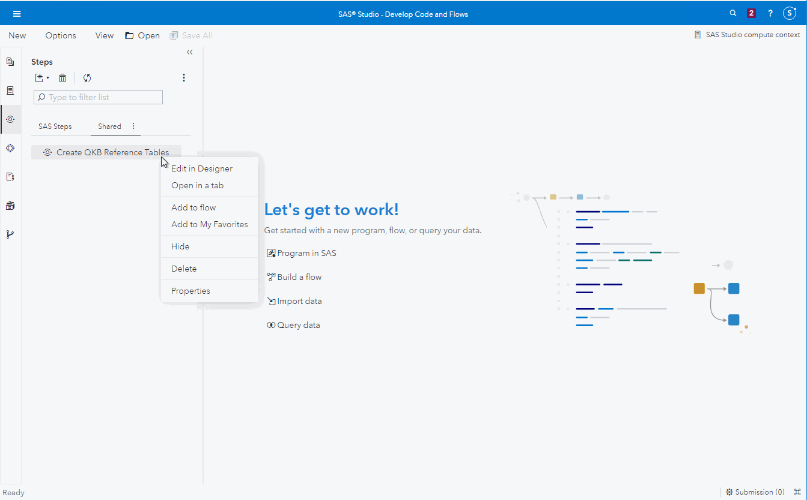

# DQ - Create QKB Reference Tables

## Description

The **Create QKB Reference Tables** custom step enables SAS Studio users to analyze the default Quality Knowledge Base (QKB) in SAS Compute and creates QKB Reference Tables for each of the definition types in the specified SAS Server location and creates a SAS Library.

You would want to run this custom step, if you have customized your QKB and would like to have the reference tables with the definition names and information for each definition type in your customized QKB.

For information on how to set a customized QKB as the default for SAS Compute, refer to this [SAS Community article](https://communities.sas.com/t5/SAS-Communities-Library/SAS-Viya-Add-a-Customized-Quality-Knowledge-Base-QKB-to-CAS-and/ta-p/891719).

Any custom data masking definition must start with one of these three words: "Mask", "Anonymize", or "Truncate" to be included on the data masking definition (DM_MKDEF) table.

*Note:*  This custom step has no input and output tables; therefore, it is intended to be executed in Standalone mode.

After running this custom step, you may want to consider adding the created SAS library to your **autoexec** in *SAS Studio* or *SAS Environment Manager*.  If you add **libname SASDQREF <output_path>**, then the delivered steps that reference the QKB will use your newly created tables.

## User Interface

* ### Create QKB Reference Tables tab ###

* ### About tab ###

## Requirements

* SAS Viya 2023.06 or later
* Customized QKB is set as default in SAS Compute.  Refer to [this article](https://communities.sas.com/t5/SAS-Communities-Library/SAS-Viya-Add-a-Customized-Quality-Knowledge-Base-QKB-to-CAS-and/ta-p/891719) for more information.
* Custom Data Masking standardization definitions must start with either "Mask", "Anonymize", or "Truncate" to be included on the output data masking definition (DM_MKDEF) table.
* Specified path for output tables must exist on the SAS Server
* Custom step must be executed by a user that has write access to the output path on the SAS Server

## Usage

Note:  The "error" in the Program log is warning messages about deprecated definitions in the QKB.

## Change Log

* Version 1.0 (09OCT2023)
    * Initial version

