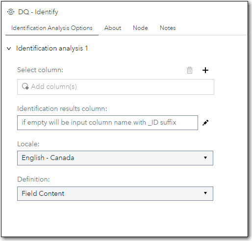
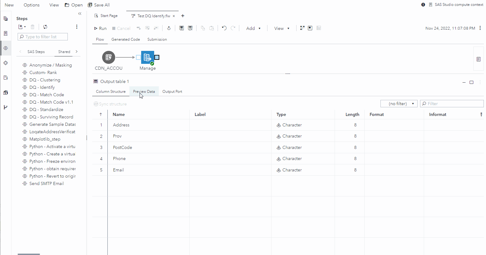

# DQ - Identify

## Description

The **DQ - Identify** step allows you to obtain the Identity Type for each individual row in a column of data based on a locale and an Identification Analysis definition using the **dqIdentify** function.  This version supports seven locales (ENCAN, ENUSA, FRCAN, FRFRA, DEDEU, ITITA and ESESP) and allows you to do Identification Analysis on up to 5 columns. 

## User Interface  

* ### Identification Analysis Options tab ###

   | Standalone mode | Flow mode |
   | --- | --- |                  
   |  |  |
   
   * This applies to Identification Analysis 1 … Identification Analysis 5

1. **Select column**                  - Defines the column on which to perform Identification Analysis.  
2. **Identification results column**  - Specify name of output column to contain generated Identity Types. If left empty, a new column will be created using name of input column suffixed with **_ID**.      
3. **Locale**                         - Pick the Locale to be used for Identification Analysis.  If left empty, the **English - USA** Locale will be used. 
4. **Definition**                     - Pick the Definition to be used for Identification Analysis. If left empty, the **Field Content (Global)** Definition will be used.  

## Requirements

2021.1.1 or later  

* This custom step requires a SAS Quality Knowledge Base (QKB) to be installed and configured. More details can be found in the documentation that is available [here](https://support.sas.com/en/software/quality-knowledge-base-support.html)  

## Usage

  


Copy/paste and run the following SAS code into SAS Studio for sample input data.
```sas
data CDN_ACCOUNTS ;
	length Name Address City Prov PostCode Phone Email $ 40 ;
	infile cards dsd dlm="," ;
	input ID Name $ Address $ City $ Prov $ PostCode $ Amount Phone $ Email $ ;
	cards ;
201,Mr. Jacques Plante,14 Denis Road,Cantley,QC,J8V 3J5,50,(819)-555-2334,
202,Tony Sarducci,2125 31 Ave,Calgary,Alberta,T2T 1T5,100,,
203,Anthony Sarducci, ,,,,400,tony.duke@telus.ca,
204,Amar Singh,5264 Joel Avenue,"Burlington,ON",L7L3Y7,,300,,
205,Jack Plant,,,,,50,555-2334,JPlante@gmail.com
206,Mr. Arnold Toporowski,"38 Metropol, Unit 1605",Ottawa ON K1Z 1E9,,613 755-2313,90,,ArnoldT@sas.com
207,Ms MJ Belanger,4500 Sherbrooke St W,Montreal,QC,H3Z 1E6,950,514 799 9239,
208,Mr. Anthony Sarducci,2125 31 Ave SW,Calgary AB T2T1T5,,,10,403.265.5177,tony.sarducci@bell.ca
209,"Plant, Jack",201-14 Denis Rd,Gatineau,,J8V3J5,150,555-2334,
210,Mme Marie-Josée Bélanger,"4500, rue Sherbrook Ouest",Montréal,PQ,,900,,MJBelanger@bell.ca
211,Ms. M.-J. Bélanger,4500 Sherbrooke O,Mtl,QC,H3Z 1E6,100,799-9239,
212,Jacques Plante,"14, Chemin Denis, app 201",Cantley,Quebec,,40,,
213,Amar Singh,5264 Joel Av,Burlington,ON,,100,(905) 637 5119,amar.singh@lost.com
214,Arnie Toperowski,"38, privé Metropole, app 1605",Otawa  ,Ont,K1Z1E9,400,,
215,Jacques Plante,14 Denise Unit 201,"Cantley, QC, J8V 3J5",,,10,,
216,JF Tremblay,P.O. Box 123,St-Marc-du-Lac-Long,QC,,200,819-555-4545,
217,Jean-Francois Tremblay,CP 123,Saint Marc QC,G0L 1TO,,90,,JFTremblay@bell.ca
218,"Tremblay, JF",CP 123,St-Marc,Quebec,GOL 1T0,50,555-4545,
219,A. Toporowski,"38 Metropole Private, Unit 1605",Ottawa,Ontario,K1Z 1E9,100,7552313,ArnoldT@sas.com
220,Tony Sarducci,2125 31 Av,Calgary,AB,,400,,tony.duke@telus.ca
;
```

## Change Log

Version 1.0 (29NOV2022)  

  * Initial version  
  

