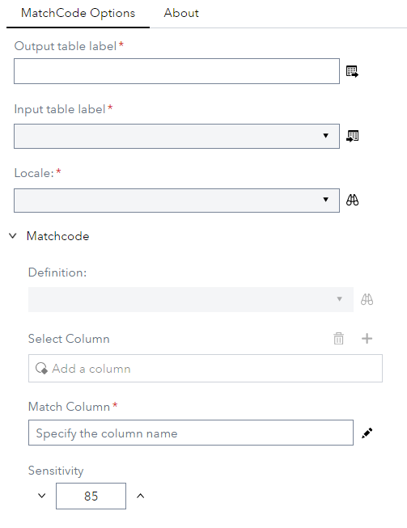
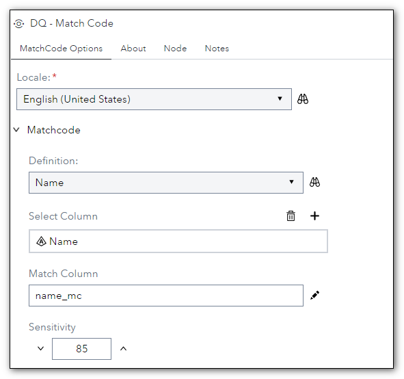
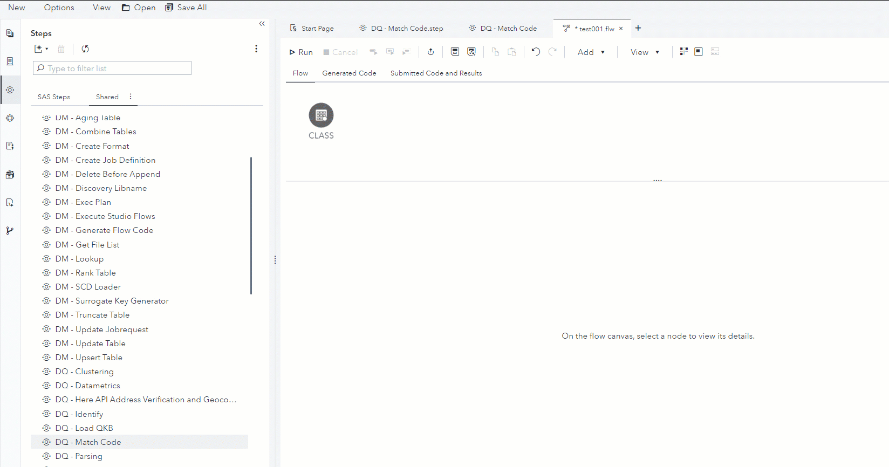

# DQ - Match Code

## Description

>**Note**: The **Match Codes** step in the **Data Quality** group in the Steps pane in SAS Studio, introduced in release 2023.08, provides the same functionality, and it is highly recommended to use that step going forward.

The **DQ - Match Code** step allows you to create a column match code based on locale and rule definition using a **dqMatch** function in the SAS Compute Server. 
 * This version uses SASDQREF tables, supports all Locales defined in the QKB and allows to generate match code for up to 10 columns. 
 * Prompts take advantage of dynamic prompt lists (SASDQREF) and hierarchies 

## User Interface  

* ### MatchCode Options tab ###

   | Standalone mode | Flow mode |
   | --- | --- |                  
   |  |  |
   
   * This applies to MatchCode1 … MatchCode5

1. **Select Column**   - Defines the column to be used to compute match code.  
2. **Match Column**    - Specify name of output column to contain generated match code. If left empty, a new column will be created using name of input column suffixed with **_MC**.      
3. **Locale**          - Define Locale to be used to compute match code.  
4. **Definition**      - Define the rule to be used to compute match code.  
5. **Sensitivity**     - Define the Sensitivity used to compute match code.  

>**Note**: The **Match Codes** step in the **Data Quality** group in the **Steps** pane in SAS Studio, introduced in release 2023.08, provides similar functionality, 
and it is highly recommended to use that step going forward when possible.

## Requirements

2023.06 or later  

* This custom step requires a SAS Quality Knowledge Base (QKB) to be installed and configured. More details can be found in the documentation that is available [here](https://support.sas.com/en/software/quality-knowledge-base-support.html)  

## Usage

  

## Change Log
  
Version 2.1 (19MAR2024)  

  * New match columns made mandatory

Version 2.0 (25JUL2023)  
 * use of the SASDQREF library to extend support to all locales defined in the QKB.
 * use of hierarchical prompts and dynamic lists.

Version 1.2 (22NOV2022)  

  * Adds support for English - Canada (ENCAN) and French - Canada (FRCAN) locales

Version 1.1 (22SEP2022)  

  * Fixes execution errors when using a locale other than English - United States (ENUSA) 

Version 1.0 (14SEP2022)  

  * Initial version  
  
 

	
