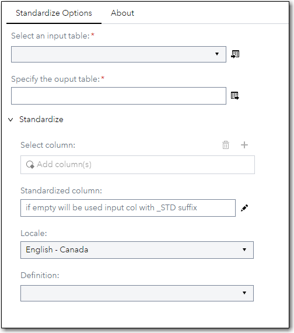
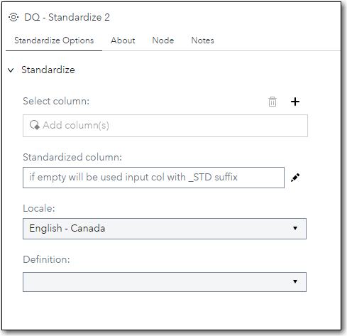
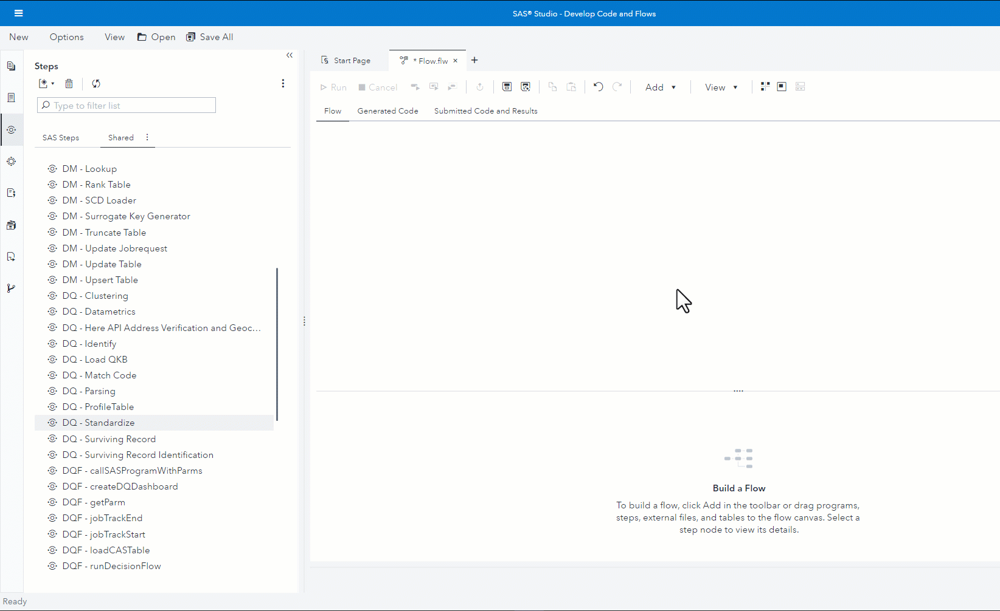

# DQ - Standardize

## Description

The **DQ - Standardize** step allows you to create a column with standardized values based on a locale and standardization definition using the **dqStandardize** function.
 * Best practice is to write the output to a new column, but you can overwrite an existing column as well.
 * If both the input table and the output table are in CAS then the step will run in CAS, otherwise it will run in the SAS Compute Server.
 * This version supports seven Locales (ENCAN, ENUSA, FRCAN, FRFRA, DEDEU, ITITA and ESESP) and allows you to standardize up to five columns.
 * It's worthwhile to note that the DQ Standardize step also allows you to mask data when using the data masking standardization definitions that have become available since [SAS Quality Knowledge Base for Contact Information](https://support.sas.com/en/software/quality-knowledge-base-support.html#documentation)   

## User Interface  

* ### Standardize Options tab ###

   | Standalone mode | Flow mode |
   | --- | --- |                  
   |  |  |

1. **Select column** - Defines column to be standardized.  
2. **Standardized column** - Specify name of output column to contain standardized value.  If left empty, a new column will be created using name of input column suffixed with **_STD**.  
3. **Locale**          - Define Locale to be used to compute standardized column.  
4. **Definition**      - Define the Standardization Definition to be used to compute standardized column.  

## Requirements  

2021.1.1 or later  

* This custom step requires a SAS Quality Knowledge Base (QKB) to be installed and configured. More details can be found in the documentation that is available [here](https://support.sas.com/en/software/quality-knowledge-base-support.html)  

## Usage  

## Change Log  

Version 1.1 (05DEC2022)
 * adds support for Canadian locales.  (ENCAN, FRCAN)
 * avoids warning by skipping length declaration for the output field if over-writing the input field.
 * adds documentation in the About tab how to get the step to run in CAS
 * conforms casing of text in the controls to coding standards

Version 1.0 (14SEP2022)
 * Initial version 