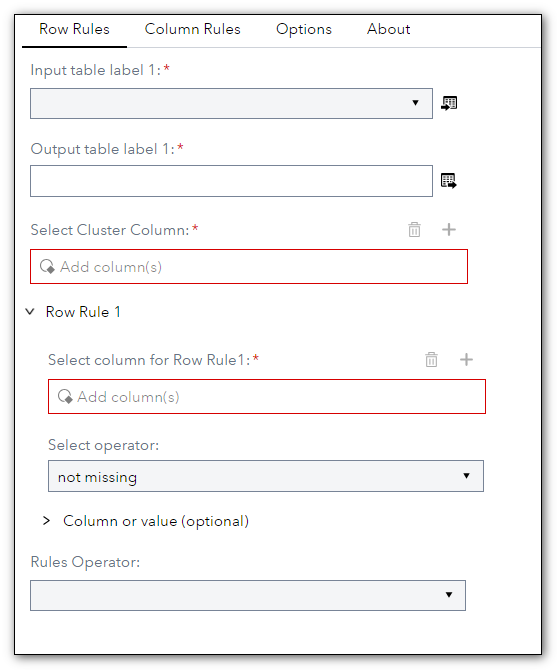

# DQ - Surviving Record
 
## Description

The **DQ - Surviving Record** step allows you to extract the best record (Golden Record) from the clustered data by selecting the rules of interest. You can use standard deduplication techniques or create a rule to choose which data should survive.  
This new version uses the SAS-supplied Autocall macro [%DQSURVR](https://go.documentation.sas.com/doc/en/dqcdc/default/dqclref/p1i32jjeybfcb7n19tzfasbzdcb9.htm) instead of the custom code.  
  
## User Interface  

* ### Surviving Record ###

   | Standalone mode | Flow mode |
   | --- | --- |                  
   |  |  |
  
* ### Row Rules tab ###  
Specifies the row-level rule that identifies which row in the cluster should be chosen as the surviving record.  

1. **Select Cluster Column** - Specifies the cluster identifier column.  
2. **Row Rule 1 - Select Column for row rule 1** - Specifies the input column to be used in the condition.
3. **Select Operator** - Specifies the operator type. Valid operators include: missing, not missing, highocc (high occurrence), lowocc (low occurrence), longest, shortest, max, min, equal to, greater than, less than, greater or equal to, less than or equal to
4. **Rule Operator** - Specifies the logical Boolean operator value to combine or exclude keywords in a search. Values can be AND or OR.
5. **Row Rule 2** - Specifies the row rule parameters as shown in Row Rule 1.  
  
* ### Column Rules tab ###  
1. **First Column rules 1** - Specifies which value from all of the cluster record values should be assigned to the column in the surviving record. See the parameters in Row Rule 1 for more information.  
2. **Column Operator** - Specifies the logical Boolean operator value to combine or exclude keywords in a search. The value can be AND or OR.     
3. **First Column:** - Specifies which of the cluster record values for one or more given fields should be assigned to the field in the surviving record.
4. **First Column rules 2** - Specifies which of the cluster record values should be assigned to the column in the surviving record. See the parameters in Row Rule 1 for more information.  
5. **Second column rules 1** - As for the first column
 
* ### Options Rules tab ###  
  
1. **Keep Duplicates** - Specifies whether to keep duplicate rows. When set to No, all non-surviving records are removed from the output. When set to Yes, all incoming records are included in the output.  
2. **Specifies the name ...** - Specifies the name of a new output field that contains information that is used to identify the surviving record in a cluster.  
3. **Promote to Cas** - Specifies whether to promote the CAS output table to global. This option is valid only for the CAS output table. When set to Yes, the CAS output table is promoted to global scope.  
4. **Generate Distinct Survivor** - Specifies whether to keep the original record and generate a distinct record. When set to Yes, it creates a new record that is a copy of the original surviving record and applies edits from field rules.  
5. **Use Primary Key column** - Specifies whether to use the primary key value from the surviving record as the surviving record ID field of all records in the cluster. When set to Yes, the primary key column must be specified. When set to Yes, places the value of the primary key field from the surviving record into the surviving record ID field of all records in the cluster.  
6. **Primary Key Column** - Specifies the input field that contains the primary key values for the incoming data.  
  

## Requirements

2023.06 or later

* The Surviving Record must be used on tables that contain a numeric column representing the cluster made previously. Typically after a [match code](<https://github.com/sassoftware/sas-studio-custom-steps/blob/main/DQ%20-%20Match%20Code/README.md>) and [cluster analysis](<https://github.com/sassoftware/sas-studio-custom-steps/blob/main/DQ%20-%20Clustering/README.md>).  

## Usage

  

## Change Log

* Version 2.0 (24JUL2023)
    * Using the SAS-supplied Autocall macro %DQSURVR    
  	
* Version 1.0 (19MAY2022)
    * Initial version  
	