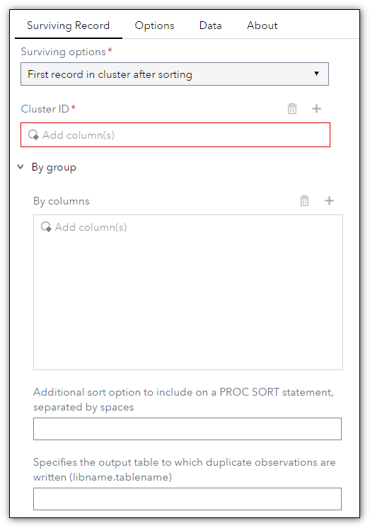
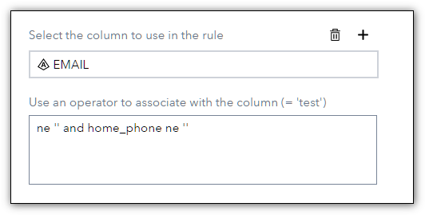
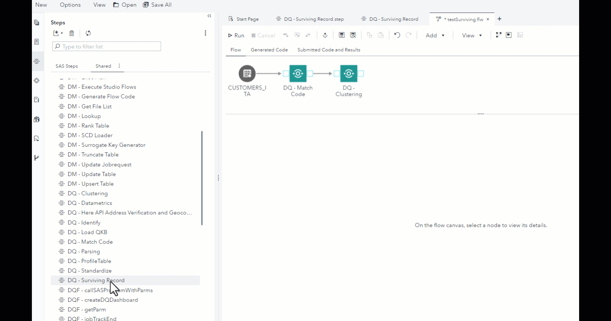

# DQ - Surviving Record
 
## Description

The **DQ - Surviving Record** step allows you to extract the best record (Golden Record) from the clustered data by selecting the rules of interest. You can use standard deduplication techniques or create a rule to choose which data should survive.

## User Interface  

* ### Surviving Options tab ###

   | Standalone mode | Flow mode |
   | --- | --- |                  
   |  |  |

* Surviving Options
1. **Sort No Dup**     - Performs a noduplicated sort on the entire row, it is mandatory to specify the Cluster_ID column and the by variables.  
2. **Sort No Dup key** - Performs a noduplicated sort on the by variables, it is mandatory to specify the Cluster_ID column and the by variables.  
3. **First record in cluster after sorting**   - Performs a sort on the Cluster_Id variable and select the first row of the cluster it is mandatory to specify the Cluster_ID.  
4. **Last record in cluster after sorting**    - Performs a sort on the Cluster_Id variable and select the last row of the cluster it is mandatory to specify the Cluster_ID.  
5. **Merge cluster using field rules** Allows you to define up to 5 rules on columns to select the best data within the cluster. Each rule is associated with a column, but it is also possible to specify more data as follows:  

6. **Merge cluster using record rules** - Allows you to define up to 5 rules on columns to select the best data within the cluster. Each rule is associated with a column and will be applied to the entire record with the concept of record weight: the record with the greatest weight, that is, the one that has more data that satisfies the rule, will be kept.  
  
* **Cluster ID** Defines the column that contains the cluster id required for all functions.  
* **By columns** Defines the columns to sort the table used in the Sort Nodup and First and Last Cluster options.  
* **Rule group** Section of the dialog contains rules that are used to determine which record in the cluster should be choosen as the surviving record. The section includes a pair of information (maximum 5), column and rule, to define the survival rule.  

* ### Options tab ###  

     

## Requirements

2021.1.5 or later

* The Surviving Record must be used on tables that contain a numeric column representing the cluster made previously. Typically after a [match code]((https://github.com/sassoftware/sas-studio-custom-steps/blob/main/DQ - Match Code/README.md)) and [cluster analysis](https://github.com/sassoftware/sas-studio-custom-steps/blob/main/DQClustering/README.md).  

## Usage

  

## Change Log

* Version 1.0 (19MAY2022)
    * Initial version  
	