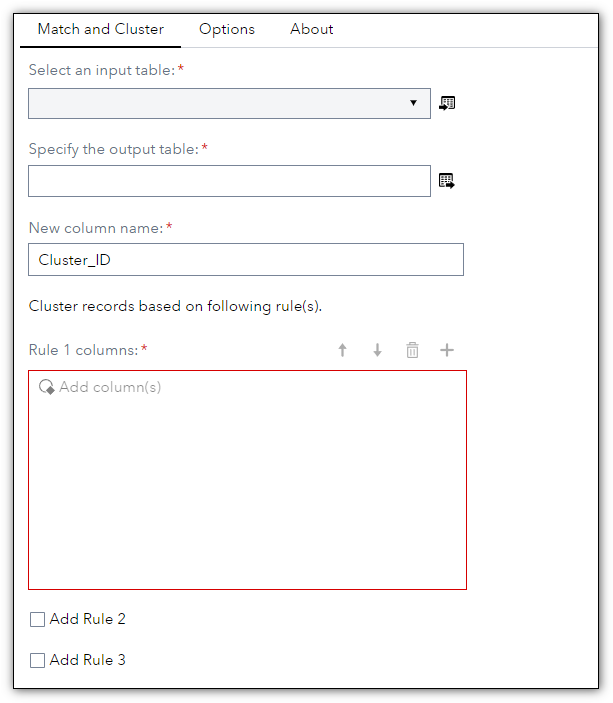
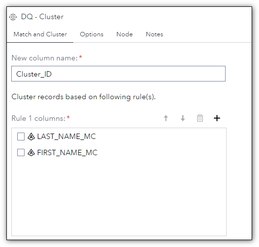
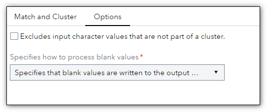
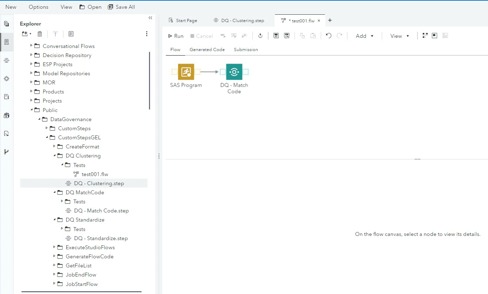

# DQ - Clustering  

## Description  

The **DQ - Clustering** step allows you to create a cluster match code based on defined rules; each rule can contain one or more columns. This version supports up to three rules.  

## User Interface

* ### Match and Cluster tab ###

   | Standalone mode | Flow mode |
   | --- | --- |                  
   |  |  |

1. **Cluster records based on following rule(s).** - Defines up to three rules for creating the cluster, several columns can be inserted in each rule.  

* ### Options tab ###

   

## Requirements

2021.1.1 or later  

## Usage

   

## Change Log

* Version 1.0 (14SEP2022)
    * Initial version