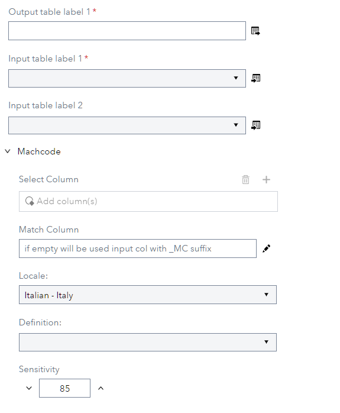
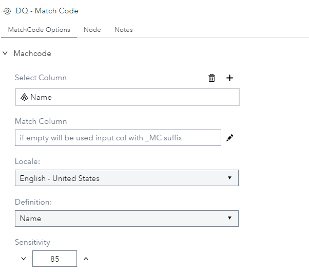
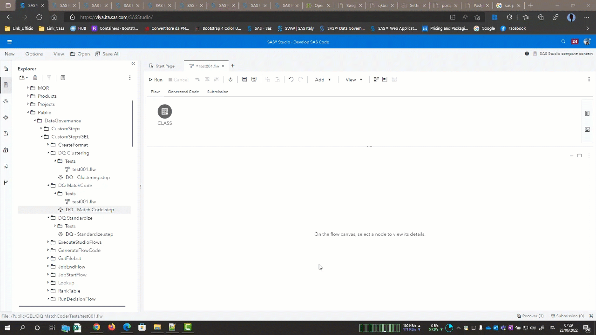

# DQ - Match Code

## Description

The **DQ - Match Code** allows you to create a column match code base on locale and rule definition using a **dqMatch** function in the SPRE compute server. This version can manage 5 Locale (ITITA, ENUSA, FRFRA, DEDEU and ESESP) and 5 columns.  

## User Interface  

* ### MatchCode Options tab ###

   | Standalone mode | Flow mode |
   | --- | --- |                  
   |  |  |

1. **Select Column**   - Defines the column to be used to compute match code.  
2. **Match Column**    - Define the output column that contain the match code, if empty will be used input column with _MC suffix.    
3. **Locale**          - Define Locale to be used to compute match code.  
4. **Definition**      - Define the rule to be used to compute match code.  
5. **Sensitivity**     - Define the Sensitivity used to compute match code.  

## Requirements

2021.1.1 or later  

## Usage

  

## Change Log

* Version 1 (14SEP2022)
    * Initial version  
	