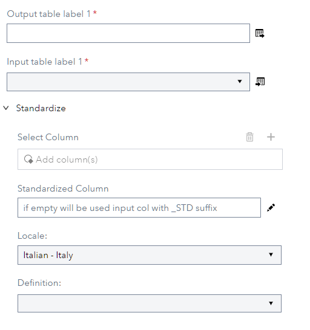
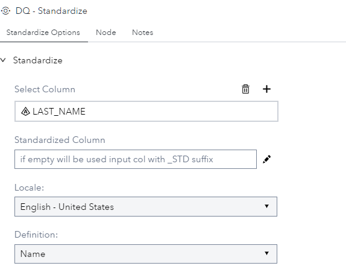
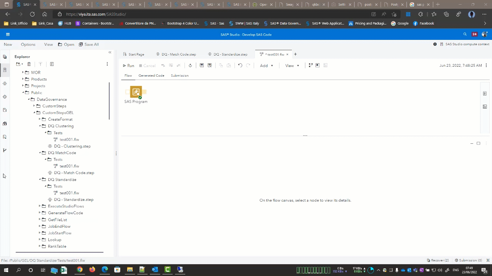

# DQ - Standardize

## Description

The **DQ - Standardize** create a standardized column base on locale and rule definition. This version can manage 5 Locale (ITITA, ENUSA, FRFRA, DEDEU and ESESP) and 5 columns.  

## User Interface  

* ### Standardize Options tab ###

   | Standalone mode | Flow mode |
   | --- | --- |                  
   |  |  |

1. **Select Column** - Defines column to be standardized.  
2. **Standardized column** - Define standardized column. If empty will be used input column with _STD suffix.  
3. **Locale**          - Define Locale to be used to compute standardized column.  
4. **Definition**      - Define the rule to be used to compute standardized column.  

## Requirements  

2021.1.1 or later

## Usage  

## Change Log  

* Version 1 (14SEP2022)
    * Initial version 