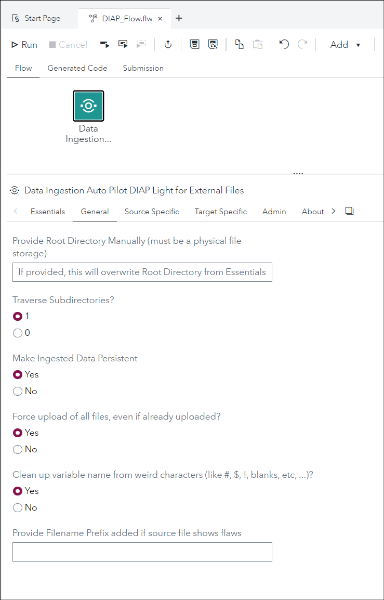
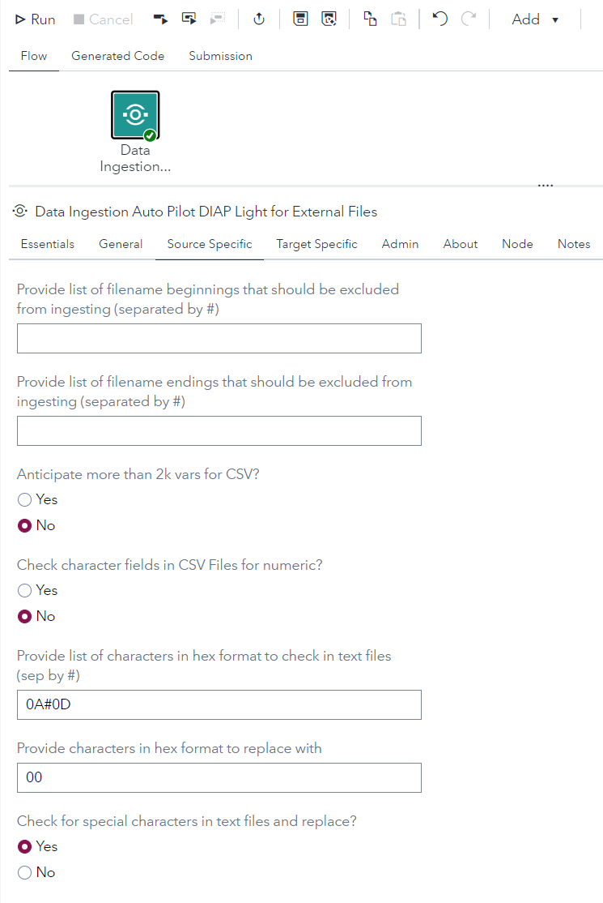
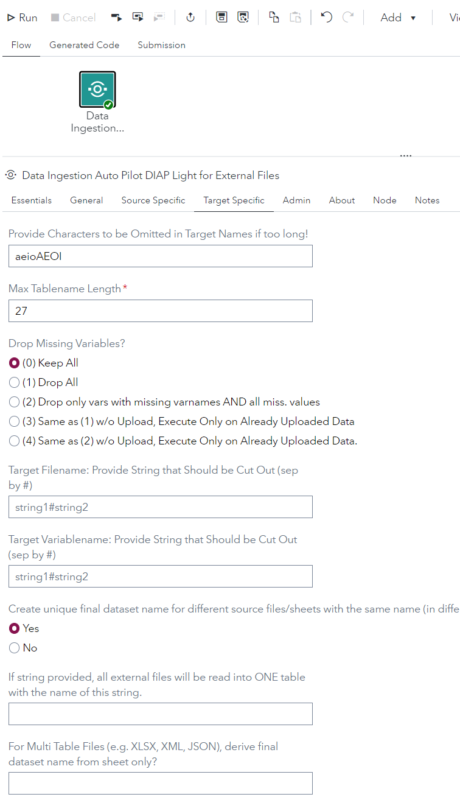
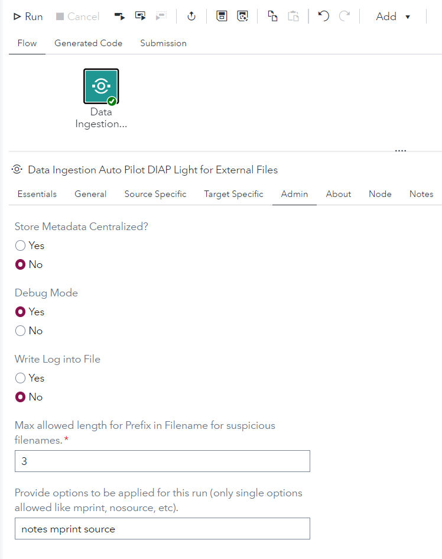
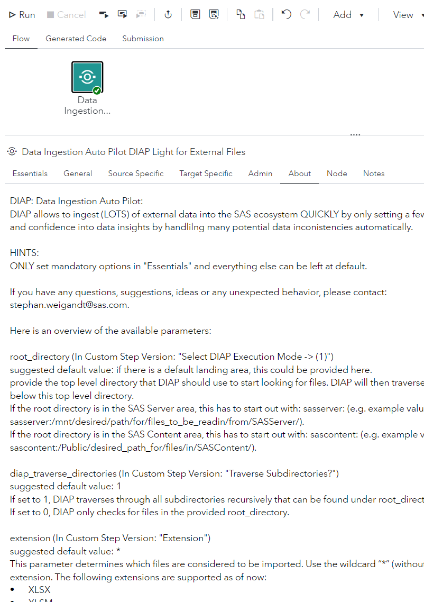

# Data Ingestion Auto Pilot DIAP Light for External Files

* [Description](#description)
* [SAS Viya Version Support](#sas-viya-version-support)
* [User Interface](#user-interface)
* [Requirements](#requirements)
* [Usage](#usage)
* [Download Step File](#download-step-file)
* [Prompt UI](#prompt-ui)
* [Program](#program)

## Description

The "**Data Ingestion Auto Pilot DIAP Light for External Files**" Custom Step enables SAS Studio Flow users to easily ingest external file(s) by the push of a button and only providing the root directory where the external files are located.
DIAP will automatically handle the following automatically:
- identifying all external files in that directory, and it will also traverse in all subdirectories. It will then attempt to read all of them in.
- determining text file separators.
- create suitable target table name that adheres to SAS naming conventions.
- create suitable variable names taking care of "weird" characters (like: $@&%., and other), if desired.
- dealing with missing variable names and/or missing values for an entire column.
- dealing very wide files (10,000s of variables).
- dealing with unwanted characters in text files that can cause error prone import (e.g. carriage return in a comment field).

DIAP also offers a "guided automation" mode. Here the user uploads a specific CSV file which contains a list of all files that need to be uploaded which instructions on where to find it and also how to ingest it where further instructions are provided. Please follow the instructions below on how to structure the CSV file. 

And: DIAP can also deal with fixed width files.

DIAP also creates reference tables to:
- show which source files were loaded into which SAS tables at what date,
- keep track of required variable name changes and to make sure that newly created variable names stay unique. 

For detailed description of the parameters, please [see here:](../README.md#user-guide-for-diap)
https://gitlab.sas.com/stweig/diap/-/blob/master/README.md#01_default_setting_wrapper_import_files_into_viyasas

Also check out this blog entry for a general description:
http://sww.sas.com/blogs/wp/technical-insights/4436/ingesting-external-files-a-nightmare-an-intro-into-diap/stweig/2021/12/31

## SAS Viya Version Support
2020.1.5 or later

## User Interface

### Essential Tab


If you are happy with all the default settings, only adjust the parameters in the "Essentials" tab, e.g. select the fully automated mode (1) and provide the top level directory either from within SAS Server or now also from SAS Content (here only CSV or TXT files are processed in the fully automated mode) and click "Run" to start the journey.

### General Tab




### Source Specific Tab



### Target Specific Tab



### Admin Tab



### About Tab




## Requirements

* A CAS session established (in an autoexec or something else)
* The provided "Target Libname" under the "Essential" tab must exist.
* One or more CAS engine libraries (SAS libraries pointing to CASLIBs) to allow the definition of the target table

Example:

```sas

```

## Usage

### How to Run DIAP with Default Settings


### Taking a Look at the Reference Tables - Flag for Suspivious Source Files


### How to Ingest Fixed Width Files - the "_DIAP_Special_File_Definition.csv" Control File


### How to Ingest Files Using a Guided Automation Control File (CSV)

This mode has many advantages. 
It has the following advantages over the fully automated mode:
- Reading in from SASServer and SASContent in one go.
- Reading in text files with "unknown" extension.
- Reading in xls files as well (Automated version can only handle XLSX).
- Reading in selected sheets from an Excel file with many, many sheets.
- Assigning explicitly delimiter for selected text files.
- Assigning explicitly target table name instead of relying on automated table name creation. 


## Change Log

Version 4.0.2
- simplify UI in custom node for target tab, change last option from text file to radio button

Version 4.0.1

- Files can now be also read in automatically from SASContent area (CSV and TXT only)
- Introducing a new mode: "Guided Automated Execution" via explicit file list.
	- This mode allows to read in older Excel files (XLS) and also text files with unknown extensions.
	- Delimiter and target table names can be explicitly provided. 
- making DIAP more stable.

Version 3.1.0

* resolved issue when files w/o extension were skipped in fixed width file mode 

Version 3.0.2 (15APR2022):

* DIAP Version 3.0.2 made available for the first time as a custom step


## Download Step File

[Data Ingestion Auto Pilot DIAP Light for External Files](./Data%20Ingestion%20Auto%20Pilot%20DIAP%20Light%20for%20External%20Files.step)

## Prompt UI

```json
{
	"showPageContentOnly": true,
	"pages": [
		{
			"id": "Essentials",
			"type": "page",
			"label": "Essentials",
			"children": [
				{
					"id": "diap_guided_auto_fl_loc_ui",
					"type": "path",
					"label": "Provide CSV File that contains detailed DIAP execution instructions (create a template by choosing \"3 - Create Guided Automation Control File Template\")",
					"pathtype": "file",
					"placeholder": "Select CSV file that describes execution (create a template by choosing \"3 - Create Guided Automation Control File Template\")",
					"required": true,
					"visible": [
						"$DIAP_mode_selection_ui",
						"=",
						"2"
					]
				},
				{
					"id": "root_directory_ui",
					"type": "path",
					"label": "Provide Root Directory (can be from within SAS Server or SAS Content)",
					"pathtype": "folder",
					"placeholder": "Select Root Directory",
					"required": true,
					"visible": [
						"$DIAP_mode_selection_ui",
						"=",
						"1"
					]
				},
				{
					"id": "controlfile_target_location_ui",
					"type": "path",
					"label": "Target Path for Template Creation (Option 3 or 4)",
					"pathtype": "folder",
					"placeholder": "",
					"required": true,
					"visible": [
						[
							"$DIAP_mode_selection_ui",
							"=",
							"4"
						],
						"|",
						[
							"$DIAP_mode_selection_ui",
							"=",
							"3"
						]
					]
				},
				{
					"id": "DIAP_mode_selection_ui",
					"type": "radiogroup",
					"label": "Select DIAP Execution Mode",
					"items": [
						{
							"value": "1",
							"label": "1 - Fully Automated"
						},
						{
							"value": "2",
							"label": "2 - Guided Automated Execution via Explicit File List"
						},
						{
							"value": "3",
							"label": "3 - Create Guided Automation Control File Template"
						},
						{
							"value": "4",
							"label": "4 - Create Fixed Width Control File Template"
						}
					],
					"visible": ""
				},
				{
					"id": "Extension_ui",
					"type": "dropdown",
					"label": "Extension",
					"items": [
						{
							"value": "*"
						},
						{
							"value": "XLSX"
						},
						{
							"value": "XLSM"
						},
						{
							"value": "JMP"
						},
						{
							"value": "CSV"
						},
						{
							"value": "TXT"
						},
						{
							"value": "JSON"
						},
						{
							"value": "SHP"
						},
						{
							"value": "NEF"
						},
						{
							"value": "CUSTOM"
						}
					],
					"required": true,
					"placeholder": "",
					"visible": ""
				},
				{
					"id": "target_libname_ui",
					"type": "textfield",
					"label": "Target Libname (CAS or 94, needs to exist)",
					"placeholder": "",
					"required": true,
					"visible": ""
				}
			]
		},
		{
			"id": "General",
			"type": "page",
			"label": "General",
			"children": [
				{
					"id": "root_directory_overwrite_ui",
					"type": "textfield",
					"label": "Provide Root Directory Manually (must be a physical file storage)",
					"placeholder": "If provided, this will overwrite Root Directory from Essentials",
					"required": false,
					"visible": ""
				},
				{
					"id": "diap_traverse_directories_ui",
					"type": "radiogroup",
					"label": "Traverse Subdirectories?",
					"items": [
						{
							"value": "1"
						},
						{
							"value": "0"
						}
					],
					"visible": ""
				},
				{
					"id": "make_imported_data_persistent_ui",
					"type": "radiogroup",
					"label": "Make Ingested Data Persistent",
					"items": [
						{
							"value": "1",
							"label": "Yes"
						},
						{
							"value": "0",
							"label": "No"
						}
					],
					"visible": ""
				},
				{
					"id": "force_upload_of_all_files_ui",
					"type": "radiogroup",
					"label": "Force upload of all files, even if already uploaded?",
					"items": [
						{
							"value": "1",
							"label": "Yes"
						},
						{
							"value": "0",
							"label": "No"
						}
					],
					"visible": ""
				},
				{
					"id": "chck_4_spcl_char_in_vars_ui",
					"type": "radiogroup",
					"label": "Clean up variable name from weird characters (like #, $, !, blanks, etc, ...)?",
					"items": [
						{
							"value": "1",
							"label": "Yes"
						},
						{
							"value": "0",
							"label": "No"
						}
					],
					"visible": ""
				},
				{
					"id": "prefix_4_suspicious_src_fl_ui",
					"type": "textfield",
					"label": "Provide Filename Prefix added if source file shows flaws",
					"placeholder": "",
					"required": false,
					"visible": ""
				}
			]
		},
		{
			"id": "Source_specific",
			"type": "page",
			"label": "Source Specific",
			"children": [
				{
					"id": "skip_files_starting_with_seq_ui",
					"type": "textfield",
					"label": "Provide list of filename beginnings that should be excluded from ingesting (separated by #)",
					"placeholder": "",
					"required": false,
					"visible": ""
				},
				{
					"id": "skip_files_ending_with_seq_ui",
					"type": "textfield",
					"label": "Provide list of filename endings that should be excluded from ingesting (separated by #)",
					"placeholder": "",
					"required": false,
					"visible": ""
				},
				{
					"id": "csv_big_data_mode_ui",
					"type": "radiogroup",
					"label": "Anticipate more than 2k vars for CSV?",
					"items": [
						{
							"value": "1",
							"label": "Yes"
						},
						{
							"value": "0",
							"label": "No"
						}
					],
					"visible": ""
				},
				{
					"id": "check_csv_4_num_ui",
					"type": "radiogroup",
					"label": "Check character fields in CSV Files for numeric?",
					"items": [
						{
							"value": "1",
							"label": "Yes"
						},
						{
							"value": "0",
							"label": "No"
						}
					],
					"visible": ""
				},
				{
					"id": "special_chrctr_seq_2_chck_inhex2",
					"type": "textfield",
					"label": "Provide list of characters in hex format to check in text files (sep by #)",
					"placeholder": "",
					"required": false,
					"visible": [
						"$check_txt_file_4_special_chrctui",
						"=",
						"1"
					]
				},
				{
					"id": "spcl_chrctr_check_rplcmnt_inhex2",
					"type": "textfield",
					"label": "Provide characters in hex format to replace with",
					"placeholder": "",
					"required": false,
					"visible": [
						"$check_txt_file_4_special_chrctui",
						"=",
						"1"
					]
				},
				{
					"id": "check_txt_file_4_special_chrctui",
					"type": "radiogroup",
					"label": "Check for special characters in text files and replace?",
					"items": [
						{
							"value": "1",
							"label": "Yes"
						},
						{
							"value": "0",
							"label": "No"
						}
					],
					"visible": ""
				}
			]
		},
		{
			"id": "Target_Specific",
			"type": "page",
			"label": "Target Specific",
			"children": [
				{
					"id": "substitute_string_seq_ui",
					"type": "textfield",
					"label": "Provide Characters to be Omitted in Target Names if too long!",
					"placeholder": "",
					"required": false,
					"visible": ""
				},
				{
					"id": "max_table_length_ui",
					"type": "numberfield",
					"label": "Max Tablename Length",
					"placeholder": "",
					"required": true,
					"max": 32,
					"min": 15,
					"excludemin": false,
					"excludemax": false,
					"visible": ""
				},
				{
					"id": "drop_missing_vars_ui",
					"type": "radiogroup",
					"label": "Drop Missing Variables?",
					"items": [
						{
							"value": "0",
							"label": "(0) Keep All"
						},
						{
							"value": "1",
							"label": "(1) Drop All"
						},
						{
							"value": "2",
							"label": "(2) Drop only vars with missing varnames AND all miss. values"
						},
						{
							"value": "3",
							"label": "(3) Same as (1) w/o Upload, Execute Only on Already Uploaded Data"
						},
						{
							"value": "4",
							"label": "(4) Same as (2) w/o Upload, Execute Only on Already Uploaded Data."
						}
					],
					"visible": ""
				},
				{
					"id": "stringseq_2_cutout_from_fn_ui",
					"type": "textfield",
					"label": "Target Filename: Provide String that Should be Cut Out (sep by #)",
					"placeholder": "string1#string2",
					"required": false,
					"visible": ""
				},
				{
					"id": "stringseq_2_cutout_from_vn_ui",
					"type": "textfield",
					"label": "Target Variablename: Provide String that Should be Cut Out (sep by #)",
					"placeholder": "string1#string2",
					"required": false,
					"visible": ""
				},
				{
					"id": "diap_create_unique_target_tblnm2",
					"type": "radiogroup",
					"label": "Create unique final dataset name for different source files/sheets with the same name (in different locations)?",
					"items": [
						{
							"value": "1",
							"label": "Yes"
						},
						{
							"value": "0",
							"label": "No"
						}
					],
					"visible": ""
				},
				{
					"id": "fnl_ds_name_4_all_extfiles_ui",
					"type": "textfield",
					"label": "If string provided, all external files will be read into ONE table with the name of this string.",
					"placeholder": "",
					"required": false,
					"visible": ""
				},
				{
					"id": "diap_fnl_tblname_from_sheetonly2",
					"type": "textfield",
					"label": "For Multi Table Files (e.g. XLSX, XML, JSON), derive final dataset name from sheet only?",
					"placeholder": "",
					"required": false,
					"visible": ""
				}
			]
		},
		{
			"id": "Admin",
			"type": "page",
			"label": "Admin",
			"children": [
				{
					"id": "meta_centralized_ui",
					"type": "radiogroup",
					"label": "Store Metadata Centralized?",
					"items": [
						{
							"value": "1",
							"label": "Yes"
						},
						{
							"value": "0",
							"label": "No"
						}
					],
					"visible": ""
				},
				{
					"id": "libname_meta_centralized_ui",
					"type": "textfield",
					"label": "Libname for Centralized DIAP Metadata",
					"placeholder": "",
					"required": true,
					"visible": [
						"$meta_centralized_ui",
						"=",
						"1"
					]
				},
				{
					"id": "debug_mode_ui",
					"type": "radiogroup",
					"label": "Debug Mode",
					"items": [
						{
							"value": "1",
							"label": "Yes"
						},
						{
							"value": "0",
							"label": "No"
						}
					],
					"visible": ""
				},
				{
					"id": "log_file_path_ui",
					"type": "path",
					"label": "Path for logfile creation",
					"pathtype": "folder",
					"placeholder": "If kept blank, log file still goes to standard output.",
					"required": true,
					"visible": [
						"$write_log_into_file_ui",
						"=",
						"1"
					]
				},
				{
					"id": "write_log_into_file_ui",
					"type": "radiogroup",
					"label": "Write Log into File",
					"items": [
						{
							"value": "1",
							"label": "Yes"
						},
						{
							"value": "0",
							"label": "No"
						}
					],
					"visible": ""
				},
				{
					"id": "max_lgth_of_suspicious_str_ui",
					"type": "numberfield",
					"label": "Max allowed length for Prefix in Filename for suspicious filenames.",
					"placeholder": "",
					"required": true,
					"max": 8,
					"min": 2,
					"excludemin": false,
					"excludemax": false,
					"visible": ""
				},
				{
					"id": "options_seq_ui",
					"type": "textfield",
					"label": "Provide options to be applied for this run (only single options allowed like mprint, nosource, etc).",
					"placeholder": "",
					"required": false,
					"visible": ""
				}
			]
		},
		{
			"id": "About",
			"type": "page",
			"label": "About",
			"children": [
				{
					"id": "text1",
					"type": "text",
					"text": "DIAP: Data Ingestion Auto Pilot:\nDIAP allows to ingest (LOTS) of external data into the SAS ecosystem QUICKLY by only setting a few parameters and pushing a button while increasing the quality and confidence into data insights by handlilng many potential data inconistencies automatically. \n\nHINTS:\nONLY set mandatory options in \"Essentials\" and everything else can be left at default.\n\nIf you have any questions, suggestions, ideas or any unexpected behavior, please contact:\nstephan.weigandt@sas.com.\n\nHere is an overview of the available parameters:\n\nroot_directory (In Custom Step Version: \"Select DIAP Execution Mode -> (1)\")\nsuggested default value: if there is a default landing area, this could be provided here.\nprovide the top level directory that DIAP should use to start looking for files. DIAP will then traverse through the whole directory structure and find all the files below this top level directory.\nIf the root directory is in the SAS Server area, this has to start out with: sasserver: (e.g. example value for root_directory: sasserver:/mnt/desired/path/for/files_to_be_readin/from/SASServer/).\nIf the root directory is in the SAS Content area, this has to start out with: sascontent: (e.g. example value for root_directory: sascontent:/Public/desired_path_for/files/in/SASContent/).\n\ndiap_traverse_directories (In Custom Step Version: \"Traverse Subdirectories?\")\nsuggested default value: 1\nIf set to 1, DIAP traverses through all subdirectories recursively that can be found under root_directory.\nIf set to 0, DIAP only checks for files in the provided root_directory.\n\nextension (In Custom Step Version: \"Extension\")\nsuggested default value: *\nThis parameter determines which files are considered to be imported. Use the wildcard “*” (without quotes) for any files that can be ingested by DIAP, or any extension. The following extensions are supported as of now:\n•\tXLSX\n•\tXLSM\n•\tCSV\n•\tJMP\n•\tSHP\n•\tTXT\n•\tNEF\n•\tJSON\n•\tCustom (Fixed Width/XML)\n\nTarget_libname (In Custom Step Version: \"Target Libname\")\nsuggested default value: any libname, that is used for testing, e.g. WORK.\nProvide the SAS or CAS libname, where the imported files are stored at. It needs to be preassigned or assigned within the session.\n\nprovide_default_log_path (In Custom Step Version: \"Path for logfile creation\")\nsuggested default value: empty/missing.\nThis parameter is only relevant when the parameter “write_log_into_file” is set to 1.\nProvide a default path for all runs: as soon as a path is provided, this path is being used for ALL runs.\nIf the log directory is in the SAS Server area, this has to start out with: sasserver: (e.g. example value for provide_default_log_path: sasserver:/mnt/desired/path/for/log_files_to_be_saved/on/SASServer/).\nIf the log directory is in the SAS Content area, this has to start out with: sascontent: (e.g. example value for provide_default_log_path: sascontent:/Public/desired_path_for/logfiles/in/SASContent/).\n\nwrite_log_into_file (In Custom Step Version: \"Write Log into File\")\nsuggested default value: 1\nIf set to 0, log is written into default SAS log location.\nIf set to 1, log is written to location as provided under the parameter “provide_default_log_path”.\n\nprofiling_execution_option (NOT AVAILABLE FOR THE CUSTOM STEP VERSION OF DIAP)\nSuggested default value: No\nSelect between the following 3 options:\n\n\nNO: this is the default, in case the AUTOPROFILING component is not installed, or it is not desired to execute anything into the AUTOPROFILING section.\n\n\nDICT_ONLY: in this mode, all the uploaded table are only loaded into the profiling dictionary, ready to be profiled, but no profiling is executed.\n\n\nPROFILE: this option creates some default dictionary entries and creates the corresponding profiles.\n\n\n\nprfl_cd_lctn_in_content_area (NOT NEEDED FOR THE CUSTOM STEP VERSION OF DIAP)\nSuggested default value: leave empty.\nThis provides the location of the AUTOPROFILING component for the program files (e.g. “/Public/DM_Assets/SAS_DQ_AUTOPROFILE/Programs” (without the quotes))\n\nprfl_dict_lctn_in_content_area (NOT NEEDED FOR THE CUSTOM STEP VERSION OF DIAP)\nSuggested default value: leave empty.\nIMPORTANT: if “Data Quality Monitoring (CDQM)” is not installed, leave empty. When empty, DIAP will ignore the “profiling_execution_option”.\nThis provides the location of the AUTOPROFILING CDQM (Data Quality Monitoring solution) component for the dictionary files (e.g. “/Public/DM_Assets/SAS_DQ_AUTOPROFILE/Imports” (without the quotes))\n\npath_2_python_shape_script (NOT NEEDED FOR THE CUSTOM STEP VERSION OF DIAP)\nsuggested default value: leave empty/missing.\nIf missing, the app uses the SAS way to read in SHAPE files, otherwise this is the full file path to the python script (which would also include setting up the python environment).\nExperience shows that certain shape file setups might cause an undesired output when using the SAS way. Using the python script allows to deal with a few more exceptions.\nFor this to work, Python has to be set up on the system. One example location could be as follows: “/mnt/viyashare/tools/run_shapeshift.sh” (without the quotes).\n\nmax_table_name_length (In Custom Step Version: \"Max Tablename Length\")\nsuggested default value: 27\nThis determines the maximum allowed table name length.  E.g. in the case of uploading XLSX files to SAS94, the final table name is built by concatenating Excel-filename and Sheetname.\nSo this can easily lead to a datasetname that is too long.\nAlso take into consideration that the concatenated name for multiple tables could potentially the same in the abbreviated form.\nThe system checks for that and adds a counter to the table name.\nSo, leave at least 2 characters for a counter.\n\ncheck_txt_file_4_special_chrct (In Custom Step Version: \"Check for special characters in text files and replace?\")\nsuggested default value: 0\nIf set to 0, the text file is read in as-is.\nIf set to 1, then text files is examined before reading for the characthers as outlined in parameter \"special_chrctr_seq_2_chck_in_hex\", and replaced with the character as outlined in parameter \"spcl_chrctr_check_rplcmnt_in_hex\".\nThis might need to be required, especially if files have NOTES or DESCRIPTION columns, that could contain carriage returns. Those carriage returns would then cause the file to be read in with a few errors, wherever those carriage returns occur.\n\nspecial_chrctr_seq_2_chck_in_hex (In Custom Step Version: \"Provide list of characters in hex format to check in text files (sep by #)\")\nsuggested default value: 0A#0D\nThis parameter has to be set to one or a sequence of # separated hex formats of a character.\n0A#0D: checks for new line feed (0A) and carriage return (0D)\nsee asciitable.com for an overview of all characters in hex format.\n\nspcl_chrctr_check_rplcmnt_in_hex (In Custom Step Version: \"Provide characters in hex format to replace with\")\nsuggested default value: 00\nPlease provide the characters that should be used to replace the special characters as defined in special_chrctr_seq_2_chck_in_hex\nThe characters value is provided in hex format.\nsee asciitable.com for an overview of all characters in hex format.\n\nsubstitute_string_seq (In Custom Step Version: \"Provide Characters to be Omitted in Target Names if too long!\")\nsuggested default value: aeiouAEIOU\nIf the target table name is too long, this string determines which characters are taken out from the target name to shorten the name further, before the truncation process kicks in.\nE.g. when substitute_string_seq = aeAEoO, then a table name of \"ThisIsAVeryLongTableNameThatIsTooLong\" and a max_table_name_length = 29\nwould be first changed to the following: \"ThisIsVryLngTblNmThtIsTLng\" which would be short enough without any further action needed by DIAP.\n\nskip_files_starting_with_seq (In Custom Step Version: \"Provide list of filename beginnings that should be excluded from ingesting (separated by #)\")\ndefault value: _DIAP_Special_File_Definition.csv\nIf not missing, DIAP will skip all the files that start out with the sequence of string snippets separated by #.\nE.g. if set to:\n_DIAP_Special_File_Definition.csv#filebe ginning1#filebeginning2\nAll files that start out with either _DIAP_Special_File_Definition.csv filebeginning1 or filebeginning2 will NOT be ingested.\n_DIAP_Special_File_Definition.csv is the default value used by DIAP to describe fixed width or XML definitions and wouldn't be needed to be read into the target libname.\n\nskip_files_ending_with_seq (In Custom Step Version: \"Provide list of filename endings that should be excluded from ingesting (separated by #)\")\ndefault value: empty/missing\nIf not missing, DIAP will skip all the files that end with the sequence of string snippets separated by #.\nE.g. if set to:\nfile_ending1#file_ending2#csv\nAll files that end with either file_ending1 or file_ending2 or csv will NOT be ingested.\nE.g. in this example all csv files would be skipped.\n\nmeta_centralized (In Custom Step Version: \"Store Metadata Centralized?\")\nsuggested default value: 1\nThis value goes closely with the next parameter “libname_meta_centralized”.\nIf set to 1, all meta information generated by DIAP (e.g. data around upload activity, variable name, table names, etc) will be stored in predetermined tables (_UPLOAD_LOG, _VARIABLE_DICTIONARY) under the libname that is provided under “libname_meta_centralized”.\nIf set to 0, all meta information generated by DIAP (e.g. data around upload activity, variable name, table names, etc) will be stored in predetermined tables (_UPLOAD_LOG, _VARIABLE_DICTIONARY) under the libname that is provided under “target_libname”.\n\nlibname_meta_centralized (In Custom Step Version: \"Libname for Centralized DIAP Metadata\")\nPlease provide a libname (SAS or CAS), that can be used as a central storage for the metainformation that is generated for all DIAP activities, when the “meta_centralized” parameter is set to 1.\nIMPORTANT:\nIf the Data Quality Monitoring Solution is installed as well and being used with DIAP, then please here the same libname as being used there for the dictionary location.\n\ndebug_mode (In Custom Step Version: \"Debug Mode\")\nSuggested default value: 1\nIf set to 1, DIAP writes out more information out to the log, that might be helpful for further investigations.\nIf set to 0, DIAP just writes out the default SAS log output, depending on the settings of the options mprint, source and notes.\n\nshp_enrich_with_zip (NOT AVAILABLE FOR THE CUSTOM STEP VERSION OF DIAP)\nsuggested default value: 0\nIf set to 0, shp files are read in as-is.\nIf set to 1, DIAP will attempt to merge in zip-code information to the location information of the shp files.\nFor this to work, this would require further installation steps, e.g. providing the zip-code lookup table. If desired, please contact Stephan Weigandt directly for inquiry about further steps to take.\n\nCASHOST (NOT NEEDED FOR THE CUSTOM STEP VERSION OF DIAP)\nThis parameter is set during the installation steps. Please don’t change it afterwards. Provide the hostname that is used for this Viya installation.\n\nCASPORT (NOT NEEDED FOR THE CUSTOM STEP VERSION OF DIAP)\nThis parameter is set during the installation steps. Please don’t change it afterwards. Provide the port that is used for this Viya installation.\nDIAP_viyaversion\nThis parameter is set during the installation steps. Please don’t change it afterwards. At this point leave the parameter set to 35.\n\nDIAP_viyaversion (NOT NEEDED FOR THE CUSTOM STEP VERSION OF DIAP)\nsuggested default value: 35\nThis parameter might be dropped at some point.\nAt this point the default value is the only valid value and should not be changed.\n\ncsv_big_data_mode (In Custom Step Version: \"Anticipate more than 2k vars for CSV?\")\nsuggested default value: 0.\nIf set to 0, csv files are read in with default mode (e.g. normal proc import stuff with guessing the format and such).\nIf set to 1, csv files are read in with the “big data mode”. It can happen that files are provided that contain more than 2000 variables. So when the anticipated number of variables is over 2000, then it is suggested to set this to 1. This will allow to read in the file completely, but the formats might not be in the desired state. DIAP will try to identify numeric columns and change the format for those from character to numeric.\n\ndrop_missing_vars (In Custom Step Version: \"Drop Missing Variables?\")\nsuggested default value: 0\nThe following values are possible:\nIf set to 0, missing variables are NOT dropped.\nIf set to 1, all variables that have ALL missing variables are dropped.\nIf set to 2, only variables with missing variables names AND all missing values will be dropped.\nIf set to 3, the same as setting to (1), but no data is being uploaded. So, when it is set to 3, the already uploaded files are treated accordingly.\nIf set to 4, the same as setting to (2), but no data is being uploaded. So, when it is set to 3, the already uploaded files are treated accordingly.\n\nstringseq_2_cutout_from_fn (In Custom Step Version: \"Target Filename: Provide String that Should be Cut Out (sep by #)\")\nsuggested default value: empty/missing.\nProvide a sequence of characters strings that should be omitted in the target filename.This prevents the target table name of getting too long.\nThe sequence is separated by #\n\nstringseq_2_cutout_from_vn (In Custom Step Version: \"Target Variablename: Provide String that Should be Cut Out (sep by #)\")\nsuggested default value: empty/missing.\nProvide a sequence of characters strings that should be omitted in the target variable name. This  prevents the variable table name of getting too long.\nThe sequence is separated by #\n\nprefix_4_suspicious_src_fl (In Custom Step Version: \"Provide Filename Prefix if source file is suspicious.\")\nsuggested default value: empty/missing.\nA string can be provided (max of length LEN as provided in parameter “wof2l_max_lgth_of_suspicious_str”), that will be added and replace the first LEN characters of the table name, if the content seems suspicious.\nThis would then suggest to check on the source file to understand what is going on.\nPossible causes for suspicion:\n\nMissing variable names\nDuplicate variable names\nIf variables are completely missing.\n\n\nmax_lgth_of_suspicious_str (In Custom Step Version: \"Max allowed length for Prefix in Filename for suspicious filenames.\")\nsuggested default value: 4\nThis parameter determines the maximum length of an allowed prefix for suspicious files.\n\ncheck_csv_4_num (In Custom Step Version: \"Check character fields in CSV Files for numeric?\")\nsuggested default value: 0\n0 (default): this means csv file is read in as-is\n1: in cases when it is a \"quoted\" csv files (e.g. happens when come of the content contains the separator), then when this is turned on, the process will perform an additional check on the data that was read in to check of some of the variables that were read in as character actually should be numeric.\n\nforce_upload_of_all_files (In Custom Step Version: \"Force upload of all files, even if already uploaded?\")\nsuggested default value: 0\n0 (default): Files are only uploaded if they were updated since last upload\n1: All files are uploaded no matter if they were uploaded before or not. No date check happening with this option.\n\ndiap_fnl_tblname_from_sheetonly (In Custom Step Version: \"For Multi Table Files (e.g. XLSX, XML, JSON), derive final dataset name from sheet only?\")\nsuggested default value: 0\n0 (default): The final dataset name is determined using the filename AND the sheetname (same principles are applied for XLSX, JSON and XML files).\n1: The final dataset name is determined using ONLY the sheetname (same principles are applied for XLSX, JSON and XML files), ignoring the filename.\n\ndiap_create_unique_target_tblnm (In Custom Step Version: \"Create unique final dataset name for different source files/sheets with the same name (in different locations)?\")\nsuggested default value: 1\n0 : when creating the final dataset name, and the final dataset name ends up being the same for 2 or more source files, then DIAP will try to append all those different source files into one target dataset.\n1 (default): when creating the final dataset name, and the final dataset name ends up being the same for 2 or more source files, then DIAP will add a unique counter to the final dataset name, so that the content of each source file is written in its own final dataset.\n\nchck_4_spcl_char_in_vars (In Custom Step Version: \"Clean up variable name from weird characters?\")\nsuggested default value: 1\n0 : variable names are only checked for minimal \"weird\" characters (like: &, ', \", %, #, ','). With this, option validvarname =any has to be set when wanting to work/see dataset from SAS Studio.\n1 (default): all weird characters are replace with underscore (_) to create a clean variable name.\n\nfnl_ds_name_4_all_extfiles (In Custom Step Version: \"If string provided, all external files will be read into ONE table with the name of this string.\")\nsuggested default value: blank(keep empty)\nif this field is non blank, then the string provided with this macrovariables is used as the target table name and DIAP will try to combine all external files that are read in, into this one table.\nThis table will be created (or if existent already, all the new data appended) in the provided target libname.\nMaximum characters allowed are 32.\nIf a string/tablename is set here, the setting of diap_create_unique_target_tblnm is ignored.\n\nONLY AVAILABLE IN CUSTOM STEP: \"Select DIAP Execution Mode\"\nThere are 4 execution modes available:\n\n(1) Fully Automated\n(2) Guided Automated Execution via Explicit File List (using specific structured CSV file)\n(3) Create Guided Automation Control File Template\n(4) Create Fixed Width Control File Template\n\nIf (3) is selected: The name of the file created in the selected directory is: \"_DIAP_guided_execution.csv\".\nIf (4) is selected: The name of the file created in the selected directory is: \"_DIAP_Special_File_Definition.csv\".\nWhen (3) or (4) is selected, as a next step please download the template csv files on your local machine for customized settings of the fields.\nThe provided content that is created in the template is merely an example and SHOULD be deleted and replaced with the settings needed to read in fixed with files or xml files (with defintion files).\nThen upload the customized CSV files to the server, so that DIAP can process them accordingly.\n\ndiap_guided_automation_fl_loc (In Custom Step Version: \"Select DIAP Execution Mode -> (2)\")\nsuggested default value: blank (keep empty)\nIf this parameter is NOT empty, DIAP will try to read instructions from this file and will ignore any settings in root_directory.\nThis path can point to a file under SAS Server or under SAS Content.\nDepending on where it is located, the provided path has to look like the following:\n\nif located under SAS SERVER: sasserver:/specific/path/to/file/under/sasserver/guided_execution_instructions.csv\nif located under SAS CONTENT: sascontent:/specific/path/to/file/under/sascontent/guided_execution_instructions.csv\n\n",
					"visible": ""
				}
			]
		}
	],
	"values": {
		"diap_guided_auto_fl_loc_ui": "",
		"root_directory_ui": "",
		"controlfile_target_location_ui": "",
		"DIAP_mode_selection_ui": {
			"value": "1",
			"label": "1 - Fully Automated"
		},
		"Extension_ui": {
			"value": "*"
		},
		"target_libname_ui": "work",
		"root_directory_overwrite_ui": "",
		"diap_traverse_directories_ui": {
			"value": "1"
		},
		"make_imported_data_persistent_ui": {
			"value": "1",
			"label": "Yes"
		},
		"force_upload_of_all_files_ui": {
			"value": "0",
			"label": "No"
		},
		"chck_4_spcl_char_in_vars_ui": {
			"value": "1",
			"label": "Yes"
		},
		"prefix_4_suspicious_src_fl_ui": "",
		"skip_files_starting_with_seq_ui": "",
		"skip_files_ending_with_seq_ui": "",
		"csv_big_data_mode_ui": {
			"value": "0",
			"label": "No"
		},
		"check_csv_4_num_ui": {
			"value": "0",
			"label": "No"
		},
		"special_chrctr_seq_2_chck_inhex2": "0A#0D",
		"spcl_chrctr_check_rplcmnt_inhex2": "00",
		"check_txt_file_4_special_chrctui": {
			"value": "0",
			"label": "No"
		},
		"substitute_string_seq_ui": "aeioAEOI",
		"max_table_length_ui": 27,
		"drop_missing_vars_ui": {
			"value": "0",
			"label": "(0) Keep All"
		},
		"stringseq_2_cutout_from_fn_ui": "",
		"stringseq_2_cutout_from_vn_ui": "",
		"diap_create_unique_target_tblnm2": {
			"value": "1",
			"label": "Yes"
		},
		"fnl_ds_name_4_all_extfiles_ui": "",
		"diap_fnl_tblname_from_sheetonly2": "",
		"meta_centralized_ui": {
			"value": "0",
			"label": "No"
		},
		"libname_meta_centralized_ui": "Public",
		"debug_mode_ui": {
			"value": "0",
			"label": "No"
		},
		"log_file_path_ui": "",
		"write_log_into_file_ui": {
			"value": "0",
			"label": "No"
		},
		"max_lgth_of_suspicious_str_ui": 3,
		"options_seq_ui": "nonotes nomprint nosource"
	},
	"promptHierarchies": []
}
```

## Program

```sas
data work._diap_option_setting_storage;
	length
		new_setting $24.
		original_setting $24.
		new_setting_seq $256.
		;
	new_setting = "";
	original_setting = "";
	new_setting_seq = "";
	numberofsettings = 0;
	if 0;
run;
%let _DIAP_option_validvarname_org = %sysfunc(getoption(validvarname));
option validvarname = any;
%if "&options_seq_ui" ne "" %then
%do;
data _diap_option_setting_storage;
	length new_setting $24.;
	new_setting_seq = strip("&options_seq_ui");
	numberofsettings = count(new_setting_seq, " ") + 1;
	
	do i = 1 to numberofsettings;
		new_setting = "";
		new_setting = scan(new_setting_seq, i, " ");
		if not missing(new_setting) then
		do;
			original_setting = getoption(new_setting);
			call execute("option "||new_Setting||";");
	
			output;
		end;
	end;
	run;	
%end;
 
 
%let production_mode = 1;
%let fcmp_run_indicator = 0;
%let install_mode_in_SAS_Content = 0;
 
 
%let diap_delimiter = ;
%macro set_os_dependent_values(
	sodv_delimiter = diap_delimiter
	);
	%if %upcase(&SYSSCP) = WIN %then
	%do;
		%let &sodv_delimiter = \;
	%end; %else
	%do;
		%let &sodv_delimiter = /;
	%end;
%mend;
%set_os_dependent_values(
	sodv_delimiter = diap_delimiter
	);
 
 
%let DIAP_root = /mnt/downloads/production_code/;
 
%let macro_root_directory = &DIAP_root.macros&diap_delimiter.;
%let wrapper_root_directory = &DIAP_root.wrapper&diap_delimiter.;
 
%let development = ;
%let development_wrapper = ;
%macro check_4_development(
	macro_variable_name_wrapper = development_wrapper,
	macro_variable_name_macros = development,
	c4d_production_mode = 0,
	c4d_delimiter = /
	);
	%if "&c4d_production_mode" ne "1" %then
	%do;
		%let &macro_variable_name_wrapper = development_wrapper&c4d_delimiter;
		%let &macro_variable_name_macros = development_macros&c4d_delimiter;
	%end;
%mend;
%check_4_development(
	macro_variable_name_wrapper = development_wrapper,
	macro_variable_name_macros = development,
	c4d_production_mode = &production_mode,
	c4d_delimiter = &diap_delimiter.
);
/******************************************************************************
				01_default_setting_wrapper_import_files_into_viya.sas
Default settings for
wrapper_import_files_into_viya.sas
________
 
 
This is part of DIAP.
 
 
______________________________________________________________________________
 
 
USAGE:       Please follow DIAP usage guide.
 
______________________________________________________________________________
 
DESCRIPTION:
 
This contains all the default settings for DIAP.
 
______________________________________________________________________________
 
 
INPUT PARAMETERS AND KEYWORDS:
 
root_directory:
		provide the root directory to start checking for
extension:
		use wildcard for any files (*) or a specific one as outlined above
target_libname:
		provide SAS or CAS libname, needs to be preassigned, or assigned
		within the session
 
 
 
______________________________________________________________________________
 
NOTES: (Initials, date, summary)
 
Stephan Weigandt     	20200406	First officially Released Version
Stephan Weigandt     	20200420	added functionality and fixes
Stephan Weigandt		20210326	create dynamic include statement depending on install location
______________________________________________________________________________
 
*******************************************************************************/
/* option validvarname = any; */
%let root_directory = /mnt/downloads/ZZ_Testing/top_folder/fixed_width/;
%let extension = *;
%let target_libname = ZZ_Tstng;
%let target_libname = work;
%let diap_traverse_directories = 1;
/**
wifiv_write_log_into_file:
	set to 1 if the log should be written out into a file.
	set to 0 if the log should go to the default output (e.g. log windows).
wifiv_provide_default_log_path:
	leave empty, then the log is written to a file which is created in the provided top level directory.
	provide a default path for all runs: as soon as a path is provided, this path is being used for ALL runs.
**/
 
%let provide_default_log_path = /mnt/downloads/production_code/Logs_of_Runs/;
%let write_log_into_file = 1;
 
/*****
profiling_execution_option:
Select between the following 3 options:
NO: this is the default, in case the AUTOPROFILING component is not installed, or it is not desired
	to execute anything into the AUTOPROFILING section.
DICT_ONLY:
	in this mode, all the uploaded table are only loaded into the profiling dictionary, ready to be p
	profiled, but no profliling is executed.
PROFILE:
	this option creates some default dictionary entries and also creates the corresponding profiles.
 
prfl_dict_lctn_in_content_area:
	IMPORTANT: LEAVE EMPTY IF CDQM(Data Quality Management System) IS NOT INSTALLED. Then DIAP will
			ignore "profiling_execution_option" parameter.
	If installed: provide path to dictionary area (must be in SAS CONTENT area, otherwise please
	contact DIAP developement team)
prfl_cd_lctn_in_content_area
	If CDQM is installed, provide path to code/program area (must be in SAS CONTENT area, otherwise please
	contact DIAP developement team)
*****/
 
%let profiling_execution_option = No;
%let prfl_cd_lctn_in_content_area = /Public/DM_Assets/SAS_DQ_AUTOPROFILE/Programs;
%let prfl_dict_lctn_in_content_area = /Public/DM_Assets/SAS_DQ_AUTOPROFILE/Imports;
%let prfl_cd_lctn_in_content_area = ;
%let prfl_dict_lctn_in_content_area = ;
 
/******
path_2_python_shape_script
		if missing, the app uses the SAS way to read in SHAPE files, otherwise this
		is the full file path to the python script (which would also include setting up the
		python environment).
******/
 
%let path_2_python_shape_script = /mnt/viyashare/tools/run_shapeshift.sh;
%let path_2_python_shape_script = ;
 
/****
max_table_name_length:
this determines the maximum allowed table name length.
E.g. in the case of uploading XLSX files to SAS94, the final table name
is built by concatenating Excel-filename and Sheetname.
So this can easily lead to a datasetname that is too long.
Also take into consideration that the concatenated name for multiple tables could
potentially the same in the abbreviated form.
The system checks for that and adds a counter to the table name.
So leave at least 2 characters for a counter.
****/
 
%let max_table_name_length = 27;
 
 
/****
check_txt_file_4_special_chrct
default value: 0
	0: read text files in as-is
	1: before reading in, check text files for special characters within quotes as provided in special_chrctr_seq_2_chck_in_hex and replace
		with character as provided in spcl_chrctr_check_rplcmnt_in_hex
 
special_chrctr_seq_2_chck_in_hex
default value: 0A#0D
this is only used when parameter check_txt_file_4_special_chrct is set to 1
Please provide special character in a #-delimited sequence in hex format.
Example:
0A#0D: checks for new line feed (0A) and carriage return (0D)
see asciitable.com
 
spcl_chrctr_check_rplcmnt_in_hex
default value: 00
Please provide the characters that should be used to replace the special characters as defined in special_chrctr_seq_2_chck_in_hex
The characters value is provided in hex format.
****/
 
%let check_txt_file_4_special_chrct = 0;
%let special_chrctr_seq_2_chck_in_hex = 0A#0D;
%let spcl_chrctr_check_rplcmnt_in_hex = 00;
 
 
/****
skip_files_starting_with_seq
default value:
	if not missing, DIAP will skip all the files that start out with the sequence of string snippets
	separated by #.
E.g. if set to:
filebeginning1#filebeginning2
All files that start out with either filebeginning1 or filebeginning2 will NOT be ingested.
 
skip_files_ending_with_seq
	if not missing, DIAP will skip all the files that end out with the sequence of string snippets
	separated by #.
E.g. if set to:
file_ending1#file_ending2#csv
All files that end with either file_ending1 or file_ending2 or csv will NOT be ingested.
E.g. in this example all csv files will be skipped.
 
****/
 
%let skip_files_starting_with_seq = _DIAP_Special_File_Definition.csv;
%let skip_files_ending_with_seq = ;
 
/****
substitute_string_seq:
If the target table name is too long, this string determines which
characters are taken out from the targeet name to shorten the name further,
before the truncation process kicks in.
E.g. when substitute_string_seq = aeAEoO
then a table name of
"ThisIsAVeryLongTableNameThatIsTooLong" and a
max_table_name_length = 29
would be first changed to the following:
"ThisIsVryLngTblNmThtIsTLng" which would be short enough
****/
 
%let substitute_string_seq = aeiouAEIOU;
 
%let meta_centralized = 1;
%let libname_meta_centralized = DM_DtMrt;
%let libname_meta_centralized = Public;
 
%let debug_mode = 1;
 
/**************
Please change all parameters above this section as needed.
See the meaning of the keywords in the headersection.
Don't change anything below this section!!
Set below values to missing if DIAP is executed in 94 environment
***************/
 
%let shp_enrich_with_zip = 0;
 
%let _DIAP_CASHOST_ = controller.viya.sas;
%let _DIAP_CASPORT_ = 5570;
%let DIAP_viyaversion = 35;
%let _DIAP_CASPORT_ = ;
%let _DIAP_CASHOST_ = ;
%let DIAP_viyaversion = ;
 
 
/*****
csv_big_data_mode
	0: read in with default mode (normal proc import stuff)
	1: in big data mode, for anticipated number of variables greater than 2000+, depending of the vector gets bigger than 32k
*****/
 
%let csv_big_data_mode = 0;
 
 
/*****
make_imported_data_persistent
	0: imported data is only written to memory (promoted)
	1: imported data is written to memory (promoted) and also written to disk (persistent)
*****/
 
%let make_imported_data_persistent = 1;
 
/****
drop_missing_vars:
	0: Don't Drop Missing Variables.
	1: Drop ALL Variables with ALL missing values.
	2: Drop only vars with miss. varnames AND all miss. values.
	3: Same as (1), without uploading data.
	4: Same as (2), without uploading data.
*****/
 
%let drop_missing_vars = 0;
 
/****
stringseq_2_cutout_from_fn
stringseq_2_cutout_from_vn
	for both parameters: provide a sequence of characters strings that should be either
	omitted in the target filename, or the target variable name.
	The sequence is separated by #
*****/
 
%let stringseq_2_cutout_from_fn = ;
%let stringseq_2_cutout_from_vn = ;
 
/********
	prefix_4_suspicious_src_fl
		here a string can be provided (max of length LEN as provided in parameter wof2l_max_lgth_of_suspicious_str), that will be added and replace
		the first LEN characters of the table name, is the content seems suspicious and suggests to check on the source file
	max_lgth_of_suspicious_str
		the max length is set to 4 by default
 
*********/
 
%let prefix_4_suspicious_src_fl=;
%let max_lgth_of_suspicious_str=4;
 
/******
	check_csv_4_num
		0 (default): this means csv file is read in as-is
		1: in cases when it is a "quoted" csv files (e.g. happens when come of the content contains the separator), then when this is
			turned on, the process will perform an andditional check on the data that was read in to check of some of the variables that
			were read in as character actually should be numeric.
*****/
 
%let check_csv_4_num = 0;
 
/******
	force_upload_of_all_files
		0 (default): Files are only uploaded if they were updated since last upload
		1: All files are uploaded independent if they were uploaded before or not. No date check happening with this option.
*****/
 
%let force_upload_of_all_files = 0;
 
/******
	diap_fnl_tblname_from_sheetonly
		0 (default): The final dataset name is determined using the filename AND the sheetname (same principles are applied for
					XLSX, JSON and XML files).
		1: The final dataset name is determined using ONLY the sheetname (same principles are applied for
					XLSX, JSON and XML files), ignoring the filename.
*****/
 
%let diap_fnl_tblname_from_sheetonly = 0;
 
/******
	diap_create_unique_target_tblnm
		0 : when creating the final dataset name, and the final dataset name ends up being the same for 2 or more source files,
			then DIAP will try to append all those different source files into one target dataset.
		1 (default): when creating the final dataset name, and the final dataset name ends up being the same for 2 or more source files,
			then DIAP will add a unique counter to the final dataset name, so that the content of each source file is written in its
			own final dataset.
*****/
 
%let diap_create_unique_target_tblnm = 1;
 
/******
	chck_4_spcl_char_in_vars
		0 : variable names are only checked for minimal "weird" characters (like: &, ', ", %, #, ','). With this, option validvarname =any has to be set
			when wanting to work/see dataset from SAS Studio.
		1 (default): all weird characters are replace with underscore (_) to create a clean variable name.
*****/
 
%let chck_4_spcl_char_in_vars = 1;
 
/******
	fnl_ds_name_4_all_extfiles
		if this field is non blank, then the string provided with this macrovariables is used as the target table name and DIAP will try to
		combine all external files that are read in, into this one table.
		This table will be created (or if existent already, all the new data appended) in the provided target libname.
		Maximum characters allowed are 32.
	
		If a string/tablename is set here, the setting of diap_create_unique_target_tblnm is ignored.
*****/
 
%let fnl_ds_name_4_all_extfiles = ;
 
 
/******
	diap_guided_automation_fl_loc
		if this field is blank files that need to be uploaded are discovered automatically by traversing through all the directories
		that can be found under the root directory.
	
		Otherwise please provide the full path starting out either with "SASSERVER:" if the file is located on the sasserver, or with
		"SASCONTENT:" if the file is located in SAS Content.
*****/
 
%let diap_guided_automation_fl_loc = ;
/******************************************************************************
 
%list_all_files
________
 
 
creates a list of files, based on the provided extensions, that are available
within a root directory. It automatically also checks all subdirectories.
 
______________________________________________________________________________
 
 
USAGE:                         see testing section on the bottom of this code
 
______________________________________________________________________________
 
DESCRIPTION:
 
This macro creates a SAS dataset that lists all files that can be found within a
root directory and all subdirectories under the provided root directory. This can be
applied to all available files (by choosing "*" as extension), or for specific extensions.
______________________________________________________________________________
 
 
INPUT PARAMETERS AND KEYWORDS:
 
laf_root_dir                  provide the top level directory from where to search for files.
laf_extenstion_to_check       can be the wildcard "*" or any extension, e.g. "CSV", "XLM" etc
								(provide without quotes)
laf_output_ds_file_overview   provide SAS datasets providing LIBNAME and SAS Dataset name
______________________________________________________________________________
 
NOTES: (Initials, date, summary)
 
Stephan Weigandt    20200406  First officially Released Version
Stephan Weigandt    20220610  expanded functionality to also cover SAS Content objects
______________________________________________________________________________
 
*******************************************************************************/
 
%macro list_all_files(
	laf_root_dir,
	laf_extenstion_to_check,
	laf_output_ds_file_overview,
	laf_debug_mode = 0,
	laf_directory_separator = /,
	laf_traverse_directories = 1,
	laf_is_sas_content_directory = 0,
	laf_iteration_number = 0_0,
	laf_include_directories = 0
	);
	%local
		filrf
		rc
		did
		memcnt
		name
		lal_append_flag
		lal_length
		tot_obs
		table_append_seq
		laf_full_file_name
		i;
 
 
	%let lal_length = %length(&laf_root_dir);
	%if "%substr(%trim(%left(&laf_root_dir)), &lal_length, 1)" ne "%trim(%left(&laf_directory_separator))" %then
	%do;
		%let laf_root_dir = %trim(%left(&laf_root_dir))&laf_directory_separator;
	%end;
	%if &laf_iteration_number = 0_0 %then
	%do;
		proc datasets lib= work;
			delete _DIAP_spcl_list_files_:;
		quit;
	%end;
	%let laf_do_processing = 1;
	%if &laf_is_sas_content_directory = 0 %then
	%do;
		filename f&laf_iteration_number "&laf_root_dir";
	%end; %else
	%do;
		%let laf_rc = 1;
		data _null_;
			length fref $ 8 folderPath $ 1024;
			folderPath = "&laf_root_dir";
			fref="__isdir";
			rcf = filename(fref, , "filesrvc", cats('folderpath=',quote(strip(folderPath))));
			put rcf;
			call symput ("laf_rc", strip(rcf));
		run;
 
	 	%if &laf_rc = 0 %then
		%do;
			filename f&laf_iteration_number filesrvc folderpath="&laf_root_dir";
		%end; %else
		%do;
			%let laf_do_processing = 0;
		%end;
	%end;
	%let laf_next_iteration = %eval(%scan(&laf_iteration_number, 1, '_') + 1);
	%let lal_append_flag = 0;
	%if %sysfunc(exist(work._DIAP_spcl_list_files_&laf_iteration_number)) %then
	%do;
		data work._DIAP_spcl_list_files_&laf_iteration_number._inter;
			set work._DIAP_spcl_list_files_&laf_iteration_number
			%if %sysfunc(exist(work._DIAP_spcl_list_files_&laf_iteration_number._inter)) %then
			%do;
				work._DIAP_spcl_list_files_&laf_iteration_number._inter
			%end;
			;
		run;
		%let lal_append_flag = 1;
	%end;
	data work._DIAP_spcl_list_files_&laf_iteration_number ;
		keep
			directory_path
			full_file_name	
			file_name
			is_in_SAS_Content_flag
			%if &laf_include_directories = 1 %then
			%do;
				object_type
			%end;
			;
		length
			directory_path $768
			file_name $256
			full_file_name $1024
			%if &laf_include_directories = 1 %then
			%do;
				object_type $12
			%end;
			;
		is_in_SAS_Content_flag = &laf_is_sas_content_directory;
		directory_path = symget("laf_root_dir");
	%if &laf_do_processing = 1 %then
	%do;
		did = dopen("f&laf_iteration_number");
		mcount = dnum(did);
		/**
		check if directory exists or the correct area is chosen.
		if not set to 0 to prevent error message
		**/
		if missing(mcount) then
			mcount = 0;
		do i=1 to mcount;
			file_name = dread(did, i);
			fid = mopen(did, file_name);
			fileext = find(file_name,'.');
			extension = scan(file_name, -1, '.');
			/* fid=0 means directory in most cases */
			full_file_name = STRIP(directory_path)||STRIP(file_name);
			if fid > 0 or fileext then
			do;
				if "&laf_extenstion_to_check" = "*" or	
				upcase(extension) = %upcase("&laf_extenstion_to_check") then
				do;
					%if &laf_debug_mode %then
					%do;
			        	put "INFORMATION: Found following file:" full_file_name;
					%end;
					%if &laf_include_directories = 1 %then
					%do;
						object_type = "file";
					%end;
					output;
				end;
				%if &laf_debug_mode %then
				%do;
					else
					do;
						put "INFORMATION: Skipping due to extension:" full_file_name;
					end;
				%end;
			end;
			%if &laf_traverse_directories = 1 %then
			%do;
				else
				do;
					%if &laf_debug_mode %then
					%do;
						put 'INFORMATION: Scanning next directory:' full_file_name;
					%end;
					%if &laf_include_directories = 1 %then
					%do;
						object_type = "folder";
						output;
					%end;					
					arg1 = cats('%nrstr(%list_all_files(', full_file_name, ", &laf_extenstion_to_check,");
					arg2 = cats("&laf_output_ds_file_overview,
					laf_debug_mode = &laf_debug_mode,");
					arg3 = cats("laf_directory_separator = &laf_directory_separator,
					laf_traverse_directories = &laf_traverse_directories,");
					arg3b = cats("laf_include_directories = &laf_include_directories, ");
					arg4 = cats("laf_is_sas_content_directory = &laf_is_sas_content_directory,
					laf_iteration_number = &laf_next_iteration._",i,"))");
					call execute(strip(arg1)||strip(arg2)||strip(arg3)||strip(arg3b)||strip(arg4));
 
 
				end;
			%end;
		end;
		rc = dclose(did);
	%end;
%else
	%do;
		full_file_name = STRIP(substr(directory_path, 1, length(directory_path)-1));
		%if &laf_include_directories = 1 %then
		%do;
			object_type = "file";
		%end;
 
		output;
	%end;
	run;
 
 
	%let tot_obs = 0;
	proc sql noprint;
		select nobs into :tot_obs
		from dictionary.tables
		where upcase(libname)='WORK' and upcase(memname)="_DIAP_SPCL_LIST_FILES_&laf_iteration_number";
	quit;
	%put total records = &tot_obs.;	
	%if &tot_obs = 0 %then
	%do;
		proc datasets lib= work;
			delete _DIAP_SPCL_LIST_FILES_&laf_iteration_number;
		quit;
		%if lal_append_flag = 1 %then
		%do;
			data work._DIAP_spcl_list_files_&laf_iteration_number.;
				set work._DIAP_spcl_list_files_&laf_iteration_number._inter;
			run;
			proc datasets lib= work;
				delete _DIAP_spcl_list_files_&laf_iteration_number._inter;
			quit;
		%end;
	%end; %else
	%do;
		%if lal_append_flag = 1 %then
		%do;
			data work._DIAP_spcl_list_files_&laf_iteration_number.;
				set work._DIAP_spcl_list_files_&laf_iteration_number.
					work._DIAP_spcl_list_files_&laf_iteration_number._inter;
			run;
			proc datasets lib= work;
				delete _DIAP_spcl_list_files_&laf_iteration_number._inter;
			quit;
		%end;
	%end;
	
	%if &laf_iteration_number = 0_0 %then
	%do;
		%let table_append_seq = ;
		proc sql noprint;
			select memname into :table_append_seq separated by " "
			from dictionary.tables
			where upcase(libname)='WORK' and upcase(memname)contains"_DIAP_SPCL_LIST_FILES_";
		quit;
		%if "&table_append_seq" ne "" %then
		%do;
			data work._laf_file_overview_sort;
				set &table_append_seq;
			run;
			proc sort data =work._laf_file_overview_sort;
				by full_file_name
				%if &laf_include_directories = 1 %then
				%do;
					descending object_type
				%end;				
				;
			quit;
			
			data &laf_output_ds_file_overview;
				set work._laf_file_overview_sort;
				by full_file_name;
				%if &laf_include_directories = 1 %then
				%do;
					if first.full_file_name ne last.full_file_name  then
					do;
					object_type = "file";
					end;
				%end;
				if first.full_file_name;
			run;
		%end;
 
 
	%end;
 
	%if &laf_do_processing = 1 %then
	%do;
		filename f&laf_iteration_number clear;
	%end;
%mend list_all_files;
/** FOR TESTING ***
 
 
option mprint source notes;
%let root_directory = /Users/<<MYUSERID>>/My Folder/SAS Videos;
%let is_content_dir = 0;
%let delimiter = /;
%let delimiter = \;
%let include_directories = 1;
%let extension = *;
%let overview_ds = work.file_overview;
%let traverse_directories = 1;
%list_all_files(
	&root_directory,
	&extension,
	&overview_ds,
	laf_traverse_directories = &traverse_directories,
	laf_debug_mode = 1,
	laf_directory_separator = /,
	laf_is_sas_content_directory = &is_content_dir,
	laf_include_directories = &include_directories
	);
 
*********************/
/******************************************************************************
 
%write_out_files_2_libname
________
 
 
uploads a list of files that are listed in a "#"-separated sequence (without quotes).
 
______________________________________________________________________________
 
 
USAGE:                         see testing section on the bottom of this code
 
______________________________________________________________________________
 
DESCRIPTION:
 
This macro uploads all files that are listed in a #-separated macro sequence into CAS.
It takes care of the following formats:
- CSV
- JMP
- XLSX.
______________________________________________________________________________
 
 
INPUT PARAMETERS AND KEYWORDS:
 
wof2l_full_filename_path_seq:
		This is a # separated sequence of filenames with full path information.
		So the sequence is like: path1/filename1 # path2/filename2 # and so on...
	wof2l_cas_target_libname:
		provide a SAS or CAS libname where the files that are found in the directory should be uploaded to.
		The system can handle SAS or CAS libnames.
	wof2l_fn_as_in_fxd_wdth_def_seq:
		It is either blank, or a sequence of filenames separated by # as found
		in the special definition file
	wof2l_directory_path_seq:
		This is a # separated sequence of path that correspond to wof2l_full_filename_path_seq
		parameter.
		So the sequence is like: path1 # path2 # and so on...		
	wof2l_guessing_row:
		default set to 5000,
		this number is used to determine how many rows are used for the text files
		to determine the type of the columns that need to be read in.
	wof2l_target_environment:
		default set to  AUTO,
		it is recommended to let it set to AUTO, otherwise it has to correspond to the
		type of the provided target library		
	wof2l_upload_activation:
		default set to 1,
		This parameter should only be changed when the program is used to test certain
		functionality that would not need to trigger the actual upload process.
		Set to 0 otherwise.
	wof2l_max_name_length:
		max allowed length of the table name, default value set to 29.
		In case table name are the same because of truncation, and automated counter
		is inserted.
	wof2l_debug_mode:
		default: 0
		1: writes out additional detail information about the process to the log window.
		0: no additional information is written out.
	wof2l_upload_log_ds:
		default is set to work._Upload_log
		This determines the dataset (full dataset name including the library) where the
		metadata of the process is being stored with regards to uploaded files.
	wof2l_shp_enrich_with_zip:
		default: 0
		0: Shape files are read in as is.
		1: additional zip information is merged into the SHAPE files assuming that they contain lattitude and longitude
			information. It also needs a specific lookup table for the process to be available.		
	wof2l_variable_dict_dataset:
		default is set to work._Variable_Dictionary
		This determines the dataset (full dataset name including the library) where the
		metadata of the process is being stored with regards to specifically variable names.
	wof2l_substitute_string_seq:
		default: aeiouAEIOU
		This sequence of characters determine which characters will be omitted if the target file name or variable name
		needs to be truncated.
	wof2l_fixed_file_definition_ds:
		contains the full dataset name, that reflects the special file definitions as outlined
		in the csv file(s) within the subdirectory(s).
	wof2l_do_profiling:
		default: NO
		NO: no additional processing is done for profiling purposes. This is also automatically chosen if the underlying
			parameters are not set that are needed for the processing of profiling.
		DICT_ONLY:  only fills in the default dictionary entries needed for the
			AUTOPROFILING app. The actual profiling needs to be triggered separatedly.
		PROFILE:	This option fills in the default dictionary entries AND also
			triggers the execution of creating the actual profiles.	
		PROFILE_ONLY_NO_UPLOAD:	This option fills in the default dictionary entries AND also
			triggers the execution of creating the actual profiles. And it will skip the upload
			process, it will only profile the tables that it can find in the provided libname.	
		The last 2 options require the "Autoprofiling" application to be included with DIAP. For details check
		the installation instructions.
	wof2l_profile_dict_location:
		This parameter is NOT used at this point.
	wof2l_path_2_gis2zip_dataset4shp
		default: /mnt/downloads/production_data/metadata
		this is the path that points to the dataset that contains GIS to ZIP data.
		The name of that dataset has to be: GIS_2_ZCTA
		and contains the following 3 columns:
			x: longitude
			y: latitude
			zip_zcta: zipcode
	wof2l_path_2_python_shape_script
		if missing, the app uses the SAS way to read in SHAPE files, otherwise this
		is the full file path to the python script (which would also include setting up the
		python environment).
	wof2l_drop_missing_vars
		0 (default): don't drop missing variables based on missing values
		1: drop all the variables that contain only missing values
		2: drop only the variables that have only missing values AND contain "ZZ_MISSING_VARNAME_" in their variable name
	wof2l_stringseq_2_cutout_from_fn
		here a sequence of strings can be provided (separated by #), that will be cut out when the target TABLE name is created.
	wof2l_stringseq_2_cutout_from_vn
		here a sequence of strings can be provided (separated by #), that will be cut out when the target VARIABLE name is created.
	wof2l_prefix_4_suspicious_src_fl
		here a string can be provided (max of length LEN as provided in parameter wof2l_max_lgth_of_suspicious_str), that will be added and replace
		the first LEN characters of the table name, is the content seems suspicious and suggests to check on the source file
	wof2l_max_lgth_of_suspicious_str
		the max length is set to 4 by default
	wof2l_check_csv_4_num
		0 (default): this means csv file is read in as-is
		1: in cases when it is a "quoted" csv files (e.g. happens when come of the content contains the separator), then when this is
			turned on, the process will perform an andditional check on the data that was read in to check of some of the variables that
			were read in as character actually should be numeric.
______________________________________________________________________________
 
NOTES: (Initials, date, summary)
 
Stephan Weigandt    20200406  First officially Released Version
______________________________________________________________________________
 
*******************************************************************************/
 
%macro write_out_files_2_libname(
	wof2l_full_filename_path_seq,
	wof2l_cas_target_libname,
	wof2l_fn_as_in_fxd_wdth_def_seq,
	wof2l_directory_path_seq = ,
	wof2l_guessing_row = 50000,
	wof2l_target_environment = AUTO,
	wof2l_upload_activation = 1,
	wof2l_max_name_length = 29,
	wof2l_debug_mode = 0,
	wof2l_upload_log_ds = work._Upload_log,
	wof2l_shp_enrich_with_zip = 1,
	wof2l_variable_dict_dataset = work._VARIABLE_DICTIONARY,
	wof2l_substitute_string_seq = aeiouAEIOU,
	wof2l_fixed_file_definition_ds = ,
	wof2l_do_profiling = NO,
	wof2l_profile_dict_location = ,
	wof2l_path_2_gis2zip_dataset4shp = /mnt/downloads/production_data/metadata,
	wof2l_path_2_python_shape_script = ,
	wof2l_csv_big_data_mode = 0,
	wof2l_drop_missing_vars = 0,
	wof2l_stringseq_2_cutout_from_fn = ,
	wof2l_stringseq_2_cutout_from_vn = ,
	wof2l_prefix_4_suspicious_src_fl = CHK,
	wof2l_max_lgth_of_suspicious_str = 4,
	wof2l_check_csv_4_num = 0,
	wof2l_viyaversion = 35,
	wof2l_chck_txt_fl_4_spcl_chrct = 0,
	wof2l_spcl_chrctr_sq2chck_in_hex = 0A#0D,
	wof2l_spcl_chrct_chck_rplcmnt_hx = 00,
	wof2l_make_imported_data_prsstnt = 1,
	wof2l_force_upload_of_all_files = 0,
	wof2l_skip_files_start_with_seq =  ,
	wof2l_skip_files_end_with_seq = ,
	wof2l_fnl_tblname_from_sheetonly = 1,
	wof2l_create_unique_target_tblnm = 0,
	wof2l_delimiter = /,
	wof2l_chck_4_spcl_char_in_vars = 1,
	wof2l_fnl_ds_name_4_all_extfiles = ,
	wof2l_diap_guided_automation = 0,
	wof2l_gddauto_upd_fls_del_seq = ,
	wof2l_gddauto_upd_fls_sht_seq = ,
	wof2l_gddauto_upd_fls_cntt_flg =,
	wof2l_gddauto_upd_fls_hdr_seq = ,
	wof2l_gddauto_upd_fls_tgt_seq =
	);
 
 
 
 
%local	
	wo2c_full_file_name
	wo2c_file_extension
	wof2l_filename
	wof2l_table_name
	wof2l_excel_table_seq
	wof2l_xlsx_table_count
	wof2l_full_table_name
	wof2l_first_char
	wof2l_full_fname_path_2_load_seq
	wof2l_extension_2_load_seq
	wof2l_target_table_name_seq
	wof2l_sheet_name_seq
	wof2l_table_to_process_check
	wof2l_xlsx_varname_seq
	wof2l_file_delimiter
	wof2l_has_header
	wof2l_delimiter_seq
	wof2l_has_header_seq
	wof2l_lrec_length
	variable_count
	variable_counter
	wof2l_special_file_type
	fwf_directory_seq
	fwf_filename_seq
	fwf_incl_fn_in_table_out_seq
	fwf_file_type_seq
	fwf_variable_name_seq
	fwf_variable_label_seq
	fwf_variable_type_seq
	fwf_variable_length_seq
	fwf_variable_format_seq
	fwf_variable_informat_seq
	fwf_variable_start_position_seq
	fwf_variable_end_position_seq
	wof2l_skip_mssng_vrnm_in_xls
	wof2l_ds_2_profile_seq
	wof2l_caslib_temp
	wof2l_castable_temp
	wof2l_final_ds_name
	wof2l_chk_strng_in_var_4_missing
	wof2l_output_dataset_name	
	wof2l_string_seq_cut_count
	wof2l_string_seq_cut_counter
	wof2l_path_for_sas_content_seq
	wof2l_file_header_flag_seq
	wof2l_header_flag_guided
	wof2l_filepath_for_sas_content
	wof2l_file_delimiter_guided
	wof2l_file_delimiter_seq
	;
/*********
First determining if the libname points to a Viya or 94 environment.
this determines how the tables are uploaded in detail.
*********/
 
%let wof2l_string_seq_cut_count = 0;
%let wof2l_string_seq_cut_count = %wordcnt(&wof2l_stringseq_2_cutout_from_vn, "#");
 
%let wof2l_lrec_length = 32760;
%let wof2l_max_var_name_length_target = 28;
%if %upcase(&wof2l_target_environment) = AUTO %then
%do;
	proc sql noprint;
		select distinct(engine)
		into :wof2l_target_environment
		from dictionary.libnames
		where upcase(libname) = "%upcase(&wof2l_cas_target_libname)"
		;
	quit;
%end;
 
 
/*****
Check here if only profiling is desired withouth any upload activity,
if so we jump to the end.
******/
%let wof2l_ds_2_profile_seq = ;
 
 
%let wof2l_chk_strng_in_var_4_missing = ZZ_MISSING_VARNAME_;
%if "%upcase(&wof2l_do_profiling)" = "PROFILE_ONLY_NO_UPLOAD" or
	&wof2l_drop_missing_vars gt 2 %then
%do;
	proc sql;
		select
			cat(trim(left(library)),".",trim(left(adjusted_table_name)))
		into
			:wof2l_ds_2_profile_seq	separated by " #"
		from
			&wof2l_upload_log_ds
		where	
			upcase(library) =  "%upcase(&wof2l_cas_target_libname)" and
			not missing(load_date);
	quit;
	%let wof2l_table_count_4_profiling = %wordcnt(&wof2l_ds_2_profile_seq, '#');
	%if &wof2l_debug_mode %then
	%do;
		%put INFORMATION: There are &wof2l_table_count_4_profiling tables that will be profiled only:.;
		%put INFORMATION: &=wof2l_ds_2_profile_seq ;
	%end;
	%if "%upcase(&wof2l_do_profiling)" = "PROFILE_ONLY_NO_UPLOAD" %then
		%let wof2l_do_profiling = PROFILE;
 
	%if &wof2l_drop_missing_vars gt 2 %then
	%do;
		%if &wof2l_drop_missing_vars eq 3 %then
			%let wof2l_drop_missing_vars = 1; %else
		%if &wof2l_drop_missing_vars eq 4 %then
			%let wof2l_drop_missing_vars = 2;
	%end;
 
	%if &wof2l_drop_missing_vars ne 0 %then
	%do;
		%let wof2l_ds2_prfl_seq_count = %wordcnt(&wof2l_ds_2_profile_seq, '#');
		%do wof2l_ds2_prfl_seq_counter = 1 %to &wof2l_ds2_prfl_seq_count;
			%let wof2l_ds_to_process = %scan(&wof2l_ds_2_profile_seq , &wof2l_ds2_prfl_seq_counter, '#');
			%let wof2l_final_table_name = %scan(&wof2l_ds_to_process , 2, '.');
			%let wof2l_cas_target_libname = %scan(&wof2l_ds_to_process , 1, '.');
			data work.&wof2l_final_table_name;
				set &wof2l_ds_to_process;
			run;
			%if &wof2l_target_environment eq CAS %then
			%do;
				proc casutil;
					droptable casdata = "&wof2l_final_table_name" incaslib = "&wof2l_cas_target_libname" quiet;
					droptable casdata = "&wof2l_final_table_name" incaslib = "&wof2l_cas_target_libname" quiet;
				quit;
			%end;
			%DIAP_handling_missings_vars(
				dhm_missing_handling_option = &wof2l_drop_missing_vars,
				dhm_dataset_2_check = work.&wof2l_final_table_name,
				dhm_dataset_2_check_output = &wof2l_ds_to_process,
				dhm_dataset_2_write_out_results = _DIAP_only_missing_analysis_&wof2l_ds2_prfl_seq_counter,
				dhm_stg_2_chk_var_b4_drop = &wof2l_chk_strng_in_var_4_missing
				);			
			%if &wof2l_target_environment eq CAS %then
			%do;
				proc casutil;
					promote casdata="&wof2l_final_table_name" incaslib="&wof2l_cas_target_libname"
							outcaslib="&wof2l_cas_target_libname" casout="&wof2l_final_table_name";
					%if &wof2l_make_imported_data_prsstnt = 1 %then
					%do;
						save casdata="&wof2l_final_table_name" incaslib="&wof2l_cas_target_libname"
								outcaslib="&wof2l_cas_target_libname" casout="&wof2l_final_table_name" replace;
					%end;
				quit;
			%end;
		%end;
	%end;
 
 
 
	%if "%upcase(&wof2l_do_profiling)" ne "NO" %then
	%do;
		%automated_profiling_4_DIAP(
			ap4d_table_2_prep_4_prof_seq = &wof2l_ds_2_profile_seq,
			ap4d_dict_source_file_path = &wof2l_profile_dict_location,
			ap4d_prof_execution_option = &wof2l_do_profiling,
			ap4d_libname_4_dictionaries = %scan(&wof2l_upload_log_ds, 1, '.'),
			ap4d_viyaversion = &wof2l_viyaversion
			);
	%end;
%end; %else
%do;
 
	%if &wof2l_shp_enrich_with_zip = 1 %then
	%do;
		libname _meta_94 "&wof2l_path_2_gis2zip_dataset4shp";
	%end;
	/*********
	Now go through all the files that need to be read in.
	one by one going through the list...
	*********/
 
	%let wof2l_variable_length_max = 256;
	/***
	wof2l_skip_mssng_vrnm_in_xls
		if set to 1, columns with missing varnames in EXCEL files will be dropped in the target table
	***/
	%let wof2l_skip_mssng_vrnm_in_xls = 1;
	%let wp2c_file_count = %wordcnt(&wof2l_full_filename_path_seq, '#');
	%put INFORMATION: There are &wp2c_file_count files to be examined to be read in!;
	/*********************************************
	**********************************************
 
	Now at first prepare the upload log dataset and determine
	which files need to be uploaded.
 
	**********************************************
	*********************************************/
 
	%let wof2l_full_fname_path_2_load_seq = ;
	%let wof2l_extension_2_load_seq = ;
	%let wof2l_target_table_name_seq = ;
	%let wof2l_sheet_name_seq = ;
	%let wof2l_original_filename_seq = ;
 
	%if &wof2l_debug_mode %then
	%do;
		%put INFORMATION: Just before log_dataset_4_upload_maintenance() macro with following inflow:;
		%put INFORMATION: &=wof2l_upload_log_ds;
		%put INFORMATION: &=wof2l_full_filename_path_seq;
		%put INFORMATION: &=wof2l_directory_path_seq;
		%put INFORMATION: &=wof2l_fnl_ds_name_4_all_extfiles;
		%put INFORMATION: &=wof2l_diap_guided_automation;
		%put INFORMATION: &=wof2l_gddauto_upd_fls_del_seq;
		%put INFORMATION: &=wof2l_gddauto_upd_fls_sht_seq;
		%put INFORMATION: &=wof2l_gddauto_upd_fls_cntt_flg;
		%put INFORMATION: &=wof2l_gddauto_upd_fls_tgt_seq;
		%put INFORMATION: &=wof2l_gddauto_upd_fls_hdr_seq;
	%end;
 
 
 
	%log_dataset_4_upload_maintenance(
		&wof2l_upload_log_ds,
		&wof2l_full_filename_path_seq,
		ld4um_directory_path_seq = &wof2l_directory_path_seq,
		ld4um_debug_mode = &wof2l_debug_mode,
		ld4um_fn_in_fxd_wdth_def_fl_seq = &wof2l_fn_as_in_fxd_wdth_def_seq,
		ld4um_substitute_string_seq = &wof2l_substitute_string_seq,
		ld4um_max_name_length = &wof2l_max_name_length,
		ld4um_stringseq_2_cutout_from_fn = &wof2l_stringseq_2_cutout_from_fn,
		ld4um_force_upload_of_all_files = &wof2l_force_upload_of_all_files,
		ld4um_fnl_tblname_from_sheetonly = &wof2l_fnl_tblname_from_sheetonly,
		ld4um_create_unique_target_tblnm = &wof2l_create_unique_target_tblnm,
		ld4um_delimiter = &wof2l_delimiter,
		ld4um_fnl_ds_name_4_all_extfiles = &wof2l_fnl_ds_name_4_all_extfiles,
		ld4um_diap_guided_automation = &wof2l_diap_guided_automation,
		ld4um_gddauto_upd_fls_del_seq = &wof2l_gddauto_upd_fls_del_seq,
		ld4um_gddauto_upd_fls_sht_seq = &wof2l_gddauto_upd_fls_sht_seq,
		ld4um_gddauto_upd_fls_cntt_flg = &wof2l_gddauto_upd_fls_cntt_flg,
		ld4um_gddauto_upd_fls_hdr_seq = &wof2l_gddauto_upd_fls_hdr_seq,
		ld4um_gddauto_upd_fls_tgt_seq = &wof2l_gddauto_upd_fls_tgt_seq
		);
 
	/*****************
	sort descending by sheetname to have them loaded first
	and to prevent to have missing sheentname in the sequence first
	*****************/
	data work._DIAP_working_upload_log_ds;
		set &wof2l_upload_log_ds.;
	run;
 
	%if "&wof2l_skip_files_start_with_seq" ne "" or
		"&wof2l_skip_files_end_with_seq" ne "" %then
	%do;
		%let wof2l_skip_files_start_count = %wordcnt(&wof2l_skip_files_start_with_seq, "#");
		%let wof2l_skip_files_end_count = %wordcnt(&wof2l_skip_files_end_with_seq, "#");
 
		data work._DIAP_working_upload_log_ds;
			set work._DIAP_working_upload_log_ds;
			length_name = length(original_sheetname);
			drop length_name;
			%do wof2l_skip_counter = 1 %to &wof2l_skip_files_start_count;
				%let wof2l_skip_files_start_with = %scan(&wof2l_skip_files_start_with_seq, &wof2l_skip_counter, "#");
				%let wof2l_skip_files_start_length = %length(&wof2l_skip_files_start_with);
				if length_name >= &wof2l_skip_files_start_length then
				do;
					if upcase(substr(original_sheetname, 1, &wof2l_skip_files_start_length)) = %upcase("&wof2l_skip_files_start_with") then delete;			
				end;
			%end;
			%do wof2l_skip_counter = 1 %to &wof2l_skip_files_end_count;
				%let wof2l_skip_files_end_with = %scan(&wof2l_skip_files_end_with_seq, &wof2l_skip_counter, "#");
				%let wof2l_skip_files_end_length = %length(&wof2l_skip_files_end_with);
				if length_name >= &wof2l_skip_files_end_length then
				do;
					if upcase(substr(original_sheetname, length_name - &wof2l_skip_files_end_length + 1, &wof2l_skip_files_end_length)) = %upcase("&wof2l_skip_files_end_with") then delete;			
				end;
			%end;
		run;			
	%end;
	proc sort
		data=work._DIAP_working_upload_log_ds;
		by load_date descending original_sheetname;
	quit;
 
	/*********************************************
	All the files where the load date is missing
	need to be read in.
	*********************************************/
 
 
	proc sql noprint;
		select
			file_path_full_name,
			adjusted_table_name,
			directory_path,
			%if "&wof2l_fixed_file_definition_ds" ne "" %then
			%do;
				filename_asin_fxd_wdth_def_fl,
				original_filename,
			%end;
			original_sheetname,
			file_delimiter,
			filepath_is_for_sas_content,
			variable_name_is_in_header,
			extension
		into
			:wof2l_full_fname_path_2_load_seq separated by " #",
			:wof2l_target_table_name_seq separated by " #",
			:wof2l_directory_path_seq separated by " #",
			%if "&wof2l_fixed_file_definition_ds" ne "" %then
			%do;
				:wof2l_fn_as_in_fxd_wdth_def_seq separated by " #",
				:wof2l_original_filename_seq separated by " #",
			%end;
			:wof2l_sheet_name_seq separated by " #",
			:wof2l_file_delimiter_seq separated by " #",
			:wof2l_path_for_sas_content_seq separated by " #",
			:wof2l_file_header_flag_seq separated by " #",
			:wof2l_extension_2_load_seq separated by " #"
		from
			work._DIAP_working_upload_log_ds
		where
			missing(load_date);
	quit;
 
	%if &wof2l_debug_mode %then
	%do;
		%put INFORMATION: This is the original files to be uploaded:;
		%put &=wof2l_full_fname_path_2_load_seq;
		%put INFORMATION: This is the corresponding target table sequence to be uploaded: ;
		%put &=wof2l_target_table_name_seq;
		%put INFORMATION: This is the corresponding sheet name sequence to be uploaded:;
		%put &=wof2l_sheet_name_seq;
		%put INFORMATION: This is the corresponding extension sequence to be uploaded:;
		%put &=wof2l_extension_2_load_seq;
		%put INFORMATION: This is the special file definition sequence if existent to be uploaded:;
		%put &=wof2l_fn_as_in_fxd_wdth_def_seq;
		%put INFORMATION: This is the directory path sequence belonging to special defined files sequence if existent to be uploaded:;
		%put &=wof2l_directory_path_seq;
		%put INFORMATION: This is the provided delimiter sequence showing the suggested delimiter for file to be uploaded:;
		%put &=wof2l_file_delimiter_seq;
		%put INFORMATION: This is the sas content flag indicator sequence showing if file to be uploaded is located in SAS Content area:;
		%put &=wof2l_path_for_sas_content_seq;
		%put INFORMATION: This is the original filename sequence sequence if existent to be uploaded:;
		%put &=wof2l_original_filename_seq;
		%put INFORMATION: This is the flag sequence to indicate if variable name is in header if existent to be uploaded:;
		%put &=wof2l_file_header_flag_seq;
	%end;
 
	%let wp2c_file_count = %wordcnt(&wof2l_full_fname_path_2_load_seq, '#');
	%put INFORMATION: There are &wp2c_file_count files to be examined to be read in!;
	%if &wp2c_file_count = 0 %then
	%do;
		%put INFORMATION GENERAL: No data uploaded since either no updates to the existing uploaded data;
		%put INFORMATION GENERAL: or no files in directory structure;
		%put INFORMATION GENERAL: Check Load Dates in Upload log and compare with modified date of files to be uploaded;
	%end; %else
	%do;
	%do wo2c_file_counter = 1 %to &wp2c_file_count;
	/*********
	First check the length of the filename and such, since that will become the table name.
	Excel will be treated separately, since one XLS file can contain multiple sheets.
	*********/
		%let wof2l_directory_path = %scan(&wof2l_directory_path_seq, &wo2c_file_counter, '#');
		%let wo2c_full_file_name = %scan(&wof2l_full_fname_path_2_load_seq, &wo2c_file_counter, '#');
		%let wo2c_file_extension = %scan(&wof2l_extension_2_load_seq, &wo2c_file_counter, '#');
		%let wof2l_sheet_name = %scan(&wof2l_sheet_name_seq, &wo2c_file_counter, '#');
		%let wof2l_final_table_name = %scan(&wof2l_target_table_name_seq, &wo2c_file_counter, '#');
		%let wof2l_filepath_for_sas_content = %scan(&wof2l_path_for_sas_content_seq, &wo2c_file_counter, '#');
		%let wof2l_file_delimiter_guided = %scan(&wof2l_file_delimiter_seq, &wo2c_file_counter, '#');
		%let wof2l_header_flag_guided = %scan(&wof2l_file_header_flag_seq, &wo2c_file_counter, '#');
 
		%if &wof2l_filepath_for_sas_content = 0 %then
		%do;
			filename inf&wo2c_file_counter "&wo2c_full_file_name";
		%end; %else
		%do;
			%let wof2l_temp_filename_only = %scan(&wo2c_full_file_name, -1, "&wof2l_delimiter");
			filename inf&wo2c_file_counter 	
					filesrvc 	
					folderpath 	= "&wof2l_directory_path"
					filename	= "&wof2l_temp_filename_only";
		%end;
 
		%local wof2l_check_source_fl_flag_&wo2c_file_counter;
		%let wof2l_check_source_fl_flag_&wo2c_file_counter = 0;
 
	/*********************************************
	we are double checking the load time which is needed
	in case we have special definitions that are processed first.
	after they are processed, they don't need to be processed again
	when reading in the "normal" files.
	*********************************************/
		
 
		%let wof2l_table_to_process_check = .;
 
		proc sql;
			select load_date
			into :wof2l_table_to_process_check
			from work._DIAP_working_upload_log_ds
			where
				upcase(file_path_full_name) = "%upcase(&wo2c_full_file_name)" and		
				upcase(adjusted_table_name) = "%upcase(&wof2l_final_table_name)"		
			;
		quit;
 
 
 
		%if &wof2l_table_to_process_check = . %then
		%do;
/*			filename REFFILE DISK "&wo2c_full_file_name.";*/
 
		/******
		*******
		In the following section the variable names are checked and made SAS compliant.
		*******
		*******/
		
			%let wof2l_max_varnumber_&wo2c_file_counter = ;
		
			%if &wof2l_debug_mode %then
				%put INFORMATION: Using &wof2l_guessing_row rows to guess column details.;
 
	/*********************************************
	First check if this is the run to read in the files
	that are defined via the special definition file.
	*********************************************/
 
 
			%if "&wof2l_fixed_file_definition_ds" ne "" %then
			%do;
				%let wof2l_fm_from_def_ds = %scan(&wof2l_fn_as_in_fxd_wdth_def_seq, &wo2c_file_counter, '#');
				%let wof2l_orig_fn = %scan(&wof2l_original_filename_seq, &wo2c_file_counter, '#');
 
 
 
				%let fwf_directory_seq = ;
				%let fwf_filename_seq = ;
				%let fwf_incl_fn_in_table_out_seq = ;
				%let fwf_file_type_seq = ;
				%let fwf_variable_name_seq = ;
				%let fwf_variable_label_seq = ;
				%let fwf_variable_type_seq = ;
				%let fwf_variable_length_seq = ;
				%let fwf_variable_format_seq = ;
				%let fwf_variable_informat_seq = ;
				%let fwf_variable_start_position_seq = ;
				%let fwf_variable_end_position_seq = ;
				%let wof2l_max_start_pos_value = ;
	/*********************************************
	reading in the definition from the special definition file
 
	*********************************************/
				
				proc sql;
					select
						directory,
						filename,
						include_fn_in_table_output,
						file_type,
						variable_name,
						variable_label,
						variable_type,
						variable_length,
						variable_format,
						variable_informat,
						variable_start_position,
						variable_end_position,
						max(variable_start_position)
					into
						:fwf_directory_seq separated by ' #',
						:fwf_filename_seq separated by ' #',
						:fwf_incl_fn_in_table_out_seq separated by ' #',
						:fwf_file_type_seq separated by ' #',
						:fwf_variable_name_seq separated by ' #',
						:fwf_variable_label_seq separated by ' #',
						:fwf_variable_type_seq separated by ' #',
						:fwf_variable_length_seq separated by ' #',
						:fwf_variable_format_seq separated by ' #',
						:fwf_variable_informat_seq separated by ' #',
						:fwf_variable_start_position_seq separated by ' #',
						:fwf_variable_end_position_seq separated by ' #',
						:wof2l_max_start_pos_value
					from	
						&wof2l_fixed_file_definition_ds
					where
						filename = "&wof2l_fm_from_def_ds" and
						directory = "&wof2l_directory_path"			
					;
				quit;
				
				%put &=fwf_directory_seq;
				%put &=fwf_filename_seq;
				%put &=fwf_incl_fn_in_table_out_seq;
				%put &=fwf_file_type_seq;
				%put &=fwf_variable_name_seq;
				%put &=fwf_variable_label_seq;
				%put &=fwf_variable_type_seq;
				%put &=fwf_variable_length_seq;
				%put &=fwf_variable_format_seq;
				%put &=fwf_variable_informat_seq;
				%put &=fwf_variable_start_position_seq;
				%put &=fwf_variable_end_position_seq;
				%put &=wof2l_max_start_pos_value;
 
	/*********************************************
	depending on the type the information is read in.
	See the different cases, e.g. FIX or XML...
	here the variable names are provided via the definition file.
	*********************************************/
 
/*				%let wof2l_input_file_&wo2c_file_counter = "&wo2c_full_file_name";*/
				%let wof2l_input_file_&wo2c_file_counter = inf&wo2c_file_counter;
				%if &wof2l_chck_txt_fl_4_spcl_chrct = 1 %then
				%do;
					filename cf&wo2c_file_counter temp;
					%let wof2l_count_of_chrct_2_chk = %wordcnt(&wof2l_spcl_chrctr_sq2chck_in_hex, '#');
					%let wof2l_hex_chrct_2_chck = %trim(%left(%scan(&wof2l_spcl_chrctr_sq2chck_in_hex, 1, '#')));
					/* MAGIC preprocessing step */
					data _null_;
						infile &&wof2l_input_file_&wo2c_file_counter recfm=n;
						file cf&wo2c_file_counter recfm=n;
						input a $char1.;
						retain open 0;
						if a='"' then
							open = not open;
						if (
							a="&wof2l_hex_chrct_2_chck"x
							%do wof2l_counter_of_chrct_2_chk = 2 %to &wof2l_count_of_chrct_2_chk;
									%let wof2l_hex_chrct_2_chck = %trim(%left(%scan(&wof2l_spcl_chrctr_sq2chck_in_hex, &wof2l_counter_of_chrct_2_chk, '#')));
								or a="&wof2l_hex_chrct_2_chck"x
							%end;
							)
							and open then
							put "%trim(%left(&wof2l_spcl_chrct_chck_rplcmnt_hx))"x @;
						else
							put a $char1. @;
					run;
					%let wof2l_input_file_&wo2c_file_counter = cf&wo2c_file_counter;
				
				%end;
 
				%let variable_count = %wordcnt(&fwf_variable_name_seq, '#');
				%let wof2l_special_file_type = %scan(&fwf_file_type_seq, 1, '#');
	/***
	file_type variable is also used to determine from which row the data
	information starts (e.g. if first row is variable name, then data
	would start with row 2.
	so in this case, file_type would contain fix-2 as a value.
	Default is starting from row 1. (e.g. if this information is missing.)
	****/
				%let wof2l_special_file_data_strt = %scan(&wof2l_special_file_type, 2, '-');
				%let wof2l_special_file_type = %scan(&wof2l_special_file_type, 1, '-');
 
				%if %upcase(%trim(%left(&wof2l_special_file_type))) = FIX %then
				%do;
					data get_table_info_&wo2c_file_counter;
						infile &&wof2l_input_file_&wo2c_file_counter truncover DSD lrecl=&wof2l_lrec_length;
						input @1
						%let fwf_fn_include_indicator = 0;
						%do variable_counter = 1 %to &variable_count;
							%let variable_name = %scan(&fwf_variable_name_seq, &variable_counter, '#');
							%let fwf_include_fn_in_output = %scan(&fwf_incl_fn_in_table_out_seq, &variable_counter, '#');
							%let variable_type = %scan(&fwf_variable_type_seq, &variable_counter, '#');
							%if "&fwf_include_fn_in_output" = "1" %then
								%let fwf_fn_include_indicator =  1;
							%put &=variable_type;
							%let variable_start_pos = %scan(&fwf_variable_start_position_seq, &variable_counter, '#');
							%let variable_end_pos = %scan(&fwf_variable_end_position_seq, &variable_counter, '#');
							var_&wo2c_file_counter._&variable_counter
								%if "%upcase(&variable_type)" = "CHAR" %then
								%do;
									$
								%end;
							&variable_start_pos. - &variable_end_pos.
						%end;
						;
						%if &fwf_fn_include_indicator = 1 %then
						%do;		
							%let variable_counter = %eval(&variable_count + 1);
							length var_&wo2c_file_counter._&variable_counter $100.;
							var_&wo2c_file_counter._&variable_counter = "&wof2l_orig_fn";
						%end;
						%if "&wof2l_special_file_data_strt" ne "" %then
						%do;
							if _n_ >= &wof2l_special_file_data_strt;
						%end;
					run;
				%end;
				%if %upcase(%trim(%left(&wof2l_special_file_type))) = XML %then
				%do;
					data get_table_info_&wo2c_file_counter;
						retain
						%do variable_counter = 1 %to &variable_count;
							var_&wo2c_file_counter._&variable_counter
						%end;
						;
						length
							whole_line $ 32000
						%do variable_counter = 1 %to &variable_count;
							%let variable_length = %scan(&fwf_variable_length_seq, &variable_counter, '#');
							%let fwf_include_fn_in_output = %scan(&fwf_incl_fn_in_table_out_seq, &variable_counter, '#');
							%let variable_type = %scan(&fwf_variable_type_seq, &variable_counter, '#');
							%if "&fwf_include_fn_in_output" = "1" %then
								%let fwf_fn_include_indicator =  1;
							%let variable_start_pos = %scan(&fwf_variable_start_position_seq, &variable_counter, '#');
							%let variable_end_pos = %scan(&fwf_variable_end_position_seq, &variable_counter, '#');
							var_&wo2c_file_counter._&variable_counter
								%if "%upcase(&variable_type)" = "CHAR" %then
								%do;
									$
								%end;
							&variable_length
						%end;
						;
						infile &&wof2l_input_file_&wo2c_file_counter truncover DSD lrecl=&wof2l_lrec_length;
						input @1 whole_line;
						output_ok = 0;
						drop
							whole_line
							exist
							position_start
							position_end
							difference
							output_ok
							;
						%let fwf_fn_include_indicator = 0;
						%do variable_counter = 1 %to &variable_count;
							%let variable_name = %scan(&fwf_variable_name_seq, &variable_counter, '#');
							%let fwf_include_fn_in_output = %scan(&fwf_incl_fn_in_table_out_seq, &variable_counter, '#');
							%let variable_type = %scan(&fwf_variable_type_seq, &variable_counter, '#');
							%if "&fwf_include_fn_in_output" = "1" %then
								%let fwf_fn_include_indicator =  1;
							%put &=variable_type;
							%let variable_start_pos = %scan(&fwf_variable_start_position_seq, &variable_counter, '#');
							%let variable_end_pos = %scan(&fwf_variable_end_position_seq, &variable_counter, '#');
							exist = index(upcase(whole_line), "%upcase(&variable_name)");
							if exist then
							do;
								position_start = index(whole_line, ">");
								position_end = index(whole_line, "</");
								difference = position_end - position_start - 1;
								var_&wo2c_file_counter._&variable_counter = substr(whole_line,position_start+1, difference);
								%if &variable_start_pos = &wof2l_max_start_pos_value %then
								%do;
									output_ok = 1;
								%end;
							end;
						%end;
						%if &fwf_fn_include_indicator = 1 %then
						%do;		
							%let variable_counter = %eval(&variable_count + 1);
							length var_&wo2c_file_counter._&variable_counter $100.;
							var_&wo2c_file_counter._&variable_counter = "&wof2l_orig_fn";
						%end;
						if output_ok then
							output;
					run;
				%end;
 
				%if &wof2l_debug_mode %then
				%do;
					data get_table_info_fwf_&wo2c_file_counter;
						set get_table_info_&wo2c_file_counter;
					run;
				%end;
 
			%end;
			%else
			%do;
	/*********************************************
	otherwise read in the "normal" cases..
	*********************************************/
 
				%if &wo2c_file_extension eq CSV or	
					&wo2c_file_extension eq TXT or
					(("&wof2l_file_delimiter_guided" ne "" and %upcase("&wof2l_file_delimiter_guided") ne "_DIAP_NA_") and
					&wof2l_diap_guided_automation = 1) %then
				%do;
					options obs = &wof2l_guessing_row;
					%let wof2l_file_delimiter = ;
					%let wof2l_has_header = 1;
	/*********************************************
	based on the first row, the delimiter is determined.
	Maximum occurence wins.
 
	Another test is performed for the header row.
	if the very first character is a number, then it is assumed
	that there is no header row.
	*********************************************/
/*					%let wof2l_input_file_&wo2c_file_counter = "&wo2c_full_file_name";*/
					%let wof2l_input_file_&wo2c_file_counter = inf&wo2c_file_counter;
					%if &wof2l_chck_txt_fl_4_spcl_chrct = 1 %then
					%do;
						filename cf&wo2c_file_counter temp;
						%let wof2l_count_of_chrct_2_chk = %wordcnt(&wof2l_spcl_chrctr_sq2chck_in_hex, '#');
						%let wof2l_hex_chrct_2_chck = %trim(%left(%scan(&wof2l_spcl_chrctr_sq2chck_in_hex, 1, '#')));
						/* MAGIC preprocessing step */
						data _null_;
							infile &&wof2l_input_file_&wo2c_file_counter recfm=n;
							file cf&wo2c_file_counter recfm=n;
							input a $char1.;
							retain open 0;
							if a='"' then
								open = not open;
							if (
								a="&wof2l_hex_chrct_2_chck"x
								%do wof2l_counter_of_chrct_2_chk = 2 %to &wof2l_count_of_chrct_2_chk;
										%let wof2l_hex_chrct_2_chck = %trim(%left(%scan(&wof2l_spcl_chrctr_sq2chck_in_hex, &wof2l_counter_of_chrct_2_chk, '#')));
									or a="&wof2l_hex_chrct_2_chck"x
								%end;
								)
								and open then
								put "%trim(%left(&wof2l_spcl_chrct_chck_rplcmnt_hx))"x @;
							else
								put a $char1. @;
						run;
						%let wof2l_input_file_&wo2c_file_counter = cf&wo2c_file_counter;
					
					%end;
 
					data _null_;
						infile &&wof2l_input_file_&wo2c_file_counter dsd truncover LRECL=&wof2l_lrec_length obs = 1;
						input line $&wof2l_lrec_length..;
						if _n_ = 1;
						count_comma = countc(line,',');
						count_semikolon = countc(line, ';');
						count_blank = countc(strip(line),' ');
						count_tab = countc(line, '09'X);
						count_pipe = countc(line, '|');
						has_no_headerrow = anydigit(substr(line, 1,1));
						if has_no_headerrow then
							call symput('wof2l_has_header', 0);
						max_count = max(count_comma, count_semikolon, count_tab, count_pipe, count_blank);
						if max_count = count_comma then call symput('wof2l_file_delimiter', ','); else
						if max_count = count_semikolon then call symput('wof2l_file_delimiter', ';'); else
						if max_count = count_tab then call symput('wof2l_file_delimiter', "TAB"); else
						if max_count = count_pipe then call symput('wof2l_file_delimiter', '|');  else
						if max_count = count_blank then call symput('wof2l_file_delimiter', 'BLANK');
					run;
		
					%let wof2l_source_fl_nmbr_rows_&wo2c_file_counter = 0;
					data _null_;
					  infile &&wof2l_input_file_&wo2c_file_counter end=eof;
					  input;
					  if eof then call symput("wof2l_source_fl_nmbr_rows_&wo2c_file_counter", _n_);
					run;
 
					%let wof2l_source_fl_nmbr_rows_&wo2c_file_counter = %trim(%left(&&wof2l_source_fl_nmbr_rows_&wo2c_file_counter));
 
					%local		
						wof2l_delimiter_file_no_&wo2c_file_counter
						wof2l_has_header_file_no_&wo2c_file_counter
						;
					%if "&wof2l_file_delimiter_guided" ne "" and
						"&wof2l_file_delimiter_guided" ne "_DIAP_NA_" %then
					%do;
						%let wof2l_file_delimiter = &wof2l_file_delimiter_guided;
					%end;
					%let wof2l_delimiter_file_no_&wo2c_file_counter = &wof2l_file_delimiter;
					%if "&wof2l_header_flag_guided" ne "" %then
					%do;
						%let wof2l_has_header = &wof2l_header_flag_guided;
					%end;
					%let wof2l_has_header_file_no_&wo2c_file_counter = &wof2l_has_header;
					%put INFORMATION GENERAL: For file &wo2c_full_file_name the delimiter is: "&wof2l_file_delimiter";
					%put INFORMATION GENERAL: There are &&wof2l_source_fl_nmbr_rows_&wo2c_file_counter rows to read in.;
 
					%if &wof2l_csv_big_data_mode = 0 %then
					%do;
						proc import
							datafile=&&wof2l_input_file_&wo2c_file_counter
							out=get_table_info_&wo2c_file_counter
							dbms=dlm replace;
								%if %upcase("&&wof2l_delimiter_file_no_&wo2c_file_counter") eq "TAB" %then
								%do;
									delimiter = '09'x ;
								%end; %else
								%if %upcase("&&wof2l_delimiter_file_no_&wo2c_file_counter") eq "BLANK" %then
								%do;
									delimiter = ' ' ;
								%end; %else
								%if %upcase("&&wof2l_delimiter_file_no_&wo2c_file_counter") eq "COMMA" %then
								%do;
									delimiter = ',' ;
								%end; %else
								%if %upcase("&&wof2l_delimiter_file_no_&wo2c_file_counter") eq "SEMICOLON" %then
								%do;
									delimiter = ';' ;
								%end; %else
								%if %upcase("&&wof2l_delimiter_file_no_&wo2c_file_counter") eq "PIPE" %then
								%do;
									delimiter = '|' ;
								%end; %else
								%do;
									delimiter = "&&wof2l_delimiter_file_no_&wo2c_file_counter" ;
								%end;
							%if &&wof2l_has_header_file_no_&wo2c_file_counter and
								&&wof2l_source_fl_nmbr_rows_&wo2c_file_counter gt 1 %then
							%do;
								datarow = 2;
							%end;
							%else
							%do;
								datarow = 1;
							%end;
							guessingrows = &wof2l_guessing_row;
						 	getnames=no;
						run;
 
 
						%let wof2l_char_seq = ;
						%let wof2l_char_seq_total = ;
						%if &wof2l_check_csv_4_num = 1 %then
						%do;
							proc sql;
								select 		
									name
								into
									:wof2l_char_seq separated by " "
								from
									dictionary.columns
								where
									upcase(libname) = "WORK" and
									upcase(memname) = "%upcase(get_table_info_&wo2c_file_counter)" and	
									upcase(type) contains "CHAR"										
									;
								select 		
									name
								into
									:wof2l_char_seq_total separated by " "
								from
									dictionary.columns
								where
									upcase(libname) = "WORK" and
									upcase(memname) = "%upcase(get_table_info_&wo2c_file_counter)"		
									;
							quit;
							
							%let wof2l_var_count_temp = %wordcnt(&wof2l_char_seq, ' ');
							%let wof2l_var_count_total_temp = %wordcnt(&wof2l_char_seq_total, ' ');
							%do wof2l_var_counter_temp = 1 %to &wof2l_var_count_temp;
								%let wof2l_num_flag_varnumber_&wof2l_var_counter_temp = 1;
							%end;
							data get_table_info_&wo2c_file_counter ;
								set get_table_info_&wo2c_file_counter ;
								drop
									DIAP_temp_val
									DIAP_temp_dotcount
									DIAP_temp_dashcount
									DIAP_temp_dash_position
									;
								%do wof2l_var_counter_temp = 1 %to &wof2l_var_count_temp;
									%let varname = %scan(&wof2l_char_seq, &wof2l_var_counter_temp, ' ');
									DIAP_temp_val = compress(&varname, ".-", 'd');
									DIAP_temp_dotcount = count(&varname, ".");
									DIAP_temp_dashcount = count(&varname, "-");
									DIAP_temp_dash_position = index(&varname, "-");
									if lengthn(DIAP_temp_val) ne 0 or
										DIAP_temp_dotcount > 1 or
										DIAP_temp_dashcount > 1 or
										DIAP_temp_dash_position > 1 then
									do;
										call symput("wof2l_num_flag_varnumber_&wof2l_var_counter_temp",  0);
									end;
								
								%end;
							run;
							
							
							
							
							%let wof2l_temp_varnum_counter = 0;
							data get_table_info_&wo2c_file_counter ;
								set get_table_info_&wo2c_file_counter;
								%do wof2l_var_counter_temp = 1 %to &wof2l_var_count_temp;
									%let varname = %scan(&wof2l_char_seq, &wof2l_var_counter_temp, ' ');
										%if &&wof2l_num_flag_varnumber_&wof2l_var_counter_temp = 1 %then
									%do;
										_&varname = &varname * 1;
										drop &varname;
										%let wof2l_temp_varnum_counter = 1;
									%end;
								%end;
							run;
							%if &wof2l_temp_varnum_counter = 1 %then
							%do;
								proc datasets library=work nolist;
								   modify get_table_info_&wo2c_file_counter;
								      rename
										%do wof2l_var_counter_temp = 1 %to &wof2l_var_count_temp;
											%let varname = %scan(&wof2l_char_seq, &wof2l_var_counter_temp, ' ');
											%if &&wof2l_num_flag_varnumber_&wof2l_var_counter_temp = 1 %then
											%do;
												_&varname = &varname 					
											%end;
										%end;	
										;
								quit;
 
								data get_table_info_&wo2c_file_counter;
									retain
										%do wof2l_var_counter_temp = 1 %to &wof2l_var_count_total_temp;
											%let varname = %scan(&wof2l_char_seq_total, &wof2l_var_counter_temp, ' ');
											&varname
										%end;
										;
									set get_table_info_&wo2c_file_counter;
								run;
							%end;	
						%end;
					%end;
 
					options obs = max;
					%if &wof2l_csv_big_data_mode = 1 %then
					%do;
 
 
						data _DIAP_csv_big_data_names_&wo2c_file_counter ;
							infile  &&wof2l_input_file_&wo2c_file_counter lrecl=5000000  dsd
								%if %upcase("&&wof2l_delimiter_file_no_&wo2c_file_counter") eq "TAB" %then
								%do;
									delimiter = '09'x
								%end; %else
								%if %upcase("&&wof2l_delimiter_file_no_&wo2c_file_counter") eq "BLANK" %then
								%do;
									delimiter = ' '
								%end; %else
								%if %upcase("&&wof2l_delimiter_file_no_&wo2c_file_counter") eq "COMMA" %then
								%do;
									delimiter = ','
								%end; %else
								%if %upcase("&&wof2l_delimiter_file_no_&wo2c_file_counter") eq "SEMICOLON" %then
								%do;
									delimiter = ';'
								%end; %else
								%if %upcase("&&wof2l_delimiter_file_no_&wo2c_file_counter") eq "PIPE" %then
								%do;
									delimiter = '|'
								%end; %else
								%do;
									delimiter = "&&wof2l_delimiter_file_no_&wo2c_file_counter"
								%end;
 
								obs=1 ;
								drop varnum;
								do varnum=1 by 1 ;
									length name $32 ;
									input name @;
									output;
								end;
						run;
						%let wof2l_max_varnumber_&wo2c_file_counter = ;
						proc sql noprint;
							select
								nobs into :wof2l_max_varnumber_&wo2c_file_counter
							from dictionary.tables
							where
								upcase(libname) = 'WORK' and
								upcase(memname) = "%upcase(_DIAP_csv_big_data_names_&wo2c_file_counter)";
						quit;
						%let wof2l_max_varnumber_&wo2c_file_counter = %trim(%left(&&wof2l_max_varnumber_&wo2c_file_counter));
 
						%do wof2l_var_counter = 1 %to &&wof2l_max_varnumber_&wo2c_file_counter;
							%let wof2l_num_flag_varnumber_&wof2l_var_counter = 1;
							%local wof2l_num_flag_varnumber_&wof2l_var_counter ;
						%end;
 
						data get_table_info_&wo2c_file_counter ;
							infile  &&wof2l_input_file_&wo2c_file_counter lrecl=5000000  dsd
							%if %upcase("&&wof2l_delimiter_file_no_&wo2c_file_counter") eq "TAB" %then
							%do;
								delimiter = '09'x
							%end; %else
							%if %upcase("&&wof2l_delimiter_file_no_&wo2c_file_counter") eq "BLANK" %then
							%do;
								delimiter = ' '
							%end; %else
							%if %upcase("&&wof2l_delimiter_file_no_&wo2c_file_counter") eq "COMMA" %then
							%do;
								delimiter = ','
							%end; %else
							%if %upcase("&&wof2l_delimiter_file_no_&wo2c_file_counter") eq "SEMICOLON" %then
							%do;
								delimiter = ';'
							%end; %else
							%if %upcase("&&wof2l_delimiter_file_no_&wo2c_file_counter") eq "PIPE" %then
							%do;
								delimiter = '|'
							%end; %else
							%do;
								delimiter = "&&wof2l_delimiter_file_no_&wo2c_file_counter"
							%end;
 
							%if &&wof2l_has_header_file_no_&wo2c_file_counter and
								&&wof2l_source_fl_nmbr_rows_&wo2c_file_counter gt 1 %then
							%do;
								firstobs = 2;
							%end;
							%else
							%do;
								firstobs = 1;
							%end;
 
							format
							%do wof2l_var_counter = 1 %to &&wof2l_max_varnumber_&wo2c_file_counter;
								var&wof2l_var_counter $64.
							%end;
							;
							informat
							%do wof2l_var_counter = 1 %to &&wof2l_max_varnumber_&wo2c_file_counter;
								var&wof2l_var_counter $64.
							%end;
							;
							array varplaceholder{&&wof2l_max_varnumber_&wo2c_file_counter} $ &wof2l_variable_length_max var1-var&&wof2l_max_varnumber_&wo2c_file_counter;
							length name  $ &wof2l_variable_length_max ;
							drop
								name
								row_counter
								varnum
								temp_val
								temp_dotcount	
								;
							do varnum=1 by 1 ;
								input name @;
								row_counter = mod(varnum, &&wof2l_max_varnumber_&wo2c_file_counter);
								if row_counter = 0 then
								do;
									row_counter = &&wof2l_max_varnumber_&wo2c_file_counter;
								end;
								varplaceholder{row_counter}= name;
								temp_val = compress(name, "-.", 'd');
								temp_dotcount = count(name, ".");
								if lengthn(temp_val) ne 0 or
									temp_dotcount > 1 then
								do;
									call symput(cats("wof2l_num_flag_varnumber_", row_counter), 0);
								end;
								if row_counter = &&wof2l_max_varnumber_&wo2c_file_counter then
								do;
									output;
								end;
							end;
						run;				
						%let wof2l_temp_varnum_counter = 0;
						data get_table_info_&wo2c_file_counter ;
							set get_table_info_&wo2c_file_counter;
							%do wof2l_var_counter = 1 %to &&wof2l_max_varnumber_&wo2c_file_counter;
								%if &&wof2l_num_flag_varnumber_&wof2l_var_counter = 1 %then
								%do;
									_var&wof2l_var_counter = var&wof2l_var_counter * 1;
									drop var&wof2l_var_counter;
									%let wof2l_temp_varnum_counter = 1;
								%end;
							%end;
						run;
						%if &wof2l_temp_varnum_counter = 1 %then
						%do;
							proc datasets library=work nolist;
							   modify get_table_info_&wo2c_file_counter;
							      rename
									%do wof2l_var_counter = 1 %to &&wof2l_max_varnumber_&wo2c_file_counter;
										%if &&wof2l_num_flag_varnumber_&wof2l_var_counter = 1 %then
										%do;
											_var&wof2l_var_counter = var&wof2l_var_counter 					
										%end;
									%end;	
									;
							quit;
						%end;	
					%end;
					%if &&wof2l_source_fl_nmbr_rows_&wo2c_file_counter = 1 and
						&&wof2l_has_header_file_no_&wo2c_file_counter %then
					%do;
						data get_table_info_&wo2c_file_counter;
							set get_table_info_&wo2c_file_counter;
							if 0;
						run;
					%end;
				%end; %else
				%if &wo2c_file_extension eq XLSX or
					(&wo2c_file_extension eq XLS and &wof2l_diap_guided_automation = 1) %then
				%do;
					proc import
						datafile=inf&wo2c_file_counter
						out=get_table_info_&wo2c_file_counter
						dbms=&wo2c_file_extension replace;
						datarow = 2;
						sheet = "&wof2l_sheet_name";
					 	getnames=no;
					run;
				%end;%else
				%if &wo2c_file_extension eq XML %then
				%do;
					filename  tpxmllib "&wo2c_full_file_name.";
					filename  tpxmlmap "%substr(&wo2c_full_file_name, 1, %eval(%length(&wo2c_full_file_name) - 3))map";
	/* 				libname tpxmllib xmlv2 automap=replace xmlmap=tpxmlmap;  */
				
					libname tpxmllib xmlv2 xmlmap=tpxmlmap access=READONLY;
					%let wo2c_temp_filename_only = %scan(%scan(&wo2c_full_file_name, -1, "&wof2l_delimiter"), 1, '.');
					data get_table_info_&wo2c_file_counter;
						set tpxmllib.&wof2l_sheet_name;
						length _diap_generated_filename_id $64.;
						_diap_generated_filename_id = "&wo2c_temp_filename_only";
					run;
 
				%end;%else
				%if &wo2c_file_extension eq JMP %then
				%do;
					proc import
						datafile=inf&wo2c_file_counter
						out= get_table_info_&wo2c_file_counter
						dbms=JMP replace;
					run;
				%end;%else
				%if &wo2c_file_extension eq JSON %then
				%do;
					libname _json json "&wo2c_full_file_name";
					data get_table_info_&wo2c_file_counter;
						set _json.&wof2l_sheet_name;
			/*			drop
							ordinal_root
							ordinal_results
							;
			*/		run;
				%end;%else
				%if &wo2c_file_extension eq SHP %then
				%do;
 
					%if &wof2l_viyaversion = 41 %then
					%do;
 
 
					%end; %else
					%if "&wof2l_path_2_python_shape_script" ne "" %then
					%do;
						%let wof2l_length_dir = %length(&wof2l_directory_path);
						%let wof2l_adjusted_dir_name = %substr(&wof2l_directory_path, 1, %eval(&wof2l_length_dir - 1));
						%put INFORMATION GENERAL: Processing Shape file # &wo2c_file_counter &wo2c_full_file_name with Python script;
						x %unquote(%bquote(')&wof2l_path_2_python_shape_script -g
							-i "&wo2c_full_file_name"
							-C "&wof2l_adjusted_dir_name"
							-l "&wof2l_directory_path._wof2l_temp_shapeshift.log"%bquote('));
						%let wof2l_temp_log_filename = ;
 
						data work.wof2l_temp_storage_logname;	
							length
								filename_target $512
								filename_source $512;
								infile "&wof2l_directory_path._wof2l_temp_shapeshift.log"
								delimiter = "," MISSOVER firstobs=1 dsd lrecl=32000;
								input
									filename_source $
									filename_target $;
								call symput("wof2l_temp_log_filename", filename_target);
						run;
						%let wof2l_temp_log_filename = %trim(%left(&wof2l_temp_log_filename));
						proc import
							datafile="&wof2l_temp_log_filename"
							out=get_table_info_&wo2c_file_counter
							dbms=dlm replace;
							delimiter = "," ;
								datarow = 2;
							guessingrows = &wof2l_guessing_row;
						 	getnames=yes;
						run;
 
						x %unquote(%bquote(')rm "&wof2l_directory_path._wof2l_temp_shapeshift.log"%bquote('));
						x %unquote(%bquote(')rm "&wof2l_temp_log_filename"%bquote('));
					%end; %else
					%do;
						%put INFORMATION GENERAL: Processing Shape file # &wo2c_file_counter &wo2c_full_file_name with SAS procedure script;
						proc mapimport
							datafile=inf&wo2c_file_counter
							out=get_table_info_&wo2c_file_counter;
						run;
						proc datasets lib=work nolist;
							modify get_table_info_&wo2c_file_counter;
								rename segment = segment_org;
						quit;
					%end;
					%if &wof2l_shp_enrich_with_zip = 1 %then
					%do;
						proc ginside
							data = get_table_info_&wo2c_file_counter
							map=_meta_94.gis_2_zcta out = get_table_info_&wo2c_file_counter;
							id zip_zcta;
						quit;	
					%end;
		
				%end;
			%end;
		/**********
		writing that meta information out into macro variables for processing down the road.
		here the variable names are captured		
		**********/
			%let wof2l_max_varnumber_&wo2c_file_counter = 0;
			%if %sysfunc(exist(get_table_info_&wo2c_file_counter)) %then
			%do;
				proc sql noprint;
					create table columns_&wo2c_file_counter as
					select
						libname,
						memname,
						name,
						length,
						type,
						varnum,
						format,
						informat
					from
						dictionary.columns
					where
						upcase(libname) = "WORK" and
						upcase(memname) = "GET_TABLE_INFO_&wo2c_file_counter"
					;
				quit;
			
				data columns_&wo2c_file_counter;
					set columns_&wo2c_file_counter;
					if missing(format) and
						missing(informat) then
					do;
						if trim(left(upcase(type))) = "NUM" then
						do;
	 						informat = "best12.";
	 						format = "best12.";
						end; else
						do;
	 						informat = "$32.";
	 						format = "$32.";
						end;
					end; else
					do;
						if missing(format) then format = informat;
						if missing(informat) then informat = format;
					end;
				run;
 
				%let wof2l_max_varnumber_&wo2c_file_counter = ;
				proc sql noprint;
					select
						nobs into :wof2l_max_varnumber_&wo2c_file_counter
					from dictionary.tables
					where
						libname = 'WORK' and
						memname = "COLUMNS_&wo2c_file_counter";
				quit;
				%let wof2l_max_varnumber_&wo2c_file_counter = %trim(%left(&&wof2l_max_varnumber_&wo2c_file_counter));
 
	/*****
	Doing the next step to align the manual chosen variable names by DIAP
	with the automatic provided ones.
	*****/
				%if &wo2c_file_extension eq CSV or		
					&wo2c_file_extension eq TXT or
					(("&wof2l_file_delimiter_guided" ne "" and %upcase("&wof2l_file_delimiter_guided") ne "_DIAP_NA_") and
						&wof2l_diap_guided_automation = 1) %then
				%do;
 
					proc datasets library=work nolist;
					   modify get_table_info_&wo2c_file_counter;
					      rename
							%do wof2c_variable_counter = 1 %to &&wof2l_max_varnumber_&wo2c_file_counter;
								var&wof2c_variable_counter = var_&wo2c_file_counter._&wof2c_variable_counter 					
							%end;	
							;
					quit;
					proc sql noprint;
						create table columns_&wo2c_file_counter as
						select
							libname,
							memname,
							name,
							length,
							type,
							varnum,
							format,
							informat
						from
							dictionary.columns
						where
							upcase(libname) = "WORK" and
							upcase(memname) = "GET_TABLE_INFO_&wo2c_file_counter"
						;
					quit;
					data columns_&wo2c_file_counter;
						set columns_&wo2c_file_counter;
						if missing(format) and
							missing(informat) then
						do;
							if trim(left(upcase(type))) = "NUM" then
							do;
		 						informat = "best12.";
		 						format = "best12.";
							end; else
							do;
		 						informat = "$32.";
		 						format = "$32.";
							end;
						end; else
						do;
							if missing(format) then format = informat;
							if missing(informat) then informat = format;
						end;
					run;
 
				%end;
 
				%if &wof2l_debug_mode %then
							%put INFORMATION: The number of columns of table # &wo2c_file_counter to read in is: &&wof2l_max_varnumber_&wo2c_file_counter;
 
				
				%do wof2l_var_counter = 1 %to &&wof2l_max_varnumber_&wo2c_file_counter;
					%local
						wof2l_varname_seq_&wo2c_file_counter._&wof2l_var_counter
						wof2l_varnum_seq_&wo2c_file_counter._&wof2l_var_counter
						wof2l_format_seq_&wo2c_file_counter._&wof2l_var_counter
						wof2l_informat_seq_&wo2c_file_counter._&wof2l_var_counter
						wof2l_length_seq_&wo2c_file_counter._&wof2l_var_counter
						wof2l_type_seq_&wo2c_file_counter._&wof2l_var_counter
						;
					%let wof2l_varname_seq_&wo2c_file_counter._&wof2l_var_counter = ;
					%let wof2l_varnum_seq_&wo2c_file_counter._&wof2l_var_counter = ;
					%let wof2l_format_seq_&wo2c_file_counter._&wof2l_var_counter = ;
					%let wof2l_informat_seq_&wo2c_file_counter._&wof2l_var_counter = ;
					%let wof2l_length_seq_&wo2c_file_counter._&wof2l_var_counter = ;
					%let wof2l_type_seq_&wo2c_file_counter._&wof2l_var_counter = ;
				%end;
				data _null_;
					set columns_&wo2c_file_counter;
					suffix = put(_n_, 6.);
					call symput(cats("wof2l_varname_seq_&wo2c_file_counter._", suffix), name);
					call symput(cats("wof2l_varnum_seq_&wo2c_file_counter._", suffix), varnum);
					call symput(cats("wof2l_format_seq_&wo2c_file_counter._", suffix), format);
					call symput(cats("wof2l_informat_seq_&wo2c_file_counter._", suffix), informat);
					call symput(cats("wof2l_length_seq_&wo2c_file_counter._", suffix), length);
					call symput(cats("wof2l_type_seq_&wo2c_file_counter._", suffix), type);
				run;
 
				%do wof2l_var_counter = 1 %to &&wof2l_max_varnumber_&wo2c_file_counter;
					%let wof2l_varname_seq_&wo2c_file_counter._&wof2l_var_counter = %trim(%left(&&wof2l_varname_seq_&wo2c_file_counter._&wof2l_var_counter));
					%let wof2l_varnum_seq_&wo2c_file_counter._&wof2l_var_counter = %trim(%left(&&wof2l_varnum_seq_&wo2c_file_counter._&wof2l_var_counter));
					%let wof2l_format_seq_&wo2c_file_counter._&wof2l_var_counter = %trim(%left(&&wof2l_format_seq_&wo2c_file_counter._&wof2l_var_counter));
					%let wof2l_informat_seq_&wo2c_file_counter._&wof2l_var_counter = %trim(%left(&&wof2l_informat_seq_&wo2c_file_counter._&wof2l_var_counter));
					%let wof2l_length_seq_&wo2c_file_counter._&wof2l_var_counter = %trim(%left(&&wof2l_length_seq_&wo2c_file_counter._&wof2l_var_counter));
					%let wof2l_type_seq_&wo2c_file_counter._&wof2l_var_counter = %trim(%left(&&wof2l_type_seq_&wo2c_file_counter._&wof2l_var_counter));
				%end;
 
 
				%let wof2l_varname_seq_count = &&wof2l_max_varnumber_&wo2c_file_counter;
				%if &wof2l_debug_mode %then
				%do;
					%do wof2l_var_counter = 1 %to &&wof2l_max_varnumber_&wo2c_file_counter;
						%put INFORMATION: wof2l_varname_seq_&wo2c_file_counter._&wof2l_var_counter = &&wof2l_varname_seq_&wo2c_file_counter._&wof2l_var_counter;
						%put INFORMATION: wof2l_varnum_seq_&wo2c_file_counter._&wof2l_var_counter = &&wof2l_varnum_seq_&wo2c_file_counter._&wof2l_var_counter;
						%put INFORMATION: wof2l_format_seq_&wo2c_file_counter._&wof2l_var_counter = &&wof2l_format_seq_&wo2c_file_counter._&wof2l_var_counter;
						%put INFORMATION: wof2l_informat_seq_&wo2c_file_counter._&wof2l_var_counter = &&wof2l_informat_seq_&wo2c_file_counter._&wof2l_var_counter;
						%put INFORMATION: wof2l_length_seq_&wo2c_file_counter._&wof2l_var_counter = &&wof2l_length_seq_&wo2c_file_counter._&wof2l_var_counter;
						%put INFORMATION: wof2l_type_seq_&wo2c_file_counter._&wof2l_var_counter = &&wof2l_type_seq_&wo2c_file_counter._&wof2l_var_counter;
					%end;
				%end;
			%end;
 
	/*********************************************
	process special definition cases...
	*********************************************/
 
			%if "&wof2l_fixed_file_definition_ds" ne "" %then
			%do;
				%if %upcase(%trim(%left(&wof2l_special_file_type))) = FIX or
					%upcase(%trim(%left(&wof2l_special_file_type))) = XML %then
				%do;
 
					data work.varnames_&wo2c_file_counter._2  ;
						length
						%do wof2c_variable_counter = 1 %to &variable_count;
							var_&wo2c_file_counter._&wof2c_variable_counter $ &wof2l_variable_length_max
						%end;
						%if &fwf_fn_include_indicator = 1 %then
						%do;
							%let wof2c_variable_counter = %eval(&variable_count + 1);
							var_&wo2c_file_counter._&wof2c_variable_counter $ &wof2l_variable_length_max
						%end;
						;
						%do wof2c_variable_counter = 1 %to &variable_count;
							%let original_varname_fwf = %trim(%left(%scan(&fwf_variable_name_seq, &wof2c_variable_counter, '#')));
 
							var_&wo2c_file_counter._&wof2c_variable_counter = "&original_varname_fwf";
						%end;
						%if &fwf_fn_include_indicator = 1 %then
						%do;
							%let wof2c_variable_counter = %eval(&variable_count + 1);
							var_&wo2c_file_counter._&wof2c_variable_counter = "_diap_gen_source_file_name";
						%end;
 
					run;
				%end;
				data work.varnames_&wo2c_file_counter._2 ;
 
					set work.varnames_&wo2c_file_counter._2 ;
					%do wof2c_variable_counter = 1 %to &&wof2l_max_varnumber_&wo2c_file_counter;
						if missing(var_&wo2c_file_counter._&wof2c_variable_counter) or
							var_&wo2c_file_counter._&wof2c_variable_counter = "_" then
						do;
							var_&wo2c_file_counter._&wof2c_variable_counter = "ZZ_MISSING_VARNAME_&wof2c_variable_counter._FILE_&&wo2c_file_counter.";					
							call symput("wof2l_check_source_fl_flag_&wo2c_file_counter", 1);
						end;
					%end;	
				run;
				%if &wof2l_debug_mode %then
				%do;
					data work.varnames_fwf_&wo2c_file_counter._2 ;
						set work.varnames_&wo2c_file_counter._2 ;
					run;
				%end;
 
			%end;
			%else
			%do;
 
	/*********************************************
	now process the variable names for all the other cases...
	*********************************************/
 
		
				%if &wo2c_file_extension eq CSV or	
					&wo2c_file_extension eq TXT or
					(("&wof2l_file_delimiter_guided" ne "" and %upcase("&wof2l_file_delimiter_guided") ne "_DIAP_NA_") and
					&wof2l_diap_guided_automation = 1) %then
				%do;
					%if &&wof2l_has_header_file_no_&wo2c_file_counter %then
					%do;
						%if &wof2l_csv_big_data_mode = 0 %then
						%do;
							data work.varnames_&wo2c_file_counter._2  ;
							%let _EFIERR_ = 0;
								infile &&wof2l_input_file_&wo2c_file_counter
 
								%if %upcase("&&wof2l_delimiter_file_no_&wo2c_file_counter") eq "TAB" %then
								%do;
									delimiter = '09'x
								%end; %else
								%if %upcase("&&wof2l_delimiter_file_no_&wo2c_file_counter") eq "BLANK" %then
								%do;
									delimiter = ' '
								%end; %else
								%if %upcase("&&wof2l_delimiter_file_no_&wo2c_file_counter") eq "COMMA" %then
								%do;
									delimiter = ','
								%end; %else
								%if %upcase("&&wof2l_delimiter_file_no_&wo2c_file_counter") eq "SEMICOLON" %then
								%do;
									delimiter = ';'
								%end; %else
								%if %upcase("&&wof2l_delimiter_file_no_&wo2c_file_counter") eq "PIPE" %then
								%do;
									delimiter = '|'
								%end; %else
								%do;
									delimiter = "&&wof2l_delimiter_file_no_&wo2c_file_counter"
								%end;
			
								MISSOVER DSD lrecl=&wof2l_lrec_length obs = 1;
								length
								%do wof2c_variable_counter = 1 %to &&wof2l_max_varnumber_&wo2c_file_counter;
									var_&wo2c_file_counter._&wof2c_variable_counter $ &wof2l_variable_length_max
								%end;
								;
								input
								%do wof2c_variable_counter = 1 %to &&wof2l_max_varnumber_&wo2c_file_counter;
									var_&wo2c_file_counter._&wof2c_variable_counter $
								%end;
								;
							run;
						%end;
						%if &wof2l_csv_big_data_mode = 1 %then
						%do;
							data work.varnames_&wo2c_file_counter._2 ;
								infile  &&wof2l_input_file_&wo2c_file_counter lrecl=5000000  dsd
 
								%if %upcase("&&wof2l_delimiter_file_no_&wo2c_file_counter") eq "TAB" %then
								%do;
									delimiter = '09'x
								%end; %else
								%if %upcase("&&wof2l_delimiter_file_no_&wo2c_file_counter") eq "BLANK" %then
								%do;
									delimiter = ' '
								%end; %else
								%if %upcase("&&wof2l_delimiter_file_no_&wo2c_file_counter") eq "COMMA" %then
								%do;
									delimiter = ','
								%end; %else
								%if %upcase("&&wof2l_delimiter_file_no_&wo2c_file_counter") eq "SEMICOLON" %then
								%do;
									delimiter = ';'
								%end; %else
								%if %upcase("&&wof2l_delimiter_file_no_&wo2c_file_counter") eq "PIPE" %then
								%do;
									delimiter = '|'
								%end; %else
								%do;
									delimiter = "&&wof2l_delimiter_file_no_&wo2c_file_counter"
								%end;
								obs = 1;
								array varplaceholder{&&wof2l_max_varnumber_&wo2c_file_counter} $ &wof2l_variable_length_max var_&wo2c_file_counter._1-var_&wo2c_file_counter._&&wof2l_max_varnumber_&wo2c_file_counter;
								length name  $ &wof2l_variable_length_max ;
								drop name row_counter varnum;
								do varnum=1 by 1 ;
									input name @;
									row_counter = mod(varnum, &&wof2l_max_varnumber_&wo2c_file_counter);
									if row_counter = 0 then
									do;
										row_counter = &&wof2l_max_varnumber_&wo2c_file_counter;
									end;
									varplaceholder{row_counter}= name;
									if row_counter = &&wof2l_max_varnumber_&wo2c_file_counter then
									do;
										output;
									end;
								end;
							run;					
						%end;
					%end; %else
					%do;
						data work.varnames_&wo2c_file_counter._2  ;
						%let _EFIERR_ = 0;
							length
							%do wof2c_variable_counter = 1 %to &&wof2l_max_varnumber_&wo2c_file_counter;
								var_&wo2c_file_counter._&wof2c_variable_counter $ &wof2l_variable_length_max
							%end;
							;
							%do wof2c_variable_counter = 1 %to &&wof2l_max_varnumber_&wo2c_file_counter;
								var_&wo2c_file_counter._&wof2c_variable_counter = "DIAP_varname_gnrtd_&wof2c_variable_counter._FILE_&&wo2c_file_counter.";
							%end;
						run;
						%let wof2l_check_source_fl_flag_&wo2c_file_counter = 2;
					%end;
					data work.varnames_&wo2c_file_counter._2 ;
 
						set work.varnames_&wo2c_file_counter._2 ;
						%do wof2c_variable_counter = 1 %to &&wof2l_max_varnumber_&wo2c_file_counter;
							if missing(var_&wo2c_file_counter._&wof2c_variable_counter) or
								var_&wo2c_file_counter._&wof2c_variable_counter = "_" then
							do;
								var_&wo2c_file_counter._&wof2c_variable_counter = "ZZ_MISSING_VARNAME_&wof2c_variable_counter._FILE_&&wo2c_file_counter.";					
								call symput("wof2l_check_source_fl_flag_&wo2c_file_counter", 1);
							end;
 
						%end;	
					run;
				%end; %else
				%if &wo2c_file_extension eq XLSX  or
					(&wo2c_file_extension eq XLS and &wof2l_diap_guided_automation = 1) %then
				%do;
					%let wof2l_final_column_name = ;
					%let wof2l_xlsx_varname_seq = ;
					proc sql noprint;
						select
							name
						into
							:wof2l_final_column_name
						from	
							dictionary.columns
						where		
							upcase(libname) = "WORK" and	
							upcase(memname) = "%upcase(get_table_info_&wo2c_file_counter)" and	
							varnum = &&wof2l_max_varnumber_&wo2c_file_counter;
					quit;
					proc import
						datafile=inf&wo2c_file_counter
						out=work.varnames_&wo2c_file_counter._2
						dbms=&wo2c_file_extension replace;
						datarow = 1;
						range="&wof2l_sheet_name$A1:%trim(%left(&wof2l_final_column_name.))1";
					 	getnames=no;
					run;
 
					data work.varnames_&wo2c_file_counter._2 ;
						length
						%do wof2c_variable_counter = 1 %to &&wof2l_max_varnumber_&wo2c_file_counter;
							_&&wof2l_varname_seq_&wo2c_file_counter._&wof2c_variable_counter $ &wof2l_variable_length_max
						%end;
						;	
						set work.varnames_&wo2c_file_counter._2 ;
						%do wof2c_variable_counter = 1 %to &&wof2l_max_varnumber_&wo2c_file_counter;
							drop &&wof2l_varname_seq_&wo2c_file_counter._&wof2c_variable_counter;
							_&&wof2l_varname_seq_&wo2c_file_counter._&wof2c_variable_counter = &&wof2l_varname_seq_&wo2c_file_counter._&wof2c_variable_counter;
							if missing(_&&wof2l_varname_seq_&wo2c_file_counter._&wof2c_variable_counter) or
								_&&wof2l_varname_seq_&wo2c_file_counter._&wof2c_variable_counter = "_" then
							do;
								_&&wof2l_varname_seq_&wo2c_file_counter._&wof2c_variable_counter = "ZZ_MISSING_VARNAME_&wof2c_variable_counter._FILE_&&wo2c_file_counter.";			
								call symput("wof2l_check_source_fl_flag_&wo2c_file_counter", 1);
							end;
						%end;	
					run;
					data work.varnames_&wo2c_file_counter._2 ;
						length
						%do wof2c_variable_counter = 1 %to &&wof2l_max_varnumber_&wo2c_file_counter;
							&&wof2l_varname_seq_&wo2c_file_counter._&wof2c_variable_counter $ &wof2l_variable_length_max
						%end;
						;	
						set work.varnames_&wo2c_file_counter._2 ;
						%do wof2c_variable_counter = 1 %to &&wof2l_max_varnumber_&wo2c_file_counter;
							drop _&&wof2l_varname_seq_&wo2c_file_counter._&wof2c_variable_counter;
							&&wof2l_varname_seq_&wo2c_file_counter._&wof2c_variable_counter = _&&wof2l_varname_seq_&wo2c_file_counter._&wof2c_variable_counter;
						%end;	
					run;
			
				%end; %else
				%if &wo2c_file_extension eq JMP or		
					&wo2c_file_extension eq SHP or		
					&wo2c_file_extension eq JSON or		
					&wo2c_file_extension eq XML %then
				%do;
					data work.varnames_&wo2c_file_counter._2;
						length
							%do wof2c_variable_counter = 1 %to &&wof2l_max_varnumber_&wo2c_file_counter;
								var&&wof2l_varnum_seq_&wo2c_file_counter._&wof2c_variable_counter $256.
							%end;
							;
							%do wof2c_variable_counter = 1 %to &&wof2l_max_varnumber_&wo2c_file_counter;
								var&&wof2l_varnum_seq_&wo2c_file_counter._&wof2c_variable_counter = "&&wof2l_varname_seq_&wo2c_file_counter._&wof2c_variable_counter";
								if missing(var&&wof2l_varnum_seq_&wo2c_file_counter._&wof2c_variable_counter) or
									var&&wof2l_varnum_seq_&wo2c_file_counter._&wof2c_variable_counter = "_" then
								do;
									var&&wof2l_varnum_seq_&wo2c_file_counter._&wof2c_variable_counter = "ZZ_MISSING_VARNAME_&wof2c_variable_counter._FILE_&&wo2c_file_counter.";			
									call symput("wof2l_check_source_fl_flag_&wo2c_file_counter", 1);
								end;
							%end;
					run;
			/****
			the next step is just there to align the jump case with the other cases.
			And also, just in case if the variable name needs to get changed, this would take care of it.
			****/
					data get_table_info_&wo2c_file_counter;
						set get_table_info_&wo2c_file_counter;
							%do wof2c_variable_counter = 1 %to &&wof2l_max_varnumber_&wo2c_file_counter;
								var&&wof2l_varnum_seq_&wo2c_file_counter._&wof2c_variable_counter = &&wof2l_varname_seq_&wo2c_file_counter._&wof2c_variable_counter;
								drop &&wof2l_varname_seq_&wo2c_file_counter._&wof2c_variable_counter;
							%end;
			
					run;
					%let wof2l_max_var_name_length_target = 29;
			
				%end;	
			%end;
		
			%if &wof2l_debug_mode %then
						%put INFORMATION: File &wo2c_full_file_name contains &&wof2l_max_varnumber_&wo2c_file_counter variables;
		/**********
		transposing to get all the variable names into one column
		**********/
			%if %sysfunc(exist(work.varnames_&wo2c_file_counter._2)) %then
			%do;	
				proc transpose
					data = work.varnames_&wo2c_file_counter._2
					out = varnames_transposed_&wo2c_file_counter;
				 	var _all_;
				run;
			/**********
			adjusting the variable name and in one first step replacing the "&" to reduce headaches
			downstream
			**********/
			
				data work.varnames_transposed_&wo2c_file_counter._exp;
					length
						varname_first_29char $32.
						new_varname $32.
						current_varname $32.
						original_varname $256.
						filename_1st_occurence $256.
						format_value $32.
						informat_value $32.
						;
					drop	
						_name_
						%if &wof2l_string_seq_cut_count eq 0 %then
						%do;					
							col1
						%end;
						;
					set varnames_transposed_&wo2c_file_counter;
					original_order = _n_;
					original_varname = upcase(col1);
					new_varname = "";
					current_varname = _name_;
					%if &wof2l_string_seq_cut_count eq 0 %then
					%do;					
						if notalpha(substr(col1, 1, 1)) then col1 = "V"||col1;
					%end;
					varname_first_29char = substr(upcase(col1), 1, &wof2l_max_var_name_length_target);
					filename_1st_occurence = "&wo2c_full_file_name";
					%do wof2c_variable_counter = 1 %to &&wof2l_max_varnumber_&wo2c_file_counter;
						if upcase(trim(left(current_varname))) = "%trim(%left(%upcase(&&wof2l_varname_seq_&wo2c_file_counter._&wof2c_variable_counter)))" then	
						do;
							format_value = "%trim(%left(&&wof2l_format_seq_&wo2c_file_counter._&wof2c_variable_counter))";
							informat_value = "%trim(%left(&&wof2l_informat_seq_&wo2c_file_counter._&wof2c_variable_counter))";
						end;
					%end;
				run;
			
	/******
	the next segment cuts out unwanted characters strings from the variable names
	*******/
 
				%if &wof2l_string_seq_cut_count ne 0 %then
				%do;
					%do wof2l_string_seq_cut_counter = 1 %to &wof2l_string_seq_cut_count;
						%let wof2l_string_2_cut = %scan(&wof2l_stringseq_2_cutout_from_vn, &wof2l_string_seq_cut_counter, "#");			
 
						data work.varnames_transposed_&wo2c_file_counter._exp;
							set work.varnames_transposed_&wo2c_file_counter._exp;
							drop
								wof2l_string_2_cut
								position
								length_chk
								length_org
								;
							wof2l_string_2_cut = "&wof2l_string_2_cut";
							length_chk = length(wof2l_string_2_cut);
							length_org = length(col1);
							position = 0;
							position = index(upcase(col1), upcase(wof2l_string_2_cut));
							if position ne 0 then
							do;
								if position = 1 and length_chk ne length_org then
									col1 = trim(left(substr(col1, position + length_chk)));
								else if position = 1 and length_chk eq length_org then
									col1 = "";
								else
									col1 = trim(left(trim(left(substr(col1, 1, position - 1)))||trim(left(substr(col1, position + length_chk)))));
							end;
							if notalpha(substr(col1, 1, 1)) then col1 = "V"||trim(left(col1));
							if missing(col1) then col1 = "ZZ_Check_cutout_strng_4_VN_&wo2c_file_counter";
							varname_first_29char = substr(upcase(col1), 1, &wof2l_max_var_name_length_target);
						run;
			
					%end;
					data work.varnames_transposed_&wo2c_file_counter._exp;
						set work.varnames_transposed_&wo2c_file_counter._exp;
						drop
							col1
						;
					run;
				%end;
 
 
				proc sort
					data = work.varnames_transposed_&wo2c_file_counter._exp;
					by	original_varname;
				quit;
			%end; /* end if exist */ %else
			%do;
				data work.varnames_transposed_&wo2c_file_counter._exp;
					length
						varname_first_29char $32.
						new_varname $32.
						current_varname $32.
						original_varname $256.
						filename_1st_occurence $256.
						format_value $32.
						informat_value $32.
						original_order 8
						;
					if 0;
				run;
			%end;
		%end; %else
		%do;
	/*******
	create empty dataset so the whole process can run through smoothly.
	*******/
			data work.varnames_transposed_&wo2c_file_counter._exp;
				length
					varname_first_29char $32.
					new_varname $32.
					current_varname $32.
					original_varname $256.
					filename_1st_occurence $256.
					format_value $32.
					informat_value $32.
					original_order 8
					;
				if 0;
			run;
			
		%end;
	%end;
 
	/**********
	now, processing the metadata, we are bringing all the files together from the previous loop into one file
	**********/
		
 
	data work.varnames_all_in_one;
		set
	%do wo2c_file_counter = 1 %to &wp2c_file_count;
		work.varnames_transposed_&wo2c_file_counter._exp
	%end;
	;
	run;
	/**********
	deduping the variable names by the ORIGINAL variable name to prepare for the variable name creation
		that adheres to the SAS variable names rules.
	**********/
 
	proc sort
		data = work.varnames_all_in_one
		out = varnames_all_in_one_deduped ;
		by original_varname format_value;
	quit;
 
	data varnames_all_in_one_deduped;
		set varnames_all_in_one_deduped;
		by original_varname ;
		if first.original_varname;
	run;
 
	/*************************
	check if table exists in CAS , but it not loaded yet
	**************************/
	%let wof2l_log_target_environment = ;
	%let wof2l_caslib_temp = %trim(%left(%scan(&wof2l_variable_dict_dataset, 1, '.')));
	proc sql noprint;
		select distinct(engine)
		into :wof2l_log_target_environment
		from dictionary.libnames
		where upcase(libname) = "%upcase(&wof2l_caslib_temp)"
		;
	quit;
 
 
	%if %sysfunc(exist(&wof2l_variable_dict_dataset)) = 0 and
		&wof2l_log_target_environment eq CAS %then
	%do;
		%let wof2l_castable_temp = %trim(%left(%scan(&wof2l_variable_dict_dataset, 2, '.')));
		proc cas;
			table.caslibinfo
		 		result=sss/caslib="&wof2l_caslib_temp"  ;
			describe sss;
			print sss;
			saveresult sss
				dataout=work._temp_path_data;
		run;
		%let wof2l_temp_lib_path = ;	
		proc sql;
			select path
			into:wof2l_temp_lib_path
			from work._temp_path_data;
		quit;
 
		%if %sysfunc(fileexist(%trim(%left(&wof2l_temp_lib_path))&wof2l_castable_temp..sashdat)) %then
		%do;
			proc casutil
				incaslib="&wof2l_caslib_temp" outcaslib = "&wof2l_caslib_temp";
				load casdata="&wof2l_castable_temp..sashdat" casout="&wof2l_castable_temp" promote;
			quit;
		%end;
	%end;
 
 
	%if %sysfunc(exist(&wof2l_variable_dict_dataset)) %then
	%do;
		data work.original_var_overview_ds;
			set &wof2l_variable_dict_dataset;
		run;
		proc sort
			data = work.original_var_overview_ds;
			by original_varname;
		quit;
		data work.overview_new_var_upload_list;
			merge
				work.varnames_all_in_one_deduped (in = update)
				work.original_var_overview_ds (in = original)
				;
			by 	original_varname;
		run;
		data work.varnames_all_in_one_deduped;
			set overview_new_var_upload_list;
		run;
	%end;
		
 
	/**********
	now preparing the sort order so we can find out if we have duplicates when we
		shorten the variable name to 29 characters
	**********/
 
	proc sort
		data = work.varnames_all_in_one_deduped;
		by 	varname_first_29char
			descending new_varname;
	quit;
 
	/**********
	this datastep deals with duplicates and if there are, we are appending a counter to
		the newly created variable name to make them unique.
		we also replace characters in the newly variable name that we don't like for SAS variable names.
		Then we are writing out the dataset so it is available for reference later on.
	**********/
		
	data &wof2l_variable_dict_dataset;
		retain
			original_varname
			new_varname
			filename_1st_occurence
			varname_first_29char
			format_value
			informat_value
			;
		length new_varname $32.;
		set work.varnames_all_in_one_deduped;
		by varname_first_29char;
		keep new_varname
			original_varname
			varname_first_29char
			filename_1st_occurence
			format_value
			informat_value
			;
		retain counter 0;
		if first.varname_first_29char then
			counter = 0;
		counter = counter + 1;
		if (first.varname_first_29char ne last.varname_first_29char) or
			(not first.varname_first_29char and not last.varname_first_29char) then
		do;
			if missing(new_varname) then
			do;
				new_varname = trim(left(varname_first_29char)) || "_" || strip(put(counter, z2.));
				%if &wof2l_chck_4_spcl_char_in_vars = 1 %then
				%do;
					new_varname = tranwrd(strip(new_varname), ' ', "_");
					new_varname = tranwrd(new_varname, '@', "_");
					new_varname = tranwrd(new_varname, ':', "_");
					new_varname = tranwrd(new_varname, '/', "_");
					new_varname = tranwrd(new_varname, '\', "_");
					new_varname = tranwrd(new_varname, '|', "_");
					new_varname = tranwrd(new_varname, ';', "_");
					new_varname = tranwrd(new_varname, '$', "_");
					new_varname = tranwrd(new_varname, '>', "_");
					new_varname = tranwrd(new_varname, '<', "_");
					new_varname = tranwrd(new_varname, '^', "_");
					new_varname = tranwrd(new_varname, '~', "_");
					new_varname = tranwrd(new_varname, '*', "_");
					new_varname = tranwrd(new_varname, '(', "_");
					new_varname = tranwrd(new_varname, '[', "_");
					new_varname = tranwrd(new_varname, ']', "_");
					new_varname = tranwrd(new_varname, '{', "_");
					new_varname = tranwrd(new_varname, '}', "_");
					new_varname = tranwrd(new_varname, ')', "_");
					new_varname = tranwrd(new_varname, '!', "_");
					new_varname = tranwrd(new_varname, '+', "_");
					new_varname = tranwrd(new_varname, '=', "_");
					new_varname = tranwrd(new_varname, '?', "_");
					new_varname = tranwrd(new_varname, '.', "_");
					new_varname = tranwrd(new_varname, '-', "_");
					new_varname = tranwrd(trim(left(new_varname)), ' ', "_");
				%end;
			end;
		end; else
			if missing(new_varname) then
			do;
				new_varname = varname_first_29char;
				%if &wof2l_chck_4_spcl_char_in_vars = 1 %then
				%do;
					new_varname = tranwrd(trim(left(new_varname)), ' ', "_");
					new_varname = tranwrd(new_varname, '@', "_");
					new_varname = tranwrd(new_varname, ':', "_");
					new_varname = tranwrd(new_varname, '/', "_");
					new_varname = tranwrd(new_varname, '\', "_");
					new_varname = tranwrd(new_varname, '|', "_");
					new_varname = tranwrd(new_varname, ';', "_");
					new_varname = tranwrd(new_varname, '$', "_");
					new_varname = tranwrd(new_varname, '>', "_");
					new_varname = tranwrd(new_varname, '<', "_");
					new_varname = tranwrd(new_varname, '^', "_");
					new_varname = tranwrd(new_varname, '~', "_");
					new_varname = tranwrd(new_varname, '*', "_");
					new_varname = tranwrd(new_varname, '(', "_");
					new_varname = tranwrd(new_varname, '[', "_");
					new_varname = tranwrd(new_varname, ']', "_");
					new_varname = tranwrd(new_varname, '{', "_");
					new_varname = tranwrd(new_varname, '}', "_");
					new_varname = tranwrd(new_varname, ')', "_");
					new_varname = tranwrd(new_varname, '!', "_");
					new_varname = tranwrd(new_varname, '+', "_");
					new_varname = tranwrd(new_varname, '=', "_");
					new_varname = tranwrd(new_varname, '?', "_");
					new_varname = tranwrd(new_varname, '.', "_");
					new_varname = tranwrd(new_varname, '-', "_");
					new_varname = tranwrd(trim(left(new_varname)), ' ', "_");
				%end;
			end;
			new_varname = tranwrd(new_varname, '&', "_");
			new_varname = tranwrd(new_varname, '#', "_");
			new_varname = tranwrd(new_varname, ',', "_");
			new_varname = tranwrd(new_varname, '%', "_");
			new_varname = tranwrd(new_varname, '"', "_");
			new_varname = tranwrd(new_varname, "'", "_");
	run;
 
	/***
	sort into work dataset, just incase if variable dictionary libnamae is a CAS lib.
	***/	
	data work._temp_variable_dict_ds_sorted;
		set &wof2l_variable_dict_dataset;
	run;
	proc sort
		data=work._temp_variable_dict_ds_sorted;
		by original_varname;
	quit;
	data &wof2l_variable_dict_dataset;
		set work._temp_variable_dict_ds_sorted;
	run;
 
	/**********
	after we determined the new variable names, we now have to read in the actual files from CSV into SAS.
		When doing that, we are now using the new variable names, and we put the original variable names
		into the label.
	**********/
 
	%do wo2c_file_counter = 1 %to &wp2c_file_count;
	/**********
	looping again through all the provided files, this time to read in the actual data.
	**********/
 
		%let wo2c_full_file_name = %scan(&wof2l_full_fname_path_2_load_seq, &wo2c_file_counter, '#');
		%let wo2c_file_extension = %scan(&wof2l_extension_2_load_seq, &wo2c_file_counter, '#');
		%let wof2l_sheet_name = %scan(&wof2l_sheet_name_seq, &wo2c_file_counter, '#');
		%let wof2l_final_table_name = %scan(&wof2l_target_table_name_seq, &wo2c_file_counter, '#');
 
		%let wof2l_filepath_for_sas_content = %scan(&wof2l_path_for_sas_content_seq, &wo2c_file_counter, '#');
		%let wof2l_file_delimiter_guided = %scan(&wof2l_file_delimiter_seq, &wo2c_file_counter, '#');
		%let wof2l_header_flag_guided = %scan(&wof2l_file_header_flag_seq, &wo2c_file_counter, '#');
 
 
 
		%let wof2l_table_to_process_check = .;
 
		proc sql;
			select load_date
			into :wof2l_table_to_process_check
			from work._DIAP_working_upload_log_ds
			where
				upcase(file_path_full_name) = "%upcase(&wo2c_full_file_name)" and		
				upcase(adjusted_table_name) = "%upcase(&wof2l_final_table_name)"		
			;
		quit;
 
		%put GENERAL INFORMATION: File # &wo2c_file_counter &wo2c_full_file_name with sheet &wof2l_sheet_name ;
		%put GENERAL INFORMATION: wof2l_table_to_process_check &wof2l_table_to_process_check for final tablename &wof2l_final_table_name ;
 
		%if &wof2l_table_to_process_check = . %then
		%do;
 
 
			data work.varnames_transposed_&wo2c_file_counter._exp;
				merge 	work.varnames_transposed_&wo2c_file_counter._exp (in = infile)
						work._temp_variable_dict_ds_sorted (drop = format_value informat_value);
				by	original_varname;
				if infile;
				original_varname = tranwrd(original_varname, '&', "_");
				original_varname = tranwrd(original_varname, '#', "_");
				original_varname = tranwrd(original_varname, ',', "_");
				original_varname = tranwrd(original_varname, '%', "_");
				original_varname = tranwrd(original_varname, '"', "_");
				original_varname = tranwrd(original_varname, "'", "_");
			run;
			data work.varnames_transposed_&wo2c_file_counter._exp;
				set work.varnames_transposed_&wo2c_file_counter._exp;
				if missing(new_varname) then
				do;
					new_varname = compress("CHECK_SOURCEFILE_4_DUP_VARNAME"||_n_);
					call symput("wof2l_check_source_fl_flag_&wo2c_file_counter", 1);
				end;
			run;
			%let new_variable_name_seq = ;
			%let original_varname_seq = ;
			%let current_variable_name_seq = ;
			%let format_value_seq = ;
			%let informat_value_seq = ;
 
			%local
				new_variable_name_seq
				original_varname_seq
			 	current_variable_name_seq
			 	format_value_seq
			 	informat_value_seq
				;	
	/**********
	so above we are merging back in the newly created variable name for the current file
			and writing those out into macro variables below for easier processing later and looping...
	**********/
 
	/***
	sort it first so that missing informat values come last.
	**/
			proc sort
				data = varnames_transposed_&wo2c_file_counter._exp;
				by original_order;
			quit;
 
 
				%do wof2l_var_counter = 1 %to &&wof2l_max_varnumber_&wo2c_file_counter;
					%let new_var_name_seq_&wo2c_file_counter._&wof2l_var_counter = ;
					%let curr_var_name_seq_&wo2c_file_counter._&wof2l_var_counter = ;
					%let orig_varname_seq_&wo2c_file_counter._&wof2l_var_counter = ;
					%let format_value_seq_&wo2c_file_counter._&wof2l_var_counter = ;
					%let informat_value_seq_&wo2c_file_counter._&wof2l_var_counter = ;
				%end;
				data _null_;
					set varnames_transposed_&wo2c_file_counter._exp;
					suffix = put(_n_, 6.);
					call symput(cats("new_var_name_seq_&wo2c_file_counter._", suffix), new_varname);
					call symput(cats("curr_var_name_seq_&wo2c_file_counter._", suffix), current_varname);
					call symput(cats("orig_varname_seq_&wo2c_file_counter._", suffix), original_varname);
					call symput(cats("format_value_seq_&wo2c_file_counter._", suffix), format_value);
					call symput(cats("informat_value_seq_&wo2c_file_counter._", suffix), informat_value);
				run;
				%do wof2l_var_counter = 1 %to &&wof2l_max_varnumber_&wo2c_file_counter;
					%let new_var_name_seq_&wo2c_file_counter._&wof2l_var_counter = "%trim(%left(&&new_var_name_seq_&wo2c_file_counter._&wof2l_var_counter))"n;
					%let curr_var_name_seq_&wo2c_file_counter._&wof2l_var_counter = %trim(%left(&&curr_var_name_seq_&wo2c_file_counter._&wof2l_var_counter));
					%let orig_varname_seq_&wo2c_file_counter._&wof2l_var_counter = %trim(%left(&&orig_varname_seq_&wo2c_file_counter._&wof2l_var_counter));
					%let format_value_seq_&wo2c_file_counter._&wof2l_var_counter = %trim(%left(&&format_value_seq_&wo2c_file_counter._&wof2l_var_counter));
					%let informat_value_seq_&wo2c_file_counter._&wof2l_var_counter = %trim(%left(&&informat_value_seq_&wo2c_file_counter._&wof2l_var_counter));
				%end;
 
 
 
			%if &wof2l_debug_mode %then
			%do;
					%do wof2l_var_counter = 1 %to &&wof2l_max_varnumber_&wo2c_file_counter;
						%put INFORMATION: new_var_name_seq_&wo2c_file_counter._&wof2l_var_counter = &&new_var_name_seq_&wo2c_file_counter._&wof2l_var_counter;
						%put INFORMATION: curr_var_name_seq_&wo2c_file_counter._&wof2l_var_counter = &&curr_var_name_seq_&wo2c_file_counter._&wof2l_var_counter;
						%put INFORMATION: orig_varname_seq_&wo2c_file_counter._&wof2l_var_counter = &&orig_varname_seq_&wo2c_file_counter._&wof2l_var_counter;
						%put INFORMATION: format_value_seq_&wo2c_file_counter._&wof2l_var_counter = &&format_value_seq_&wo2c_file_counter._&wof2l_var_counter;
						%put INFORMATION: informat_value_seq_&wo2c_file_counter._&wof2l_var_counter = &&informat_value_seq_&wo2c_file_counter._&wof2l_var_counter;
					%end;
			%end;
	/**********
	now reading in the complete dataset and setting all the variable characteristics as determined in above
			steps.
	**********/
 
 
	/****
	Check for variable counter to be different from zero ,so that a valid table is created
	*****/
 
			%if &&wof2l_max_varnumber_&wo2c_file_counter gt 0 %then
			%do;
	/****
	have to check for fixed delimited file first, since they might have a CSV or TXT extension.
	****/
			%let wof2l_check_source_file_flag = &&wof2l_check_source_fl_flag_&wo2c_file_counter;
 
			%if &wof2l_check_source_file_flag = 1 and
				"&wof2l_prefix_4_suspicious_src_fl" ne "" and
				"&wof2l_fnl_ds_name_4_all_extfiles" eq "" %then
			%do;
				%let wof2l_length_prefix_fn_str = %length(&wof2l_prefix_4_suspicious_src_fl);
				%if &wof2l_max_lgth_of_suspicious_str < &wof2l_length_prefix_fn_str %then
				%do;
					%let &wof2l_length_prefix_fn_str = &wof2l_max_lgth_of_suspicious_str;
					%let wof2l_prefix_4_suspicious_src_fl = %substr(&wof2l_prefix_4_suspicious_src_fl, 1, &wof2l_length_prefix_fn_str);
				%end;
				%let wof2l_final_table_name = &wof2l_prefix_4_suspicious_src_fl%trim(%left(%substr(&wof2l_final_table_name, %eval(&wof2l_length_prefix_fn_str + 1))));
			%end;
 
			%if "&wof2l_fixed_file_definition_ds" ne "" %then
			%do;
 
					%if &wof2l_debug_mode %then
					%do;
						%put INFORMATION: Loading FIXED/Width delimited file #&wo2c_file_counter. &wo2c_full_file_name;
						%put INFORMATION: Target libname is: &wof2l_cas_target_libname;
						%put INFORMATION: Target Table name is: &wof2l_final_table_name;
					%end;	
					
					%if &wof2l_upload_activation = 1 %then
					%do;
						
						%if "&wof2l_fnl_ds_name_4_all_extfiles" ne "" and
							%sysfunc(exist(&wof2l_cas_target_libname..&wof2l_final_table_name)) %then
						%do;
							data work.&wof2l_fnl_ds_name_4_all_extfiles;
								set &wof2l_cas_target_libname..&wof2l_final_table_name;
							run;
						%end;
							
						%if &wof2l_target_environment eq CAS %then
						%do;
							proc casutil;
								droptable casdata = "&wof2l_final_table_name" incaslib = "&wof2l_cas_target_libname" quiet;
								droptable casdata = "&wof2l_final_table_name" incaslib = "&wof2l_cas_target_libname" quiet;
							quit;
						%end;
						data &wof2l_cas_target_libname..&wof2l_final_table_name;
							set
							%if "&wof2l_fnl_ds_name_4_all_extfiles" ne "" and
								%sysfunc(exist(work.&wof2l_fnl_ds_name_4_all_extfiles)) %then
							%do;
								work.&wof2l_fnl_ds_name_4_all_extfiles
							%end;
								work.get_table_info_&wo2c_file_counter
								;
							%do wof2c_variable_counter = 1 %to &&wof2l_max_varnumber_&wo2c_file_counter;
								&&new_var_name_seq_&wo2c_file_counter._&wof2c_variable_counter = &&curr_var_name_seq_&wo2c_file_counter._&wof2c_variable_counter;
								drop &&curr_var_name_seq_&wo2c_file_counter._&wof2c_variable_counter;
							%end;
							format
							%do wof2c_variable_counter = 1 %to &&wof2l_max_varnumber_&wo2c_file_counter;
								&&new_var_name_seq_&wo2c_file_counter._&wof2c_variable_counter &&format_value_seq_&wo2c_file_counter._&wof2c_variable_counter
							%end;
							;
							informat
							%do wof2c_variable_counter = 1 %to &&wof2l_max_varnumber_&wo2c_file_counter;
								%if "%trim(%left(&&informat_value_seq_&wo2c_file_counter._&wof2c_variable_counter))" = "" %then
									%let informat_value_seq_&wo2c_file_counter._&wof2c_variable_counter = &&format_value_seq_&wo2c_file_counter._&wof2c_variable_counter;
								&&new_var_name_seq_&wo2c_file_counter._&wof2c_variable_counter &&informat_value_seq_&wo2c_file_counter._&wof2c_variable_counter
							%end;
							;
							label
							%do wof2c_variable_counter = 1 %to &&wof2l_max_varnumber_&wo2c_file_counter;
								&&new_var_name_seq_&wo2c_file_counter._&wof2c_variable_counter = "&&orig_varname_seq_&wo2c_file_counter._&wof2c_variable_counter"
							%end;
							;
							
			
						run;			
						data work._DIAP_working_upload_log_ds;
							set work._DIAP_working_upload_log_ds;
							if file_path_full_name = "&wo2c_full_file_name" then	
							do;
								%if &wof2l_check_source_file_flag = 1 and
									"&wof2l_prefix_4_suspicious_src_fl" ne "" and
									"&wof2l_fnl_ds_name_4_all_extfiles" eq "" %then
								%do;
									adjusted_table_name = "&wof2l_final_table_name";
								%end;
								check_source_file_flag = &wof2l_check_source_file_flag;
								load_date = today();
								load_time = time();
								library = "%upcase(&wof2l_cas_target_libname)";
							end;
						run;
						%if &wof2l_target_environment eq CAS %then
						%do;
							proc casutil;
								promote casdata="&wof2l_final_table_name" incaslib="&wof2l_cas_target_libname"
										outcaslib="&wof2l_cas_target_libname" casout="&wof2l_final_table_name";
								%if &wof2l_make_imported_data_prsstnt = 1 %then
								%do;
									save casdata="&wof2l_final_table_name" incaslib="&wof2l_cas_target_libname"
											outcaslib="&wof2l_cas_target_libname" casout="&wof2l_final_table_name" replace;
								%end;
							quit;
						%end;
						%let wof2l_ds_2_profile_seq = &wof2l_ds_2_profile_seq.# &wof2l_cas_target_libname..&wof2l_final_table_name;
					%end; %else %put INFORMATION ALERT: Upload is set to be NOT active!!!;
 
			%end;
			%else
			%do;	
 
				%let wof2l_final_ds_name = &wof2l_cas_target_libname..&wof2l_final_table_name;
				%if &wof2l_drop_missing_vars ne 0 %then
				%do;
					%let wof2l_output_dataset_name = work.&wof2l_final_table_name;
				%end; %else	
				%do;
					%let wof2l_output_dataset_name = &wof2l_final_ds_name;
				%end;
 
 
				%if &wo2c_file_extension eq CSV or	
					&wo2c_file_extension eq TXT or
					(("&wof2l_file_delimiter_guided" ne "" and %upcase("&wof2l_file_delimiter_guided") ne "_DIAP_NA_") and
					&wof2l_diap_guided_automation = 1) %then
				%do;
		
					%if &wof2l_debug_mode %then
					%do;
						%put INFORMATION: Loading file #&wo2c_file_counter. &wo2c_full_file_name;
						%put INFORMATION: Target libname is: &wof2l_cas_target_libname;
						%put INFORMATION: Target Table name is: &wof2l_final_table_name;
					%end;
					%if &wof2l_upload_activation = 1 %then
					%do;
 
						%if "&wof2l_fnl_ds_name_4_all_extfiles" ne "" and
							%sysfunc(exist(&wof2l_output_dataset_name)) %then
						%do;
							data work.&wof2l_fnl_ds_name_4_all_extfiles;
								set &wof2l_output_dataset_name;
							run;
						%end;
						
 
						%if &wof2l_target_environment eq CAS %then
						%do;
							proc casutil;
								droptable casdata = "&wof2l_final_table_name" incaslib = "&wof2l_cas_target_libname" quiet;
								droptable casdata = "&wof2l_final_table_name" incaslib = "&wof2l_cas_target_libname" quiet;
							quit;
						%end;
		
/*						%let wof2l_input_file_&wo2c_file_counter = "&wo2c_full_file_name";*/
						%let wof2l_input_file_&wo2c_file_counter = inf&wo2c_file_counter;
						%if &wof2l_chck_txt_fl_4_spcl_chrct = 1 %then
						%do;
							filename cf&wo2c_file_counter temp;
							%let wof2l_count_of_chrct_2_chk = %wordcnt(&wof2l_spcl_chrctr_sq2chck_in_hex, '#');
							%let wof2l_hex_chrct_2_chck = %trim(%left(%scan(&wof2l_spcl_chrctr_sq2chck_in_hex, 1, '#')));
							/* MAGIC preprocessing step */
							data _null_;
								infile &&wof2l_input_file_&wo2c_file_counter recfm=n;
								file cf&wo2c_file_counter recfm=n;
								input a $char1.;
								retain open 0;
								if a='"' then
									open = not open;
								if (
									a="&wof2l_hex_chrct_2_chck"x
									%do wof2l_counter_of_chrct_2_chk = 2 %to &wof2l_count_of_chrct_2_chk;
											%let wof2l_hex_chrct_2_chck = %trim(%left(%scan(&wof2l_spcl_chrctr_sq2chck_in_hex, &wof2l_counter_of_chrct_2_chk, '#')));
										or a="&wof2l_hex_chrct_2_chck"x
									%end;
									)
									and open then
									put "%trim(%left(&wof2l_spcl_chrct_chck_rplcmnt_hx))"x @;
								else
									put a $char1. @;
							run;
							%let wof2l_input_file_&wo2c_file_counter = cf&wo2c_file_counter;
						
						%end;
		
						%if &wof2l_csv_big_data_mode = 0 %then
						%do;
 
		
							data
								%if "&wof2l_fnl_ds_name_4_all_extfiles" ne "" and
									%sysfunc(exist(work.&wof2l_fnl_ds_name_4_all_extfiles)) %then
								%do;
									work._wof2l_output_dataset_name
								%end; %else
								%do;
									&wof2l_output_dataset_name
								%end;
							;
							%let _EFIERR_ = 0;
								infile &&wof2l_input_file_&wo2c_file_counter
 
								%if %upcase("&&wof2l_delimiter_file_no_&wo2c_file_counter") eq "TAB" %then
								%do;
									delimiter = '09'x
								%end; %else
								%if %upcase("&&wof2l_delimiter_file_no_&wo2c_file_counter") eq "BLANK" %then
								%do;
									delimiter = ' '
								%end; %else
								%if %upcase("&&wof2l_delimiter_file_no_&wo2c_file_counter") eq "COMMA" %then
								%do;
									delimiter = ','
								%end; %else
								%if %upcase("&&wof2l_delimiter_file_no_&wo2c_file_counter") eq "SEMICOLON" %then
								%do;
									delimiter = ';'
								%end; %else
								%if %upcase("&&wof2l_delimiter_file_no_&wo2c_file_counter") eq "PIPE" %then
								%do;
									delimiter = '|'
								%end; %else
								%do;
									delimiter = "&&wof2l_delimiter_file_no_&wo2c_file_counter"
								%end;
 
								MISSOVER DSD
								lrecl=&wof2l_lrec_length
								%if &&wof2l_has_header_file_no_&wo2c_file_counter %then
								%do;
									firstobs = 2;
								%end;
								%else	
								%do;
									firstobs = 1;
								%end;
								length
								%do wof2c_variable_counter = 1 %to &&wof2l_max_varnumber_&wo2c_file_counter;
									%if "&&wof2l_length_seq_&wo2c_file_counter._&wof2c_variable_counter" eq "" %then
										%let wof2l_length_seq_&wo2c_file_counter._&wof2c_variable_counter = 3;
									var_&wo2c_file_counter._&wof2c_variable_counter
									%if "%upcase(&&wof2l_type_seq_&wo2c_file_counter._&wof2c_variable_counter)" = "CHAR" %then
									%do;
										$
									%end; &&wof2l_length_seq_&wo2c_file_counter._&wof2c_variable_counter
								%end;
								;
								
								%do wof2c_variable_counter = 1 %to &&wof2l_max_varnumber_&wo2c_file_counter;
									%if "&&wof2l_format_seq_&wo2c_file_counter._&wof2c_variable_counter" eq "" %then
										%let wof2l_format_seq_&wo2c_file_counter._&wof2c_variable_counter = best12.;
									format var_&wo2c_file_counter._&wof2c_variable_counter &&wof2l_format_seq_&wo2c_file_counter._&wof2c_variable_counter;
								%end;
								%do wof2c_variable_counter = 1 %to &&wof2l_max_varnumber_&wo2c_file_counter;
									%if "&&wof2l_informat_seq_&wo2c_file_counter._&wof2c_variable_counter" eq "" %then
										%let wof2l_informat_seq_&wo2c_file_counter._&wof2c_variable_counter = best32.;
									informat var_&wo2c_file_counter._&wof2c_variable_counter &&wof2l_informat_seq_&wo2c_file_counter._&wof2c_variable_counter;
								%end;
								label
								%do wof2c_variable_counter = 1 %to &&wof2l_max_varnumber_&wo2c_file_counter;
									&&new_var_name_seq_&wo2c_file_counter._&wof2c_variable_counter = "&&orig_varname_seq_&wo2c_file_counter._&wof2c_variable_counter"
								%end;
								;
								input
								%do wof2c_variable_counter = 1 %to &&wof2l_max_varnumber_&wo2c_file_counter;
									var_&wo2c_file_counter._&wof2c_variable_counter 		
									%if "%upcase(&&wof2l_type_seq_&wo2c_file_counter._&wof2c_variable_counter)" = "CHAR" %then
									%do;
										$
									%end;
								%end;
								;
								%do wof2c_variable_counter = 1 %to &&wof2l_max_varnumber_&wo2c_file_counter;
									&&new_var_name_seq_&wo2c_file_counter._&wof2c_variable_counter = &&curr_var_name_seq_&wo2c_file_counter._&wof2c_variable_counter;
									drop &&curr_var_name_seq_&wo2c_file_counter._&wof2c_variable_counter;
								%end;
								format
								%do wof2c_variable_counter = 1 %to &&wof2l_max_varnumber_&wo2c_file_counter;
									&&new_var_name_seq_&wo2c_file_counter._&wof2c_variable_counter &&format_value_seq_&wo2c_file_counter._&wof2c_variable_counter
								%end;
								;
								informat
								%do wof2c_variable_counter = 1 %to &&wof2l_max_varnumber_&wo2c_file_counter;
									%if "%trim(%left(&&informat_value_seq_&wo2c_file_counter._&wof2c_variable_counter))" = "" %then
										%let informat_value_seq_&wo2c_file_counter._&wof2c_variable_counter = &&format_value_seq_&wo2c_file_counter._&wof2c_variable_counter;
									&&new_var_name_seq_&wo2c_file_counter._&wof2c_variable_counter &&informat_value_seq_&wo2c_file_counter._&wof2c_variable_counter
								%end;
								;
							run;
							%if "&wof2l_fnl_ds_name_4_all_extfiles" ne "" and
								%sysfunc(exist(work.&wof2l_fnl_ds_name_4_all_extfiles)) %then
							%do;
								data &wof2l_output_dataset_name;
									set work.&wof2l_fnl_ds_name_4_all_extfiles
										work._wof2l_output_dataset_name;
								run;
							%end;
						%end;
						%if &wof2l_csv_big_data_mode = 1 %then
						%do;
							data &wof2l_output_dataset_name;
								set
								%if "&wof2l_fnl_ds_name_4_all_extfiles" ne "" and
									%sysfunc(exist(work.&wof2l_fnl_ds_name_4_all_extfiles)) %then
								%do;
									work.&wof2l_fnl_ds_name_4_all_extfiles
								%end;
									work.get_table_info_&wo2c_file_counter
									;
								%do wof2c_variable_counter = 1 %to &&wof2l_max_varnumber_&wo2c_file_counter;
									&&new_var_name_seq_&wo2c_file_counter._&wof2c_variable_counter = &&curr_var_name_seq_&wo2c_file_counter._&wof2c_variable_counter;
									drop &&curr_var_name_seq_&wo2c_file_counter._&wof2c_variable_counter;
								%end;
								label
								%do wof2c_variable_counter = 1 %to &&wof2l_max_varnumber_&wo2c_file_counter;
									&&new_var_name_seq_&wo2c_file_counter._&wof2c_variable_counter = "&&orig_varname_seq_&wo2c_file_counter._&wof2c_variable_counter"
								%end;
								;
								format
								%do wof2c_variable_counter = 1 %to &&wof2l_max_varnumber_&wo2c_file_counter;
									&&new_var_name_seq_&wo2c_file_counter._&wof2c_variable_counter &&format_value_seq_&wo2c_file_counter._&wof2c_variable_counter
								%end;
								;
								informat
								%do wof2c_variable_counter = 1 %to &&wof2l_max_varnumber_&wo2c_file_counter;
									%if "%trim(%left(&&informat_value_seq_&wo2c_file_counter._&wof2c_variable_counter))" = "" %then
										%let informat_value_seq_&wo2c_file_counter._&wof2c_variable_counter = &&format_value_seq_&wo2c_file_counter._&wof2c_variable_counter;
									&&new_var_name_seq_&wo2c_file_counter._&wof2c_variable_counter &&informat_value_seq_&wo2c_file_counter._&wof2c_variable_counter
								%end;
								;
							run;			
 
						%end;
						%if &wof2l_debug_mode %then
									%put INFORMATION PROGRESS: Updating Loaddate of &wo2c_full_file_name;
 
						%if &wof2l_drop_missing_vars ne 0 %then
						%do;
							%DIAP_handling_missings_vars(
								dhm_missing_handling_option = &wof2l_drop_missing_vars,
								dhm_dataset_2_check = &wof2l_output_dataset_name,
								dhm_dataset_2_check_output = &wof2l_final_ds_name,
								dhm_dataset_2_write_out_results = _DIAP_missing_analysis_&wo2c_file_counter,
								dhm_stg_2_chk_var_b4_drop = &wof2l_chk_strng_in_var_4_missing
								);			
 
						%end;
						data work._DIAP_working_upload_log_ds;
							set work._DIAP_working_upload_log_ds;
							if file_path_full_name = "&wo2c_full_file_name" then	
							do;
								%if &wof2l_check_source_file_flag = 1 and
									"&wof2l_prefix_4_suspicious_src_fl" ne "" and
									"&wof2l_fnl_ds_name_4_all_extfiles" eq "" %then
								%do;
									adjusted_table_name = "&wof2l_final_table_name";
								%end;
								check_source_file_flag = &wof2l_check_source_file_flag;
								load_date = today();
								load_time = time();
								library = "%upcase(&wof2l_cas_target_libname)";
							end;
						run;
			
						%if &wof2l_target_environment eq CAS %then
						%do;
							proc casutil;
								promote casdata="&wof2l_final_table_name" incaslib="&wof2l_cas_target_libname"
										outcaslib="&wof2l_cas_target_libname" casout="&wof2l_final_table_name";
								%if &wof2l_make_imported_data_prsstnt = 1 %then
								%do;
									save casdata="&wof2l_final_table_name" incaslib="&wof2l_cas_target_libname"
											outcaslib="&wof2l_cas_target_libname" casout="&wof2l_final_table_name" replace;
								%end;
							quit;
						%end;
						%let wof2l_ds_2_profile_seq = &wof2l_ds_2_profile_seq.# &wof2l_cas_target_libname..&wof2l_final_table_name;			
					%end; %else %put INFORMATION ALERT: Upload is set to be NOT active!!!;
				%end; %else	
				%if &wo2c_file_extension eq XLSX  or
					(&wo2c_file_extension eq XLS and &wof2l_diap_guided_automation = 1) %then
				%do;
					%if &wof2l_debug_mode %then
					%do;
						%put INFORMATION: Loading EXCEL file #&wo2c_file_counter. &wo2c_full_file_name;
						%put INFORMATION: SHEET  &wof2l_sheet_name;
						%put INFORMATION: Target libname is: &wof2l_cas_target_libname;
						%put INFORMATION: Target Table name is: &wof2l_final_table_name;
					%end;
			
					%if &wof2l_upload_activation = 1 %then
					%do;
 
 
						%if "&wof2l_fnl_ds_name_4_all_extfiles" ne "" and
							%sysfunc(exist(&wof2l_output_dataset_name)) %then
						%do;
							data work.&wof2l_fnl_ds_name_4_all_extfiles;
								set &wof2l_output_dataset_name;
							run;
						%end;
 
						%if &wof2l_target_environment eq CAS %then
						%do;
							proc casutil;
								droptable casdata = "&wof2l_final_table_name" incaslib = "&wof2l_cas_target_libname" quiet;
								droptable casdata = "&wof2l_final_table_name" incaslib = "&wof2l_cas_target_libname" quiet;
							quit;
						%end;
						data &wof2l_output_dataset_name;
							set
							%if "&wof2l_fnl_ds_name_4_all_extfiles" ne "" and
								%sysfunc(exist(work.&wof2l_fnl_ds_name_4_all_extfiles)) %then
							%do;
								work.&wof2l_fnl_ds_name_4_all_extfiles
							%end;
		
								work.get_table_info_&wo2c_file_counter;
							%do wof2c_variable_counter = 1 %to &&wof2l_max_varnumber_&wo2c_file_counter;
								&&new_var_name_seq_&wo2c_file_counter._&wof2c_variable_counter = &&curr_var_name_seq_&wo2c_file_counter._&wof2c_variable_counter;
								drop &&curr_var_name_seq_&wo2c_file_counter._&wof2c_variable_counter;
							%end;
							label
							%do wof2c_variable_counter = 1 %to &&wof2l_max_varnumber_&wo2c_file_counter;
								&&new_var_name_seq_&wo2c_file_counter._&wof2c_variable_counter = "&&orig_varname_seq_&wo2c_file_counter._&wof2c_variable_counter"
							%end;
							;
							format
							%do wof2c_variable_counter = 1 %to &&wof2l_max_varnumber_&wo2c_file_counter;
								&&new_var_name_seq_&wo2c_file_counter._&wof2c_variable_counter &&format_value_seq_&wo2c_file_counter._&wof2c_variable_counter
							%end;
							;
							informat
							%do wof2c_variable_counter = 1 %to &&wof2l_max_varnumber_&wo2c_file_counter;
								%if "%trim(%left(&&informat_value_seq_&wo2c_file_counter._&wof2c_variable_counter))" = "" %then
									%let informat_value_seq_&wo2c_file_counter._&wof2c_variable_counter = &&format_value_seq_&wo2c_file_counter._&wof2c_variable_counter;
								&&new_var_name_seq_&wo2c_file_counter._&wof2c_variable_counter &&informat_value_seq_&wo2c_file_counter._&wof2c_variable_counter
							%end;
							;
							%if &wof2l_skip_mssng_vrnm_in_xls = 1 %then
							%do;
								ZZ_MISSING_VARNAME_2_AVOID_WNG = 0;
								drop ZZ_MISSING_VARNAME_:;
							%end;
						run;			
						%if &wof2l_drop_missing_vars ne 0 %then
						%do;
							%DIAP_handling_missings_vars(
								dhm_missing_handling_option = &wof2l_drop_missing_vars,
								dhm_dataset_2_check = &wof2l_output_dataset_name,
								dhm_dataset_2_check_output = &wof2l_final_ds_name,
								dhm_dataset_2_write_out_results = _DIAP_missing_analysis_&wo2c_file_counter,
								dhm_stg_2_chk_var_b4_drop = &wof2l_chk_strng_in_var_4_missing
								);									
						%end;
						data work._DIAP_working_upload_log_ds;
							set work._DIAP_working_upload_log_ds;
							if file_path_full_name = "&wo2c_full_file_name" and
								original_sheetname = "&wof2l_sheet_name" then	
							do;
								%if &wof2l_check_source_file_flag = 1 and
									"&wof2l_prefix_4_suspicious_src_fl" ne "" and
									"&wof2l_fnl_ds_name_4_all_extfiles" eq "" %then
								%do;
									adjusted_table_name = "&wof2l_final_table_name";
								%end;
								check_source_file_flag = &wof2l_check_source_file_flag;
								load_date = today();
								load_time = time();
								library = "%upcase(&wof2l_cas_target_libname)";
							end;
						run;
		
						%if &wof2l_target_environment eq CAS %then
						%do;
							proc casutil;
								promote casdata="&wof2l_final_table_name" incaslib="&wof2l_cas_target_libname"
										outcaslib="&wof2l_cas_target_libname" casout="&wof2l_final_table_name";
								%if &wof2l_make_imported_data_prsstnt = 1 %then
								%do;
									save casdata="&wof2l_final_table_name" incaslib="&wof2l_cas_target_libname"
											outcaslib="&wof2l_cas_target_libname" casout="&wof2l_final_table_name" replace;
								%end;
							quit;
						%end;
						%let wof2l_ds_2_profile_seq = &wof2l_ds_2_profile_seq.# &wof2l_cas_target_libname..&wof2l_final_table_name;
					%end; %else %put INFORMATION ALERT: Upload is set to be NOT active!!!;
				%end; %else	
				%if &wo2c_file_extension eq JMP or
					&wo2c_file_extension eq SHP or		
					&wo2c_file_extension eq JSON or		
					&wo2c_file_extension eq XML %then
				%do;
					%if &wof2l_debug_mode %then
					%do;
						%put INFORMATION: Loading JUMP/SHP file #&wo2c_file_counter. &wo2c_full_file_name;
						%put INFORMATION: Target libname is: &wof2l_cas_target_libname;
						%put INFORMATION: Target Table name is: &wof2l_final_table_name;
					%end;	
					
					%if &wof2l_upload_activation = 1 %then
					%do;
						proc datasets lib= work;
							delete _DIAP_xml_temp_storage;
						quit;
						%if (&wo2c_file_extension eq XML and
						%sysfunc(exist(&wof2l_output_dataset_name))) or
						("&wof2l_fnl_ds_name_4_all_extfiles" ne "" and
							%sysfunc(exist(&wof2l_output_dataset_name)) ) %then
						%do;					
							data work._DIAP_xml_temp_storage;
								set &wof2l_output_dataset_name;
							run;
						%end;
 
 
 
						%if &wof2l_target_environment eq CAS %then
						%do;
							proc casutil;
								droptable casdata = "&wof2l_final_table_name" incaslib = "&wof2l_cas_target_libname" quiet;
								droptable casdata = "&wof2l_final_table_name" incaslib = "&wof2l_cas_target_libname" quiet;
							quit;
						%end;
						data
							%if (&wo2c_file_extension eq XML and
								%sysfunc(exist(work._DIAP_xml_temp_storage))) or
								("&wof2l_fnl_ds_name_4_all_extfiles" ne "" and
								%sysfunc(exist(work._DIAP_xml_temp_storage)) ) %then
							%do;
								work._DIAP_XML_Temp_storage_new;
							%end; %else
							%do;
								&wof2l_output_dataset_name;
							%end;
							set work.get_table_info_&wo2c_file_counter
 
								;
							%do wof2c_variable_counter = 1 %to &&wof2l_max_varnumber_&wo2c_file_counter;
								&&new_var_name_seq_&wo2c_file_counter._&wof2c_variable_counter = &&curr_var_name_seq_&wo2c_file_counter._&wof2c_variable_counter;
								drop &&curr_var_name_seq_&wo2c_file_counter._&wof2c_variable_counter;
							%end;
							label
							%do wof2c_variable_counter = 1 %to &&wof2l_max_varnumber_&wo2c_file_counter;
								&&new_var_name_seq_&wo2c_file_counter._&wof2c_variable_counter = "&&orig_varname_seq_&wo2c_file_counter._&wof2c_variable_counter"
							%end;
							;
							format
							%do wof2c_variable_counter = 1 %to &&wof2l_max_varnumber_&wo2c_file_counter;
								&&new_var_name_seq_&wo2c_file_counter._&wof2c_variable_counter &&format_value_seq_&wo2c_file_counter._&wof2c_variable_counter
							%end;
							;
							informat
							%do wof2c_variable_counter = 1 %to &&wof2l_max_varnumber_&wo2c_file_counter;
								%if "%trim(%left(&&informat_value_seq_&wo2c_file_counter._&wof2c_variable_counter))" = "" %then
									%let informat_value_seq_&wo2c_file_counter._&wof2c_variable_counter = &&format_value_seq_&wo2c_file_counter._&wof2c_variable_counter;
								&&new_var_name_seq_&wo2c_file_counter._&wof2c_variable_counter &&informat_value_seq_&wo2c_file_counter._&wof2c_variable_counter
							%end;
							;
			
						run;			
 
						%if (&wo2c_file_extension eq XML and
							%sysfunc(exist(work._DIAP_xml_temp_storage))) or
							("&wof2l_fnl_ds_name_4_all_extfiles" ne "" and
							%sysfunc(exist(work._DIAP_xml_temp_storage)) )%then
						%do;
							data &wof2l_output_dataset_name;
								set work._DIAP_xml_temp_storage
									work._DIAP_XML_Temp_storage_new;
							run;
							proc datasets lib = work;
								delete _DIAP_xml_temp_storage
										_DIAP_XML_Temp_storage_new;
							quit;
						%end;
						%if &wof2l_drop_missing_vars ne 0 %then
						%do;
							%DIAP_handling_missings_vars(
								dhm_missing_handling_option = &wof2l_drop_missing_vars,
								dhm_dataset_2_check = &wof2l_output_dataset_name,
								dhm_dataset_2_check_output = &wof2l_final_ds_name,
								dhm_dataset_2_write_out_results = _DIAP_missing_analysis_&wo2c_file_counter,
								dhm_stg_2_chk_var_b4_drop = &wof2l_chk_strng_in_var_4_missing
								);			
						%end;
						data work._DIAP_working_upload_log_ds;
							set work._DIAP_working_upload_log_ds;
							if file_path_full_name = "&wo2c_full_file_name"
							%if &wo2c_file_extension eq JSON or
								&wo2c_file_extension eq XML %then
							%do;
								and
								original_sheetname = "&wof2l_sheet_name"
							%end;
								then	
							do;
								%if &wof2l_check_source_file_flag = 1 and
									"&wof2l_prefix_4_suspicious_src_fl" ne "" and
									"&wof2l_fnl_ds_name_4_all_extfiles" eq "" %then
								%do;
									adjusted_table_name = "&wof2l_final_table_name";
								%end;
								check_source_file_flag = &wof2l_check_source_file_flag;
								load_date = today();
								load_time = time();
								library = "%upcase(&wof2l_cas_target_libname)";
							end;
						run;
						%if &wof2l_target_environment eq CAS %then
						%do;
							proc casutil;
								promote casdata="&wof2l_final_table_name" incaslib="&wof2l_cas_target_libname"
										outcaslib="&wof2l_cas_target_libname" casout="&wof2l_final_table_name";
								%if &wof2l_make_imported_data_prsstnt = 1 %then
								%do;
									save casdata="&wof2l_final_table_name" incaslib="&wof2l_cas_target_libname"
											outcaslib="&wof2l_cas_target_libname" casout="&wof2l_final_table_name" replace;
								%end;
							quit;
						%end;
						%let wof2l_ds_2_profile_seq = &wof2l_ds_2_profile_seq.# &wof2l_cas_target_libname..&wof2l_final_table_name;
					%end; %else %put INFORMATION ALERT: Upload is set to be NOT active!!!;
				%end; %else
				%if &wo2c_file_extension eq NEF %then
				%do;
					%if &wof2l_debug_mode %then
					%do;
						%put INFORMATION: Copying NEF file #&wo2c_file_counter. &wo2c_full_file_name;
						%put INFORMATION: Target libname is: &wof2l_cas_target_libname;
						%put INFORMATION: Target Table name is: &wof2l_final_table_name;
					%end;
					%if &wof2l_upload_activation = 1 %then
					%do;
						%let wof2l_libname_path = ;
						%if &wof2l_target_environment eq CAS %then
						%do;
							proc cas;
								table.caslibinfo result=sss/caslib="&wof2l_cas_target_libname"  ;
								describe sss;
								print sss;
								saveresult sss  dataout=work.xdata;
							run;
								
							proc sql;
							    select path into:wof2l_libname_path
							    from work.xdata;
							quit;
						%end; %else
						%do;
							%let wof2l_libname_path = %trim(%left(%sysfunc(pathname(&wof2l_cas_target_libname))))&wof2l_delimiter.;
						%end;
						data work._DIAP_working_upload_log_ds;
							set work._DIAP_working_upload_log_ds;
							if file_path_full_name = "&wo2c_full_file_name" then	
							do;
								%if &wof2l_check_source_file_flag = 1 and
									"&wof2l_prefix_4_suspicious_src_fl" ne "" and
									"&wof2l_fnl_ds_name_4_all_extfiles" eq "" %then
								%do;
									adjusted_table_name = "&wof2l_final_table_name";
								%end;
								check_source_file_flag = &wof2l_check_source_file_flag;
								load_date = today();
								load_time = time();
								library = "%upcase(&wof2l_cas_target_libname)";
							end;
						run;
						%if &wof2l_debug_mode %then
							%put INFORMATION GENERAL: This file is copied into this path: wof2l_libname_path = &wof2l_libname_path;
						x "scp &wo2c_full_file_name &wof2l_libname_path.&wof2l_final_table_name..NEF";
		
					%end; %else %put INFORMATION ALERT: Upload is set to be NOT active!!!;
				%end; %else
				%put INFORMATION ALERT: Extension &wo2c_file_extension is unknown!;
			%end; /* end of fixed width file ELSE*/
 
			%end; /*end of check for varnumber gt 0 */ %else
			%do;
				%put INFORMATION: File #&wo2c_file_counter. &wo2c_full_file_name not uploaded no variable in source file!;		
			%end;
 
		%end; %else	
		%do;
			%put INFORMATION: File #&wo2c_file_counter. &wo2c_full_file_name not uploaded since no new version available!!;
		%end;
 
	filename inf&wo2c_file_counter clear;
	%end; /* end file counter */
 
	%if &wof2l_target_environment eq CAS %then
	%do;
		data wof2l_upload_log_ds;
			set work._DIAP_working_upload_log_ds;
			if missing(library) then delete;
		run;
		%let wof2l_final_table_name = %scan(&wof2l_upload_log_ds, 2, '.');
		%let wof2l_cas_target_libname = %scan(&wof2l_upload_log_ds, 1, '.');
		proc casutil;
			droptable casdata = "&wof2l_final_table_name" incaslib = "&wof2l_cas_target_libname" quiet;
			droptable casdata = "&wof2l_final_table_name" incaslib = "&wof2l_cas_target_libname" quiet;
		quit;
		data &wof2l_cas_target_libname..&wof2l_final_table_name;
			set wof2l_upload_log_ds;
		run;
		proc casutil;
			promote casdata="&wof2l_final_table_name" incaslib="&wof2l_cas_target_libname"
					outcaslib="&wof2l_cas_target_libname" casout="&wof2l_final_table_name" ;
			save casdata="&wof2l_final_table_name" incaslib="&wof2l_cas_target_libname"
					outcaslib="&wof2l_cas_target_libname" casout="&wof2l_final_table_name" replace;
		quit;
 
		data wof2l_variable_dict_dataset;
			set &wof2l_variable_dict_dataset;
		run;
		%let wof2l_final_table_name = %scan(&wof2l_variable_dict_dataset, 2, '.');
		%let wof2l_cas_target_libname = %scan(&wof2l_variable_dict_dataset, 1, '.');
		proc casutil;
			droptable casdata = "&wof2l_final_table_name" incaslib = "&wof2l_cas_target_libname" quiet;
			droptable casdata = "&wof2l_final_table_name" incaslib = "&wof2l_cas_target_libname" quiet;
		quit;
		data &wof2l_cas_target_libname..&wof2l_final_table_name;
			set wof2l_variable_dict_dataset;
		run;
		proc casutil;
			promote casdata="&wof2l_final_table_name" incaslib="&wof2l_cas_target_libname"
					outcaslib="&wof2l_cas_target_libname" casout="&wof2l_final_table_name" ;
			save casdata="&wof2l_final_table_name" incaslib="&wof2l_cas_target_libname"
					outcaslib="&wof2l_cas_target_libname" casout="&wof2l_final_table_name" replace;
		quit;
	%put &=wof2l_ds_2_profile_seq;
		%if "%upcase(&wof2l_do_profiling)" = "DICT_ONLY" or	
			"%upcase(&wof2l_do_profiling)" = "PROFILE" %then
		%do;
			%automated_profiling_4_DIAP(
				ap4d_table_2_prep_4_prof_seq = &wof2l_ds_2_profile_seq,
				ap4d_dict_source_file_path = &wof2l_profile_dict_location,
				ap4d_prof_execution_option = &wof2l_do_profiling,
				ap4d_libname_4_dictionaries = %scan(&wof2l_upload_log_ds, 1, '.'),
				ap4d_viyaversion = &wof2l_viyaversion
				);
		%end;
 
	%end; /* if CAS */ %else
	%do;
		data &wof2l_upload_log_ds;
			set work._DIAP_working_upload_log_ds;
			if missing(library) then delete;
		run;
 
	%end; /* file loop */
	%end; /*   zero files check */
%end; /* check for doing only profiling */
%mend;
 
/** FOR TESTING ***
option mprint source notes;
%let full_filename_path_seq = ;
proc sql noprint;
	select
		full_file_name
	into
		:full_filename_path_seq separated by " #"
	from
		&overview_ds;
quit;
%put &=full_filename_path_seq;
 
%write_out_files_2_libname(
	&wo2c_full_file_name_seq,
	&target_libname,
	&overview_ds
	);
 
 
*********************/
/******************************************************************************
 
%wordcnt
________
 
 
Counts the words in a list
 
______________________________________________________________________________
 
 
USAGE:                         %wordcnt(list,delim)
 
______________________________________________________________________________
 
DESCRIPTION:
 
Finds the number of words/tokens in a string.  The user specifies a
delimiter e.g. # to identify what separates the words.  The macro should be
called in the following way, e.g. %let x=%wordcnt(item1#item2 item2a#item3, '#').  After running
the macro x will be assigned the value of wordcnt.
______________________________________________________________________________
 
 
INPUT PARAMETERS AND KEYWORDS:
 
list            the name of the string.
delim           the delimiter e.g. '#'.
______________________________________________________________________________
 
 
CALLS: none.
______________________________________________________________________________
 
NOTES: (Initials, date, summary)
 
Stephan Weigandt    20200406  First officially Released Version
______________________________________________________________________________
 
*******************************************************************************/
%macro wordcnt(
list,
delim
)
;
%local
word
wc_count;
%let wc_count = 0;
%if %quote(&list) ne %then
%do;
%let word = %scan(%quote(&list), 1, &delim);
%let word = %quote(&word);
%do %while (&word ne);
%let wc_count = %eval(&wc_count + 1);
%let word = %scan(%quote(&list), &wc_count+1, &delim);
%let word = %quote(&word);
%end;
%end;
&wc_count
%mend wordcnt;
/******************************************************************************
 
%log_dataset_4_upload_maintenance
________
 
 
uploads a list of files that are listed in a "#"-separated sequence (without quotes).
Specifically this macro maintains the upload log dataset and preparess the upload log dataset
so it can be used by "write_out_files_2_libname.sas" to read in the files that need
to be read in.
 
______________________________________________________________________________
 
 
USAGE:                         see testing section on the bottom of this code
 
______________________________________________________________________________
 
DESCRIPTION:
 
This macro uploads all files that are listed in a #-separated macro sequence into CAS.
It takes care of the following formats:
- CSV
- JMP
- XLSX.
______________________________________________________________________________
 
 
INPUT PARAMETERS AND KEYWORDS:
 
	ld4um_upload_log_ds_name:
			name and place of the dataset that keeps track of all the uploaded files.
	ld4um_upload_new_seq_of_files:
			list of files separated by # that need to be uploaded to SAS/CAS.
	ld4um_directory_path_seq:
			list of directories of files that need to be uploaded separated by #
	ld4um_substitute_string_seq:
			if the filename or variable names need to be truncated, one way to get there
			is to omit certain characters im the target table name/variable name.
	ld4um_fn_in_fxd_wdth_def_fl_seq:
			if the macro is called based on "special definition" file, this will
			reference which table name was provided in that dictionary
	ld4um_max_name_length:
			the total filename has to be less than 32, this process adds at least 2 characters
			to the target table name in case when the truncated table name from 2 or more
			source files end up to be the same name.
			So this number indicates how many characters are used in case the table name
			has to be truncated. it is recommneded to use a number less or equal than 30.
	ld4um_debug_mode:
			1: writes out additional information to the log.
			0 (default): no additional information is written out to the log.
	ld4um_check_modify_date:
			1 (default): process checks for the modified date of the file to be uploaded and compares
						to the load date of that file in case the same file was uploaded in the past.
			0: modified date is ignored and all files are uploaded no matter what.
	ld4um_stringseq_2_cutout_from_fn
			a string sequence separated by # can be provided, which will be cut out of the filename
 
 
______________________________________________________________________________
 
NOTES: (Initials, date, summary)
 
Stephan Weigandt    20200406  First officially Released Version
______________________________________________________________________________
 
*******************************************************************************/
 
%macro log_dataset_4_upload_maintenance(
	ld4um_upload_log_ds_name,
	ld4um_upload_new_seq_of_files,
	ld4um_directory_path_seq = ,
	ld4um_substitute_string_seq = ,
	ld4um_fn_in_fxd_wdth_def_fl_seq = ,
	ld4um_max_name_length = 29,
	ld4um_debug_mode = 0,
	ld4um_check_modify_date = 1,
	ld4um_stringseq_2_cutout_from_fn = ,
	ld4um_force_upload_of_all_files = 0,
	ld4um_fnl_tblname_from_sheetonly = 1,
	ld4um_create_unique_target_tblnm = 0,
	ld4um_delimiter = /,
	ld4um_fnl_ds_name_4_all_extfiles = ,
	ld4um_diap_guided_automation = 0,
	ld4um_gddauto_upd_fls_del_seq = ,
	ld4um_gddauto_upd_fls_sht_seq = ,
	ld4um_gddauto_upd_fls_cntt_flg = ,
	ld4um_gddauto_upd_fls_tgt_seq = ,
	ld4um_gddauto_upd_fls_hdr_seq =
 
	);
			
 
%local	
	ld4um_file_count
	ld4um_file_counter
	ld4um_full_file_name
	ld4um_file_extension
	ld4um_filename
	ld4um_full_file_name_length
	ld4um_table_name
	ld4um_excel_table_seq
	ld4um_xlsx_table_count
	ld4um_xlsx_table_counter
	ld4um_first_char
	ld4um_original_table_name
	ld4um_final_table_name
	ld4um_sheet_name
	ld4um_file_name_length
	ld4um_full_table_name
	ld4um_original_sheet_name
	ld4um_sheet_name_length
	ld4um_onefile
	ld4um_string_seq_cut_count
	ld4um_string_seq_cut_counter
	ld4um_gddauto_upd_fls_del
	ld4um_gddauto_upd_fls_sht
	ld4um_gddauto_upd_fls_ct_flag
	ld4um_gddauto_upd_fls_tgt
	ld4um_gddauto_upd_fls_hdr_flg
 
	;
 
 
%let ld4um_gddauto_upd_fls_del = ;
 
%let ld4um_half_of_max_name_length = %eval(&ld4um_max_name_length / 2);
%let ld4um_file_count = %wordcnt(&ld4um_upload_new_seq_of_files, '#');
%let ld4um_string_seq_cut_count = 0;
%let ld4um_string_seq_cut_count = %wordcnt(&ld4um_stringseq_2_cutout_from_fn, "#");
 
proc datasets lib = work;
	delete _file_list_complete_info_:;
quit;
 
%do ld4um_file_counter = 1 %to &ld4um_file_count;
/*********
First check the length of the filename and such, since that will become the table name.
Excel will be treated separately, since one XLS file can contain multiple sheets.
*********/
	%let ld4um_full_file_name = %scan(&ld4um_upload_new_seq_of_files, &ld4um_file_counter, '#');
	%let ld4um_file_extension = %upcase(%trim(%left(%scan(&ld4um_full_file_name, -1))));
 
	%if "&ld4um_gddauto_upd_fls_cntt_flg" ne "" %then
		%let ld4um_gddauto_upd_fls_ct_flag = %scan(&ld4um_gddauto_upd_fls_cntt_flg, &ld4um_file_counter, '#');
 
	%if "&ld4um_gddauto_upd_fls_ct_flag" eq "" %then
		%let ld4um_gddauto_upd_fls_ct_flag = 0;
 
	%if &ld4um_diap_guided_automation = 1 %then
	%do;
		%if "&ld4um_gddauto_upd_fls_del_seq" ne "" %then
		%do;
			%let ld4um_gddauto_upd_fls_del = %scan(&ld4um_gddauto_upd_fls_del_seq, &ld4um_file_counter, '#');
		%end; %else
		%do;
			%let ld4um_gddauto_upd_fls_del = ;
		%end;
 
		%if "&ld4um_gddauto_upd_fls_hdr_seq" ne "" %then
		%do;
			%let ld4um_gddauto_upd_fls_hdr_flg = %scan(&ld4um_gddauto_upd_fls_hdr_seq, &ld4um_file_counter, '#');
		%end; %else
		%do;
			%let ld4um_gddauto_upd_fls_hdr_flg = ;
		%end;
 
		%let ld4um_gddauto_upd_fls_sht = %scan(&ld4um_gddauto_upd_fls_sht_seq, &ld4um_file_counter, '#');
		%if %upcase("&ld4um_gddauto_upd_fls_sht") eq "_DIAP_NA_" %then
			%let ld4um_gddauto_upd_fls_sht = ;
		%if "&ld4um_gddauto_upd_fls_tgt_seq" ne "" %then
		%do;
			%let ld4um_gddauto_upd_fls_tgt = %scan(&ld4um_gddauto_upd_fls_tgt_seq, &ld4um_file_counter, '#');
			%if %upcase("&ld4um_gddauto_upd_fls_tgt") eq "_DIAP_NA_" %then
				%let ld4um_gddauto_upd_fls_tgt = ;
		%end; %else
		%do;
			%let ld4um_gddauto_upd_fls_tgt = ;
		%end;
	%end;
 
 
	%if "&ld4um_fn_in_fxd_wdth_def_fl_seq" ne "" %then	
	%do;
		%let ld4um_fn_in_fxd_wdth_def_fl = %scan(&ld4um_fn_in_fxd_wdth_def_fl_seq, &ld4um_file_counter, '#');
		%if &ld4um_debug_mode %then
		%do;
			%put INFORMATION: General: Working on  &=ld4um_fn_in_fxd_wdth_def_fl;
			%put INFORMATION: General: Working on  &=ld4um_full_file_name;
		%end;
	%end;
	%let ld4um_filename = %scan(&ld4um_full_file_name, -1, "&ld4um_delimiter");
	%let ld4um_original_table_name = %scan(&ld4um_filename, 1, '.');
	%if "&ld4um_directory_path_seq" ne "" %then
	%do;
		%let ld4um_directory_path = %scan(&ld4um_directory_path_seq, &ld4um_file_counter, '#');
	%end; %else
	%do;
		%let ld4um_full_file_name_length = %length(&ld4um_full_file_name);
		%let ld4um_file_name_length = %length(&ld4um_filename);
		%let ld4um_directory_path = %substr(&ld4um_full_file_name, 1, %eval(&ld4um_full_file_name_length - &ld4um_file_name_length));
	%end;
	%let ld4um_onefile = _DIAP_DT;
 
	%if &ld4um_gddauto_upd_fls_ct_flag = 0 %then
	%do;
		filename _DIAP_DT "&ld4um_full_file_name";
	%end; %else
	%do;
		filename _DIAP_DT filesrvc folderpath= "&ld4um_directory_path" filename="&ld4um_filename";
	%end;
 
	%if &ld4um_debug_mode %then
	%do;
		%put INFORMATION: General: Working on  &=ld4um_filename;
		%put INFORMATION: General: Working on  &=ld4um_directory_path;
	%end;
	%let ld4um_file_modified_date = ;
	%if &ld4um_check_modify_date = 1
/*		and*/
/*		&ld4um_gddauto_upd_fls_ct_flag = 0 */
		%then
	%do;
	    %let ld4um_fid=%sysfunc(fopen(&ld4um_onefile));
	
		%let ld4um_Modify_Datetime = %qsysfunc(finfo(&ld4um_fid,Last Modified));
		%let ld4um_file_modified_date = %substr(&ld4um_Modify_Datetime, 1, 9);
		%let ld4um_file_modified_time = %substr(&ld4um_Modify_Datetime, 11, 8);
	   	%let ld4um_fid=%sysfunc(fclose(&ld4um_fid));
	%end;
	%if "&ld4um_file_modified_date" eq "" %then
	%do;
		%let ld4um_file_modified_date = 10Jan2199;
		%let ld4um_file_modified_time = 00:00:01;
	%end;
 
	%if &ld4um_string_seq_cut_count ne 0 %then
	%do;
		%do ld4um_string_seq_cut_counter = 1 %to &ld4um_string_seq_cut_count;
			%let ld4um_string_2_cut = %scan(&ld4um_stringseq_2_cutout_from_fn, &ld4um_string_seq_cut_counter, "#");			
 
			%if &ld4um_debug_mode %then
			%do;
				%put INFORMATION: General: Omitting character string from File: &ld4um_original_table_name;
			%end;
 
			data _null_;
				ld4um_original_table_name = "&ld4um_original_table_name";
				ld4um_string_2_cut = "&ld4um_string_2_cut";
				length_chk = length(ld4um_string_2_cut);
				length_org = length(ld4um_original_table_name);
				position = 0;
				position = index(upcase(ld4um_original_table_name), upcase(ld4um_string_2_cut));
				if position ne 0 then
				do;
					if position = 1 and length_chk ne length_org then
						ld4um_original_table_name = trim(left(substr(ld4um_original_table_name, position + length_chk)));
					else if position = 1 and length_chk eq length_org then
						ld4um_original_table_name = "";
					else
						ld4um_original_table_name = trim(left(trim(left(substr(ld4um_original_table_name, 1, position - 1)))||trim(left(substr(ld4um_original_table_name, position + length_chk)))));
				end;
				if missing(ld4um_original_table_name) then ld4um_original_table_name = "ZZ_Check_out_cut_out_string_4_FN_&ld4um_file_counter";
				call symput("ld4um_original_table_name", ld4um_original_table_name);
			run;
			%let ld4um_original_table_name = %trim(%left(&ld4um_original_table_name));
 
			%if &ld4um_debug_mode %then
			%do;
				%put INFORMATION: General: To New Filename: &ld4um_original_table_name;
			%end;
 
		%end;
	%end;
 
	%if "&ld4um_gddauto_upd_fls_tgt" ne "" %then
		%let ld4um_original_table_name = &ld4um_gddauto_upd_fls_tgt;
 
	%let ld4um_first_char = %substr(&ld4um_original_table_name, 1, 1);
	%if &ld4um_debug_mode %then
	%do;
		%put INFORMATION: General: Working on  &=ld4um_first_char;
		%put INFORMATION: General: Working on  &=ld4um_file_modified_date;
	%end;
	data _null_;
		if compress("&ld4um_first_char","1234567890(-@*+{[}])") = "" then	
			call symput("ld4um_first_char", 1);
	run;
	%if &ld4um_first_char = 1 %then
		%let ld4um_table_name = T&ld4um_original_table_name;
	%else	
		%let ld4um_table_name = &ld4um_original_table_name;
		%if &ld4um_debug_mode %then
	%do;
		%put INFORMATION: General: Working on  &=ld4um_table_name;
	%end;	
	/*********
	before checking table name length, reduce characters that need to be dropped
	mandatorily.
	*********/
	%let ld4um_table_name = %upcase(%sysfunc(compress(%superQ(ld4um_table_name),%(%))));
	%if %length(&ld4um_table_name) gt &ld4um_max_name_length %then
	%do;
		%let ld4um_table_name = %sysfunc(compress(%superQ(ld4um_table_name),&ld4um_substitute_string_seq.));
		%if %length(&ld4um_table_name) gt &ld4um_max_name_length %then
			%let ld4um_table_name = %substr(&ld4um_table_name, 1, &ld4um_max_name_length);
	%end;
	%let ld4um_original_sheet_name = ;
	%let ld4um_xlsx_table_counter = 1;
/*********
For Excel this is an attempt to come up with some intelligent way to determine the opimal
length of file name and sheet name(s) per Excel file for the target table name.
*********/
	%if ((&ld4um_file_extension eq XLSX or
		&ld4um_file_extension eq JSON or
		&ld4um_file_extension eq XML) or
		(&ld4um_file_extension eq XLS and &ld4um_diap_guided_automation = 1) ) and
		("&ld4um_fn_in_fxd_wdth_def_fl_seq" eq "") %then
	%do;
		%if &ld4um_file_extension eq XML and
			&ld4um_diap_guided_automation ne 1 %then
		%do;
			filename  tempxlsx "&ld4um_full_file_name.";
			filename  tpxmlmap "%substr(&ld4um_full_file_name, 1, %eval(%length(&ld4um_full_file_name) - 3))map";
			libname tempxlsx xmlv2 automap=replace xmlmap=tpxmlmap;
		
			libname tempxlsx xmlv2 xmlmap=tpxmlmap access=READONLY;
 
		%end; %else
		%if &ld4um_diap_guided_automation ne 1 %then
		%do;
			libname tempxlsx &ld4um_file_extension "&ld4um_full_file_name.";
		%end;
		%let ld4um_excel_table_seq = ;
		%if &ld4um_fnl_tblname_from_sheetonly = 1 %then
		%do;
			%let ld4um_table_name = ;
		%end;
		%let ld4um_org_excel_table_name = &ld4um_table_name;
		%if &ld4um_diap_guided_automation ne 1 %then
		%do;
			proc sql noprint;
				select
					memname
				into
					:ld4um_excel_table_seq separated by "#"
				from
					dictionary.tables
				where
					upcase(libname) = "TEMPXLSX";
			quit;
		%end; %else
		%do;
			%let ld4um_excel_table_seq = &ld4um_gddauto_upd_fls_sht;
		%end;
		%let ld4um_xlsx_table_count = %wordcnt(&ld4um_excel_table_seq, '#');
		%let ld4um_table_name_length = %length(&ld4um_table_name);
		%if &ld4um_debug_mode %then
			%put INFORMATION: General: Working on  &ld4um_org_excel_table_name;
		%do ld4um_xlsx_table_counter = 1 %to &ld4um_xlsx_table_count;
			%let ld4um_table_name = &ld4um_org_excel_table_name;
			%let ld4um_original_sheet_name = %scan(&ld4um_excel_table_seq, &ld4um_xlsx_table_counter, "#");
			%let ld4um_sheet_name = %sysfunc(tranwrd(%quote(&ld4um_original_sheet_name),-,_));
			%let ld4um_sheet_name = %sysfunc(compress(%superQ(ld4um_sheet_name),%(%)));
			/**
				check if name is final table name is provided through guided automation,
				then sheet name is not needed.
			**/
			%if "&ld4um_gddauto_upd_fls_tgt" ne "" %then
				%let ld4um_sheet_name = ;
			%let ld4um_sheet_name_length = %length(&ld4um_sheet_name);
			%let ld4um_complete_length = %eval(&ld4um_sheet_name_length + &ld4um_table_name_length);
			%if &ld4um_debug_mode %then
			%do;
				%put INFORMATION: General: Working on  &=ld4um_sheet_name;
				%put INFORMATION: General: Working on  &=ld4um_complete_length;
			%end;
			%if &ld4um_complete_length gt &ld4um_max_name_length %then
			%do;
				%let ld4um_sheet_name = %sysfunc(compress(%superQ(ld4um_sheet_name),&ld4um_substitute_string_seq.));;
				%let ld4um_sheet_name_length = %length(&ld4um_sheet_name);
				%if &ld4um_sheet_name_length gt &ld4um_max_name_length %then
				%do;
					%let ld4um_sheet_name = %substr(&ld4um_sheet_name, 1, &ld4um_max_name_length);
					%let ld4um_sheet_name_length = &ld4um_max_name_length;
				%end;
				%let ld4um_complete_length = %eval(&ld4um_sheet_name_length + &ld4um_table_name_length);
				%if &ld4um_complete_length gt &ld4um_max_name_length %then
				%do;
					%let ld4um_table_name = %sysfunc(compress(%superQ(ld4um_table_name),&ld4um_substitute_string_seq.));
				%end;
				
			%end;
			%let ld4um_table_name_length = %length(&ld4um_table_name);
			%let ld4um_sheet_name_length = %length(&ld4um_sheet_name);
			%let ld4um_complete_length = %eval(&ld4um_sheet_name_length + &ld4um_table_name_length);		
			%if %length(&ld4um_sheet_name) gt &ld4um_half_of_max_name_length and
				%length(&ld4um_table_name) gt &ld4um_half_of_max_name_length %then
			%do;
					%let ld4um_table_name = %substr(&ld4um_table_name, 1, &ld4um_half_of_max_name_length);
					%let ld4um_sheet_name = %substr(&ld4um_sheet_name, 1, &ld4um_half_of_max_name_length);
					
			%end; %else
			%if &ld4um_complete_length gt &ld4um_max_name_length %then
			%do;
				%if &ld4um_table_name_length gt &ld4um_sheet_name_length %then
				%do;
					%let ld4um_allowed_length = %eval(&ld4um_max_name_length - &ld4um_sheet_name_length);
					%let ld4um_table_name = %substr(&ld4um_table_name, 1, &ld4um_allowed_length);
				%end; %else	
				%do;
					%let ld4um_allowed_length = %eval(&ld4um_max_name_length - &ld4um_table_name_length);
					%let ld4um_sheet_name = %substr(&ld4um_sheet_name, 1, &ld4um_allowed_length);
				%end;
			%end;
			%let ld4um_table_name = %sysfunc(tranwrd(%quote(&ld4um_table_name&ld4um_sheet_name),%str( ),_));
			%let ld4um_final_table_name = %sysfunc(tranwrd(%quote(&ld4um_table_name),%str( ),_));
			%let ld4um_final_table_name = %upcase(%sysfunc(tranwrd(%quote(&ld4um_final_table_name),-,_)));
/*********
Write out information to a temporary file for later consumption in case for Excel.
*********/
/** **/
			%if &ld4um_debug_mode %then
			%do;
				%put INFORMATION PROGRESS: File &ld4um_full_file_name;
				%put INFORMATION PROGRESS: Sheet &ld4um_original_sheet_name;
				%put INFORMATION PROGRESS: Mofify Date &ld4um_file_modified_date;
				%put INFORMATION PROGRESS: Modify Time &ld4um_file_modified_time;
				%put INFORMATION PROGRESS: Final Table Name &ld4um_final_table_name;
			%end;
 
 
			data work._file_list_complete_info_&ld4um_file_counter._&ld4um_xlsx_table_counter;
				length
					file_path_full_name $512
					original_filename $128
					original_sheetname $128
					adjusted_table_name $64
					adjusted_table_name_org $64
					extension $12
					library $8
					file_delimiter $32
					%if "&ld4um_directory_path_seq" ne "" %then
					%do;
						directory_path  $512
					%end;					
					;
				format
					file_modified_date date10.
					file_modified_time time8.
					;
				file_path_full_name = "&ld4um_full_file_name";
				original_filename = "&ld4um_filename";
	 			original_sheetname = "&ld4um_original_sheet_name";
	  			adjusted_table_name_org = "%trim(%left(&ld4um_final_table_name))";
				adjusted_table_name = "";
				file_delimiter = "&ld4um_gddauto_upd_fls_del";
				extension = "&ld4um_file_extension";
				library = "";
				file_modified_date = input("&ld4um_file_modified_date", date9.);
				file_modified_time = input("&ld4um_file_modified_time", time8.);
				check_source_file_flag = 0;
				filepath_is_for_sas_content = &ld4um_gddauto_upd_fls_ct_flag;
				%if &ld4um_gddauto_upd_fls_hdr_flg = 0 %then
				%do;
					variable_name_is_in_header = 0;
				%end; %else
				%do;
					variable_name_is_in_header = 1;
				%end;
				%if "&ld4um_directory_path_seq" ne "" %then
				%do;
					directory_path = "&ld4um_directory_path";
				%end;
			run;
		%end;
	%end; %else
	%do;
		%if &ld4um_file_extension ne DBF and
			&ld4um_file_extension ne PRJ and
			&ld4um_file_extension ne SHX %then
		%do;
/*********
Write out information to a temporary file for later consumption in case for all other cases.
*********/
			%let ld4um_final_table_name = %sysfunc(tranwrd(%quote(&ld4um_table_name),%str( ),_));
			%let ld4um_final_table_name = %sysfunc(tranwrd(%quote(&ld4um_final_table_name),-,_));
			
	/**
			%put INFORMATION PROGRESS: File &ld4um_full_file_name;
			%put INFORMATION PROGRESS: Mofify Date &ld4um_file_modified_date;
			%put INFORMATION PROGRESS: Modify Time &ld4um_file_modified_time;
	
	**/
			data work._file_list_complete_info_&ld4um_file_counter._&ld4um_xlsx_table_counter;
					length
						file_path_full_name $512
						original_filename $128
						original_sheetname $128
						adjusted_table_name $64
						adjusted_table_name_org $64
						extension $12
						library $8
						file_delimiter $32
						%if "&ld4um_directory_path_seq" ne "" %then
						%do;
							directory_path  $512
						%end;					
						%if "&ld4um_fn_in_fxd_wdth_def_fl_seq" ne "" %then	
						%do;
							filename_asin_fxd_wdth_def_fl $128
						%end;
						;
					format
						file_modified_date date9.
						file_modified_time time8.
						;
					file_path_full_name = "&ld4um_full_file_name";
					original_filename = "&ld4um_filename";
		 			original_sheetname = "&ld4um_original_sheet_name";
		  			adjusted_table_name_org = "%trim(%left(&ld4um_final_table_name))";
					adjusted_table_name = "";
					library = "";
					file_delimiter = "&ld4um_gddauto_upd_fls_del";
					extension = "&ld4um_file_extension";
					file_modified_date = input("&ld4um_file_modified_date", date9.);
					file_modified_time = input("&ld4um_file_modified_time", time8.);
					check_source_file_flag = 0;
					filepath_is_for_sas_content = &ld4um_gddauto_upd_fls_ct_flag;
					%if &ld4um_gddauto_upd_fls_hdr_flg = 0 %then
					%do;
						variable_name_is_in_header = 0;
					%end; %else
					%do;
						variable_name_is_in_header = 1;
					%end;
					%if "&ld4um_directory_path_seq" ne "" %then
					%do;
						directory_path = "&ld4um_directory_path";
					%end;
					%if "&ld4um_fn_in_fxd_wdth_def_fl_seq" ne "" %then	
					%do;
						filename_asin_fxd_wdth_def_fl = "&ld4um_fn_in_fxd_wdth_def_fl";
					%end;
				run;
		%end;
	%end;
 
 
%end;
/*********
Put all the information together into one file and check if there is an original overview
file available.
*********/
%let ld4um_temp_table_seq_2_check = ;
 
proc sql noprint;
	select memname
	into :ld4um_temp_table_seq_2_check separated by " "
	from dictionary.tables
	where
		upcase(libname) = "WORK" and	
		upcase(memname) contains "_FILE_LIST_COMPLETE_INFO_";
quit;
 
%if &ld4um_temp_table_seq_2_check eq %then
%do;
	data &ld4um_temp_table_seq_2_check;
		length
			file_path_full_name $512
			original_filename $128
			original_sheetname $128
			adjusted_table_name $64
			adjusted_table_name_org $64
			extension $12
			library $8
			file_delimiter $32
			%if "&ld4um_directory_path_seq" ne "" %then
			%do;
				directory_path  $512
			%end;					
			%if "&ld4um_fn_in_fxd_wdth_def_fl_seq" ne "" %then	
			%do;
				filename_asin_fxd_wdth_def_fl $128
			%end;
			;
		check_source_file_flag = 0;
		filepath_is_for_sas_content = 0;
		if 0;
	run;			
%end;
 
 
/*************************
check if table exists in CAS , but it not loaded yet
**************************/
%let ld4um_target_environment = ;
%let ld4um_caslib_temp = %trim(%left(%scan(&ld4um_upload_log_ds_name, 1, '.')));
proc sql noprint;
	select distinct(engine)
	into :ld4um_target_environment
	from dictionary.libnames
	where upcase(libname) = "%upcase(&ld4um_caslib_temp)"
	;
quit;
 
%if %sysfunc(exist(&ld4um_upload_log_ds_name)) = 0 and
	&ld4um_target_environment eq CAS %then
%do;
	%let ld4um_castable_temp = %trim(%left(%scan(&ld4um_upload_log_ds_name, 2, '.')));
	proc cas;
		table.caslibinfo
	 		result=sss/caslib="&ld4um_caslib_temp"  ;
		describe sss;
		print sss;
		saveresult sss
			dataout=work._temp_path_data;
	run;
	%let ld4um_temp_lib_path = ;	
	proc sql;
		select path
		into:ld4um_temp_lib_path
		from work._temp_path_data;
	quit;
 
	%if %sysfunc(fileexist(%trim(%left(&ld4um_temp_lib_path))&ld4um_castable_temp..sashdat)) %then
	%do;
		proc casutil
			incaslib="&ld4um_caslib_temp" outcaslib = "&ld4um_caslib_temp";
			load casdata="&ld4um_castable_temp..sashdat" casout="&ld4um_castable_temp" promote;
		quit;
	%end;
%end;
 
 
 
%if %sysfunc(exist(&ld4um_upload_log_ds_name)) %then
%do;
	data work.ld4um_combined_log_ds;
		set &ld4um_temp_table_seq_2_check
		;
	run;
	proc sort
		data = work.ld4um_combined_log_ds;
		by
			file_path_full_name
			;
	quit;
	
	data work.original_overview_ds;
		set &ld4um_upload_log_ds_name;
		if missing(check_source_file_flag) then check_source_file_flag = 0;
	run;
	proc sort
		data = work.original_overview_ds;
		by
			file_path_full_name
			;
	quit;
	data work.overview_new_upload_list;
		merge
			work.ld4um_combined_log_ds (in = update)
			work.original_overview_ds (in = original);
		by 	
			file_path_full_name;
		format
			temp_mod_date best12.
			temp_load_date best12.;
		temp_mod_date = .;
		temp_load_date = .;
		if not update and original then
			output; else
		if update and original then
		do;
			temp_mod_date = file_modified_date;
			temp_load_date = load_date;
			%if &ld4um_force_upload_of_all_files = 0 %then
			%do;
				if temp_mod_date < temp_load_date or
				   (file_modified_date = load_date and		
				   file_modified_time < load_time) then
				do;
					put "PROCESSSING INFORMATION: Following file is not uploaded again since the last upload date is more recent then the file date:" ;
					put "PROCESSSING INFORMATION: " file_path_full_name;
					output;				
				end; else
				do;
			%end;
					load_date = .;
					load_time = .;
					output;	
			%if &ld4um_force_upload_of_all_files = 0 %then
			%do;
				end;
			%end;
		end; else
		if update and not original then	
		do;
			output;
		end;
		drop
			temp_mod_date
			temp_load_date
			file_modified_date
			file_modified_time;
	run;
	data work.zz_ld4um_upload_log_ds_name;
		set overview_new_upload_list;
	run;
%end; %else
%do;
	data work.zz_ld4um_upload_log_ds_name;
		set &ld4um_temp_table_seq_2_check
		;
		format
			load_time time8.
			load_date date9.
		;
		load_date = .;
		load_time = .;
		drop
			file_modified_date
			file_modified_time;
	run;
			
%end;
	
proc sort data = work.zz_ld4um_upload_log_ds_name;
	by
		adjusted_table_name_org
		descending load_date;
quit;
 
/**********
this datastep deals with duplicates and if there are, we are appending a counter to
	the newly created table name to make them unique.
**********/
%let ld4um_z_prefix = %eval(31 - &ld4um_max_name_length);
data &ld4um_upload_log_ds_name;
	set work.zz_ld4um_upload_log_ds_name;
	by
		adjusted_table_name_org;
	retain counter 0;
	drop counter;
	if first.adjusted_table_name_org then
		counter = 0;
	counter = counter + 1;
	%if &ld4um_create_unique_target_tblnm = 1 %then
	%do;
		if (first.adjusted_table_name_org ne last.adjusted_table_name_org) or
			(not first.adjusted_table_name_org and not last.adjusted_table_name_org) then
		do;
			if missing(adjusted_table_name) then
			do;
				%if "&ld4um_fnl_ds_name_4_all_extfiles" eq "" %then
				%do;
					adjusted_table_name = trim(left(adjusted_table_name_org)) || "_" || put(counter, z&ld4um_z_prefix..);
				%end; %else
				%do;
					adjusted_table_name = "&ld4um_fnl_ds_name_4_all_extfiles";
				%end;
			end;
		end; else
	%end;
		%if "&ld4um_fnl_ds_name_4_all_extfiles" eq "" %then
		%do;
			adjusted_table_name = trim(left(adjusted_table_name_org));
		%end; %else
		%do;
			adjusted_table_name = "&ld4um_fnl_ds_name_4_all_extfiles";
		%end;
 
run;
 
 
 
%mend log_dataset_4_upload_maintenance;
/** FOR TESTING ***
option mprint source notes;
option mprint source notes;
* %include "C:\Users\<<MYUSERID>>\OneDrive - SAS\Documents\Data Management\Code Examples\Viya\DIAP\Git_Section\diap\macros\wordcnt.sas";
%include "/mnt/downloads/production_code/macros/wordcnt.sas";
 
%let upload_new_seq_of_files=/mnt/downloads/ZZ_Testing/top_folder/excel_2/excel_test.xlsx#
/Public/DIAP/TestFiles/excelfile.xlsx# /mnt/downloads/ZZ_Testing/top_folder/excel_2/_DIAP_guided_execution.csv#
/Public/DIAP/TestFiles/testdir1/TestData_w_blank_del.csv# /Public/DIAP/TestFiles/testdir2/TestData.csv;
%let directory_path_seq=/mnt/downloads/ZZ_Testing/top_folder/excel_2/# /Public/DIAP/TestFiles/#
/mnt/downloads/ZZ_Testing/top_folder/excel_2/# /Public/DIAP/TestFiles/testdir1/# /Public/DIAP/TestFiles/testdir2/;
%let WOF2L_FNL_DS_NAME_4_ALL_EXTFILES=;
%let WOF2L_DIAP_GUIDED_AUTOMATION=1;
%let WOF2L_GDDAUTO_UPD_FLS_DEL_SEQ=# # #blank #;
%let WOF2L_GDDAUTO_UPD_FLS_SHT_SEQ=Sheet1 #ByPlant # # #;
%let WOF2L_GDDAUTO_UPD_FLS_CNTT_FLG=0 #1 #0 #1 #1;
%let WOF2L_GDDAUTO_UPD_FLS_TGT_SEQ=#ByPlantData # #TestBlankCSVFile #;
%let WOF2L_GDDAUTO_UPD_FLS_HDR_SEQ=1 #1 #1 #1 #1;
 
 
%let upload_log_ds_name = work._upload_log_work2;
 
%let substitute_string_seq = aeiouAEOIU;
%log_dataset_4_upload_maintenance(
	&upload_log_ds_name,
	&upload_new_seq_of_files,
	ld4um_directory_path_seq = &directory_path_seq,
	ld4um_substitute_string_seq = &substitute_string_seq,
	ld4um_max_name_length = 29,
	ld4um_debug_mode = 1,
	ld4um_check_modify_date = 1,
	ld4um_stringseq_2_cutout_from_fn = ,
	ld4um_force_upload_of_all_files = 0,
	ld4um_fnl_tblname_from_sheetonly = 1,
	ld4um_create_unique_target_tblnm = 0,
	ld4um_delimiter = /,
	ld4um_fnl_ds_name_4_all_extfiles = ,
	ld4um_diap_guided_automation = 1,
	ld4um_gddauto_upd_fls_del_seq = &WOF2L_GDDAUTO_UPD_FLS_DEL_SEQ,
	ld4um_gddauto_upd_fls_sht_seq = &WOF2L_GDDAUTO_UPD_FLS_SHT_SEQ,
	ld4um_gddauto_upd_fls_cntt_flg = &WOF2L_GDDAUTO_UPD_FLS_CNTT_FLG,
	ld4um_gddauto_upd_fls_tgt_seq = &WOF2L_GDDAUTO_UPD_FLS_TGT_SEQ,
	ld4um_gddauto_upd_fls_hdr_seq = &WOF2L_GDDAUTO_UPD_FLS_HDR_SEQ
	);
 
 
*********************/
 
 
/******************************************************************************
 
%automated_profiling_4_DIAP
________
 
 
 
______________________________________________________________________________
 
 
USAGE:                         see testing section on the bottom of this code
 
______________________________________________________________________________
 
DESCRIPTION:
 
This macro is used within DIAP to integrate the AUTOPROFILING app developed
by Joao Olivera in SAS Portugal. It bridges the information coming from DIAP to the
Autorprofiling application.
______________________________________________________________________________
 
 
INPUT PARAMETERS AND KEYWORDS:
 
	ap4d_table_2_prep_4_prof_seq: sequence of tables loaded to CAS separated by #
	ap4d_dict_source_file_name: this parameter is not used at the moment
	ap4d_dict_source_file_path: this parameter is not used at the moment
	ap4d_prof_execution_option:
		2 options
			DICT_ONLY:  only fills in the default dictionary entries needed for the
						AUTOPROFILING app. The actual profiling needs to be triggered
						separatedly.
			PROFILE:	This option fills in the default dictionary entries AND also
						triggers the execution of creating the actual profiles.
	ad4d_fcmp_execution:
		2 options
			1: used proc FCMP to execute commands
			0: uses traditional macro processing to execute commands
______________________________________________________________________________
 
NOTES: (Initials, date, summary)
 
Stephan Weigandt    20200707  First officially Released Version
______________________________________________________________________________
 
*******************************************************************************/
 
%macro automated_profiling_4_DIAP(
	ap4d_table_2_prep_4_prof_seq = ,
	ap4d_dict_source_file_name = ,
	ap4d_dict_source_file_path = ,
	ap4d_prof_execution_option = DICT_ONLY,
	ad4d_fcmp_execution = 1,
	ap4d_libname_4_dictionaries = ,
	ap4d_viyaversion = 35
	);
 
	%let ViyaVersion = &ap4d_viyaversion;		/* constant used on the macro routine called | 34 = Viya 3.4 | 35 = Viya 3.5 */
	%let DataMartLib = &ap4d_libname_4_dictionaries;	/* constant used on the macro routine called | Data Mart Location */
	
 
 
	
	/* Including the Auto Profiling code that creates / populates the Data Mart*/
 
	%local
		ap4d_table_count
		ap4d_table_counter
		ap4d_full_table_name
		ap4d_col_seq
		ap4d_ds_name
		ap4d_ds_libname
		ap4d_col_counter
		ap4d_col_count
		ap4d_col_name
		ap4d_col_name_seq
		ap4d_col_type_seq
	;
	%let ap4d_table_count = %wordcnt(&ap4d_table_2_prep_4_prof_seq, "#");
 
 
	%do ap4d_table_counter = 1 %to &ap4d_table_count;
		%let ap4d_full_table_name = %scan(&ap4d_table_2_prep_4_prof_seq, &ap4d_table_counter, "#");
		%let ap4d_ds_libname = %scan(&ap4d_full_table_name, 1, ".");
		%let ap4d_ds_name = %scan(&ap4d_full_table_name, 2, ".");
		%let ap4d_col_name_seq = ;
		%let ap4d_col_type_seq = ;
		%if "%upcase(&ap4d_prof_execution_option)" = "DICT_ONLY" or
			"%upcase(&ap4d_prof_execution_option)" = "PROFILE" %then
		%do;
 
			%let ap4d_final_table_name = &ap4d_ds_name;
			%let ap4d_cas_target_libname = DM_DtMrt;
			%let ap4d_max_varnumber_&ap4d_table_counter = ;
			proc sql noprint;
				select
					nobs into :ap4d_max_varnumber_&ap4d_table_counter
				from dictionary.tables
				where
					upcase(libname) = "%upcase(&ap4d_ds_libname)" and
				 	upcase(memname) = "%upcase(&ap4d_ds_name)";
			quit;
 
 
 
			%do ap4d_var_counter = 1 %to &&ap4d_max_varnumber_&ap4d_table_counter;
				%local
					ap4d_varname_seq_&ap4d_table_counter._&ap4d_var_counter
					ap4d_type_seq_&ap4d_table_counter._&ap4d_var_counter
					;
				%let ap4d_varname_seq_&ap4d_table_counter._&ap4d_var_counter = ;
				%let ap4d_type_seq_&ap4d_table_counter._&ap4d_var_counter = ;
			%end;
 
			proc sql noprint;
				create table columns_4_prfl_&ap4d_table_counter as
				select
					name,
					type
				from
					dictionary.columns
				where
					upcase(libname) = "%upcase(&ap4d_ds_libname)" and
					upcase(memname) = "%upcase(&ap4d_ds_name)"
				;
			quit;
 
 
 
			data _null_;
				set columns_4_prfl_&ap4d_table_counter;
				suffix = put(_n_, 6.);
				call symput(cats("ap4d_varname_seq_&ap4d_table_counter._", suffix), name);
				call symput(cats("ap4d_type_seq_&ap4d_table_counter._", suffix), type);
			run;
			%do ap4d_var_counter = 1 %to &&ap4d_max_varnumber_&ap4d_table_counter;
				%let ap4d_varname_seq_&ap4d_table_counter._&ap4d_var_counter = %trim(%left(&&ap4d_varname_seq_&ap4d_table_counter._&ap4d_var_counter));
				%let ap4d_type_seq_&ap4d_table_counter._&ap4d_var_counter = %trim(%left(&&ap4d_type_seq_&ap4d_table_counter._&ap4d_var_counter));
			%end;
			%let ap4d_varname_seq_count = &&ap4d_max_varnumber_&ap4d_table_counter;
				%do ap4d_var_counter = 1 %to &&ap4d_max_varnumber_&ap4d_table_counter;
					%put INFORMATION: ap4d_varname_seq_&ap4d_table_counter._&ap4d_var_counter = &&ap4d_varname_seq_&ap4d_table_counter._&ap4d_var_counter;
					%put INFORMATION: ap4d_type_seq_&ap4d_table_counter._&ap4d_var_counter = &&ap4d_type_seq_&ap4d_table_counter._&ap4d_var_counter;
				%end;
 
 
			proc casutil;
				droptable casdata = "&ap4d_final_table_name" incaslib = "&ap4d_cas_target_libname" quiet;
				droptable casdata = "&ap4d_final_table_name" incaslib = "&ap4d_cas_target_libname" quiet;
			quit;
 
 
			data &ap4d_cas_target_libname..&ap4d_ds_name;
				length
					_Definition_Version		4
					_Definition_date			8
					_rawdta_lib_name			$40	
					_rawdta_table_name 		$40
					_column_2profile 		$1
					_column_mr_group			$128
					_column_name				$40
					_column_name_matchcode	$64
					_column_label			$64
					_column_meaning 			$256
					_column_func_meaning		$64
					_column_iscritical 		$1
					_column_type				$32
					_column_datatype 		$32
					_column_data_fmt			$64
					_column_decimals			8
					_column_pattern			$2048
					_column_minmax			$64
					_DQ_Resolution_Actions 	$2048
					_DQ_locale				$10
					_DQ_match_level_names	3.0
					_DQ_match_level_addrs	3.0
					_Func_Validation			$128
					_Func_ValDesc			$2048
					_SID_model_name			$128
					_SID_model_table			$40
					_SID_model_caslib		$40
					_SID_model_params		$2048
					_max_sample_size			8
				;
	
				%do ap4d_var_counter = 1 %to &&ap4d_max_varnumber_&ap4d_table_counter;
					_column_2profile = "Y";
					_column_name = "&&ap4d_varname_seq_&ap4d_table_counter._&ap4d_var_counter";
					_column_label = "&&ap4d_varname_seq_&ap4d_table_counter._&ap4d_var_counter";
					_column_iscritical = "Y";
					_column_type =
					%if "%upcase(&&ap4d_type_seq_&ap4d_table_counter._&ap4d_var_counter)" = "CHAR" %then
					%do;
						"CHAR"
					%end; %else		
					%do;
						"DOUBLE"
					%end;
					;
					_column_datatype = _column_type;
					_max_sample_size = 250;
					_rawdta_lib_name = "&ap4d_ds_libname";
					_rawdta_table_name = "&ap4d_ds_name";
					output;
				%end;
			run;
 
			proc casutil;
				promote casdata="&ap4d_final_table_name" incaslib="&ap4d_cas_target_libname"
						outcaslib="&ap4d_cas_target_libname" casout="&ap4d_final_table_name" ;
			quit;
 
 
			%let ViyaVersion = 35;
			%let DataMartLib = DM_DtMrt;
			%let inSrcFile = &ap4d_ds_name..csv;
			%let inSrcFileType = CSV;
			%let inSrcTable = &ap4d_ds_name.;
			%let do_update_defs = YES;
			%if &ap4d_table_counter = &ap4d_table_count %then
			%do;
				%let save_to_disk = YES;
			%end; %else
			%do;
				%let save_to_disk = NO;
			%end;
			%let prfTableSuffix=_PRF;	 							/* Suffix to be used on the profile results table */
			%if &ad4d_fcmp_execution = 1 %then
			%do;
 
				data _null_;
					retain 	_inViyaVer _dmCasLib
							_inSrcFile _inSrcFileType _inSrcTable
							_do_update_defs _save_to_disk
					;
					length 	_inViyaVer 		$4
							_dmCasLib		$40
							_inSrcFile 		$40
							_inSrcFileType	$10
							_inSrcTable 	$40
							_do_update_defs	$3
							_save_to_disk 	$3
							
							_val	$80
							len		8
							maxlen	8
					;
					/* Looping throughout the JSON set */
					
						/* Initiation of variables and stuff */
							_dmCasLib = "&DataMartLib";
							_inViyaVer= &ViyaVersion;
			
						/* Making sure that the params content has no spaces / blanks and special characters
						although this should be already handled on the javascript gathering param values*/
						_inSrcFile = "&ap4d_cas_target_libname..SASDS";
						_inSrcFileType = "&inSrcFileType";
						_inSrcTable = "&ap4d_final_table_name";
						_do_update_defs = "&do_update_defs";
						_save_to_disk = "&save_to_disk";
						
						put "======================| Run_Loading_Dictionary with |======================";
					
						put _inViyaVer=	 	
							_dmCasLib=		 	
							_inSrcFile= 			
							_inSrcFileType=		
							_inSrcTable= 	
							_do_update_defs=	
							_save_to_disk=;
						put "=========================| Calling the Program |==========================";
						if (_inViyaVer > 0) then do;
							call TblDict_Load_Dictionary(_inViyaVer,		_dmCasLib,
														 _inSrcFile, 		_inSrcTable,
														 _do_update_defs, 	_save_to_disk
														);
						end;
			
				run;
			%end; %else
			%do;
				%put &=DataMartLib;
				%load_DTA_prf_rawdta_tabledict(
									inViyaVer	  = &ViyaVersion,
									dmCasLib	  = &DataMartLib,
									inSrcFile	  = &ap4d_cas_target_libname..SASDS,
									inSrcTable	  = &ap4d_final_table_name,
									do_update_defs= &do_update_defs,
									save_to_disk  = &save_to_disk
								  );
 
 
			%end;
 
			proc casutil;
				droptable casdata = "&ap4d_final_table_name" incaslib = "&ap4d_cas_target_libname" quiet;
			quit;
 
		%end; /** end if **/
	%end;
	%do ap4d_table_counter = 1 %to &ap4d_table_count;
		%let ap4d_full_table_name = %scan(&ap4d_table_2_prep_4_prof_seq, &ap4d_table_counter, "#");
		%let ap4d_ds_libname = %scan(&ap4d_full_table_name, 1, ".");
		%let ap4d_ds_name = %scan(&ap4d_full_table_name, 2, ".");
 
		%if "%upcase(&ap4d_prof_execution_option)" = "PROFILE" %then
		%do;
			%let ViyaVersion = 35;
			%let DataMartLib = DM_DtMrt;
			%let inSrcFile = &ap4d_ds_name..csv;
			%let inSrcFileType = CSV;
			%let prfTableSuffix=_PRF;			
			%let inSrcTable = &ap4d_ds_name.;
			%let do_update_defs = YES;
			%if &ap4d_table_counter = &ap4d_table_count %then
			%do;
				%let save_to_disk = YES;
			%end; %else
			%do;
				%let save_to_disk = NO;
			%end;
 
			%if &ad4d_fcmp_execution = 1 %then
			%do;
				data _null_;
					retain 	_in_rawdta_lib _in_rawdta_table _in_prf_table_desc
							_dm_cas_lib _in_prf_table _do_append_master _save_to_disk
					;
					length 	_in_rawdta_lib 		$40
							_in_rawdta_table 	$40
							_in_prf_table		$40
							_dm_cas_lib			$40
							_in_prf_table_desc 	$255
							_do_append_master 	$3
							_save_to_disk 		$3
							
							_val	$256
							len		8
							maxlen	8
					;
							_dm_cas_lib = "&DataMartLib";
							_inViyaVer= &ViyaVersion;
			
						/* Making sure that the params content has no spaces / blanks and special characters
						although this should be already handled on the javascript gathering param values*/
						_in_rawdta_lib = "&ap4d_ds_libname";
						_in_rawdta_table = strip("&ap4d_ds_name");
						_in_prf_table_desc = "Automated Profile prepared by DIAP";
						_do_append_master = "&do_update_defs";
						_save_to_disk = "&save_to_disk";
					
						
						put "======================| Run_Auto_Profiling |======================";
						/* Generating the Profiling Table Name =
							raw data table name plus the Suffix defined by 'prfTableSuffix' */
						_val = compress(upcase(_in_rawdta_table));
						len = length(_val);
						maxlen = 32 - length("_PRF");
						if len gt maxlen then  _in_prf_table = strip(substrn(_val, 1, maxlen) || "_PRF");
						else				   _in_prf_table = strip(substrn(_val, 1, len) || "_PRF");
						
						put _in_rawdta_lib=
							_in_rawdta_table=
							_in_prf_table=
							_in_prf_table_desc=
							_dm_cas_lib=	
							_do_append_master=
							_save_to_disk=;
						put "======================| Calling the Program |=======================";
						call DQ_AutoProfile_Run(
								_in_rawdta_lib,
								_in_rawdta_table,
								_in_prf_table,
								_in_prf_table_desc,
								_dm_cas_lib,
								_do_append_master,
								_save_to_disk
												);
			
				run;
			%end; %else
			%do;
				%let ap4d_ds_name = %trim(%left(%upcase(&ap4d_ds_name));
				%let ap4d_length_ds_name = %length(&ap4d_ds_name);
				%let ap4d_legnth_prefix = %length(&prfTableSuffix);
				%let ad4d_max_length_ds_name = %eval(32 - &ap4d_legnth_prefix);
				%if &ap4d_length_ds_name gt &ad4d_max_length_ds_name %then	
				%do;
					%let in_prf_table = %trim(%left(%substr(&ap4d_ds_name, 1, &ad4d_max_length_ds_name)))&prfTableSuffix;
				%end; %else	
				%do;
					%let in_prf_table = %trim(%left(%substr(&ap4d_ds_name, 1, &ap4d_length_ds_name)))&prfTableSuffix;
				%End;
 
				%let in_prf_tabl = %trim(%left((&in_prf_tabl)));
				
				%do_profile_results2(
							in_rawdta_lib 	   = &ap4d_ds_libname,
							in_rawdta_table   = &ap4d_ds_name,
							in_prf_table 	   = &in_prf_table,
							in_prf_table_desc = Automated Profile prepared by DIAP,
							dm_cas_lib 	   = &DataMartLib,
							do_append_master  = &do_update_defs,
							save_to_disk 	   = &save_to_disk
							);
			%end;
		%end;
	%end; /** 	end of ap4d_table_counter  **/
%mend;
 
/** FOR TESTING ***
option mprint source notes;
%include "/mnt/downloads/production_code/macros/wordcnt.sas";
	OPTIONS cashost="&_CASHOST_" casport=&_CASPORT_;
	cas;
	caslib _all_ assign;
libname test "/mnt/downloads/blast_covid/data/100_Loading";
%let table_2_prep_4_prof_seq = test._variable_dictionary_bl_load#test.first_blast#test.first_blast_expanded1#test._upload_log_bl_load;
%let dict_source_file_name = ;
%let profile_option = PROFILE;
%let dict_source_file_path = /Public/DM_Assets/SAS_DQ_AUTOPROFILE/Imports;
%automated_profiling_4_DIAP(
	ap4d_table_2_prep_4_prof_seq = &table_2_prep_4_prof_seq,
	ap4d_dict_source_file_name = &dict_source_file_name,
	ap4d_dict_source_file_path = &dict_source_file_path,
	ap4d_prof_execution_option = &profile_option
	);
 
*********************/
/******************************************************************************
 
%wrapper_import_files_into_viya
________
 
 
this is the core wrapper of DIAP.
It takes in all the parameters and prepares and starts the process
- to find the files in the directories
- process the files found in the directories
- manages the metadata of those files and cleans up the metadata
- triggers the profiling execution .
 
______________________________________________________________________________
 
 
USAGE:        see testing section on the bottom of this code
 
______________________________________________________________________________
 
DESCRIPTION:
 
DIAP can handle a whole variety of external files to be uploaded into SAS/CAS.
 
______________________________________________________________________________
 
 
INPUT PARAMETERS AND KEYWORDS:
 
	wifiv_inRootDir:
		default: /mnt/downloads/ZZ_Testing/top_folder/
		This is the path to the top level directory that DIAP should use to start looking for
		files that should be uploaded.
	wifiv_inExtension:
		default: *
		provide which extensions to look for. Choose * (default) to look for any extensions.
	wifiv_inTargetLib:
		default: work
		provide a SAS or CAS libname where the files that are found in the directory should be uploaded to.
		The system can handle SAS or CAS libnames.
	wifiv_inUpldLogDS:
		This parameter is not used at this point.
	wifiv_inSbstStrgSeq:
		default: aeiouAEIOU
		This sequence of characters determine which characters will be omitted if the target file name or variable name
		needs to be truncated.
	wifiv_meta_centralized:
		default: 1
		1: if set to 1, then all the information will be centrally stored in the library as specified in wifiv_libname_meta_centralized
			libname. The overview of the uploaded tables are stored under
				_Upload_log ,
			and the overview of the variables created is stored in this table:
				_Variable_Dictionary
		0: if set to 0, then the metainformation about the upload process is stored within the chosen target library
			as specified in wifiv_inTargetLib.
			The overview of the uploaded tables are stored under
				_Upload_log_&wifiv_inTargetLib,
			and the overview of the variables created is stored in this table:
				_Variable_Dictionary_&wifiv_inTargetLib
	wifiv_libname_meta_centralized:
		default: DM_DtMrt
		this parameter determines the library name where the metainformation about this process is stored in case a
		centralized location is desired.
	wifiv_max_table_name_length:
		default: 27
		determines the maximum table length allowed after truncation of the name. It is recommended to have a value less than
		30 for sure, since the underscore plus a counter is added in case the truncated name is the name for multiple source files.
	wifiv_debug_mode:
		default: 0
		1: writes out additional detail information about the process to the log window.
		0: no additional information is written out.
	wifiv_shp_enrich_with_zip:
		default: 0
		0: Shape files are read in as is.
		1: additional zip information is merged into the SHAPE files assuming that they contain lattitude and longitude
			information. It also needs a specific lookup table for the process to be available.
	wifiv_do_profiling:
		default: NO
		NO: no additional processing is done for profiling purposes. This is also automatically chosen if the underlying
			parameters are not set that are needed for the processing of profiling.
		DICT_ONLY:  only fills in the default dictionary entries needed for the
			AUTOPROFILING app. The actual profiling needs to be triggered separatedly.
		PROFILE:	This option fills in the default dictionary entries AND also
			triggers the execution of creating the actual profiles.	
		The last 2 options require the "Autoprofiling" application to be included with DIAP. For details check
		the installation instructions.
	wifiv_profiling_dict_location:
		This parameter is NOT used at this point.
	wifiv_profiling_code_location:
		This parameter is NOT used at this point.
 
______________________________________________________________________________
 
NOTES: (Initials, date, summary)
 
Stephan Weigandt    20200406  First officially Released Version
______________________________________________________________________________
 
*******************************************************************************/
%macro wrapper_import_files_into_viya(
	wifiv_inRootDir 	   = /mnt/downloads/ZZ_Testing/top_folder/,
	wifiv_inExtension   = *,
	wifiv_inTargetLib 	   = work,
	wifiv_inUpldLogDS = _NONE_,
	wifiv_inSbstStrgSeq 	   = aeiouAEIOU,
	wifiv_meta_centralized = 1,
	wifiv_libname_meta_centralized = DM_DtMrt,
	wifiv_max_table_name_length = 27,
	wifiv_debug_mode = 0,
	wifiv_shp_enrich_with_zip = 0,
	wifiv_do_profiling = NO,
	wifiv_profiling_dict_location = ,
	wifiv_profiling_code_location = ,
	wifiv_path_2_python_shape_script = ,
	wifiv_csv_big_data_mode = 0,
	wifiv_write_log_into_file = 1,
	wifiv_provide_default_log_path = ,
	wifiv_drop_missing_vars = 0,
	wifiv_stringseq_2_cutout_from_fn = ,
	wifiv_stringseq_2_cutout_from_vn = ,
	wifiv_prefix_4_suspicious_src_fl = CHK,
	wifiv_max_lgth_of_suspicious_str = 4,
	wifiv_check_csv_4_num = 0,
	wifiv_macro_varname_cashost = controller.viya.sas,
	wifiv_macro_varname_casport = 5570,
	wifiv_viyaversion = 35,
	wifiv_install_mode_in_SASContent = 0,
	wifiv_chck_txt_fl_4_spcl_chrct = 0,
	wifiv_spcl_chrctr_sq2chck_in_hex = 0A#0D,
	wifiv_spcl_chrct_chck_rplcmnt_hx = 00,
	wifiv_make_imported_data_prsstnt = 1,
	wifiv_force_upload_of_all_files = 0,
	wifiv_traverse_directories = 1,
	wifiv_skip_files_start_with_seq = ,
	wifiv_skip_files_end_with_seq = ,
	wifiv_fnl_tblname_from_sheetonly = 0,
	wifiv_create_unique_target_tblnm = 1,
	wifiv_delimiter = /,
	wifiv_chck_4_spcl_char_in_vars = 1,
	wifiv_fnl_ds_name_4_all_extfiles = ,
	wifiv_diap_guided_auto_fl_loc =
);
 
%put INFORMATION GENERAL: &=wifiv_inExtension;
%put INFORMATION GENERAL: &=wifiv_inTargetLib;
%put INFORMATION GENERAL: &=wifiv_inUpldLogDS;
 
%local
	wifiv_temp_file
	wifiv_temp_path_length
	wifiv_temp_file_length
	wifiv_temp_path_only
	wifiv_diap_gdd_auto_fl_loc_src
	wifiv_diap_gdd_auto_fl_loc_only
	wifiv_temp_count
	wifiv_diap_guided_automation
	wifiv_gddauto_upd_fls_del_seq
	wifiv_gddauto_upd_fls_dir_seq
	wifiv_gddauto_upd_fls_sht_seq
	wifiv_gddauto_upd_fls_cntt_flg
	wifiv_gddauto_upd_fls_tgt_seq
	;
 
%let fixed_width_file_definition_name = _DIAP_Special_File_Definition.csv;
 
%let wifiv_diap_gdd_auto_fl_loc_src = ;
%let wifiv_diap_gdd_auto_fl_loc_only = ;
%if "&wifiv_diap_guided_auto_fl_loc" = "" %then
%do;
	%let wifiv_diap_guided_automation = 0;
	%let wifiv_gddauto_upd_fls_del_seq = ;
	%let wifiv_gddauto_upd_fls_dir_seq = ;
	%let wifiv_gddauto_upd_fls_sht_seq = ;
	%let wifiv_gddauto_upd_fls_hdr_seq = ;
	%let wifiv_gddauto_upd_fls_cntt_flg = ;
	%let wifiv_gddauto_upd_fls_tgt_seq = ;
 
	%let length = %length(&root_directory);
	%let last_char = %substr(&root_directory,&length, 1);
 
	%if "&last_char" ne "&wifiv_delimiter." %then
		%let root_directory = &root_directory.&wifiv_delimiter.;
	
 
%end; %else
%do;
 
	%let wifiv_diap_gdd_auto_fl_loc_src = %scan(&wifiv_diap_guided_auto_fl_loc, 1, ":");
	%let wifiv_gdd_src_length = %length(&wifiv_diap_gdd_auto_fl_loc_src);
	%let wifiv_gdd_loc_length = %length(&wifiv_diap_guided_auto_fl_loc);
	%if &wifiv_debug_mode = 1 %then
		%put &=wifiv_diap_guided_auto_fl_loc;
	%if &wifiv_debug_mode = 1 %then
		%put &=wifiv_gdd_src_length;
	%if &wifiv_debug_mode = 1 %then
		%put &=wifiv_diap_gdd_auto_fl_loc_src;
	%if &wifiv_debug_mode = 1 %then
		%put &=wifiv_gdd_loc_length;
 
	%let wifiv_diap_gdd_auto_fl_loc_only = %substr(&wifiv_diap_guided_auto_fl_loc, %eval(&wifiv_gdd_src_length + 2));
 
	%let do_processing = 1;
	%if %upcase("&wifiv_diap_gdd_auto_fl_loc_src") eq "SASSERVER" %then
	%do;
		filename _DIAP_GA "&wifiv_diap_gdd_auto_fl_loc_only";	
	%end; %else
	%do;
		%let wifiv_temp_file = %scan(&wifiv_diap_gdd_auto_fl_loc_only, -1, "&wifiv_delimiter");
		%let wifiv_temp_path_length = %length(&wifiv_diap_gdd_auto_fl_loc_only);
		%let wifiv_temp_file_length = %length(&wifiv_temp_file);
		%let wifiv_temp_path_only = %substr(&wifiv_diap_gdd_auto_fl_loc_only, 1, %eval(&wifiv_temp_path_length - &wifiv_temp_file_length));
		
		filename _DIAP_GA 	
				filesrvc 	
				folderpath 	= "&wifiv_temp_path_only"
				filename	= "&wifiv_temp_file";
	%end;
	%let wifiv_diap_guided_automation = 1;
	%let wifiv_gddauto_upd_fls_del_seq = ;
	%let wifiv_gddauto_upd_fls_dir_seq = ;
	%let wifiv_gddauto_upd_fls_sht_seq = ;
	%let wifiv_gddauto_upd_fls_cntt_flg = ;
	%let wifiv_gddauto_upd_fls_hdr_seq = ;
	%let wifiv_gddauto_upd_fls_tgt_seq = ;
	%let wifiv_ga_full_filename_path_seq = ;
	%let wifiv_fllist_contains_fixed_def = 0;
 
	proc import
		datafile = _DIAP_GA
		out = work._DIAP_guided_execution_order
		dbms=dlm replace;
		delimiter = "," ;
		datarow = 2;
		guessingrows = 200;
	 	getnames=yes;
	quit;
 
	%let wifiv_temp_count = 0;
	%let wifiv_temp_target_count = 0;
	%let wifiv_temp_header_flag_count = 0;
 
	proc sql;
		select
			count(name)
		into :wifiv_temp_count
		from dictionary.columns
		where upcase(libname) = "WORK" and
		upcase(memname) = "_DIAP_GUIDED_EXECUTION_ORDER" and
		upcase(name) = "DELIMITER_FOR_TEXT_FILES";
	quit;
	proc sql;
		select
			count(name)
		into :wifiv_temp_target_count
		from dictionary.columns
		where upcase(libname) = "WORK" and
		upcase(memname) = "_DIAP_GUIDED_EXECUTION_ORDER" and
		upcase(name) = "TARGET_TABLE_NAME";
	quit;
	proc sql;
		select
			count(name)
		into :wifiv_temp_header_flag_count
		from dictionary.columns
		where upcase(libname) = "WORK" and
		upcase(memname) = "_DIAP_GUIDED_EXECUTION_ORDER" and
		upcase(name) = "COLUMN_NAMES_IN_FIRST_ROW";
	quit;
	proc sql;
		select
			count(full_file_name)
		into
			:wifiv_fllist_contains_fixed_def
		from work._DIAP_guided_execution_order
		where upcase(full_file_name) contains %upcase("&fixed_width_file_definition_name");
	quit;
 
	data work._DIAP_guided_execution_order;
		length target_table_name $64.
				delimiter_for_text_files $64.
				sheet_xml_json_tablename $64.;
		set work._DIAP_guided_execution_order (rename=(delimiter_for_text_files = del_ftf_old
														target_table_name = ttn_old
														sheet_xml_json_tablename = sheet_xjt_old));
		file_name = scan(full_file_name, -1, "&wifiv_delimiter");
		drop
			file_name_length
			full_name_length
			del_ftf_old
			ttn_old
			sheet_xjt_old
			;
		if missing(ttn_old) then
			target_table_name = "_DIAP_NA_";
		else
			target_table_name = ttn_old;
		if missing(del_ftf_old) then
			delimiter_for_text_files = "_DIAP_NA_";
		else
			delimiter_for_text_files = del_ftf_old;
		if missing(sheet_xjt_old) then
			sheet_xml_json_tablename = "_DIAP_NA_";
		else
			sheet_xml_json_tablename = sheet_xjt_old;
		%if &wifiv_temp_header_flag_count ne 0 %then
		%do;
			if missing(column_names_in_first_row) then
				column_names_in_first_row = 1;
		%end;
		if missing(is_in_SAS_Content_flag) then
			is_in_SAS_Content_flag = 0;
		file_name_length = length(file_name);
		full_name_length = length(full_file_name);
		directory_path = substr(full_file_name, 1, full_name_length - file_name_length);
	run;
	
 
 
%end;
 
%let wifiv_root_dir_src = %upcase(%scan(&wifiv_inRootDir, 1, ":"));
%let wifiv_root_is_sas_content = 0;
%if %upcase("&wifiv_root_dir_src") eq "SASCONTENT" %then
%do;
	%let root_directory = %scan(&wifiv_inRootDir, 2, ":");
	%let wifiv_root_is_sas_content = 1;
%end; %else
%do;
	%if %upcase("&wifiv_root_dir_src") eq "SASSERVER" %then
	%do;
		%let root_directory = %scan(&wifiv_inRootDir, 2, ":");
	%end; %else
	%do;
		%let root_directory = &wifiv_inRootDir;
	%end;
%end;
%let extension = &wifiv_inExtension;
%let target_libname = &wifiv_inTargetLib;
 
/****
max_table_name_length:
this determines the maximum allowed table name length.
E.g. in the case of uploading XLSX files to SAS94, the final table name
is built by concatenating Excel-filename and Sheetname.
So this can easily lead to a datasetname that is too long.
Also take into consideration that the concatenated name for multiple tables could
potentially the same in the abbreviated form.
The system checks for that and adds a counter to the table name.
So leave at least 2 characters for a counter.
****/
%let max_table_name_length = &wifiv_max_table_name_length;
/****
substitute_string_seq:
If the target table name is too long, this string determines which
characters are taken out from the targeet name to shorten the name further,
before the truncation process kicks in.
E.g. when substitute_string_seq = aeAEoO
then a table name of
"ThisIsAVeryLongTableNameThatIsTooLong" and a
max_table_name_length = 29
would be first changed to the following:
"ThisIsVryLngTblNmThtIsTLng" which would be short enough
****/
%let substitute_string_seq = &wifiv_inSbstStrgSeq.;
 
%let meta_centralized = &wifiv_meta_centralized;
%let libname_meta_centralized = &wifiv_libname_meta_centralized;
 
%let debug_mode = &wifiv_debug_mode;
%let shp_enrich_with_zip = &wifiv_shp_enrich_with_zip;
/**************
Please change all parameters above this section as needed.
See the meaning of the keywords in the headersection.
Don't change anything below this section!!
***************/
 
 
%let wifiv_clean_up_worklib_inbetween = 1;
 
%if &meta_centralized = 1 %then
%do;
	%let upload_log_ds = &libname_meta_centralized.._UPLOAD_LOG;
	%let variable_dict_ds = &libname_meta_centralized.._VARIABLE_DICTIONARY;
%end; %else
%do;
	%let upload_log_ds = &target_libname.._UPLOAD_LOG_%upcase(&target_libname.);
	%let variable_dict_ds = &target_libname.._VARIABLE_DICTIONARY_%upcase(&target_libname.);
%end;
 
%let wifiv_target_environment = ;
 
proc sql noprint;
	select distinct(engine)
	into :wifiv_target_environment
	from dictionary.libnames
	where upcase(libname) = "%upcase(&wifiv_inTargetLib)"
	;
quit;
 
 
%if "%upcase(&wifiv_target_environment)" eq "CAS" %then
%do;
	%if "&wifiv_macro_varname_cashost" ne  "" %then
	%do;
		options cashost="&wifiv_macro_varname_cashost" casport=&wifiv_macro_varname_casport;
	%end;
/*	cas DIAP_PRC;*/
	caslib _all_ assign;
%end;	
/***
Check that last characters is either / or \
***/	
 
 
%if "&wifiv_provide_default_log_path" eq "" %then
	%let wifiv_write_log_into_file = 0;
 
 
%if &wifiv_write_log_into_file = 1 %then
%do;
	%let wifiv_timestamp = ;
	data _null_;
		todaysdate = today();
		year = year(todaysdate);
		month = put(month(todaysdate), z2.);
		day = put(day(todaysdate), z2.);
		nowtime = time();
		hour = put(hour(nowtime), z2.);
		minute = put(minute(nowtime), z2.);
		put minute;
		timestamp = trim(left(year))||trim(left(month))||trim(left(day))||"_"||trim(left(hour))||trim(left(minute));
		call symput('wifiv_timestamp', timestamp);
	run;
	%let wifiv_timestamp = %trim(%left(&wifiv_timestamp));
	
	%if "&wifiv_provide_default_log_path" eq "" %then
		%let wifiv_provide_default_log_path = %trim(%left(&root_directory));
 
	%if &wifiv_install_mode_in_SASContent = 0 %then
	%do;
		proc printto
			log="&wifiv_provide_default_log_path.&target_libname._&wifiv_timestamp._DIAP_upload_run.log";
		quit;
	%end; %else
	%if &wifiv_install_mode_in_SASContent = 1 %then
	%do;
		filename logfile
			filesrvc
			folderpath = "&wifiv_provide_default_log_path"
			filename = "&target_libname._&wifiv_timestamp._DIAP_upload_run.log";
 
		proc printto
			log=logfile new;
		quit;
	%end;
	
%end;
/***
overview_ds:
		provide the location of the SAS dataset, that contains the list
		of all found files in the directory.
***/
	%let overview_ds = work._file_overview;
	%let batchsize = 100;	
	
	proc datasets lib=%scan(&overview_ds, 1, '.');
		delete %scan(&overview_ds, 2, '.');
	quit;
	
/***
In case CUSTOM is selected make sure that to check for the files, all the extensions are checked for
****/
	%let extension_pass_through = &extension;
	%if "%upcase(&extension)" eq "CUSTOM" %then	
		%let extension_pass_through = *;
 
	%if &wifiv_diap_guided_automation = 1 %then
	%do;
 
		data &overview_ds;
			set work._DIAP_guided_execution_order;
		run;
 
	%end; %else
	%do;
		%list_all_files(
			&root_directory,
			&extension_pass_through,
			&overview_ds,
			laf_debug_mode = &debug_mode,
			laf_traverse_directories = &wifiv_traverse_directories,
			laf_directory_separator = &wifiv_delimiter.,
			laf_is_sas_content_directory = &wifiv_root_is_sas_content			
			);
	%end;
	%if "%upcase(&wifiv_do_profiling)" = "DICT_ONLY" or
		"%upcase(&wifiv_do_profiling)" = "PROFILE" or
		"%upcase(&wifiv_do_profiling)" = "PROFILE_ONLY_NO_UPLOAD" %then
	%do;
		%if "&wifiv_profiling_dict_location" eq "" %then
		%do;
			%let wifiv_do_profiling = NO;
		%end; %else
		%do;
			filename PrfRslts 	/* limited to 8 characters */
					filesrvc 	/* SAS Viya Service to load the code stored within Viya */
					folderpath 	= "&prfl_cd_lctn_in_content_area"
					filename	= 'DQ_AutoDataProfiling_Exec_4.sas';
			%include PrfRslts;
			filename _TblDict 	/* limited to 8 characters */
					filesrvc 	/* SAS Viya Service to load the code stored within Viya */
					folderpath 	= "&prfl_cd_lctn_in_content_area"
					filename	= 'DQ_AutoDataProfiling_TableDict_4.sas';
			%include _TblDict;
		%end;
	%end;
	
 
 
	%if %sysfunc(exist(&overview_ds)) ne 0 %then
	%do;
 
/****
prepare for fixed-width file import
****/
		%let diap_fixed_width_file_def_seq = ;
		%let fixed_file_ds_name_4_processing = ;
 
		%local
			wifiv_skip_files_start_count
			wifiv_skip_files_end_count
			;
 
		proc sql;
			select
				full_file_name
			into
				:diap_fixed_width_file_def_seq separated by ' #'
			from	
				&overview_ds
			where
				upcase(file_name) = "%upcase(&fixed_width_file_definition_name)"
			;
		quit;
		%let fixed_file_width_def_count = %wordcnt(&diap_fixed_width_file_def_seq, '#');
		%put &=fixed_file_width_def_count;
 
 
		%if "&wifiv_skip_files_start_with_seq" ne "" or
			"&wifiv_skip_files_end_with_seq" ne "" %then
		%do;
			%let wifiv_skip_files_start_count = %wordcnt(&wifiv_skip_files_start_with_seq, "#");
			%let wifiv_skip_files_end_count = %wordcnt(&wifiv_skip_files_end_with_seq, "#");
 
 
 
			data &overview_ds.;
				set &overview_ds;
				length_name = length(file_name);
				drop length_name;
				%do wifiv_skip_counter = 1 %to &wifiv_skip_files_start_count;
					%let wifiv_skip_files_start_with = %scan(&wifiv_skip_files_start_with_seq, &wifiv_skip_counter, "#");
					%let wifiv_skip_files_start_length = %length(&wifiv_skip_files_start_with);
					if length_name >= &wifiv_skip_files_start_length then
					do;
						if upcase(substr(file_name, 1, &wifiv_skip_files_start_length)) = %upcase("&wifiv_skip_files_start_with") then delete;			
					end;
				%end;
				%do wifiv_skip_counter = 1 %to &wifiv_skip_files_end_count;
					%let wifiv_skip_files_end_with = %scan(&wifiv_skip_files_end_with_seq, &wifiv_skip_counter, "#");
					%let wifiv_skip_files_end_length = %length(&wifiv_skip_files_end_with);
					if length_name >= &wifiv_skip_files_end_length then
					do;
						if upcase(substr(file_name, length_name - &wifiv_skip_files_end_length + 1, &wifiv_skip_files_end_length)) = %upcase("&wifiv_skip_files_end_with") then delete;			
					end;
				%end;
			run;			
		%end;
		
		%if &fixed_file_width_def_count ne 0 %then
		%do;
			%do fixed_file_width_def_counter = 1 %to &fixed_file_width_def_count;
				%let diap_fixed_width_file_def = %scan(&diap_fixed_width_file_def_seq, &fixed_file_width_def_counter, '#');
				proc import
					datafile="&diap_fixed_width_file_def"
					out=work._fixed_file_definition_&fixed_file_width_def_counter
					dbms=dlm replace;
					delimiter = "," ;
					datarow = 2;
					guessingrows = 200;
				 	getnames=yes;
				quit;
			%end;
			%let fixed_file_ds_name_4_processing = work._fixed_file_definition_all_comb;
			data &fixed_file_ds_name_4_processing;
				set
				%do fixed_file_width_def_counter = 1 %to &fixed_file_width_def_count;
					work._fixed_file_definition_&fixed_file_width_def_counter
				%end;
				;
			run;
 
			proc sort
				data = &fixed_file_ds_name_4_processing nodupkey;
				by
					filename
					directory
					variable_name
					;
			quit;
			
			data work._fixed_file_definition_red;
				set &fixed_file_ds_name_4_processing;
				by filename directory;
				if first.directory;
			run;
			%let ind_fn_4_fixed_width_seq = ;
			%let is_full_fn_indicator_seq = ;
			%let ind_dir_4_fixed_width_seq = ;
			
			proc sql;
				select
					filename,
					directory
				into
					:ind_fn_4_fixed_width_seq separated by ' #',
					:ind_dir_4_fixed_width_seq separated by ' #'
				from	
					work._fixed_file_definition_red
				;
			quit;
			%let fixed_filename_count = %wordcnt(&ind_fn_4_fixed_width_seq, '#');
/****
now check for how many fixed file are occuring
*****/
			%if &wifiv_debug_mode = 1 %then
			%do;
				data &overview_ds._fxd_backup;
					set &overview_ds;
				run;
			%end;
			data &overview_ds._fixed_width
				&overview_ds (drop = filename_as_in_fixed_width_def);
				length
					filename_as_in_fixed_width_def $100.;
				set &overview_ds;
				drop switch;
				switch = 0;
				%do fixed_filename_counter = 1 %to &fixed_filename_count;
					%let filename = %scan(&ind_fn_4_fixed_width_seq, &fixed_filename_counter, '#' );
					%let fixed_file_dir = %scan(&ind_dir_4_fixed_width_seq, &fixed_filename_counter, '#' );
					%let filename_length = %length(%trim(%left(&filename)));
					if substr(upcase(file_name), 1, &filename_length) = "%trim(%left(%upcase(&filename)))" and
						trim(left(upcase(directory_path))) = "%trim(%left(%upcase(&fixed_file_dir)))" then
					do;
						filename_as_in_fixed_width_def = "%trim(%left(&filename))";
						switch = 1;
					end;
				%end;
				if switch then
					output &overview_ds._fixed_width;
				else
					output &overview_ds;
			run;
 
 
 
			
			proc sort
				data = &fixed_file_ds_name_4_processing nodupkey;
				by
					filename
					directory
					variable_start_position
					variable_name
					;
			quit;
 
 
			data work._loop_overview_ds_fwf;
				set &overview_ds._fixed_width;
				unique_id = _n_;
			run;
	
			%let number_of_rows_fwf = 0;
			proc sql noprint;
				select
					nobs
				into	
					:number_of_rows_fwf
				from	
					dictionary.tables
				where
					libname = "WORK" and
					memname = "_LOOP_OVERVIEW_DS_FWF";
			quit;
	
			%if &number_of_rows_fwf ne 0 %then
			%do;
 
				%let mod_fwf = %sysfunc(mod(&number_of_rows_fwf,&batchsize));
				%let loop_size_fwf = %eval(&number_of_rows_fwf / &batchsize);
				
				%do batch_counter_fwf = 0 %to &loop_size_fwf;
					%let full_filename_path_seq_fwf = ;
					%let directory_path_seq_fwf = ;
					%let fn_as_in_fixed_width_def_seq = ;
					proc sql noprint;
						select
							full_file_name,
							directory_path,
							filename_as_in_fixed_width_def
						into
							:full_filename_path_seq_fwf separated by "# ",
							:directory_path_seq_fwf separated by "# ",
							:fn_as_in_fixed_width_def_seq separated by "# "
						from
							work._loop_overview_ds_fwf
						where
							unique_id gt %eval(&batch_counter_fwf*&batchsize) and		
							unique_id le %eval(%eval(&batch_counter_fwf +1)*&batchsize);
					quit;
 
					%if &wifiv_clean_up_worklib_inbetween = 1 %then
					%do;
						proc datasets lib = work nolist;
							delete
								varnames_:
								get_table_info_:
								;
						quit;
					%end;
		
					%put INFORMATION GENERAL: This is batch # &batch_counter_fwf &=full_filename_path_seq_fwf;
					%put INFORMATION GENERAL: This is batch # &batch_counter_fwf &=directory_path_seq_fwf;
					%write_out_files_2_libname(
						&full_filename_path_seq_fwf,
						&target_libname,
						&fn_as_in_fixed_width_def_seq,
						wof2l_directory_path_seq = &directory_path_seq_fwf,
						wof2l_upload_log_ds = &upload_log_ds,
						wof2l_shp_enrich_with_zip = &shp_enrich_with_zip,
						wof2l_variable_dict_dataset = &variable_dict_ds,
						wof2l_debug_mode = &debug_mode,
						wof2l_max_name_length = &max_table_name_length,
						wof2l_substitute_string_seq = &substitute_string_seq,
						wof2l_fixed_file_definition_ds = &fixed_file_ds_name_4_processing ,
						wof2l_do_profiling = &wifiv_do_profiling,
						wof2l_profile_dict_location = &wifiv_profiling_dict_location,
						wof2l_path_2_python_shape_script = &wifiv_path_2_python_shape_script,
						wof2l_drop_missing_vars = &wifiv_drop_missing_vars,
						wof2l_stringseq_2_cutout_from_fn = &wifiv_stringseq_2_cutout_from_fn,
						wof2l_stringseq_2_cutout_from_vn = &wifiv_stringseq_2_cutout_from_vn,
						wof2l_prefix_4_suspicious_src_fl = &wifiv_prefix_4_suspicious_src_fl,
						wof2l_max_lgth_of_suspicious_str = &wifiv_max_lgth_of_suspicious_str,
						wof2l_check_csv_4_num = &wifiv_check_csv_4_num,
						wof2l_viyaversion = &wifiv_viyaversion,
						wof2l_chck_txt_fl_4_spcl_chrct = &wifiv_chck_txt_fl_4_spcl_chrct,
						wof2l_spcl_chrctr_sq2chck_in_hex = &wifiv_spcl_chrctr_sq2chck_in_hex,
						wof2l_spcl_chrct_chck_rplcmnt_hx = &wifiv_spcl_chrct_chck_rplcmnt_hx,
						wof2l_make_imported_data_prsstnt = &wifiv_make_imported_data_prsstnt,
						wof2l_force_upload_of_all_files = &wifiv_force_upload_of_all_files,
						wof2l_skip_files_start_with_seq = &wifiv_skip_files_start_with_seq ,
						wof2l_skip_files_end_with_seq = &wifiv_skip_files_end_with_seq,
						wof2l_fnl_tblname_from_sheetonly = &wifiv_fnl_tblname_from_sheetonly,
						wof2l_create_unique_target_tblnm = &wifiv_create_unique_target_tblnm,
						wof2l_delimiter = &wifiv_delimiter,
						wof2l_chck_4_spcl_char_in_vars = &wifiv_chck_4_spcl_char_in_vars,
						wof2l_fnl_ds_name_4_all_extfiles = &wifiv_fnl_ds_name_4_all_extfiles,
						wof2l_diap_guided_automation = &wifiv_diap_guided_automation,
						wof2l_gddauto_upd_fls_del_seq = &wifiv_gddauto_upd_fls_del_seq,
						wof2l_gddauto_upd_fls_sht_seq = &wifiv_gddauto_upd_fls_sht_seq,
						wof2l_gddauto_upd_fls_cntt_flg = &wifiv_gddauto_upd_fls_cntt_flg,
						wof2l_gddauto_upd_fls_hdr_seq = &wifiv_gddauto_upd_fls_hdr_seq,
						wof2l_gddauto_upd_fls_tgt_seq = &wifiv_gddauto_upd_fls_tgt_seq
						
						);
				%end;
			%end;
			%else
				%put INFORMATION ALERT: Did NOT find any matching definitions in the Special File Definition;
				%let fixed_file_ds_name_4_processing = ;
			
 
		%end; /* end of Fixed width check/processing */
 
 
 
		data work._loop_overview_ds;
			set &overview_ds;
			unique_id = _n_;
		run;
 
		%let number_of_rows = 0;
		proc sql noprint;
			select
				nobs
			into	
				:number_of_rows
			from	
				dictionary.tables
			where
				libname = "WORK" and
				memname = "_LOOP_OVERVIEW_DS";
		quit;
 
		%let mod = %sysfunc(mod(&number_of_rows,&batchsize));
		%let loop_size = %eval(&number_of_rows / &batchsize);
		%do batch_counter = 0 %to &loop_size;
			%let full_filename_path_seq = ;
			%let directory_path_seq = ;
			proc sql noprint;
				select
					full_file_name,
					is_in_SAS_Content_flag,
					%if &wifiv_diap_guided_automation = 1 %then
					%do;
						sheet_xml_json_tablename,
						%if &wifiv_temp_count ne 0 %then
						%do;
							delimiter_for_text_files,
						%end;
						%if &wifiv_temp_header_flag_count ne 0 %then
						%do;
							column_names_in_first_row,
						%end;
						%if &wifiv_temp_target_count ne 0 %then
						%do;
							target_table_name,
						%end;
					%end;
					directory_path
				into
					:full_filename_path_seq separated by "# ",
					:wifiv_gddauto_upd_fls_cntt_flg separated by " #" ,
					%if &wifiv_diap_guided_automation = 1 %then
					%do;
						:wifiv_gddauto_upd_fls_sht_seq separated by " #" ,
						%if &wifiv_temp_count ne 0 %then
						%do;
							:wifiv_gddauto_upd_fls_del_seq separated by " #",
						%end;
						%if &wifiv_temp_header_flag_count ne 0 %then
						%do;
							:wifiv_gddauto_upd_fls_hdr_seq separated by " #",
						%end;
						%if &wifiv_temp_target_count ne 0 %then
						%do;
							:wifiv_gddauto_upd_fls_tgt_seq separated by " #",
						%end;
					%end;
					:directory_path_seq separated by "# "
				from
					work._loop_overview_ds
				where
					unique_id gt %eval(&batch_counter*&batchsize) and		
					unique_id le %eval(%eval(&batch_counter +1)*&batchsize);
			quit;
 
			%put INFORMATION GENERAL: This is batch # &batch_Counter &=full_filename_path_seq;
			%put INFORMATION GENERAL: This is batch # &batch_Counter &=directory_path_seq;
			%if &wifiv_clean_up_worklib_inbetween = 1 %then
			%do;
				proc datasets lib = work nolist;
					delete
						varnames_:
						get_table_info_:
						;
				quit;
			%end;
			%write_out_files_2_libname(
				&full_filename_path_seq,
				&target_libname,
				,
				wof2l_directory_path_seq = &directory_path_seq,
				wof2l_upload_log_ds = &upload_log_ds,
				wof2l_debug_mode = &debug_mode,
				wof2l_shp_enrich_with_zip = &shp_enrich_with_zip,
				wof2l_variable_dict_dataset = &variable_dict_ds,
				wof2l_max_name_length = &max_table_name_length,
				wof2l_substitute_string_seq = &substitute_string_seq,
				wof2l_do_profiling = &wifiv_do_profiling,
				wof2l_profile_dict_location = &wifiv_profiling_dict_location,
				wof2l_path_2_python_shape_script = &wifiv_path_2_python_shape_script,
				wof2l_csv_big_data_mode = &wifiv_csv_big_data_mode,
				wof2l_drop_missing_vars = &wifiv_drop_missing_vars,
				wof2l_stringseq_2_cutout_from_fn = &wifiv_stringseq_2_cutout_from_fn,
				wof2l_stringseq_2_cutout_from_vn = &wifiv_stringseq_2_cutout_from_vn,
				wof2l_prefix_4_suspicious_src_fl = &wifiv_prefix_4_suspicious_src_fl,
				wof2l_max_lgth_of_suspicious_str = &wifiv_max_lgth_of_suspicious_str,
				wof2l_check_csv_4_num = &wifiv_check_csv_4_num,
				wof2l_viyaversion = &wifiv_viyaversion,
				wof2l_chck_txt_fl_4_spcl_chrct = &wifiv_chck_txt_fl_4_spcl_chrct,
				wof2l_spcl_chrctr_sq2chck_in_hex = &wifiv_spcl_chrctr_sq2chck_in_hex,
				wof2l_spcl_chrct_chck_rplcmnt_hx = &wifiv_spcl_chrct_chck_rplcmnt_hx,
				wof2l_make_imported_data_prsstnt = &wifiv_make_imported_data_prsstnt,
				wof2l_force_upload_of_all_files = &wifiv_force_upload_of_all_files,
				wof2l_skip_files_start_with_seq = &wifiv_skip_files_start_with_seq ,
				wof2l_skip_files_end_with_seq = &wifiv_skip_files_end_with_seq,
				wof2l_fnl_tblname_from_sheetonly = &wifiv_fnl_tblname_from_sheetonly,
				wof2l_create_unique_target_tblnm = &wifiv_create_unique_target_tblnm,
				wof2l_delimiter = &wifiv_delimiter,
				wof2l_chck_4_spcl_char_in_vars = &wifiv_chck_4_spcl_char_in_vars,
				wof2l_fnl_ds_name_4_all_extfiles = &wifiv_fnl_ds_name_4_all_extfiles,
				wof2l_diap_guided_automation = &wifiv_diap_guided_automation,
				wof2l_gddauto_upd_fls_del_seq = &wifiv_gddauto_upd_fls_del_seq,
				wof2l_gddauto_upd_fls_sht_seq = &wifiv_gddauto_upd_fls_sht_seq,
				wof2l_gddauto_upd_fls_cntt_flg = &wifiv_gddauto_upd_fls_cntt_flg,
				wof2l_gddauto_upd_fls_hdr_seq = &wifiv_gddauto_upd_fls_hdr_seq,
				wof2l_gddauto_upd_fls_tgt_seq = &wifiv_gddauto_upd_fls_tgt_seq
				);
		%end;
	%end; %else
	%do;
		%put INFORMATION ALERT: Directory does NOT exist!;
	%end;
	%if &wifiv_write_log_into_file = 1 %then
	%do;
		proc printto;
		quit;
	%end;
/*	%if "%upcase(&wifiv_target_environment)" eq "CAS1" %then*/
/*	%do;*/
/*		cas DIAP_PRC disconnect ;*/
/*		cas DIAP_PRC terminate ;*/
/*	%end;*/
%mend wrapper_import_files_into_viya;
 
/** FOR TESTING ***
option mprint source notes;
%include "/mnt/downloads/production_code/wrapper/development_wrapper/00_all_code_pieces_import_files_into_viya_4_execution.sas";
	OPTIONS cashost="&_CASHOST_" casport=&_CASPORT_;
	cas;
	caslib _all_ assign;
 
%let root_directory = /mnt/downloads/ZZ_Testing/top_folder/;
%let extension = *;
%let target_libname = work;
%let substitute_string_seq = aeiouAEIOU;
%let meta_centralized = 0;
%let libname_meta_centralized = work;
%let max_table_name_length = 27;
%let shp_enrich_with_zip = 0;
%let debug_mode = 1;
%let profiling_execution_option = NO;
%let prfl_dict_lctn_in_content_area = ;
%let prfl_cd_lctn_in_content_area = ;
 
	%wrapper_import_files_into_viya(
		wifiv_inRootDir 	   = &root_directory,
		wifiv_inExtension   = &extension,
		wifiv_inTargetLib 	   = &target_libname,
		wifiv_inUpldLogDS = _NONE_,
		wifiv_inSbstStrgSeq 	   = &substitute_string_seq,
		wifiv_meta_centralized = &meta_centralized,
		wifiv_libname_meta_centralized = &libname_meta_centralized,
		wifiv_max_table_name_length = &max_table_name_length,
		wifiv_debug_mode = &debug_mode,
		wifiv_shp_enrich_with_zip = &shp_enrich_with_zip,
		wifiv_do_profiling = &profiling_execution_option,
		wifiv_profiling_dict_location = &prfl_dict_lctn_in_content_area,
		wifiv_profiling_code_location = &prfl_cd_lctn_in_content_area
		);
 
 
*********************/
/******************************************************************************
 
%DIAP_handling_missings_vars
________
 
 
deletes completely missing variables from datasets
 
______________________________________________________________________________
 
 
USAGE:                         see testing section on the bottom of this code
 
______________________________________________________________________________
 
DESCRIPTION:
 
This macro checks all the variables of a provided dataset for completely missing
	variables. There are 2 modes for dropping of those variables, either all of them, or
only the ones that contains a certain string in their variable name.
______________________________________________________________________________
 
 
INPUT PARAMETERS AND KEYWORDS:
 
	dhm_missing_handling_option:
		1: drop any variable that contains only missing values
		2: drop only those variables that contain a certain string
		as provided in parameter dhm_stg_2_chk_var_b4_drop
	dhm_dataset_2_check
		provide the dataset name that needs to be checked for missing variables				
	dhm_dataset_2_write_out_results
		provide dataset name where the results of the missing variables is stored
	dhm_stg_2_chk_var_b4_drop
		checks the variable name for this string sequence before dropping
		default: ZZ_MISSING_VARNAME_	
______________________________________________________________________________
 
NOTES: (Initials, date, summary)
 
Stephan Weigandt    20200909  First officially Released Version
______________________________________________________________________________
 
*******************************************************************************/
%macro DIAP_handling_missings_vars(
	dhm_missing_handling_option = 1,
	dhm_dataset_2_check = ,
	dhm_dataset_2_check_output = ,
	dhm_dataset_2_write_out_results = ,
	dhm_stg_2_chk_var_b4_drop = ZZ_MISSING_VARNAME_
	);
 
	%local
		dhm_drop_seq
		dhm_count_num
		dhm_count_char
		;
	%let dhm_drop_seq = ;
	%let dhm_count_num = 0;
	%let dhm_count_char = 0;
	proc sql noprint;
		select
			count(type)
		into
			:dhm_count_num
		from
			dictionary.columns
		where
			upcase(libname) = "%upcase(%trim(%left(%scan(&dhm_dataset_2_check, 1, '.'))))" and
			upcase(memname) = "%upcase(%trim(%left(%scan(&dhm_dataset_2_check, 2, '.'))))" and
			upcase(type) = "NUM"
		;
		select
			count(type)
		into
			:dhm_count_char
		from
			dictionary.columns
		where
			upcase(libname) = "%upcase(%trim(%left(%scan(&dhm_dataset_2_check, 1, '.'))))" and
			upcase(memname) = "%upcase(%trim(%left(%scan(&dhm_dataset_2_check, 2, '.'))))" and
			upcase(type) = "CHAR"
		;
	quit;
	%let dhm_count_char = %trim(%left(&dhm_count_char));
	%let dhm_count_num = %trim(%left(&dhm_count_num));
 
	proc iml;
		use &dhm_dataset_2_check;
		%if &dhm_count_num > 0 %then
		%do;
			read all var _NUM_ into x[colname=nNames];
			n = countn(x,"col");
			nmiss = countmiss(x,"col");
		%end;	
		%if &dhm_count_char > 0 %then
		%do;
			read all var _CHAR_ into x[colname=cNames];
			c = countn(x,"col");
			cmiss = countmiss(x,"col");
		%end;	
		close &dhm_dataset_2_check;
		%if &dhm_count_num > 0  and
			&dhm_count_char > 0 %then
		%do;
			/* combine results for num and char into a single table */
			Names = cNames || nNames;
			rNames = {"Missing", "Not_Missing"};
			cnt = (cmiss // c) || (nmiss // n);
			print cnt[r=rNames c=Names label=""];
	
			create &dhm_dataset_2_write_out_results
				from cnt[r=rNames c=Names];
				append from cnt[r=rNames];
			close;
		%end;
		%if &dhm_count_num = 0  and
			&dhm_count_char > 0 %then
		%do;
			/* combine results for num and char into a single table */
			Names = cNames ;
			rNames = {"Missing", "Not_Missing"};
			cnt = (cmiss // c) ;
			print cnt[r=rNames c=Names label=""];
	
			create &dhm_dataset_2_write_out_results
				from cnt[r=rNames c=Names];
				append from cnt[r=rNames];
			close;
		%end;
		%if &dhm_count_num > 0  and
			&dhm_count_char = 0 %then
		%do;
			/* combine results for num and char into a single table */
			Names = nNames;
			rNames = {"Missing", "Not_Missing"};
			cnt = (nmiss // n);
			print cnt[r=rNames c=Names label=""];
	
			create &dhm_dataset_2_write_out_results
				from cnt[r=rNames c=Names];
				append from cnt[r=rNames];
			close;
		%end;
	quit;
	proc transpose
		data = &dhm_dataset_2_write_out_results
		out = &dhm_dataset_2_write_out_results._t;
		id  rnames;
	quit;
 
	%if &dhm_missing_handling_option = 1 %then
	%do;
/****
delete all occuring missing vars
****/
		proc sql;
			select
				_NAME_
			into
				:dhm_drop_seq separated by " "
			from
				&dhm_dataset_2_write_out_results._t
			where
				Missing > 1 and
				Not_Missing = 0
			;
		quit;
 
	%end;
	%if &dhm_missing_handling_option = 2 %then
	%do;
/****
delete occuring missing vars that originally also have a missing variable name
****/
		proc sql;
			select
				_NAME_
			into
				:dhm_drop_seq separated by " "
			from
				&dhm_dataset_2_write_out_results._t
			where
				Missing > 1 and
				Not_Missing = 0 and
				upcase(_NAME_) contains ("%upcase(&dhm_stg_2_chk_var_b4_drop)")
			;
		quit;
 
	%end;
	%let dhm_missing_var_count = 0;
	%let dhm_missing_var_count = %wordcnt(&dhm_drop_seq, ' ');
	data &dhm_dataset_2_check_output;
		set &dhm_dataset_2_check;
		%if &dhm_missing_var_count ne 0 %then
		%do;
			drop &dhm_drop_seq;
		%end;
	run;
 
%mend;
 
/** FOR TESTING ***
option mprint source notes;
%include "/mnt/downloads/production_code/macros/wordcnt.sas";
data one;
input ZZ_MISSING_VARNAME_ $ b $ cothervar $ d e;
cards;
. . . 1 3
. b . 2 4
. a . . 5
. . . 3 5
. a . . 6
. a . . 7
. a . 2 8
;
run;
 
%let ebla_cas_target_libname = ZZ_Tstng;
%let missing_handling_option = 1;
%let dataset_2_check = work.one;
%let dataset_2_check_output = work.two;
%let dataset_2_write_out_results =  work._missing_var_results_;
%let stg_2_chk_var_b4_drop = ZZ_MISSING_VARNAME_;
 
 
%DIAP_handling_missings_vars(
	dhm_missing_handling_option = &missing_handling_option,
	dhm_dataset_2_check = &dataset_2_check,
	dhm_dataset_2_check_output = &dataset_2_check_output,
	dhm_dataset_2_write_out_results = &dataset_2_write_out_results,
	dhm_stg_2_chk_var_b4_drop = &stg_2_chk_var_b4_drop
	);
 
 
*********************/
 
%macro execute_all();
%put 	&=chck_4_spcl_char_in_vars_ui	;
%put  	&=check_csv_4_num_ui	;
%put 	&=check_txt_file_4_special_chrctui	;
%put 	&=csv_big_data_mode_ui	;
%put 	&=debug_mode_ui	;
%put 	&=diap_create_unique_target_tblnm2	;
%put 	&=diap_fnl_tblname_from_sheetonly2	;
%put 	&=diap_traverse_directories_ui	;
%put 	&=drop_missing_vars_ui	;
%put 	&=extension_ui	;
%put 	&=fnl_ds_name_4_all_extfiles_ui	;
%put 	&=force_upload_of_all_files_ui	;
%put 	&=libname_meta_centralized_ui	;
%put 	&=make_imported_data_persistent_ui	;
%put 	&=max_lgth_of_suspicious_str_ui	;
%put 	&=max_table_length_ui	;
%put 	&=meta_centralized_ui	;
%put 	&=prefix_4_suspicious_src_fl_ui	;
%put 	&=root_directory_ui	;
%put    &=log_file_path_ui;
%put &=root_directory_overwrite_ui;
%put 	&=skip_files_ending_with_seq_ui	;
%put 	&=skip_files_starting_with_seq_ui	;
%put 	&=spcl_chrctr_check_rplcmnt_inhex2	;
%put 	&=special_chrctr_seq_2_chck_inhex2	;
%put 	&=stringseq_2_cutout_from_fn_ui	;
%put 	&=stringseq_2_cutout_from_vn_ui	;
%put 	&=substitute_string_seq_ui	;
%put 	&=target_libname_ui	;
%put 	&=write_log_into_file_ui	;
%let root_directory = &root_directory_ui;
/*%let root_directory = %scan(&root_directory_ui, 2, ":")/;*/
/*%let root_directory_source = %scan(&root_directory_ui, 1, ":");*/
/*%let do_processing = 1;*/
/*%if "%upcase(&root_directory_source)" ne "SASSERVER" and*/
/*	"&root_directory_overwrite_ui" = "" and*/
/*	&DIAP_mode_selection_ui = 1 %then*/
/*%do;*/
/*	%let do_processing = 0;*/
/*	%put FATAL ABORT: Please select a directory under SASSERVER!!!;*/
/*	%put FATAL ABORT: SAS Content folders are NOT allowed!!;*/
/*%end;*/
 
%put &=root_directory;
 
%let 	chck_4_spcl_char_in_vars	=	&chck_4_spcl_char_in_vars_ui	;
%let 	check_csv_4_num	=	&check_csv_4_num_ui	;
%let 	check_txt_file_4_special_chrct	=	&check_txt_file_4_special_chrctui	;
%let 	csv_big_data_mode	=	&csv_big_data_mode_ui	;
%let 	debug_mode	=	&debug_mode_ui	;
%let 	diap_create_unique_target_tblnm	=	&diap_create_unique_target_tblnm2	;
%let 	diap_fnl_tblname_from_sheetonly	=	&diap_fnl_tblname_from_sheetonly2	;
%let 	diap_traverse_directories	=	&diap_traverse_directories_ui	;
%let 	drop_missing_vars	=	&drop_missing_vars_ui	;
%let 	extension	=	&extension_ui	;
%let 	fnl_ds_name_4_all_extfiles	=	&fnl_ds_name_4_all_extfiles_ui	;
%let 	force_upload_of_all_files	=	&force_upload_of_all_files_ui	;
%let 	libname_meta_centralized	=	&libname_meta_centralized_ui	;
%let 	make_imported_data_persistent	=	&make_imported_data_persistent_ui	;
%let 	max_lgth_of_suspicious_str	=	&max_lgth_of_suspicious_str_ui	;
%let 	max_table_length	=	&max_table_length_ui	;
%let 	meta_centralized	=	&meta_centralized_ui	;
%let 	prefix_4_suspicious_src_fl	=	&prefix_4_suspicious_src_fl_ui	;
 
%if "&root_directory_overwrite_ui" ne "" %then
%do;
	%let root_directory_source_ow = %upcase(%scan(&root_directory_overwrite_ui, 1, ":"));
	%if "&root_directory_source_ow"	ne "SASSERVER" and
		"&root_directory_source_ow"	ne "SASCONTENT" %then
	%do;
		%let root_directory = SASSERVER:&root_directory_overwrite_ui;
	%end; %else
	%do;
		%let root_directory = &root_directory_overwrite_ui;
	%end;
%end;
%let 	skip_files_ending_with_seq	=	&skip_files_ending_with_seq_ui	;
%let 	skip_files_starting_with_seq	=	&skip_files_starting_with_seq_ui	;
%let 	spcl_chrctr_check_rplcmnt_in_hex	=	&spcl_chrctr_check_rplcmnt_inhex2	;
%let 	special_chrctr_seq_2_chck_in_hex	=	&special_chrctr_seq_2_chck_inhex2	;
%let 	stringseq_2_cutout_from_fn	=	&stringseq_2_cutout_from_fn_ui	;
%let 	stringseq_2_cutout_from_vn	=	&stringseq_2_cutout_from_vn_ui	;
%let 	substitute_string_seq	=	&substitute_string_seq_ui	;
%let 	target_libname	=	&target_libname_ui	;
%let 	write_log_into_file	=	&write_log_into_file_ui	;
 
%let DIAP_viyaversion = 4;
 
%let provide_default_log_path = ;
%let log_file_directory_source_ui = ;
%if "&log_file_path_ui" ne "" %then
%do;
	%let provide_default_log_path = %scan(&log_file_path_ui, 2, ":")/;
	%let log_file_directory_source_ui = %scan(&log_file_path_ui, 1, ":");
%end;
%if "%upcase(&log_file_directory_source_ui)" eq "SASSERVER" %then
%do;
	%let install_mode_in_SAS_Content = 0;
%end; %else
%do;
	%let install_mode_in_SAS_Content = 1;
%end;
%if &DIAP_mode_selection_ui = 1 %then
%do;
	%let diap_guided_automation_fl_loc = ;
%end; %else
%do;
	%let diap_guided_automation_fl_loc = &diap_guided_auto_fl_loc_ui;
%end;
 
 
 
 
%if &fcmp_run_indicator = 1 and
	&do_processing = 1 %then
%do;
	%_jobexec_dict_loading; run; quit;
%end; %else
%if &do_processing = 1 %then
%do;
 
	%put INFORMATION: &=profiling_execution_option ;
	%wrapper_import_files_into_viya(
		wifiv_inRootDir 	   = &root_directory,
		wifiv_inExtension   = &extension,
		wifiv_inTargetLib 	   = &target_libname,
		wifiv_inUpldLogDS = _NONE_,
		wifiv_inSbstStrgSeq 	   = &substitute_string_seq,
		wifiv_meta_centralized = &meta_centralized,
		wifiv_libname_meta_centralized = &libname_meta_centralized,
		wifiv_max_table_name_length = &max_table_name_length,
		wifiv_debug_mode = &debug_mode,
		wifiv_shp_enrich_with_zip = &shp_enrich_with_zip,
		wifiv_do_profiling = &profiling_execution_option,
		wifiv_profiling_dict_location = &prfl_dict_lctn_in_content_area,
		wifiv_profiling_code_location = &prfl_cd_lctn_in_content_area,
		wifiv_path_2_python_shape_script = &path_2_python_shape_script,
		wifiv_csv_big_data_mode = &csv_big_data_mode,
		wifiv_write_log_into_file = &write_log_into_file,
		wifiv_provide_default_log_path = &provide_default_log_path,
		wifiv_drop_missing_vars = &drop_missing_vars,
		wifiv_stringseq_2_cutout_from_fn = &stringseq_2_cutout_from_fn,
		wifiv_stringseq_2_cutout_from_vn = &stringseq_2_cutout_from_vn,
		wifiv_prefix_4_suspicious_src_fl = &prefix_4_suspicious_src_fl,
		wifiv_max_lgth_of_suspicious_str = &max_lgth_of_suspicious_str,
		wifiv_check_csv_4_num = &check_csv_4_num,
		wifiv_macro_varname_cashost = &_CASHOST_,
		wifiv_macro_varname_casport = &_CASPORT_,
		wifiv_viyaversion = &DIAP_viyaversion,
		wifiv_install_mode_in_SASContent = &install_mode_in_SAS_Content,
		wifiv_chck_txt_fl_4_spcl_chrct = &check_txt_file_4_special_chrct,
		wifiv_spcl_chrctr_sq2chck_in_hex = &special_chrctr_seq_2_chck_in_hex,
		wifiv_spcl_chrct_chck_rplcmnt_hx = &spcl_chrctr_check_rplcmnt_in_hex,
		wifiv_make_imported_data_prsstnt = &make_imported_data_persistent,
		wifiv_force_upload_of_all_files = &force_upload_of_all_files,
		wifiv_traverse_directories = &diap_traverse_directories,
		wifiv_skip_files_start_with_seq = &skip_files_starting_with_seq,
		wifiv_skip_files_end_with_seq = &skip_files_ending_with_seq,
		wifiv_fnl_tblname_from_sheetonly = &diap_fnl_tblname_from_sheetonly,
		wifiv_create_unique_target_tblnm = &diap_create_unique_target_tblnm,
		wifiv_delimiter = &diap_delimiter.,
		wifiv_chck_4_spcl_char_in_vars = &chck_4_spcl_char_in_vars,
		wifiv_fnl_ds_name_4_all_extfiles = &fnl_ds_name_4_all_extfiles,
		wifiv_diap_guided_auto_fl_loc = &diap_guided_automation_fl_loc
		);
%end;
 
%mend;
%if &DIAP_mode_selection_ui = 4 %then
%do;
	filename temp_fix temp;
		data _null_;
			file temp_fix delimiter = ",";
			infile datalines delimiter = "," truncover;
			length
			  directory $256.
			  filename $128.
			  include_fn_in_table_output 8
			  file_type $3.
			  variable_name $32.
			  variable_label $256.
			  variable_type $4.
			  variable_length 8
			  variable_format $32.
			  variable_informat $32.
			  variable_start_position 8
			  variable_end_position 8;
	
			input
			  directory $
			  filename $
			  include_fn_in_table_output
			  file_type $
			  variable_name $
			  variable_label $
			  variable_type $
			  variable_length
			  variable_start_position
			  variable_end_position;
	 		variable_format = "";
			variable_informat = "";
			if _n_ = 1 then
			do;
			put
			  "directory,"
			  "filename,"
			  "include_fn_in_table_output,"
			  "file_type,"
			  "variable_name,"
			  "variable_label,"
			  "variable_type,"
			  "variable_length,"
			  "variable_start_position,"
			  "variable_end_position,"
			  "variable_format,"
			  "variable_informat"
				;
				
			end;
			put
			  directory $
			  filename $
			  include_fn_in_table_output
			  file_type $
			  variable_name $
			  variable_label $
			  variable_type $
			  variable_length
			  variable_start_position
			  variable_end_position
			variable_format
			variable_informat	;
	
			  datalines;
	/mnt/downloads/climate/,climdiv,1,fix,state_code,state_code,char,3,1,3
	/mnt/downloads/climate/,climdiv,1,fix,division_number,division_number,num,8,4,4
	/mnt/downloads/climate/,climdiv,1,fix,element_code,element_code,char,1,5,6
	/mnt/downloads/climate/,climdiv,1,fix,year,year,num,8,7,10
	/mnt/downloads/ZZ_Testing/top_folder/xml/,first_blast.xml,1,xml,hit_num,hit_num,num,8,1,1
	/mnt/downloads/ZZ_Testing/top_folder/xml/,first_blast.xml,1,xml,hit_id,hit_id,char,32,2,2
	/mnt/downloads/ZZ_Testing/top_folder/xml/,first_blast.xml,1,xml,hit_def,hit_def,char,512,3,3
	/mnt/downloads/ZZ_Testing/top_folder/xml/,first_blast.xml,1,xml,hit_accession,hit_accession,num,8,4,4
	/mnt/downloads/ZZ_Testing/top_folder/xml/,first_blast.xml,1,xml,hit_len,hit_len,num,8,5,5
	/mnt/downloads/ZZ_Testing/top_folder/xml/,first_blast.xml,1,xml,hsp_midline,hsp_midline,char,32000,6,6
			;
		run;
%end;
%if &DIAP_mode_selection_ui = 3 %then
%do;
	filename temp_gdd temp;
		data _null_;
			file temp_gdd delimiter = ",";
			infile datalines delimiter = "," truncover;
			length
				full_file_name $256.
				sheet_xml_json_tablename $128.
				is_in_SAS_Content_flag $32.
				column_names_in_first_row $32.
				delimiter_for_text_files $32.
				target_table_name $32.
				;
	
			input
				full_file_name $
				sheet_xml_json_tablename $
				is_in_SAS_Content_flag
				column_names_in_first_row
				delimiter_for_text_files $
				target_table_name $
				;
	
			if _n_ = 1 then
			do;
			put
				"full_file_name,"
				"sheet_xml_json_tablename,"
				"is_in_SAS_Content_flag,"
				"column_names_in_first_row,"
				"delimiter_for_text_files,"
				"target_table_name"
				;
 
			end;
			put
				full_file_name $
				sheet_xml_json_tablename $
				is_in_SAS_Content_flag
				column_names_in_first_row
				delimiter_for_text_files $
				target_table_name $
				;	
			datalines;
/mnt/dir/where/excel/files/test_excel.xlsx,name_of_sheet_2_read_in,0,1, ,excel_sheet2
/public/dir/where/csv/files/test_detect_delimiter_automatically.csv, ,1,1, ,auto_detect_delimiter
/public/dir/where/csv/files/test_comma_delimited.csv, ,1,1,comma,
/public/dir/where/csv/files/test_tab_delimited.csv, ,1,1,tab,tab_del_from_sasContent
/public/dir/where/csv/files/test_blank_space_delimited.csv, ,1,1,blank,
/public/dir/where/csv/files/test_semicolon_delimited.csv, ,1,1,semicolon,semi_del_table
/public/dir/where/csv/files/test_pipe_delimited.csv, ,1,1,pipe,
/mnt/dir/where/more/excel/files/test_target_table_name_auto_created.xlsx,another_name_of_sheet_2_read_in,0,1, ,
			;
		run;
%end;
 
 
%macro check_4_admin_tasks();
/*%let root_directory = ;*/
/*%let root_directory_source = ;*/
/*%if &DIAP_mode_selection_ui = 1 %then*/
/*%do;*/
/*	%let root_directory = %scan(&root_directory_ui, 2, ":")/;*/
/*	%let root_directory_source = %scan(&root_directory_ui, 1, ":");*/
/*%end;*/
%let do_processing = 1;
/*%if "%upcase(&root_directory_source)" ne "SASSERVER" and*/
/*	"&root_directory_overwrite_ui" = "" and*/
/*	&DIAP_mode_selection_ui = 1 %then*/
/*%do;*/
/*	%let do_processing = 0;*/
/*	%put FATAL ABORT: Please select a directory under SASSERVER!!!;*/
/*	%put FATAL ABORT: SAS Content folders are NOT allowed!!;*/
/*%end;*/
/*%if "&root_directory_overwrite_ui" ne "" %then*/
/*%do;*/
/*	%let root_directory = &root_directory_overwrite_ui;*/
/*	%let root_directory_source = SASSERVER;*/
/*%end;*/
 
%let controlfile_target_location = %scan(&controlfile_target_location_ui, 2, ":")/;
%let control_trgt_location_source = %scan(&controlfile_target_location_ui, 1, ":");
 
 
%put &=controlfile_target_location;
%put &=do_processing;
 
 
%if (&DIAP_mode_selection_ui = 3 or &DIAP_mode_selection_ui = 4) and
	&do_processing = 1 %then
%do;
	%if &DIAP_mode_selection_ui = 4 %then
	%do;
		%if %upcase("&control_trgt_location_source") eq "SASSERVER" %then
		%do;
			filename out "&controlfile_target_location._DIAP_Special_File_Definition.csv";
		%end; %else
		%do;
			filename out 	
					filesrvc 	
					folderpath 	= "&controlfile_target_location"
					filename	= "_DIAP_Special_File_Definition.csv";
		%end;
		%put &=controlfile_target_location;
		data _null_;
			file out delimiter = ",";
			infile temp_fix delimiter = "," truncover;
			length
			  directory $256.
			  filename $128.
			  include_fn_in_table_output $32.
			  file_type $32.
			  variable_name $32.
			  variable_label $256.
			  variable_type $32.
			  variable_length $32.
			  variable_format $32.
			  variable_informat $32.
			  variable_start_position $32.
			  variable_end_position $32.;
	
			input
			  directory $
			  filename $
			  include_fn_in_table_output $
			  file_type $
			  variable_name $
			  variable_label $
			  variable_type $
			  variable_length $
			  variable_start_position $
			  variable_end_position $
			  variable_format $
			  variable_informat $
			  ;
	
			put
			  directory $
			  filename $
			  include_fn_in_table_output $
			  file_type $
			  variable_name $
			  variable_label $
			  variable_type $
			  variable_length $
			  variable_start_position $
			  variable_end_position $
			  variable_format $
			  variable_informat $
			  ;
		run;
	%end;
 
 
	%if &DIAP_mode_selection_ui = 3 %then
	%do;
		%if %upcase("&control_trgt_location_source") eq "SASSERVER" %then
		%do;
			filename out "&controlfile_target_location._DIAP_guided_execution.csv";
		%end; %else
		%do;
			filename out 	
					filesrvc 	
					folderpath 	= "&controlfile_target_location"
					filename	= "_DIAP_guided_execution.csv";
		%end;
		data _null_;
			file out delimiter = ",";
			infile temp_gdd delimiter = "," truncover;
			length
				full_file_name $256.
				sheet_xml_json_tablename $128.
				is_in_SAS_Content_flag $32.
				column_names_in_first_row $32.
				delimiter_for_text_files $32.
				target_table_name $32.
				;
	
			input
				full_file_name $
				sheet_xml_json_tablename $
				is_in_SAS_Content_flag $
				column_names_in_first_row $
				delimiter_for_text_files $
				target_table_name $
				;
	
			put
				full_file_name $
				sheet_xml_json_tablename $
				is_in_SAS_Content_flag $
				column_names_in_first_row $
				delimiter_for_text_files $
				target_table_name $
				;	
		run;
	%end;
%end; %else
%do;
	%execute_all();
%end;
 
data _null_;
	set _diap_option_setting_storage;
	call execute("option "||original_setting||";");
run;
 
option validvarname = &_DIAP_option_validvarname_org;
%mend check_4_admin_tasks;
%check_4_admin_tasks();

```
