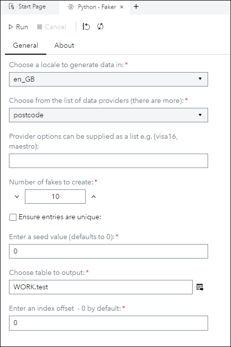
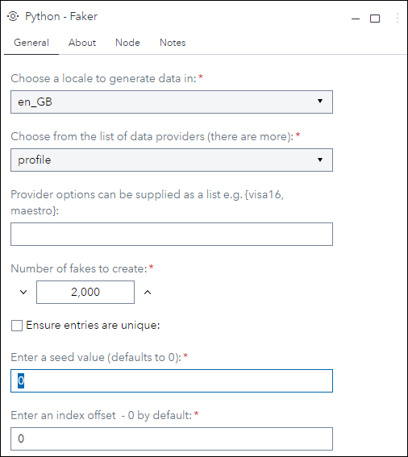
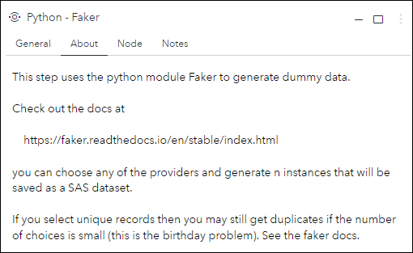
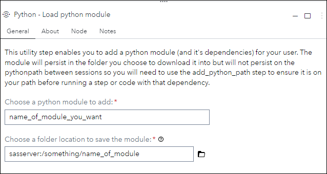
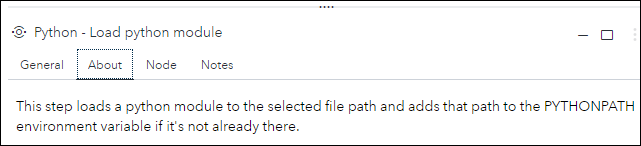
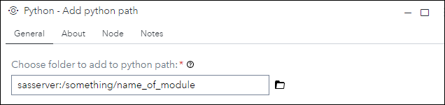
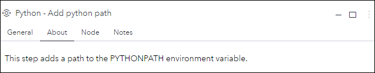

# Data Synthesis with Python faker, and supporting steps. 

## Description

The **Python - faker** custom step enables SAS Studio users to generate synthetic data using the Python faker module.

The **Python - Load python module** custom step enables SAS Studio users to download or update the files for a Python module to a location on their filesystem so that it can be used with Python (see Step below).

The **Python - Add python path** custom step enables SAS Studio users to add a path on their filesystem to the pythonpath so that Python modules located there can be utilised (see Step above).

## User Interface

### Python - faker

* ### General tab ###

   | Standalone mode | Flow mode |
   | --- | --- |                  
   |  |  |

* ### About tab ###

   

### Python - Load python module

* ### General tab ###

   

* ### About tab ###

   

### Python - Add python path

* ### General tab ###

   

* ### About tab ###

   

## Requirements

**Python - Faker** requires that the faker module is availabe to the Python instance in Viya.

The Steps  **Python - Load python module** and **Python - Add python path** can be used to achieve this, if faker is not already available.

Has only been tested on 2022.1.5 or later

## Usage

The usage of these steps, and faker itself, is disccused at length in a series of articles on the SAS Communities website.

* https://communities.sas.com/t5/SAS-Communities-Library/Data-Synthesis-with-SAS-Viya-and-Python/ta-p/844128

* https://communities.sas.com/t5/SAS-Communities-Library/Data-Synthesis-with-SAS-Viya-and-Python-Part-Two/ta-p/846349

## Change Log

* Version 1.0 (2022/12/06)
  * Initial version released to GitHub
