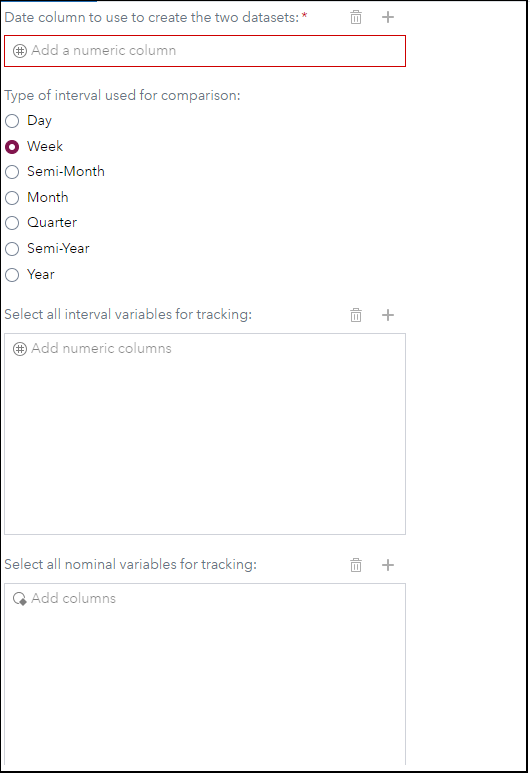
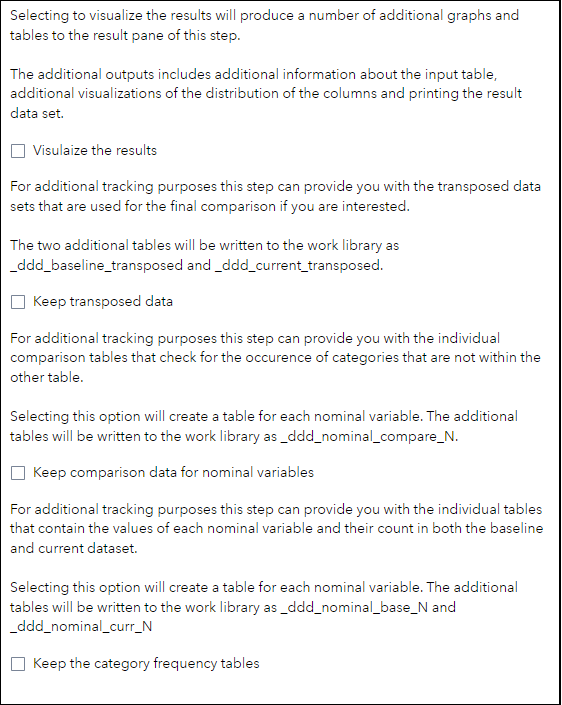

# Detect Data Drift

## Description

The "**Detect Data Drift**" custom steps performs a number of calculations and creates metrics for tracking changes that happen in a dataset. For this comparison a date variable and an interval is required to compare the data.

As input table provide all of the data, then from the input data and the interval two datasets are created:

1.   The current dataset which contains data greater than the interval - 1 to the run date of this step
2.   The baseline dataset which contains data between the interval -2 and -1 to the run date of this step

The output table contains the following metrics - in brackets you will find for which types of variables the metric is tracked, PCT is short for percentage:

-   sumDifference (interval)
-   sumDifferencePCT (interval)
-   minDifference (interval)
-   minDifferencePCT (interval)
-   maxDifference (interval)
-   maxDifferencePCT (interval)
-   meanDifference (interval)
-   meanDifferencePCT (interval)
-   medianDifference (interval)
-   medianDifferencePCT (interval)
-   nmissDifference (both)
-   nmissDifferencePCT (both)
-   cssDifference (interval)
-   cssDifferencePCT (interval)
-   cvDifference (interval)
-   cvDifferencePCT (interval)
-   prtDifference (interval)
-   prtDifferencePCT (interval)
-   rangeDifference (interval)
-   rangeDifferencePCT (interval)
-   stdDifference (interval)
-   stdDifferencePCT (interval)
-   stderrDifference (interval)
-   stderrDifferencePCT (interval)
-   tDifference (interval)
-   tDifferencePCT (interval)
-   ussDifference (interval)
-   ussDifferencePCT (interval)
-   varDifference (interval)
-   varDifferencePCT (interval)
-   p1Difference (interval)
-   p1DifferencePCT (interval)
-   p25Difference (interval)
-   p25DifferencePCT (interval)
-   p75Difference (interval)
-   p75DifferencePCT (interval)
-   p99Difference (interval)
-   p99DifferencePCT (interval)
-   lclmDifference (interval)
-   lclmDifferencePCT (interval)
-   uclmDifference (interval)
-   uclmDifferencePCT (interval)
-   modeDifference (interval)
-   modeDifferencePCT (interval)
-   qrangeDifference (interval)
-   qrangeDifferencePCT (interval)
-   kurtosisDifference (interval)
-   kurtosisDifferencePCT (interval)
-   skewnessDifference (interval)
-   skewnessDifferencePCT (interval)
-   countDifference (both)
-   countDifferencePCT (both)
-   totalDifference (both)
-   totalDifferencePCT (both)
-   numberOfCategoriesBaseline (nominal)
-   numberOfCategoriesCurrent (nominal)
-   numberOfCategoriesDifference (nominal)
-   numberOfCategoriesDifferencePCT (nominal)
-   differingCategories (nominal)

## User Interface

* ### Definition tab ###

   
   
* ### Output Options tab

   

## Requirements

SAS Viya 2024.07 or later

## Usage

Find a demonstration of this step in this YouTube video: [Detect Data Drift | Custom Step](https://youtu.be/Kl7QbLmzVmI).

If you want to run a test using the data shown in the video here is the code to generate it:

```SAS
* Sample data creation;
data work.hmeq_data_drift;
    length customerID captureDate 8.;
    format captureDate date9.;

    set sampsio.hmeq;

    customerID = _n_;

    * This only adds a new date value each 10 rows;
    captureDate = today() - ceil(_n_ / 10);
run;
```

## Change Log

* Version 1.0 (29JUL2024)
    * Initial version
