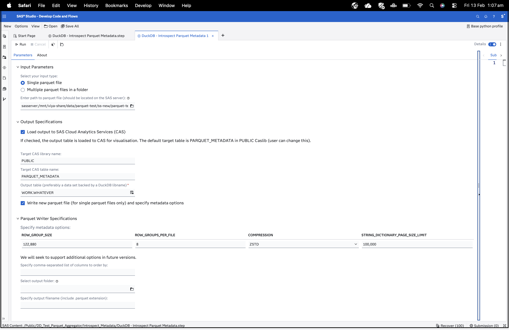

# DuckDB - Extract Parquet Metadata

## Description
This custom step extracts and outputs metadata from input parquet files. It also gives you an option to load this output to a SAS Cloud Analytics Services (CAS) table for visualisation. Visualising this output in applications like SAS Visual Analytics helps us understand if the parquet metadata and rowgroup structure need adjustment to yield faster query performance.  Then, based on user-specified parameters, this step can write parquet files reflecting changed metadata, particularly sorting information and rowgroups.  It takes advantage of the SAS/ACCESS Interface to DuckDB and inbuilt functions to work with parquet files.

Open file formats such as parquet are popular due to benefits they offer in reduced data footprint and columnar structure.  Also, DuckDB is a popular and performant query processing engine that reduces data movement. Parquet functions in DuckDB are useful tools that assist better use of parquet file metadata.

### Why do we need to extract parquet metadata?

Because we have nothing better to do :)?  On a serious note,

1. Parquet, as a format, is valued due to its ability to segment and partition data.  

*This means that parquet metadata captures pre-calculated information about individual segments of the file (including order and partitions) represented as rowgroups.  These rowgroups provide advance information to "reader" programs (a query in simple terms) regarding the distribution and range of data available in observations contained in a rowgroup, and smart readers use this to decide whether to skip sections of a file altogether to satisfy a query.   A simple example is when a rowgroup contains information only for males, i.e. Gender="M" and the query criteria filters for females (Gender="F"), the query does not need to read any observation in that rowgroup, resulting in faster execution.*

2. Rowgroups can be manipulated and organisations **should** take advantage of this opportunity to satisfy their analytics use cases.

*The naïve behaviour of parquet writer programs is to use a default number of rowgroups and distribute data equally across all rowgroups. However, this doesn't yield much benefit in query execution, especially when querying for sparsely distributed data which can lie just about anywhere. Parquet writer options contained in this step allow you to manipulate metadata to suit your purposes and align rowgroups towards commonly queried columns or patterns. Users can find out their common query patterns through carrying out code analysis or using their domain knowledge.*

3. Parquet can originate from just about anywhere.

*Parquet provides us benefits, but also makes us more vulnerable to problems posed by inefficient writers which may have been used in the past.  Extracting metadata helps you understand metadata (introspection) better and allows you remediation opportunity by writing a new file more aligned to your organisational/ query goals.*

---
## User Interface

(Watch out for a more detailed walkthrough soon.)

---
## Requirements
- SAS Viya environment with SAS Studio flows (step tested on monthly stable 2026.01)
- SAS/ACCESS Interface to DuckDB configured on the compute server. Note that SAS supports DuckDB from monthly stable 2025.07 onwards.
---
## Usage

Configure the parameters as needed in the Parameters tab and run the step.

---
## Parameters

### Input Parameters

- Path to parquet file(file selector, required): select only files on the SAS server (i.e. the filesystem). Based on earlier selection, this could be a single parquet file or a folder comprising multiple files.

### Output Specification

1. Output table (output port, required): connect an output table to the output port for holding schema results.  
2. Load to CAS (checkbox, optional): if checked, the output table is loaded to Cloud Analytics Services (and promoted to global scope) for visualisation. The default table is PARQUET_METADATA in PUBLIC caslib (can be changed by user). 

Visualising this output in applications like SAS Visual Analytics helps us understand if  parquet metadata or rowgroup structure needs adjustment to yield faster query performance. The Load-to-CAS option is provided as part of this custom step as a convenience (to remind you of this quick option for visualisation rather than scrolling through a long table in case of many rowgroups).  Even if you choose not to load to CAS at this stage, you can always load the output table later through the [Load to CAS](https://github.com/sassoftware/sas-studio-custom-steps/tree/main/CAS%20-%20Load%20to%20CAS) custom step also available in this repo.

### Parquet Writer Options
1. Select whether you want to write to a new parquet file with new metadata options and provide output table location and name (you will be able to overwrite existing file if you give the same name).
2. Order By Columns (text field):  Parquet rowgroups and metadata provide best value when planned in alignment with commonly queried columns.  Specify an Order By clause (without the \"ORDER BY\") in comma-separated form listing columns that you would like the new table to be ordered by.
3. Parquet writer options (option table): Change options for the new file if you wish. A limited set of options are offered as parquet writer options are numerous and differ based on DuckDB version.

Refer [DuckDB documentation](https://duckdb.org/docs/stable/data/parquet/overview) for an overview of these options. Future updates shall include more detailed overview of writer options.

---
## Installation & Notes
This step is part of the `sas-studio-custom-steps` collection. Follow the repository instructions in the top-level README to make custom steps available in SAS Studio.

---
## Change Log

Refer detailed changelog [here](./extras/CHANGELOG.md).

- Version: 0.6.0 (19FEB2026)
   - Version submitted to GitHub

- Version: 0.1.0 (04FEB2026)
   - Initial Prototype

---
## Contact
- [Sundaresh Sankaran](mailto:Sundaresh.sankaran@sas.com)
