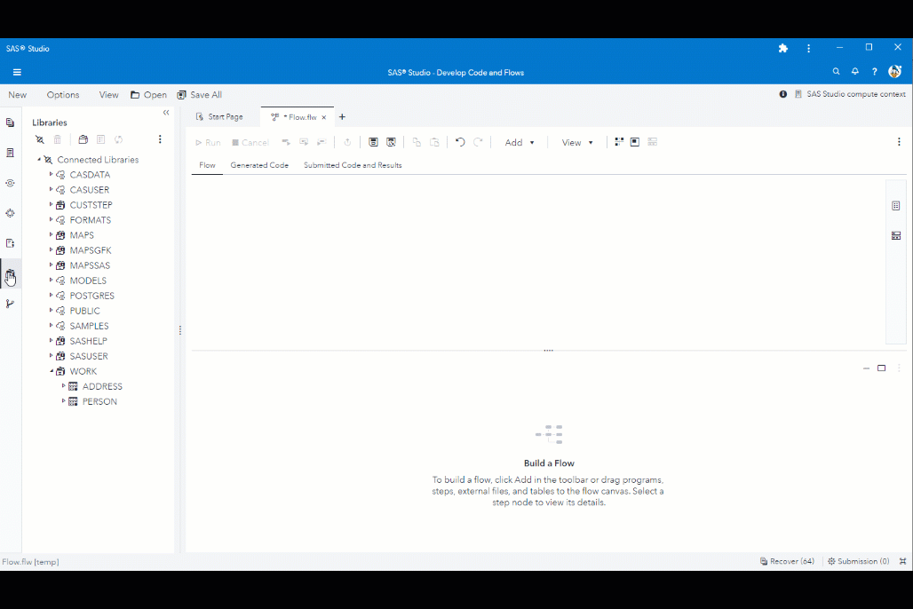
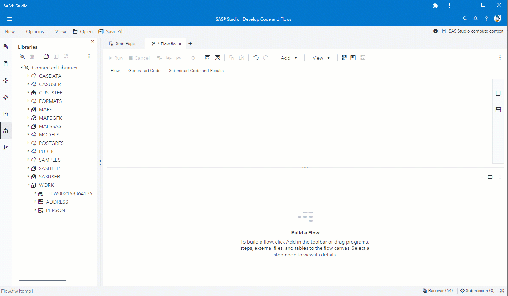

# Usage Examples

Here are two examples, including test data, how to use the custom step.

---

## Example 1: Save flow data to parquet file.

In this example we write the flow input data "ADDRESS" to a Parquet file on the server.


---

## Example 2: Join flow data with data from parquet file.

In this example we join the flow input data "PERSON" with the Parquet data ADDRESS that we have written in example 1.


---

## Example 3: Pass DuckDB data from one DuckDB step to the next.

By default DuckDB will only write its data into memory and at the end of the custom step the data that was written into memory will get lost. However, you can write data to a DuckDB database file. For the custom step you have to do this if you want to pass DuckDB data (data that you have written to DuckDB) from one DuckDB custom step to the next.


---

Copy/paste and run the following SAS code into SAS Studio for sample input data.
```sas
data PERSON;
    length NAME $35;
    infile cards dlm="," ;
    input ID NAME $;
    cards;
1,KATRINA POHL
2,SUBHASHINI JAMUNA POHL
3,KATHLEEN FLORENCE WAUGH
4,PHILIP CHARLES WAUGH
5,BRUCE WAUGH
6,W C KHOURY
7,CHRISTOPHER OCONNOR
8,LENG OCONNOR
9,GOVIND RAMJI SMITH
10,SMITH
11,GOVIND RAMJI SMITH
12,JOHN E SMITH
13,ETHEL ANNE GODWIN
14,GARY CHARLES GODWIN
15,B LEIGH
16,JANET SARA HYDE
17,D MORROW
18,DOROTHY ANN BEATRICE KINGHAM
19,JAMES WYLLIE TYRIE
20,GLEN TYRIE
21,M TYRIE
22,TIM TYRIE
23,EDITH CORNES
24,LYNN L BARON
25,THOMAS WILLIAM BARON
26,AMY YANG
27,YVONNE MARSHALL
28,JOHN MARSHALL
29,IRENE BAKER
30,ANNE DUFFEY
31,HEATHER HAWTHORNE
32,RM HAWTHORNE
33,LORRAINE ELLEN RILEY
34,MARY AGNES RILEY
35,AMANDA KOUMIOTIS
36,JOHN PETER ANTONY FLETCHER
37,KATHERINE MEG FLETCHER
38,RONALD WILLIAM JESSOP
39,YVONNE JESSOP
40,YVONNE ALESI
41,MARGARET KING
42,DANIEL KING
43,JACQUELINE ALISON MORRIS
44,J MCCORMICK
45,Rosalind Jane Lawson
46,Rosalyn Crockford
47,Ben Vanner
48,John Laing
49,Elizabeth Wesley
50,Rosamund Napier Penn Towle
;
data ADDRESS;
    length ADDRESS TOWN $50;
    infile cards dlm="," ;
    input ID ADDRESS TOWN $;
    cards;
1,810 St Johns Road,Clacton-On-Sea
2,13 Cimbernstr,Munich
3,530 Watford Way,London
4,4 Lady Leasow Radbrook Green,Shrewsbury
5,Oak Meadow,East Hanningfield
6,268 Norwood Road,Middx
7,8 Maes Y Fron Pentregwyddel Road,Colwyn Bay
8,15 Baron Fold Crescent,Manchester
9,21 Enmore Gardens,London
10,6 Hardcastle Gardens,Sheffield
11,6 Glebe Way,Clacton on Sea
12,97A Walford Road,London N16
13,96 Lingmell Avenue,St Helens
14,31 Conway Court,Ellesmere Port
15,53 Duke Street,Wellingborough
16,18 Portland Road,Colchester
17,12 Lincoln Way,Corby
18,25 Hayward Close,North Somerset
19,8 Yeomans Court Clumber Road West,Nottingham
20,55 Brickhouse Road,Rowley Regis
21,18 Thornewill House,London
22,19 Toronto Place,Leeds
23,57 West Park Road,Corsham
24,19 St Andrews Road,Diss
25,Vila Maria 14 John Road,Lymm
26,Flat 19 River Mead Uxbridge Road,Kingston Upon Thames
27,245 Camberwell New Road,London
28,1 Essex Court,London
29,37 Sherwood Drive,Cannock
30,14 Chattenden Court Boxley Road,Maidstone
31,Ivy Cottage Rainton Gate,Houghton le Spring
32,10 Sharston Crescent,Knutsford
33,15 Cherry Orchard Estate Higham on the,Nuneaton
34,18 Radnor Drive Morriston,West Glamorgan
35,12 Marsdale,Hull
36,133 Heath Road,Runcorn
37,1 Jubilee Close,Brandon
38,2 Rileys Way,Stoke on Trent
39,Railway Bell Priory Road,Tonbridge
40,26 Castle Meadows,Wakefield
41,Newfield Le Mont Cochon,Jersey
42,29 Burlington Avenue,Morecambe
43,47 Church Street,Swadlincote
44,11 Antrobus Road,Salisbury
45,178 Hartfield Road,London
46,111 Hawkwood Road,Halstead
47,2 Ambleside Close,Leicester
48,11 the Neuk,Aberdeen
49,404 Thorold Road,Ilford
50,West End House Hse Hillside Lane,Matlock
;
run;
```
