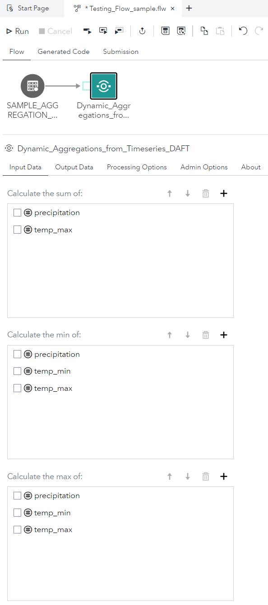
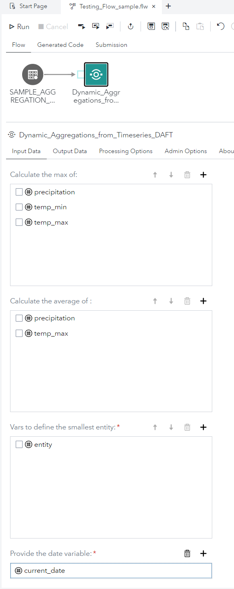
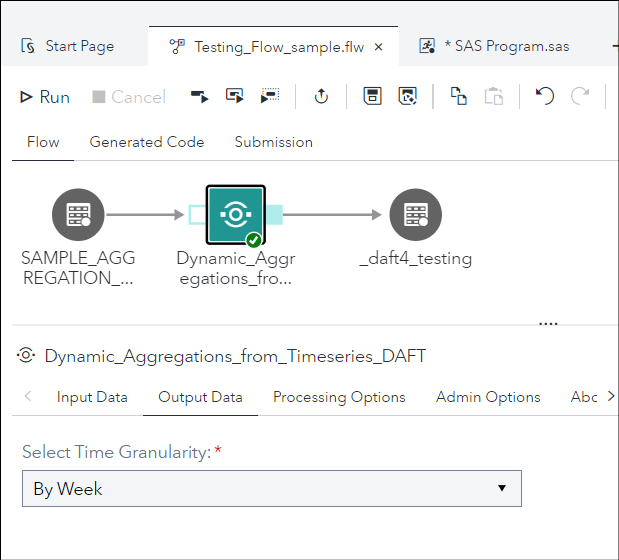
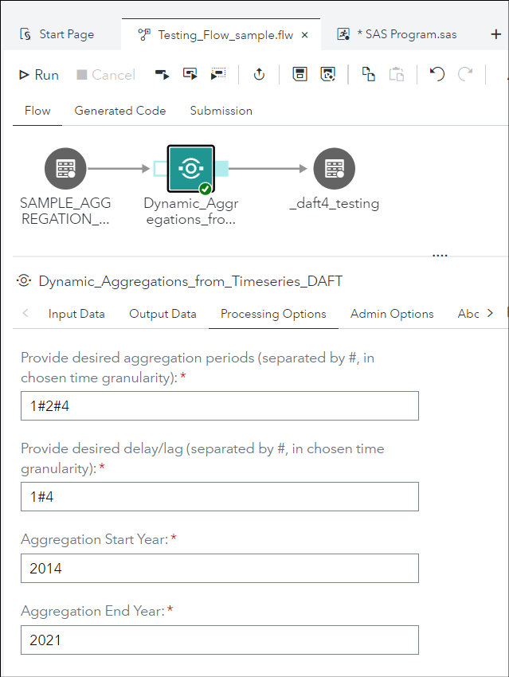
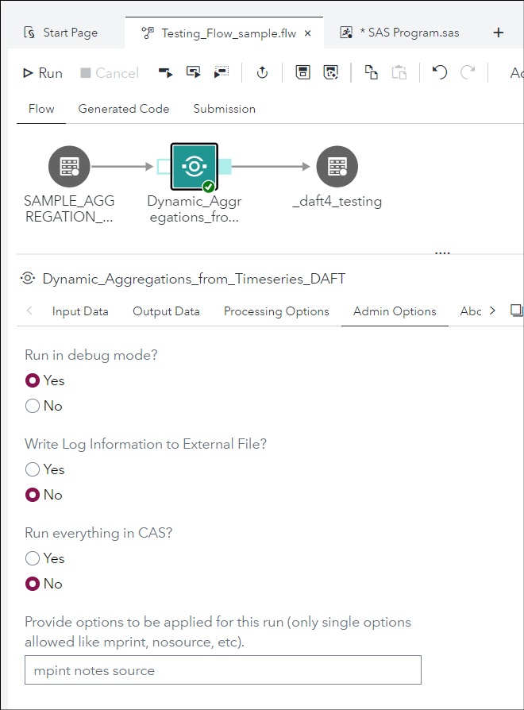
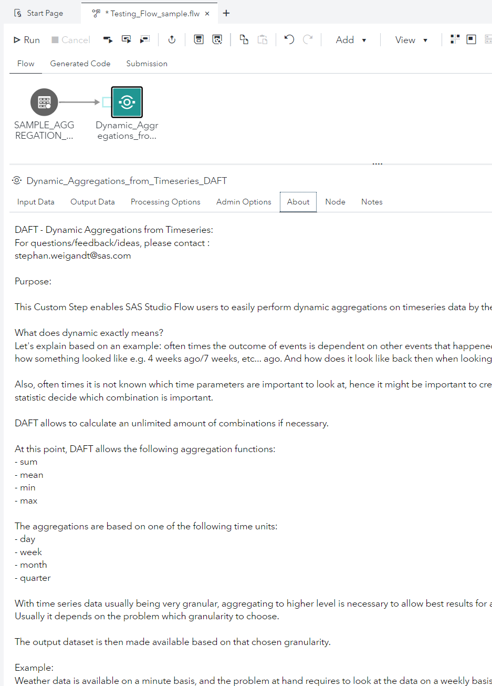

[[_TOC_]]

# Dynamic Aggregations From Timeseries DAFT

* [Description](#description)
* [SAS Viya Version Support](#sas-viya-version-support)
* [User Interface](#user-interface)
* [Requirements](#requirements)
* [Usage](#usage)
* [Download Step File](#download-step-file)
* [Prompt UI](#prompt-ui)
* [Program](#program)

## Description

The "**Dynamic Aggregations From Timeseries DAFT**" Custom Step enables SAS Studio Flow users to easily perform dynamic aggregations on timeseries data by the push of a button.

What does dynamic exactly means?
Let's explain based on an example: often times the outcome of events is dependent on other events that happened in the past. So it is important to get the view on the data how something looked like e.g. 4 weeks ago/7 weeks, etc... ago. And how does it look like back then when looking at the aggregate data of 2 weeks/3 weeks, etc...

Also, often times it is not known which time parameters are important to look at, hence it might be important to create a whole bunch of combinations and then let the statistic decide which combination is important. 

DAFT allows to calculate an unlimited amount of combinations if necessary.

At this point, DAFT allows the following aggregation functions:
- sum 
- mean
- min 
- max

The aggregations are based on one of the following time units:
- day 
- week
- month
- quarter

With time series data usually being very granular, aggregating to higher level is necessary to allow best results for analytic purposes. 
Usually it depends on the problem which granularity to choose. 

The output dataset is then made available based on that chosen granularity. 

Example:
Weather data is available on a minute basis, and the problem at hand requires to look at the data on a weekly basis and it is required to look at the summed up precipitation over 1 week and 2 weeks for both 4 weeks and 8 weeks ago. 

The aggregation sequence that needs to be provided is: 1#2
The lag sequence that needs to be provided is: 4#8

DAFT then creates all combinations between aggregation and lag sequence and the output variables would look like:
- precipitation_sum1L4
- precipitation_sum1L8
- precipitation_sum2L4
- precipitation_sum2L8

with "sum" describing the statistic that is being looked at for that variable, and the number behind it describes the length based on the selected unit, and "L" describing which lag is being looked. 

Since the granularity is "By Week", DAFT would create the following 2 time variables:
_DAFT_year
_DAFT_week

Additionally the output dataset contains the variables that describe the entity. 
In the weather example, this could the region/county level, or zip code level, etc...
In other examples, e.g. when the transaction data is e.g. bank data, the smallest entity could be person, household, company or parent company.

## SAS Viya Version Support
tested on 2022.1.2, but should work in earlier releases as well

## User Interface

### Input Data Tab

The complete options are spread over 2 screenshots:






### Output Data Tab




### Processing Options Tab



### Admin Options Tab



### About Tab




## Requirements

* A CAS session established (in an autoexec or something else)
* The provided libname for the output table in the "Output Data" tab must exist.

Example:

```sas

```

## Usage

### How to Run DAFT with Default Settings


Copy/paste these next few lines of code into SAS Studio - SAS Program tab in order to create a test timeseries dataset for playing around:
*******
data work.sample_aggregation_ds;
	format 
		current_date date9.;
	drop
		counter;
	current_date = 20084;
	counter = 0;
	/**
	loop through weeks/days to create timeseries skeleton
	**/
	do week = 1 to 52;
		do day = 1 to 7;
			counter = counter + 1;
			/* 
			this produced precipitation will always sum up to the current week number when 
			weekly aggregated
			*/
			precipitation = week/7;
			/*
			the max of temp_min will always be the current week number when weekly aggregated
			*/
			temp_min = week - (day - 1)/week;
			/*
			the min of temp_max will always be the current week number when weekly aggregated
			*/
			temp_max = week + (week * (day-1))**2;
			current_date = current_date + 1;
			/*
			create random entity number between 0 and 1, also create an entity number 2, for which 
			above rules apply for summation expectation
			*/
			entity = floor(mod(ranuni(counter)*100,2));
			cal_week = week(current_date);
			output;
			entity = 2;
			output;
		end;
	end;
run;
**************

## Change Log

Version 2.0.1

initial published version as a custom step


## Download Step File

[Dynamic Aggregations From Timeseries DAFT](./Dynamic%20Aggregations%20From%20Timeseries%20DAFT.step)

## Prompt UI

```json
{
	"showPageContentOnly": true,
	"pages": [
		{
			"id": "InputData",
			"type": "page",
			"label": "Input Data",
			"children": [
				{
					"id": "input_ds_ui",
					"type": "inputtable",
					"label": "Provide the Transaction table to be aggregated",
					"required": true,
					"placeholder": "",
					"visible": ""
				},
				{
					"id": "sum_variables_seq_ui",
					"type": "columnselector",
					"label": "Calculate the sum of:",
					"order": true,
					"columntype": "n",
					"max": null,
					"min": null,
					"visible": "",
					"table": "input_ds_ui"
				},
				{
					"id": "min_variables_seq_ui",
					"type": "columnselector",
					"label": "Calculate the min of:",
					"order": true,
					"columntype": "n",
					"max": null,
					"min": null,
					"visible": "",
					"table": "input_ds_ui"
				},
				{
					"id": "max_variables_seq_ui",
					"type": "columnselector",
					"label": "Calculate the max of:",
					"order": true,
					"columntype": "n",
					"max": null,
					"min": null,
					"visible": "",
					"table": "input_ds_ui"
				},
				{
					"id": "avg_variables_seq_ui",
					"type": "columnselector",
					"label": "Calculate the average of :",
					"order": true,
					"columntype": "n",
					"max": null,
					"min": null,
					"visible": "",
					"table": "input_ds_ui"
				},
				{
					"id": "entity_def_seq_ui",
					"type": "columnselector",
					"label": "Vars to define the smallest entity:",
					"order": true,
					"columntype": "a",
					"max": null,
					"min": 1,
					"visible": "",
					"table": "input_ds_ui"
				},
				{
					"id": "date_variable_ui",
					"type": "columnselector",
					"label": "Provide the date variable:",
					"order": false,
					"columntype": "n",
					"max": 1,
					"min": 1,
					"visible": "",
					"table": "input_ds_ui"
				}
			]
		},
		{
			"id": "outputdata",
			"type": "page",
			"label": "Output Data",
			"children": [
				{
					"id": "Output_ds_ui",
					"type": "textfield",
					"label": "Full Output Table (including libname and table name)",
					"placeholder": "E.g. public.output_table",
					"required": true,
					"visible": ""
				},
				{
					"id": "time_granularity_ui",
					"type": "dropdown",
					"label": "Select Time Granularity:",
					"items": [
						{
							"value": "day",
							"label": "By Day"
						},
						{
							"value": "week",
							"label": "By Week"
						},
						{
							"value": "month",
							"label": "By Month"
						},
						{
							"value": "quarter",
							"label": "By Quarter"
						}
					],
					"required": true,
					"placeholder": "",
					"visible": ""
				}
			]
		},
		{
			"id": "processingoptions",
			"type": "page",
			"label": "Processing Options",
			"children": [
				{
					"id": "agg_period_seq_ui",
					"type": "textfield",
					"label": "Provide desired aggregation periods (separated by #, in chosen time granularity):",
					"placeholder": "",
					"required": true,
					"visible": ""
				},
				{
					"id": "lag_period_seq_ui",
					"type": "textfield",
					"label": "Provide desired delay/lag (separated by #, in chosen time granularity):",
					"placeholder": "",
					"required": true,
					"visible": ""
				},
				{
					"id": "period_start_year_ui",
					"type": "textfield",
					"label": "Aggregation Start Year:",
					"placeholder": "",
					"required": true,
					"visible": ""
				},
				{
					"id": "period_end_year_ui",
					"type": "textfield",
					"label": "Aggregation End Year:",
					"placeholder": "",
					"required": true,
					"visible": ""
				}
			]
		},
		{
			"id": "admin",
			"type": "page",
			"label": "Admin Options",
			"children": [
				{
					"id": "debug_mode_ui",
					"type": "radiogroup",
					"label": "Run in debug mode?",
					"items": [
						{
							"value": "1",
							"label": "Yes"
						},
						{
							"value": "0",
							"label": "No"
						}
					],
					"visible": ""
				},
				{
					"id": "log_file_path_ui",
					"type": "path",
					"label": "Path for logfile creation",
					"pathtype": "folder",
					"placeholder": "If kept blank, log file still goes to standard output.",
					"required": true,
					"visible": [
						"$write_log_to_file_ui",
						"=",
						"1"
					]
				},
				{
					"id": "write_log_to_file_ui",
					"type": "radiogroup",
					"label": "Write Log Information to External File?",
					"items": [
						{
							"value": "1",
							"label": "Yes"
						},
						{
							"value": "0",
							"label": "No"
						}
					],
					"visible": ""
				},
				{
					"id": "run_everything_in_CAS_ui",
					"type": "radiogroup",
					"label": "Run everything in CAS?",
					"items": [
						{
							"value": "1",
							"label": "Yes"
						},
						{
							"value": "0",
							"label": "No"
						}
					],
					"visible": ""
				},
				{
					"id": "options_seq_ui",
					"type": "textfield",
					"label": "Provide options to be applied for this run (only single options allowed like mprint, nosource, etc).",
					"placeholder": "",
					"required": false,
					"visible": ""
				}
			]
		},
		{
			"id": "about",
			"type": "page",
			"label": "About",
			"children": [
				{
					"id": "text1",
					"type": "text",
					"text": "DAFT - Dynamic Aggregations from Timeseries:\nFor questions/feedback/ideas, please contact :\nstephan.weigandt@sas.com\n\nPurpose:\n\nThis Custom Step enables SAS Studio Flow users to easily perform dynamic aggregations on timeseries data by the push of a button.\n\nWhat does dynamic exactly means?\nLet's explain based on an example: often times the outcome of events is dependent on other events that happened in the past. So it is important to get the view on the data how something looked like e.g. 4 weeks ago/7 weeks, etc... ago. And how does it look like back then when looking at the aggregate data of 2 weeks/3 weeks, etc...\n\nAlso, often times it is not known which time parameters are important to look at, hence it might be important to create a whole bunch of combinations and then let the statistic decide which combination is important. \n\nDAFT allows to calculate an unlimited amount of combinations if necessary.\n\nAt this point, DAFT allows the following aggregation functions:\n- sum \n- mean\n- min \n- max\n\nThe aggregations are based on one of the following time units:\n- day \n- week\n- month\n- quarter\n\nWith time series data usually being very granular, aggregating to higher level is necessary to allow best results for analytic purposes. \nUsually it depends on the problem which granularity to choose. \n\nThe output dataset is then made available based on that chosen granularity. \n\nExample:\nWeather data is available on a minute basis, and the problem at hand requires to look at the data on a weekly basis and it is required to look at the summed up precipitation over 1 week and 2 weeks for both 4 weeks and 8 weeks ago. \n\nThe aggregation sequence that needs to be provided is: 1#2\nThe lag sequence that needs to be provided is: 4#8\n\nDAFT then creates all combinations between aggregation and lag sequence and the output variables would look like:\nprecipitation_sum1L4\nprecipitation_sum1L8\nprecipitation_sum2L4\nprecipitation_sum2L8\n\nwith \"sum\" describing the statistic that is being looked at for that variable, and the number behind it describes the length based on the selected unit, and \"L\" describing which lag is being looked. \n\nSince the granularity is \"By Week\", DAFT would create the following 2 time variables:\n_DAFT_year\n_DAFT_week\n\nAdditionally the output dataset contains the variables that describe the entity. \nIn the weather example, this could the region/county level, or zip code level, etc...\nIn other examples, e.g. when the transaction data is e.g. bank data, the smallest entity could be person, household, company or parent company.\n\n\nCopy/paste these next few lines of code into SAS Studio - SAS Program tab in order to create a test timeseries dataset for playing around:\n*******\ndata work.sample_aggregation_ds;\n\tformat \n\t\tcurrent_date date9.;\n\tdrop\n\t\tcounter;\n\tcurrent_date = 20084;\n\tcounter = 0;\n\t/**\n\tloop through weeks/days to create timeseries skeleton\n\t**/\n\tdo week = 1 to 52;\n\t\tdo day = 1 to 7;\n\t\t\tcounter = counter + 1;\n\t\t\t/* \n\t\t\tthis produced precipitation will always sum up to the current week number when \n\t\t\tweekly aggregated\n\t\t\t*/\n\t\t\tprecipitation = week/7;\n\t\t\t/*\n\t\t\tthe max of temp_min will always be the current week number when weekly aggregated\n\t\t\t*/\n\t\t\ttemp_min = week - (day - 1)/week;\n\t\t\t/*\n\t\t\tthe min of temp_max will always be the current week number when weekly aggregated\n\t\t\t*/\n\t\t\ttemp_max = week + (week * (day-1))**2;\n\t\t\tcurrent_date = current_date + 1;\n\t\t\t/*\n\t\t\tcreate random entity number between 0 and 1, also create an entity number 2, for which \n\t\t\tabove rules apply for summation expectation\n\t\t\t*/\n\t\t\tentity = floor(mod(ranuni(counter)*100,2));\n\t\t\tcal_week = week(current_date);\n\t\t\toutput;\n\t\t\tentity = 2;\n\t\t\toutput;\n\t\tend;\n\tend;\nrun;\n**************",
					"visible": ""
				}
			]
		}
	],
	"values": {
		"input_ds_ui": {
			"library": "",
			"table": ""
		},
		"sum_variables_seq_ui": [],
		"min_variables_seq_ui": [],
		"max_variables_seq_ui": [],
		"avg_variables_seq_ui": [],
		"entity_def_seq_ui": [],
		"date_variable_ui": [],
		"Output_ds_ui": "Public._DAFT_Output_Table",
		"time_granularity_ui": {
			"value": "month",
			"label": "By Month"
		},
		"agg_period_seq_ui": "1#2",
		"lag_period_seq_ui": "1#4",
		"period_start_year_ui": "2015",
		"period_end_year_ui": "2021",
		"debug_mode_ui": {
			"value": "0",
			"label": "No"
		},
		"log_file_path_ui": "",
		"write_log_to_file_ui": {
			"value": "0",
			"label": "No"
		},
		"run_everything_in_CAS_ui": {
			"value": "1",
			"label": "Yes"
		},
		"options_seq_ui": "nonotes nomprint nosource"
	},
	"promptHierarchies": []
}
```

## Program

```sas
data work._daft_option_setting_storage;
	length
		new_setting $24.
		original_setting $24.
		new_setting_seq $256.
		;
	new_setting = "";
	original_setting = "";
	new_setting_seq = "";
	numberofsettings = 0;
	if 0;
run;
%let _daft_option_validvarname_org = %sysfunc(getoption(validvarname));
option validvarname = any;
%if "&options_seq_ui" ne "" %then
%do;
data _daft_option_setting_storage;
	length new_setting $24.;
	new_setting_seq = strip("&options_seq_ui");
	numberofsettings = count(new_setting_seq, " ") + 1;
	
	do i = 1 to numberofsettings;
		new_setting = "";
		new_setting = scan(new_setting_seq, i, " ");
		if not missing(new_setting) then
		do;
			original_setting = getoption(new_setting);
			call execute("option "||new_Setting||";");
	
			output;
		end;
	end;
	run;	
%end;
 
 
%let production_mode = 1;
%let fcmp_run_indicator = 0;
%let install_mode_in_SAS_Content = 0;
 
 
%let daft_delimiter = ;
%macro set_os_dependent_values(
	sodv_delimiter = daft_delimiter
	);
	%if %upcase(&SYSSCP) = WIN %then
	%do;
		%let &sodv_delimiter = \;
	%end; %else
	%do;
		%let &sodv_delimiter = /;
	%end;
%mend;
%set_os_dependent_values(
	sodv_delimiter = daft_delimiter
	);
 
 
/******************************************************************************
 
%wordcnt
________
 
 
Counts the words in a list
 
______________________________________________________________________________
 
 
USAGE:                         %wordcnt(list,delim)
 
______________________________________________________________________________
 
DESCRIPTION:
 
Finds the number of words/tokens in a string.  The user specifies a
delimiter e.g. # to identify what separates the words.  The macro should be
called in the following way, e.g. %let x=%wordcnt(item1#item2 item2a#item3, '#').  After running
the macro x will be assigned the value of wordcnt.
______________________________________________________________________________
 
 
INPUT PARAMETERS AND KEYWORDS:
 
list            the name of the string.
delim           the delimiter e.g. '#'.
______________________________________________________________________________
 
 
CALLS: none.
______________________________________________________________________________
 
NOTES: (Initials, date, summary)
 
stweig    20200406  First officially Released Version
______________________________________________________________________________
 
*******************************************************************************/
%macro wordcnt(
list,
delim
)
;
%local
word
wc_count;
%let wc_count = 0;
%if %quote(&list) ne %then
%do;
%let word = %scan(%quote(&list), 1, &delim);
%let word = %quote(&word);
%do %while (&word ne);
%let wc_count = %eval(&wc_count + 1);
%let word = %scan(%quote(&list), &wc_count+1, &delim);
%let word = %quote(&word);
%end;
%end;
&wc_count
%mend wordcnt;
%macro load_final_data(
	lfd_libname = ,
	wof2l_final_table_name = ,
	lfd_target_libname = bttrball,
	lfd_environment_macro_var_name = run_environment
	);
	%let wof2l_final_table_name = %upcase(&wof2l_final_table_name);
	%if &&&lfd_environment_macro_var_name = CAS %then
	%do;
		proc casutil;
			droptable casdata = "&wof2l_final_table_name" incaslib = "&lfd_target_libname" quiet;
			droptable casdata = "&wof2l_final_table_name" incaslib = "&lfd_target_libname" quiet;
		quit;
	%end;
		data &lfd_target_libname..&wof2l_final_table_name;
			set &lfd_libname..&wof2l_final_table_name;
		run;
	%if &&&lfd_environment_macro_var_name = CAS %then
	%do;
		proc casutil;
			promote casdata="&wof2l_final_table_name" incaslib="&lfd_target_libname"
					outcaslib="&lfd_target_libname" casout="&wof2l_final_table_name";
			save casdata="&wof2l_final_table_name" incaslib="&lfd_target_libname"
					outcaslib="&lfd_target_libname" casout="&wof2l_final_table_name" replace;
		quit;
	
	%end;
%mend;
/******************************************************************************
 
%create_agg_by_period_by_lag
________
 
DESCRIPTION:
 
This program creates aggregates by time period and also by lag.
The resulting variables can be very helpful for forecasting and such.
 
______________________________________________________________________________
 
NOTES: (Initials, date, summary)
 
stweig    	20211102  First officially Released Version
 
______________________________________________________________________________
 
*******************************************************************************/
 
%macro create_agg_by_period_by_lag_core(
	cabpblc_lag_aggregation_seq = ,
	cabpblc_lag_delay_seq = ,
	cabpblc_input_ds = ,
	cabpblc_output_ds = ,
	cabpblc_var_seq = ,
	cabpblc_debug_mode = 0,
	cabpblc_group_by = ,
	cabpblc_group_by_except_time = ,
	cabpblc_temp_libname = work
	);
	%local
		max_lag_value
		aggregation_count
		delay_count
		agg_counter
		aggregation
		delay_counter
		counter
		varname
		cabpbl_target_lib_engine
		run_environment
		last_of_ds_groupby_varname
		;
	%let max_lag_value = 1;
	%let aggregation_count = %wordcnt(&cabpblc_lag_aggregation_seq, '#');
	%let delay_count = %wordcnt(&cabpblc_lag_delay_seq, '#');
	%let cabpblc_var_count = %wordcnt(&cabpblc_var_seq, '#');
	%do agg_counter = 1 %to &aggregation_count;
		%let aggregation = %scan(&cabpblc_lag_aggregation_seq, &agg_counter, '#');
		%do delay_counter = 1 %to &delay_count;
			%let delay = %scan(&cabpblc_lag_delay_seq, &delay_counter, '#');
			%let temp = %sysevalf(&aggregation + &delay + 1);
			%if &temp > &max_lag_value %then
			%do;
				%let max_lag_value = &temp;
			%end;
		%end;
	%end;
 
	%if &cabpblc_debug_mode = 1 %then
	%do;
		%put INFORMATION: Max history needed for calculations &=max_lag_value;
	%end;
 
	%local
		cabpblc_temp_libname_compute
		cabpbl_output_libname
		cabpbl_output_table_name
		;
	%let cabpblc_temp_libname_compute = work;
	data &cabpblc_temp_libname_compute.._DAFT_table_pre_agg_lag;
		set &cabpblc_input_ds;
		/* by &cabpblc_group_by; */
	run;
	proc sort
		data = &cabpblc_temp_libname_compute.._DAFT_table_pre_agg_lag;
		by &cabpblc_group_by;
	quit;
	
	%let last_of_ds_groupby_varname = %scan(&cabpblc_group_by_except_time, -1);
 
	data &cabpblc_temp_libname_compute.._DAFT_table_agg_by_lag ;
		set &cabpblc_temp_libname_compute.._DAFT_table_pre_agg_lag;
			%do counter = 1 %to &cabpblc_var_count;
				%let varname = %scan(%scan(&cabpblc_var_seq, &counter, "#"), 1, '$');
				&varname.L0 = &varname.;
				%do lag_counter = 1 %to &max_lag_value;
					&varname.L&lag_counter = lag&lag_counter(&varname.);	
				%end;
			%end;
	run;
	data &cabpblc_temp_libname_compute.._DAFT_table_agg_by_lag;
		set &cabpblc_temp_libname_compute.._DAFT_table_agg_by_lag;
		retain temp_counter 0;
		drop temp_counter;
		by &cabpblc_group_by_except_time;
		if first.&last_of_ds_groupby_varname then
		do;
			temp_counter = 0;
		end;
		temp_counter = temp_counter + 1;
			%do counter = 1 %to &cabpblc_var_count;
				%let varname = %scan(%scan(&cabpblc_var_seq, &counter, "#"), 1, '$');
				%do lag_counter = 1 %to &max_lag_value;
					if temp_counter <= &lag_counter then	
					do;
						&varname.L&lag_counter = .;	
					end;
				%end;
			%end;
	run;
 
	%let cabpbl_output_table_name = %upcase(%scan(&cabpblc_output_ds, 2, '.'));
	%let cabpbl_output_libname = %scan(&cabpblc_output_ds, 1, '.');
	%let cabpbl_target_lib_engine = ; /* V9 or CAS */
	proc sql noprint;
		select distinct(engine)
		into :cabpbl_target_lib_engine
		from dictionary.libnames
		where upcase(libname) = "%upcase(&cabpbl_output_libname)"
		;
	quit;
 
	%let cabpbl_target_lib_engine = %upcase(%trim(%left(&cabpbl_target_lib_engine)));
	%if &cabpbl_target_lib_engine = CAS %then
	%do;
		proc casutil;
			droptable casdata = "&cabpbl_output_table_name" incaslib = "&cabpbl_output_libname" quiet;
			droptable casdata = "&cabpbl_output_table_name" incaslib = "&cabpbl_output_libname" quiet;
		quit;
	%end;
 
	data &cabpblc_output_ds ;
		set &cabpblc_temp_libname_compute.._DAFT_table_agg_by_lag;
		if _n_ > &max_lag_value;
		%if &cabpblc_debug_mode = 0 %then
		%do;
			drop
			%do counter = 1 %to &cabpblc_var_count;
				%let varname = %scan(%scan(&cabpblc_var_seq, &counter, "#"), 1, '$');
				%let cabpblc_stat_function = %scan(%scan(&cabpblc_var_seq, &counter, "#"), 2, '$');
				&varname.L0
				%do lag_counter = 1 %to &max_lag_value;
					&varname.L&lag_counter 	
				%end;
			%end;
			;
		%end;		 			
		%if &cabpblc_debug_mode = 1 %then
		%do;
			%put INFORMATION: Now processing &=aggregation_count;
			%put INFORMATION: Now processing &=delay_count;
			%put INFORMATION: Now processing &=cabpblc_lag_aggregation_seq;
			%put INFORMATION: Now processing &=cabpblc_lag_delay_seq;
			%put INFORMATION: Now processing &=cabpblc_var_count;
			%put INFORMATION: Now processing &=cabpblc_var_seq;
		%end;
		%do agg_counter = 1 %to &aggregation_count;
			%let aggregation = %scan(&cabpblc_lag_aggregation_seq, &agg_counter, '#');
			%do delay_counter = 1 %to &delay_count;
				%let delay = %scan(&cabpblc_lag_delay_seq, &delay_counter, '#');
				%do counter = 1 %to &cabpblc_var_count;
					%let varname = %scan(%scan(&cabpblc_var_seq, &counter, "#"), 1, '$');
					%let cabpblc_stat_function = %scan(%scan(&cabpblc_var_seq, &counter, "#"), 2, '$');
					%if %upcase(&cabpblc_stat_function) eq AVG %then
					%do;
						/* &varname._&cabpblc_stat_function.&aggregation.L&delay = mean(of &varname.L&delay-&varname.L%eval(&delay + &aggregation - 1)); */
						&varname.&aggregation.L&delay = mean(of &varname.L&delay-&varname.L%eval(&delay + &aggregation - 1));
					%end; %else %if %upcase(&cabpblc_stat_function) eq AGG %then
					%do;
						/* &varname._&cabpblc_stat_function.&aggregation.L&delay = sum(of &varname.L&delay-&varname.L%eval(&delay + &aggregation - 1)); */
						&varname.&aggregation.L&delay = sum(of &varname.L&delay-&varname.L%eval(&delay + &aggregation - 1));
					%end; %else %if %upcase(&cabpblc_stat_function) eq ASIS %then
					%do;
						&varname._L&delay = &varname.L&delay;
						&varname._L&delay = &varname.L&delay;
					%end; %else
					%do;
						/* &varname._&cabpblc_stat_function.&aggregation.L&delay = &cabpblc_stat_function.(of &varname.L&delay-&varname.L%eval(&delay + &aggregation - 1)); */
						&varname.&aggregation.L&delay = &cabpblc_stat_function.(of &varname.L&delay-&varname.L%eval(&delay + &aggregation - 1));
					%end;
				%end;
			%end;
		%end;
	run;
 
 
	%if &cabpbl_target_lib_engine = CAS %then
	%do;
		proc casutil;
			promote casdata="&cabpbl_output_table_name" incaslib="&cabpbl_output_libname"
					outcaslib="&cabpbl_output_libname" casout="&cabpbl_output_table_name";
			save casdata="&cabpbl_output_table_name" incaslib="&cabpbl_output_libname"
					outcaslib="&cabpbl_output_libname" casout="&cabpbl_output_table_name" replace;
		quit;
	%end;
 
%mend;
 
/******************************************************************************
 
%create_agg_by_period_by_lag
________
 
DESCRIPTION:
 
This program creates aggregates by time period and also by lag.
The resulting variables can be very helpful for forecasting and such.
 
______________________________________________________________________________
 
NOTES: (Initials, date, summary)
 
stweig    	20211102  First officially Released Version
 
______________________________________________________________________________
 
*******************************************************************************/
 
%macro create_agg_by_period_by_lag(
	cabpbl_input_ds = ,
	cabpbl_output_ds = ,
	cabpbl_sum_vars_seq = ,
	cabpbl_avg_vars_seq = ,
	cabpbl_min_vars_seq = ,
	cabpbl_max_vars_seq = ,
	cabpbl_date_variable = ,
	cabpbl_time_granularity = ,
	cabpbl_agg_period_seq = ,
	cabpbl_lag_period_seq = ,
	cabpbl_temp_libname = work,
	cabpbl_entity_definition_seq = ,
	cabpbl_group_by = ,
	cabpbl_debug_mode = 0,
	cabpbl_keep_org_var_after_means = 0
	
	);
 
	%local
		 cabpbl_var_seq
		 cabpbl_counter
		 cabpbl_temp_variable_name
		;
	%let cabpbl_sumvar_postfix = _sum;
	%let cabpbl_avgvar_postfix = _mean;
	%let cabpbl_minvar_postfix = _min;
	%let cabpbl_maxvar_postfix = _max;
 
	%if &cabpbl_keep_org_var_after_means = 1 %then
	%do;
		%let cabpbl_sumvar_postfix = ;
		%let cabpbl_avgvar_postfix = ;
		%let cabpbl_minvar_postfix = ;
		%let cabpbl_maxvar_postfix = ;
		
 
	%end;
 
	%let cabpbl_sum_vars_count = %wordcnt(&cabpbl_sum_vars_seq, "#");
	%let cabpbl_avg_vars_count = %wordcnt(&cabpbl_avg_vars_seq, "#");
	%let cabpbl_min_vars_count = %wordcnt(&cabpbl_min_vars_seq, "#");
	%let cabpbl_max_vars_count = %wordcnt(&cabpbl_max_vars_seq, "#");
	%if &cabpbl_debug_mode = 1 %then
	%do;
		%put INFORMATION: Now processing &=cabpbl_input_ds;
		%put INFORMATION: Now processing &=cabpbl_output_ds;
		%put INFORMATION: Now processing &=cabpbl_entity_definition_seq;
		%put INFORMATION: Now processing &=cabpbl_temp_libname;
	%end;
	%let cabpbl_var_seq = ;
	%do cabpbl_counter = 1 %to &cabpbl_sum_vars_count;
		%let cabpbl_temp_variable_name = %scan(&cabpbl_sum_vars_seq, &cabpbl_counter, "#");
		%if "&cabpbl_var_seq" ne "" %then
		%do;
			%let cabpbl_var_seq = &cabpbl_var_seq#&cabpbl_temp_variable_name.&cabpbl_sumvar_postfix.$agg;			
		%end; %else
		%do;
			%let cabpbl_var_seq = &cabpbl_temp_variable_name.&cabpbl_sumvar_postfix.$agg;			
		%end;
	%end;
	%do cabpbl_counter = 1 %to &cabpbl_avg_vars_count;
		%let cabpbl_temp_variable_name = %scan(&cabpbl_avg_vars_seq, &cabpbl_counter, "#");
		%if "&cabpbl_var_seq" ne "" %then
		%do;
			%let cabpbl_var_seq = &cabpbl_var_seq#&cabpbl_temp_variable_name.&cabpbl_avgvar_postfix.$avg;			
		%end; %else
		%do;
			%let cabpbl_var_seq = &cabpbl_temp_variable_name.&cabpbl_avgvar_postfix.$avg;			
		%end;
	%end;
	%do cabpbl_counter = 1 %to &cabpbl_min_vars_count;
		%let cabpbl_temp_variable_name = %scan(&cabpbl_min_vars_seq, &cabpbl_counter, "#");
		%if "&cabpbl_var_seq" ne "" %then
		%do;
			%let cabpbl_var_seq = &cabpbl_var_seq#&cabpbl_temp_variable_name.&cabpbl_minvar_postfix.$min;			
		%end; %else
		%do;
			%let cabpbl_var_seq = &cabpbl_temp_variable_name.&cabpbl_minvar_postfix.$min;			
		%end;
	%end;
	%do cabpbl_counter = 1 %to &cabpbl_max_vars_count;
		%let cabpbl_temp_variable_name = %scan(&cabpbl_max_vars_seq, &cabpbl_counter, "#");
		%if "&cabpbl_var_seq" ne "" %then
		%do;
			%let cabpbl_var_seq = &cabpbl_var_seq#&cabpbl_temp_variable_name.&cabpbl_maxvar_postfix.$max;			
		%end; %else
		%do;
			%let cabpbl_var_seq = &cabpbl_temp_variable_name.&cabpbl_maxvar_postfix.$max;			
		%end;
	%end;
 
	%if &cabpbl_debug_mode = 1 %then
	%do;
		%put INFORMATION: Now processing &=cabpbl_maxvar_postfix;
		%put INFORMATION: Now processing &=cabpbl_minvar_postfix;
		%put INFORMATION: Now processing &=cabpbl_sum_vars_seq;
		%put INFORMATION: Now processing &=cabpbl_avg_vars_seq;
		%put INFORMATION: Now processing &=cabpbl_entity_definition_seq;
		%put INFORMATION: Now processing &=cabpbl_lag_period_seq;
		%put INFORMATION: Now processing &=cabpbl_agg_period_seq;
		%put INFORMATION: Now processing &=cabpbl_var_seq;
	%end;
	
	%create_agg_by_period_by_lag_core(
		cabpblc_lag_aggregation_seq = &cabpbl_agg_period_seq,
		cabpblc_lag_delay_seq = &cabpbl_lag_period_seq,
		cabpblc_input_ds = &cabpbl_input_ds,
		cabpblc_output_ds = &cabpbl_output_ds,
		cabpblc_var_seq = &cabpbl_var_seq,
		cabpblc_debug_mode = &cabpbl_debug_mode,
		cabpblc_group_by = &cabpbl_group_by,
		cabpblc_group_by_except_time = &cabpbl_entity_definition_seq,
		cabpblc_temp_libname = &cabpbl_temp_libname
		);
 
 
%mend;
 
/******************************************************************************
 
%create_cube_by_timeunit
________
 
 
 
______________________________________________________________________________
 
 
DESCRIPTION:
 
this program creates a cube by timeunit and by location.
 
It is also designed to work with a UI like the task environment.
 
______________________________________________________________________________
 
 
NOTES: (Initials, date, summary)
 
stweig    	20211102  First officially Released Version
______________________________________________________________________________
 
*******************************************************************************/
 
%macro create_cube_by_timeunit(
	ccbt_input_ds = ,
	ccbt_output_ds = work._ccbt_DAFT_output_ds,
	ccbt_debug_mode = 0,
	ccbt_sum_variables_seq = ,
	ccbt_avg_variables_seq = ,
	ccbt_min_variables_seq = ,
	ccbt_max_variables_seq = ,
	ccbt_avg_variables_blk_seq = ,
	ccbt_sum_variables_blk_seq = ,
	ccbt_min_variables_blk_seq = ,
	ccbt_max_variables_blk_seq = ,
	ccbt_entity_definition_seq = ,
	ccbt_date_variable = ,
ccbt_group_by = ,
	ccbt_time_granularity = ,
	ccbt_temp_libname = work,
ccbt_agg_start_year = 2015,
ccbt_agg_end_year = 2021,
	ccbt_keep_org_var_after_means = 0
 
);
 
 
 
/***
take the weather data and prepare variables so they are congruent and standardized, e.g.
making sure the date variable is standardized, etc. so it can be used later
for building the krons according to chosen granularity
***/
	data &ccbt_temp_libname.._DAFT_pre_cube;
		set &ccbt_input_ds;
/*        %if %upcase("&ccbt_temp_libname") eq "PUBLIC" %then*/
/*        %do;*/
/*            by &ccbt_group_by;*/
/*        %end;*/
keep
			_DAFT_year
			_DAFT_&ccbt_time_granularity
			&ccbt_sum_variables_blk_seq
			&ccbt_avg_variables_blk_seq
			&ccbt_min_variables_blk_seq
			&ccbt_max_variables_blk_seq
			&ccbt_date_variable
			_DAFT_date_sas
			&ccbt_entity_definition_seq
			;
		format _DAFT_date_sas date9.;
		/* %if &run_environment = CAS %then
		%do; */
			_DAFT_date_sas = &date_variable;
		/* %end; %else
		%do;
			_DAFT_date_sas = input(&date_variable, anydtdte10.);
		%end; */
		%if %upcase("&ccbt_time_granularity") ne "DAY" %then
		%do;
			_DAFT_&ccbt_time_granularity = &ccbt_time_granularity(_DAFT_date_sas);
		%end; %else
		%do;
			_DAFT_&ccbt_time_granularity = mod(juldate(_DAFT_date_sas),1000);
		%end;
		_DAFT_year = year(_DAFT_date_sas);
		if _DAFT_year >= &ccbt_agg_start_year and
			_DAFT_year <= &ccbt_agg_end_year;
	run;
 
%if %upcase("&ccbt_temp_libname") ne "PUBLIC" %then
%do;
	proc sort data = &ccbt_temp_libname.._DAFT_pre_cube;
		by &ccbt_group_by;
	run;
%end;
 
/**
build normalized cube
**/
 
/***
depending on the variables chosen by topic (sum, min or max), those
aggregated values are calculated by the group_by variables.
***/
	%let ccbt_sum_vars_count = %wordcnt(&ccbt_sum_variables_seq, "#");
	%let ccbt_avg_vars_count = %wordcnt(&ccbt_avg_variables_seq, "#");
	%let ccbt_min_vars_count = %wordcnt(&ccbt_min_variables_seq, "#");
	%let ccbt_max_vars_count = %wordcnt(&ccbt_max_variables_seq, "#");
 
	proc means data = &ccbt_temp_libname.._DAFT_pre_cube nolabels noprint;
		class &ccbt_group_by;
		output out = &ccbt_temp_libname.._DAFT_cube_base_&ccbt_time_granularity
		%if "&ccbt_sum_variables_seq" ne "" %then
		%do;
			sum(&ccbt_sum_variables_blk_seq)=
		%end;
		%if "&ccbt_avg_variables_seq" ne "" %then
		%do;
			mean(&ccbt_avg_variables_blk_seq)=
		%end;
		%if "&ccbt_min_variables_seq" ne "" %then
		%do;
			min(&ccbt_min_variables_blk_seq)=
		%end;
		%if "&ccbt_max_variables_seq" ne "" %then
		%do;
			max(&ccbt_max_variables_blk_seq)=
		%end;
			/autoname;
	quit;
 
 
 
 
 
 
%let ccbt_location_count = %wordcnt(&ccbt_entity_definition_seq, " ");
/***
drop variables and rows from the means output
that is not needed.
***/
 
	data &ccbt_output_ds
			%if &ccbt_keep_org_var_after_means = 1 %then
			%do;
			(rename = (
				%do ccbt_counter = 1 %to &ccbt_sum_vars_count;
					%let ccbt_varname = %scan(&ccbt_sum_variables_seq, &ccbt_counter, "#");
						&ccbt_varname._sum = &ccbt_varname.			
				%end;
				%do ccbt_counter = 1 %to &ccbt_avg_vars_count;
					%let ccbt_varname = %scan(&ccbt_avg_variables_seq, &ccbt_counter, "#");
						&ccbt_varname._avg = &ccbt_varname.			
				%end;
				%do ccbt_counter = 1 %to &ccbt_min_vars_count;
					%let ccbt_varname = %scan(&ccbt_min_variables_seq, &ccbt_counter, "#");
						&ccbt_varname._min = &ccbt_varname.			
				%end;
				%do ccbt_counter = 1 %to &ccbt_max_vars_count;
					%let ccbt_varname = %scan(&ccbt_max_variables_seq, &ccbt_counter, "#");
						&ccbt_varname._max = &ccbt_varname.			
				%end;		
					)
			)
			%end;
			;
		set &ccbt_temp_libname.._DAFT_cube_base_&ccbt_time_granularity;
		drop
			_type_
			_freq_
			;
		if not missing(_DAFT_year) and
		%do ccbt_counter = 1 %to &ccbt_location_count;
			%let ccbt_varname = %scan(&ccbt_entity_definition_seq, &ccbt_counter, " ");
			not missing(&ccbt_varname) and
		%end;			
			not missing(_DAFT_&ccbt_time_granularity) then
		do;
			output &ccbt_output_ds;
		end;
	run;
 
 
	/* %if &upload_base_cube_to_CAS = 1 %then
	%do;
		%load_final_data(
			lfd_libname = wc_wh,
			wof2l_final_table_name = &cube_final_datasetname_root.&ccbt_time_granularity,
			lfd_target_libname = &cas_target_libname,
			lfd_environment_macro_var_name = run_environment
			);
	%end; */
 
 
 
%mend;
 
%macro create_clean_varname_blk_seq(
	ccvbs_seq_name = ,
	ccvbs_original_seq = );
	%let &ccvbs_seq_name = ;
%put ccvbs_seq_name = &ccvbs_seq_name;
%put ccvbs_original_seq = &ccvbs_original_seq;
	%do ccvbs_counter = 1 %to %wordcnt(&ccvbs_original_seq, "#");
		%let ccvbs_seq_piece = %scan(&ccvbs_original_seq, &ccvbs_counter, "#");
		%put &=ccvbs_seq_piece;
		%let ccvbs_pos_start = %index(&ccvbs_seq_piece, %str(%'));
		%let ccvbs_pos_end = %index(&ccvbs_seq_piece, %str(%'n));
%put &=ccvbs_seq_piece &=ccvbs_pos_start &=ccvbs_pos_end;
		%if &ccvbs_pos_start ne 0 and		
			&ccvbs_pos_end ne 0 %then
		%do;
			%let ccvbs_length_to_check = %length(&ccvbs_seq_piece);
			%let ccvbs_new_var_name = %sysfunc(tranwrd(%substr(&ccvbs_seq_piece, 2, %eval(&ccvbs_length_to_check -3)), %str( ), %str(_)));
			%let ccvbs_new_var_name = %sysfunc(tranwrd(&ccvbs_new_var_name, %str($), %str(_)));
			%let ccvbs_new_var_name = %sysfunc(tranwrd(&ccvbs_new_var_name, %str(%@), %str(_)));
			%let ccvbs_new_var_name = %sysfunc(tranwrd(&ccvbs_new_var_name, %str(%%), %str(_)));
			%let ccvbs_new_var_name = %sysfunc(tranwrd(&ccvbs_new_var_name, %str(%(), %str(_)));
			%let ccvbs_new_var_name = %sysfunc(tranwrd(&ccvbs_new_var_name, %str(%)), %str(_)));
%put &=ccvbs_length_to_check  &=ccvbs_new_var_name;
		%end; %else
		%do;
			%let ccvbs_new_var_name = &ccvbs_seq_piece;
%put  &=ccvbs_new_var_name;
		%end;
		%let &ccvbs_seq_name = &&&ccvbs_seq_name &ccvbs_new_var_name;
	%end;
%mend;
/******************************************************************************
 
%create_data_views_execution
________
 
 
This wrapper can take any data set that is based on location variables and date and
	creates aggregations by period by lag for specific time units.
 
	It is also set up to create so called kron variables that give an indication how
	a distribution compares to a norm distributed that is calculated on the fly based on a
	norm time period (e.g. 6 years)
 
______________________________________________________________________________
 
 
______________________________________________________________________________
 
NOTES: (Initials, date, summary)
 
stweig    	20211102  First officially Released Version
 
______________________________________________________________________________
 
*******************************************************************************/
 
%macro wrapper_create_lagged_aggrgtns(
	wcla_input_ds = ,
	wcla_output_ds = work._DAFT_output_ds,
	wcla_run_environment = CAS,
	wcla_debug_mode = 0,
	wcla_sum_variables_seq = ,
	wcla_avg_variables_seq = ,
	wcla_min_variables_seq = ,
	wcla_max_variables_seq = ,
	wcla_entity_definition_seq = ,
	wcla_date_variable = ,
	wcla_time_granularity = ,
	wcla_agg_period_seq = ,
	wcla_lag_period_seq = ,
	wcla_directory_separator = ,
	wcla_temp_libname = work,
wcla_agg_start_year = 2015,
wcla_agg_end_year = 2021,
	wcla_keep_org_var_after_means = 0
	);
 
 
 
/***
set group_by parameter for later.
_daft_year_ variable will be created automatically
***/
%local
	wcla_group_by_except_last
	wcla_group_by_last
	wcla_group_by
	wcla_location_count
	wcla_sum_vars_seq_blk
	wcla_avg_vars_seq_blk
	wcla_min_vars_seq_blk
	wcla_max_vars_seq_blk
 
 
	;
 
/***
sequence information that comes in via the task UI needs to get
cleaned up, so it is standardized and comes as a sequence separated by a blank (instead of separated by #)
provide the sequence name as defined in the task object and the name of the macro variable
where the new standardized sequence is stored.
It especially deals with variable names that contain blanks.
So with that I have the original sequence plus a sequence with the new variable names that are separated by blanks.
This allows better usage downstream.
***/
 
%let wcla_sum_vars_seq_blk = ;
%let wcla_avg_vars_seq_blk = ;
%let wcla_min_vars_seq_blk = ;
%let wcla_max_vars_seq_blk = ;
%let wcla_ent_def_seq_blk = ;
 
%create_clean_varname_blk_seq
	(
	ccvbs_seq_name = wcla_ent_def_seq_blk,
	ccvbs_original_seq = &wcla_entity_definition_seq
	);
%create_clean_varname_blk_seq
	(
	ccvbs_seq_name = wcla_sum_vars_seq_blk,
	ccvbs_original_seq = &wcla_sum_variables_seq
	);
%create_clean_varname_blk_seq
	(
	ccvbs_seq_name = wcla_avg_vars_seq_blk,
	ccvbs_original_seq = &wcla_avg_variables_seq
	);
%create_clean_varname_blk_seq
	(
	ccvbs_seq_name = wcla_min_vars_seq_blk,
	ccvbs_original_seq = &wcla_min_variables_seq
	);
%create_clean_varname_blk_seq
	(
	ccvbs_seq_name = wcla_max_vars_seq_blk,
	ccvbs_original_seq = &wcla_max_variables_seq
	);
%let wcla_group_by_except_last = &wcla_ent_def_seq_blk _daft_year;
%let wcla_group_by_last = _daft_&wcla_time_granularity;
 
%let wcla_group_by = &wcla_group_by_except_last &wcla_group_by_last;
 
%let wcla_location_count = %wordcnt(&wcla_entity_definition_seq, " ");
 
%if &debug_mode = 1 %then
%do;
	%put INFORMATION: Now processing &=wcla_sum_variables_seq;
	%put INFORMATION: Now processing &=wcla_avg_variables_seq;
	%put INFORMATION: Now processing &=wcla_min_variables_seq;
	%put INFORMATION: Now processing &=wcla_max_variables_seq;
	%put INFORMATION: Now processing &=wcla_avg_vars_seq_blk;
	%put INFORMATION: Now processing &=wcla_sum_vars_seq_blk;
	%put INFORMATION: Now processing &=wcla_min_vars_seq_blk;
	%put INFORMATION: Now processing &=wcla_max_vars_seq_blk;
	%put INFORMATION: Now processing &=wcla_entity_definition_seq;
	%put INFORMATION: Now processing &=wcla_ent_def_seq_blk;
	%put INFORMATION: Now processing &=wcla_group_by;
%end;
 
 
 
data &wcla_temp_libname.._DAFT_RAW_DATA_ADJUSTED (keep =
		&wcla_sum_vars_seq_blk
		&wcla_avg_vars_seq_blk
		&wcla_min_vars_seq_blk
		&wcla_max_vars_seq_blk
		&date_variable
		&wcla_ent_def_seq_blk
		);
	set &wcla_input_ds ;
	%do wcla_var_counter = 1 %to %wordcnt(&wcla_sum_vars_seq_blk, ' ');
		%let wcla_variable_new = %scan(&wcla_sum_vars_seq_blk, &wcla_var_counter, ' ');
		%let wcla_variable_old = %scan(&wcla_sum_variables_seq, &wcla_var_counter, "#");
		&wcla_variable_new = &wcla_variable_old;
	%end;
	%do wcla_var_counter = 1 %to %wordcnt(&wcla_avg_vars_seq_blk, ' ');
		%let wcla_variable_new = %scan(&wcla_avg_vars_seq_blk, &wcla_var_counter, ' ');
		%let wcla_variable_old = %scan(&wcla_avg_variables_seq, &wcla_var_counter, "#");
		&wcla_variable_new = &wcla_variable_old;
	%end;
	%do wcla_var_counter = 1 %to %wordcnt(&wcla_min_vars_seq_blk, ' ');
		%let wcla_variable_new = %scan(&wcla_min_vars_seq_blk, &wcla_var_counter, ' ');
		%let wcla_variable_old = %scan(&wcla_min_variables_seq, &wcla_var_counter, "#");
		&wcla_variable_new = &wcla_variable_old;
	%end;
	%do wcla_var_counter = 1 %to %wordcnt(&wcla_max_vars_seq_blk, ' ');
		%let wcla_variable_new = %scan(&wcla_max_vars_seq_blk, &wcla_var_counter, ' ');
		%let wcla_variable_old = %scan(&wcla_max_variables_seq, &wcla_var_counter, "#");
		&wcla_variable_new = &wcla_variable_old;
	%end;
	%do wcla_var_counter = 1 %to %wordcnt(&wcla_ent_def_seq_blk, ' ');
		%let wcla_variable_new = %scan(&wcla_ent_def_seq_blk, &wcla_var_counter, ' ');
		%let wcla_variable_old = %scan(&wcla_entity_definition_seq, &wcla_var_counter, "#");
		&wcla_variable_new = &wcla_variable_old;
	%end;
run;
 
%let wcla_avg_vars_seq = %sysfunc(tranwrd(&wcla_avg_vars_seq_blk, %str( ), %str(#)));
%let wcla_sum_vars_seq = %sysfunc(tranwrd(&wcla_sum_vars_seq_blk, %str( ), %str(#)));
%let wcla_min_vars_seq = %sysfunc(tranwrd(&wcla_min_vars_seq_blk, %str( ), %str(#)));
%let wcla_max_vars_seq = %sysfunc(tranwrd(&wcla_max_vars_seq_blk, %str( ), %str(#)));
 
 
 
 
%create_cube_by_timeunit(
	ccbt_input_ds = &wcla_temp_libname.._DAFT_RAW_DATA_ADJUSTED,
	ccbt_output_ds = &wcla_temp_libname.._DAFT_cube_base_clean_&wcla_time_granularity,
	ccbt_debug_mode = &wcla_debug_mode,
	ccbt_sum_variables_seq = &wcla_sum_vars_seq,
	ccbt_avg_variables_seq = &wcla_avg_vars_seq,
	ccbt_min_variables_seq = &wcla_min_vars_seq,
	ccbt_max_variables_seq = &wcla_max_vars_seq,
	ccbt_avg_variables_blk_seq = &wcla_avg_vars_seq_blk,
	ccbt_sum_variables_blk_seq = &wcla_sum_vars_seq_blk,
	ccbt_min_variables_blk_seq = &wcla_min_vars_seq_blk,
	ccbt_max_variables_blk_seq = &wcla_max_vars_seq_blk,
	ccbt_entity_definition_seq = &wcla_ent_def_seq_blk,
	ccbt_date_variable = &wcla_date_variable,
ccbt_group_by = &wcla_group_by,
	ccbt_time_granularity = &wcla_time_granularity,
	ccbt_temp_libname = &wcla_temp_libname,
ccbt_agg_start_year = &wcla_agg_start_year,
ccbt_agg_end_year = &wcla_agg_end_year,
	ccbt_keep_org_var_after_means = &wcla_keep_org_var_after_means
 
);
/***
depending on the variables chosen by topic (sum, min or max), those
aggregated values are calculated by the group_by variables.
***/
 
%create_agg_by_period_by_lag(
	cabpbl_input_ds = &wcla_temp_libname.._DAFT_cube_base_clean_&wcla_time_granularity,
	cabpbl_output_ds = &wcla_output_ds,
	cabpbl_sum_vars_seq = &wcla_sum_variables_seq,
	cabpbl_avg_vars_seq = &wcla_avg_variables_seq,
	cabpbl_min_vars_seq = &wcla_min_variables_seq,
	cabpbl_max_vars_seq = &wcla_max_variables_seq,
	cabpbl_date_variable = &wcla_date_variable,
	cabpbl_time_granularity = &wcla_time_granularity,
	cabpbl_agg_period_seq = &wcla_agg_period_seq,
	cabpbl_lag_period_seq = &wcla_lag_period_seq,
	cabpbl_temp_libname = &wcla_temp_libname,
	cabpbl_entity_definition_seq = &wcla_ent_def_seq_blk,
	cabpbl_group_by = &wcla_group_by,
	cabpbl_debug_mode = &wcla_debug_mode,
	cabpbl_keep_org_var_after_means = &wcla_keep_org_var_after_means
	
	);
 
 
%mend;
 
%macro execute_all();
 
%let directory_separator = /;
%let write_log_into_file = &write_log_to_file_ui	;
%let provide_default_log_path = ;
%let log_file_directory_source_ui = ;
%if "&log_file_path_ui" ne "" %then
%do;
	%let provide_default_log_path = %scan(&log_file_path_ui, 2, ":")/;
	%let log_file_directory_source_ui = %scan(&log_file_path_ui, 1, ":");
%end;
 
 
%let period_start_year = &period_start_year_ui;
%let period_end_year = &period_end_year_ui;
%let input_ds = &input_ds_ui;
%let output_ds = &Output_ds_ui;
%let run_everything_in_CAS = &run_everything_in_CAS_ui;
 
%let target_lib_output_ds = %scan(&output_ds, 1, '.');
%let target_lib_engine = ; /* V9 or CAS */
proc sql noprint;
	select distinct(engine)
	into :target_lib_engine
	from dictionary.libnames
	where upcase(libname) = "%upcase(&target_lib_output_ds)"
	;
quit;
%let run_environment = CAS;
%let debug_mode = &debug_mode_ui;
 
%let target_lib_engine = %upcase(%trim(%left(&target_lib_engine)));
 
 
 
%let temp_libname = Public;
%if &run_everything_in_CAS = 0 or
	&target_lib_engine = V9 %then
%do;
	%let temp_libname = work;
%end;
 
%let sum_variables_seq = ;
%do counter = 1 %to &sum_variables_seq_ui_count;
	%let sum_variables_seq = &sum_variables_seq &&sum_variables_seq_ui_&counter._name.#;
%end;
 
%let avg_variables_seq = ;
%do counter = 1 %to &avg_variables_seq_ui_count;
	%let avg_variables_seq = &avg_variables_seq &&avg_variables_seq_ui_&counter._name.#;
%end;
 
%let min_variables_seq = ;
%do counter = 1 %to &min_variables_seq_ui_count;
	%let min_variables_seq = &min_variables_seq &&min_variables_seq_ui_&counter._name.#;
%end;
 
%let max_variables_seq = ;
%do counter = 1 %to &max_variables_seq_ui_count;
	%let max_variables_seq = &max_variables_seq &&max_variables_seq_ui_&counter._name.#;
%end;
 
%let entity_definition_seq = ;
%do counter = 1 %to &entity_def_seq_ui_count;
	%let entity_definition_seq = &entity_definition_seq &&entity_def_seq_ui_&counter._name.#;
%end;
 
%let date_variable = &date_variable_ui_1_name;
%let time_granularity = &time_granularity_ui;
%let agg_period_seq = &agg_period_seq_ui;
%let lag_period_seq = &lag_period_seq_ui;
%if &debug_mode = 1 %then
%do;
	%put INFORMATION: Now processing &=target_lib_engine;
	%put INFORMATION: Now processing &=min_variables_seq;
	%put INFORMATION: Now processing &=sum_variables_seq;
	%put INFORMATION: Now processing &=avg_variables_seq;
	%put INFORMATION: Now processing &=entity_definition_seq;
	%put INFORMATION: Now processing &=max_variables_seq;
%end;
 
 
%if "%upcase(&log_file_directory_source_ui)" eq "SASSERVER" %then
%do;
	%let log_file_in_SAS_Content = 0;
%end; %else
%do;
	%let log_file_in_SAS_Content = 1;
%end;
%let write_log_to_file = &write_log_to_file_ui;
 
%if &write_log_to_file = 1 %then
%do;
 
	/**
	determine and set todays date
	**/
	data _null_;
		todaysdate = today();
		year = year(todaysdate);
		month = put(month(todaysdate), z2.);
		day = put(day(todaysdate), z2.);
		nowtime = time();
		hour = put(hour(nowtime), z2.);
		minute = put(minute(nowtime), z2.);
		put minute;
		timestamp = trim(left(year))||trim(left(month))||trim(left(day))||"_"||trim(left(hour))||trim(left(minute));
		call symput('timestamp', timestamp);
	run;
	%let timestamp = %trim(%left(&timestamp));
 
 
	%if &log_file_in_SAS_Content = 1 %then
	%do;
		filename logfile
			filesrvc
			folderpath = "&provide_default_log_path"
			filename = "wc_run_&timestamp.aggregations.log";
		filename printfl
			filesrvc
			folderpath = "&provide_default_log_path"
			filename = "wc_run_&timestamp.aggregations.out";
	%end; %else
	%do;
		filename logfile "&provide_default_log_path.wc_run_&timestamp.aggregations.log";
		filename printfl "&provide_default_log_path.wc_run_&timestamp.aggregations.out";
	%end;
	proc printto
		log=logfile new
		print=printfl new;
	quit;
%end;
 
 
 
%wrapper_create_lagged_aggrgtns(
	wcla_input_ds = &input_ds,
	wcla_output_ds = &output_ds,
	wcla_run_environment = CAS,
	wcla_debug_mode = &debug_mode,
	wcla_sum_variables_seq = &sum_variables_seq,
	wcla_avg_variables_seq = &avg_variables_seq,
	wcla_min_variables_seq = &min_variables_seq,
	wcla_max_variables_seq = &max_variables_seq,
	wcla_entity_definition_seq = &entity_definition_seq,
	wcla_date_variable = &date_variable,
	wcla_time_granularity = &time_granularity,
	wcla_agg_period_seq = &agg_period_seq,
	wcla_lag_period_seq = &lag_period_seq,
	wcla_directory_separator = &directory_separator,
	wcla_temp_libname = &temp_libname,
	wcla_agg_start_year = &period_start_year,
	wcla_agg_end_year = &period_end_year
	);
 
 
 
%if &write_log_to_file = 1 %then
%do;
	proc printto ;
	quit;
%end;
 
%mend;
 
 
%execute_all();
 
data _null_;
	set _daft_option_setting_storage;
	call execute("option "||original_setting||";");
run;
option validvarname = &_DAFT_option_validvarname_org;


```
