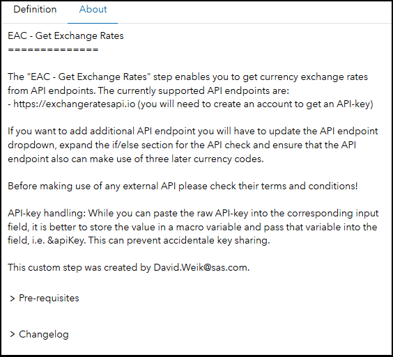

# EAC - Get Exchange Rates

## Description

The **EAC - Get Exchange Rates** custom step enables SAS Studio users to get current and historic currency exchange rates as table to work with. In the default mode it will always fetch the latest exchange rates. Unchecking the checkbox will enable you to get a historic date for which you want the currency exchange rates.

The following API providers are implemented:

- https://exchangeratesapi.io - You will need to create an account to use the service

Please ensure that you have read the terms and conditions of the service that you use.

## User Interface

* ### Definition tab ###

   

* ### About tab ###

   

## Updating the currency symbols

The base currency is set via a static dropdown. If a currency symbol is missing you can update the list using these steps:

1. Run this program and copy the log output of it - note you will need to provide an API-key for https://exchangeratesapi.io:

   ```SAS
   %let apiKey = <key-value>;
   
   filename _ger_sym temp;
   
   proc http
   	method='get'
   	url="http://api.exchangeratesapi.io/v1/symbols?access_key=&apiKey."
   	out=_ger_sym;
   quit;
   
   libname _ger_sym json;
   
   data _null_;
   	length entry $256.;
   	set _ger_sym.alldata(where=(p=2)) end=eof;
   	if eof then entry = catx('"', '{"value": ', P2, ',"label": ', Value, '}');
   	else entry = catx('"', '{"value": ', P2, ',"label": ', Value, '},');
   	put entry;
   run;
   
   libname _ger_sym clear;
   filename _ger_sym clear;
   ```

2. Open up the Get Exchange Rates custom step in the Custom Step Designer and switch to the Prompt UI tab

3. Search for *baseCurrency* and select all elements of the items attribute between the square brackets

4. Replace the elements in-between the square brackets with the result you copied from the SAS program log

## Requirements

SAS Viya 2023.08 or later

**API-key:** You will need to provide an API-key for the currency exchange provider endpoint.

## Usage

Find a demonstration of this step in this YouTube video: [Get Exchange Rates | Custom Step](https://youtu.be/zo9oP0Csb9E)

## Change Log

* Version 1.1 (03JAN2025)
    * Added EAC category name prefix
* Version 1.0 (04SEP2023)
    * Initial version
