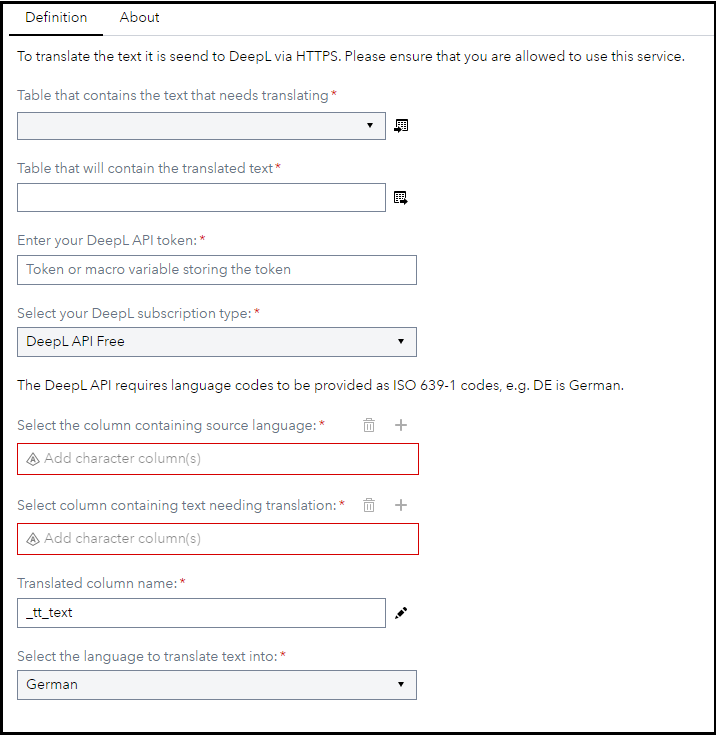
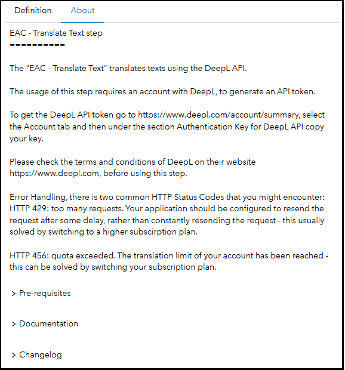

# EAC - Translate Text

## Description

The **EAC - Translate Text** custom step enables SAS Studio users to translate text using the [DeepL API](https://www.deepl.com/docs-api). This custom step supports both the free and the paid DeepL API, but it only supports the translation of strings and not whole documents.

## User Interface

* ### Definition tab ###

   

* ### About tab ###

   

## Requirements

2023.04 or later

You need a valid API key from DeepL, which also requires you having an active account with them. For commercial use of DeepL please check their [website](https://www.deepl.com/for-business/).

Currently the default translation dropdown comes implemented with German (DE), English (EN), French (FR) and Italian (IT) - you can expand this list if needed through the SAS Custom Step Designer by editing the dropdown list element with the ID **targetLang**. For a list of all supported languages please refer to the [DeepL API documentation](https://www.deepl.com/docs-api/translate-text/translate-text/).

## Usage

Find a demonstration of this step in this YouTube video: [Translate Text | Custom Step](https://youtu.be/2JMwhU9CLFc)

Also you can find an example SAS Studio Flow in this folder [Translate Text Example.flw](./extras/EAC-Translate-Text-Example.flw)

## Change Log

* Version 1.1 (03JAN2025)
    * Added EAC category name prefix
    * Updated the About page to the current template
* Version 1.0 (10MAY2023)
    * Initial version
