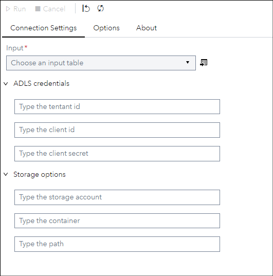
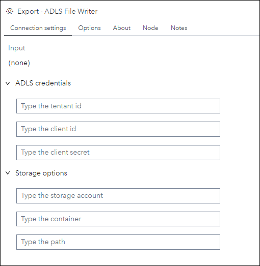
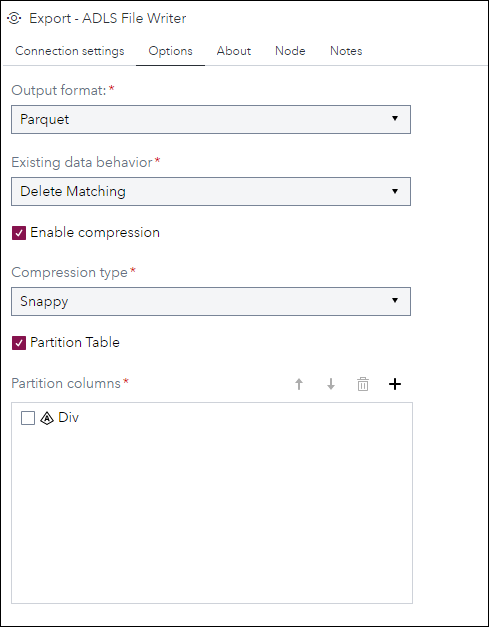
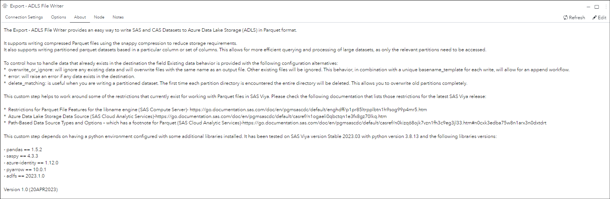

# ADLS File Writer

## Description

The **Export - ADLS File Writer** provides an easy way to write SAS and CAS Datasets to Azure Data Lake Storage (ADLS) in Parquet format.

It supports writing compressed Parquet files using the snappy compression to reduce storage requirements. 
It also supports writing partitioned parquet datasets based in a particular column or set of columns. This allows for more efficient querying and processing of 
large datasets, as only the relevant partitions need to be accessed.
To control how to handle data that already exists in the destination the field **Existing data behavior** is provided with the following configuration alternatives: 
 - **overwrite_or_ignore**: will ignore any existing data and will overwrite files with the same name as an output file. Other existing files will be ignored. This behavior, in combination with a unique basename_template for each write, will allow for an append workflow.
 - **error**: will raise an error if any data exists in the destination. 
 - **delete_matching**: is useful when you are writing a partitioned dataset. The first time each partition directory is encountered the entire directory will be deleted. This allows you to overwrite old partitions completely.

This custom step helps to work around some of the restrictions that currently exist for working with Parquet files in SAS Viya. Please check the following documentation that lists those restrictions for the latest SAS Viya release:
 - [Restrictions for Parquet File Features for the libname engine](https://go.documentation.sas.com/doc/en/pgmsascdc/default/enghdff/p1pr85ltrpplbtn1h9sog99p4mr5.htm) (SAS Compute Server) 
 - [Azure Data Lake Storage Data Source](https://go.documentation.sas.com/doc/en/pgmsascdc/default/casref/n1ogaeli0qbctqn1e3fx8gz70lkq.htm) (SAS Cloud Analytic Services)
 - [Path-Based Data Source Types and Options](https://go.documentation.sas.com/doc/en/pgmsascdc/default/casref/n0kizq68ojk7vzn1fh3c9eg3jl33.htm#n0cxk3edba75w8n1arx3n0dxtdrt) – which has a footnote for Parquet (SAS Cloud Analytic Services)

## User Interface

* ### Connection settings tab ###

   | Standalone mode | Flow mode |
   |-----------| --- |                
   |  |  |

* ### Options tab ###

   

* ### About tab ###

   

## Requirements

This customs step depends on having a python environment configured with the following libraries installed: 
> - pandas
> - saspy
> - azure-identity
> - pyarrow
> - adlfs

Tested on Viya version Stable 2023.03 with python environment version 3.8.13 and the libraries versions:
> - pandas == 1.5.2
> - saspy == 4.3.3
> - azure-identity == 1.12.0
> - pyarrow == 10.0.1
> - adlfs == 2023.1.0

## Usage

## Change Log

* Version 1.0 (APR2023)
    * Initial version
