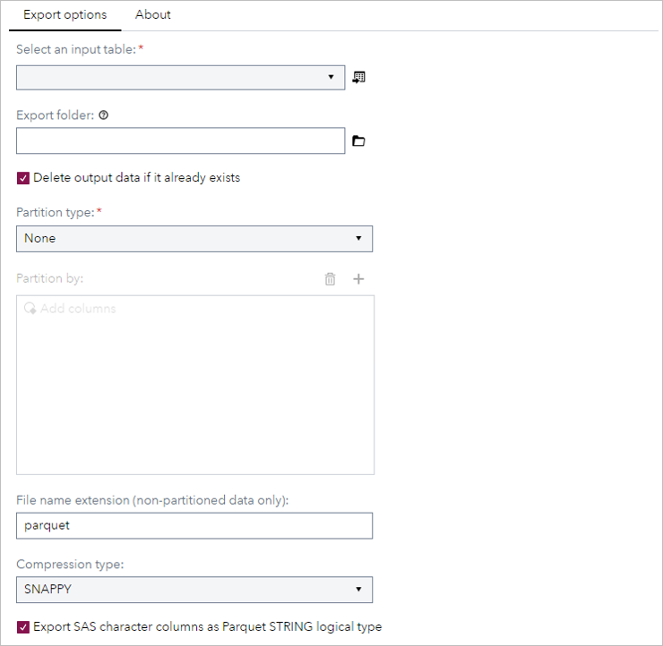
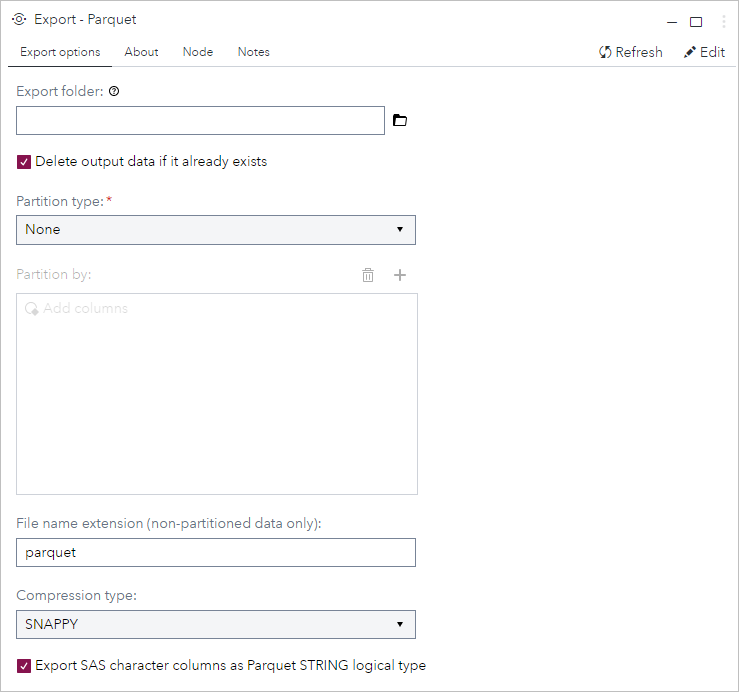
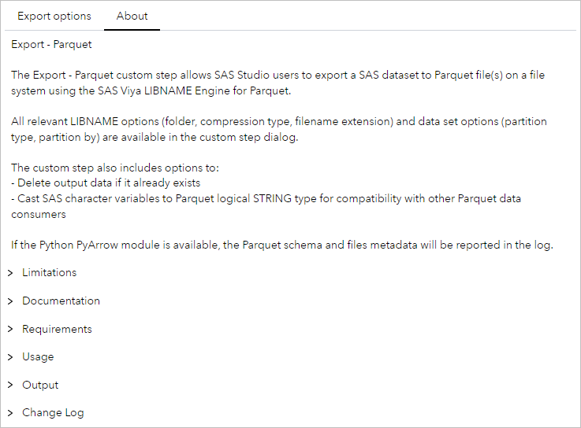
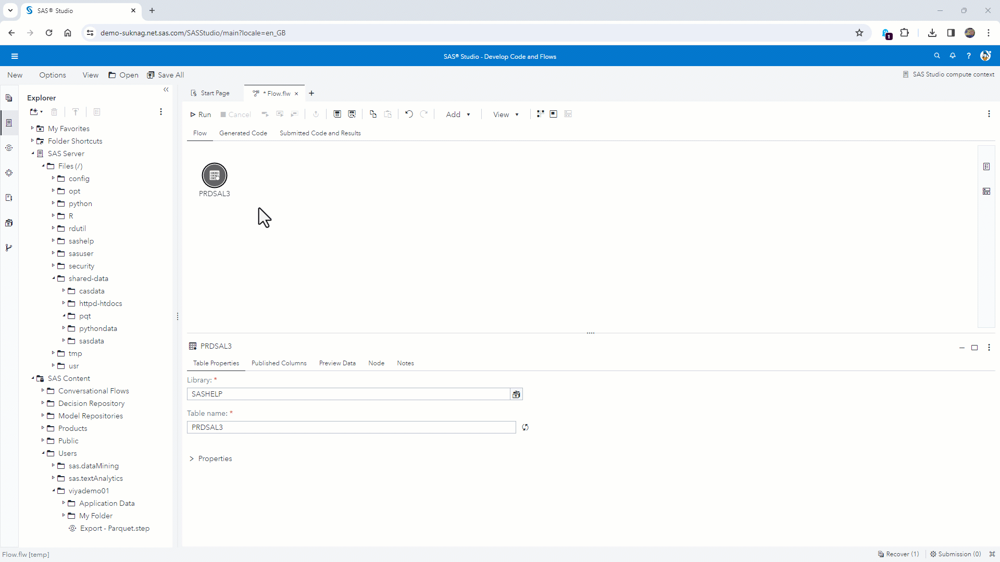

# Export - Parquet

## Description

The Export - Parquet custom step allows SAS Studio users to export a SAS dataset to Parquet file(s) on a file system using the SAS Viya [LIBNAME Engine for Parquet](https://go.documentation.sas.com/doc/en/pgmsascdc/default/enghdff/titlepage.htm).

All relevant [LIBNAME](https://go.documentation.sas.com/doc/en/pgmsascdc/default/enghdff/p0o5it2bceyl22n1obcw2riw34da.htm) options (folder, compression type, filename extension) and [data set](https://go.documentation.sas.com/doc/en/pgmsascdc/default/enghdff/p0s4vjgncxd7l9n1mr8s2day37p8.htm) options (partition type, partition by) are available in the custom step dialog.

The custom step also includes options to:
* Delete output data if it already exists
* Cast SAS character variables to Parquet logical [STRING](https://github.com/apache/parquet-format/blob/master/LogicalTypes.md#string) type for compatibility with other Parquet data consumers

If the Python [PyArrow](https://arrow.apache.org/docs/python/index.html) module is available, the Parquet schema and files [metadata](https://arrow.apache.org/docs/python/generated/pyarrow.parquet.ParquetDataset.html) will be reported in the log. 

Limitations:
* Does not support export to AWS S3, ADLS or GCS object storage. For export to ADLS, do check out the [ADLS File Writer](https://github.com/sassoftware/sas-studio-custom-steps/tree/main/Export%20-%20ADLS%20File%20Writer) custom step by [Alfredo Lorie](https://github.com/AlfredoLorie)

## User Interface

### Options tab

   | Standalone mode | Flow mode |
   | --- | --- |                  
   |  |  |

### About tab

   | Standalone & flow mode |
   | --- |                  
   |  |

## Requirements

Tested on SAS Viya version Stable 2023.11, with Python 3.9.16 and PyArrow 13.0.0.
- Requires SAS Viya 2023.10 or above (the [DBTYPE](https://go.documentation.sas.com/doc/en/pgmsascdc/default/enghdff/p0tocvixpavet1n1xsr86quwsts1.htm) option was added in 2023.10)
- Python must be [configured](https://go.documentation.sas.com/doc/en/pgmsascdc/default/proc/p1m1pc8yl1crtkn165q2d4njnip1.htm) on the SAS Viya platform
- [PyArrow](https://arrow.apache.org/docs/python/index.html) is not required, but if module is installed, Parquet metadata will be reported in the log

## Usage

### Demo

This short demo shows how to export the SASHELP.PRDSAL3 data set to Parquet files, partitioned by the COUNTRY column using the FILENAME [partition type](https://go.documentation.sas.com/doc/en/pgmsascdc/default/enghdff/p11evtc1gyn7awn1jgpilr5981nd.htm).

### Custom step options

| Field | Default | Description |
|-|-|-|
| Input table | None | Input table, connect using the input port in the Flow |
| Export folder | None | Target folder for the output data. See notes on output file naming below |
| Delete output data if it already exists | True | The target location [must be empty](https://go.documentation.sas.com/doc/en/pgmsascdc/default/enghdff/p11evtc1gyn7awn1jgpilr5981nd.htm) for partitioned data. Check this box to delete data in the export folder if it exists |
| Partition type | None | Can be DIRECTORY, FILENAME, HIVE. Details in the [PARTITION_TYPE](https://go.documentation.sas.com/doc/en/pgmsascdc/default/enghdff/p11evtc1gyn7awn1jgpilr5981nd.htm) option documentation |
| Partition by | - | One or more columns that determine the table's partitions. Details in the [PARTITION_BY](https://go.documentation.sas.com/doc/en/pgmsascdc/default/enghdff/p0h12prerc11lbn1xhd57kj7hwyo.htm) option documentation|
| File name extension (non-partitioned data only) | parquet | Specifies the file extension for SAS to write Parquet files. Details in the [FILE_NAME_EXTENSION](https://go.documentation.sas.com/doc/en/pgmsascdc/default/enghdff/p0zbefnebg0p3ln19139ion5tsti.htm) option documentation |
| Compression type | SNAPPY | Controls the compression type. Details in the [COMPRESS](https://go.documentation.sas.com/doc/en/pgmsascdc/default/enghdff/n0r6numhme4ojdn10fycx1nybryf.htm) option documentation |
| Export SAS character columns as Parquet STRING logical type | True | If set, this option will cast SAS dataset character variables to Parquet [STRING](https://github.com/apache/parquet-format/blob/master/LogicalTypes.md#string) logical type. (By default, the SAS LIBNAME Engines for Parquet uses a [BYTE_ARRAY](https://parquet.apache.org/docs/file-format/types/)) |

### Output

Using the example in the demo video above, if the SASHELP.PRDSAL3 data set is exported to the folder /shared-data/pqt, the following files are created with each [partition type](https://go.documentation.sas.com/doc/en/pgmsascdc/default/enghdff/p11evtc1gyn7awn1jgpilr5981nd.htm):

| Partition type | Example output files |
| - | - |
| None | ./prdsal3.parquet |
| DIRECTORY | ./prdsal3/Canada/part0.parquet ./prdsal3/Mexico/part0.parquet ./prdsal3/U.S.A./part0.parquet|
| FILENAME | ./prdsal3/Canada_part0.parquet ./prdsal3/Mexico_part0.parquet ./prdsal3/U.S.A._part0.parquet |
| HIVE | ./prdsal3/COUNTRY=Canada/part0.parquet ./prdsal3/COUNTRY=Mexico/part0.parquet ./prdsal3/COUNTRY=U.S.A./part0.parquet
|

## Change Log

* Version 1.0 (15DEC2023) 
    * Initial version