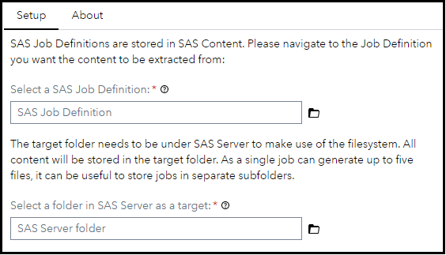
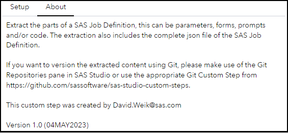

# Extract Job Definition Metadata

The **Extract Job Definition Metadata** custom step helps you to extract all content (SAS Code, HTML forms, XML Prompts and Parameters) from a SAS Job Definition. The extracted content is stored in SAS Server.

If you want to leverage the additional integration with Git you can use the Git Repositories pane in SAS Studio or the Git Custom Step, refer this [page](https://github.com/sassoftware/sas-studio-custom-steps/blob/main/Git%20-%20Clone%20Git%20Repo/Overview%20of%20Git-related%20Custom%20Steps.md) which explains the motivation behind custom steps which surface Git integration functionality.

This step makes use of the SAS Viya Job Definitions REST API endpoint - see the documentation [here](https://developer.sas.com/apis/rest/Compute/#job-definitions).

## User Interface

### Setup

### About

## Requirements

SAS Viya 2023.11 or later.

## Usage

Find a demonstration of this step in this YouTube video: [Extract Job Metadata |Custom Step](https://youtu.be/8c-LAu8zArM).

## Change Log
Version: 1.1.   (23NOV2023)
  - Support for JSON prompts added

Version: 1.0.   (04MAY2023)
  - Initial Version

