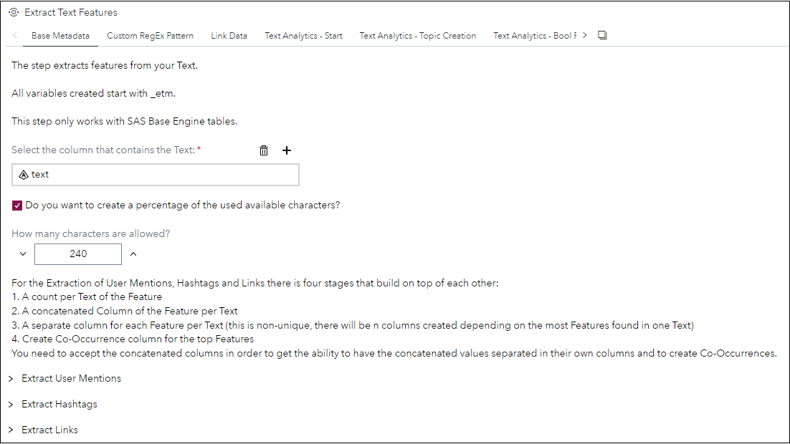
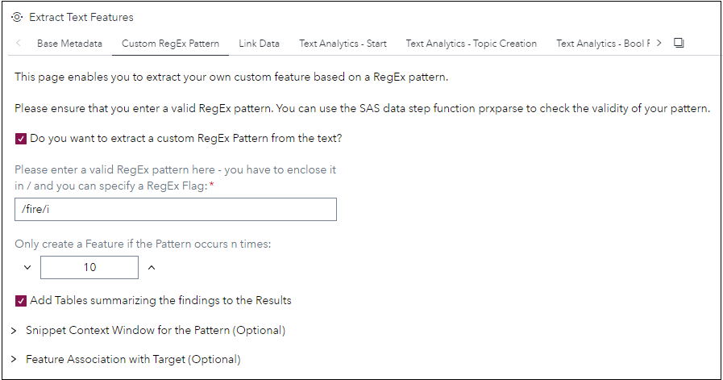
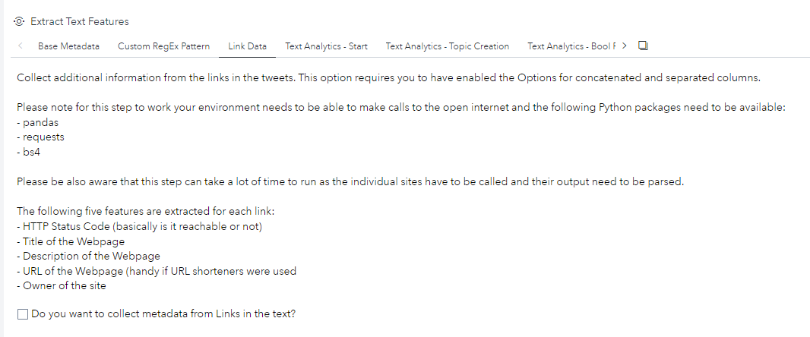
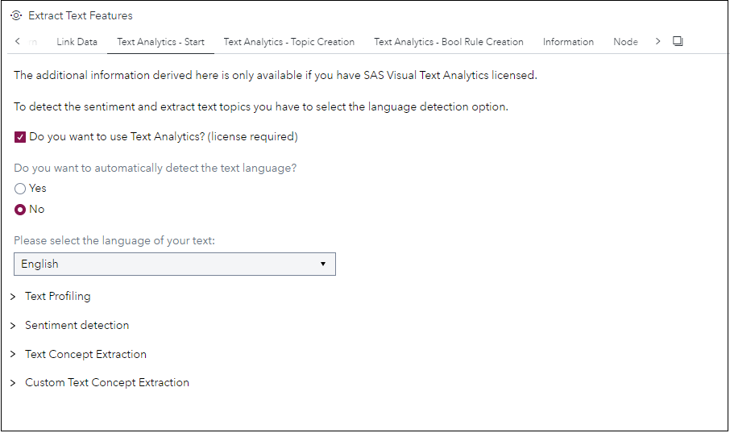
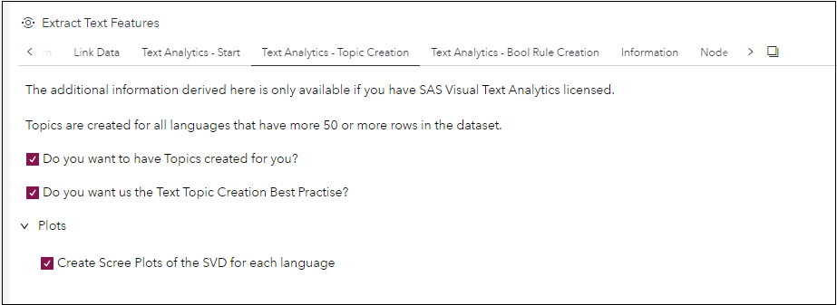
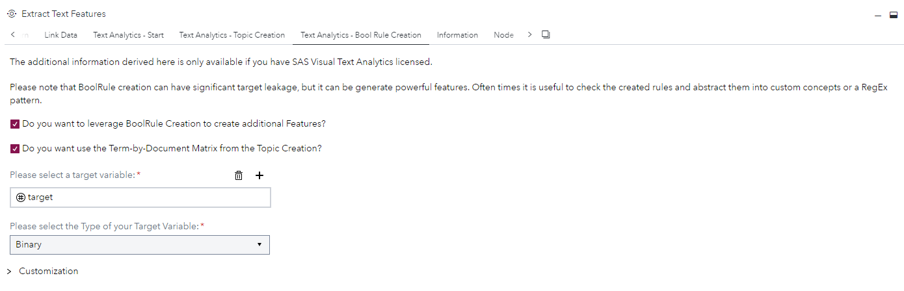
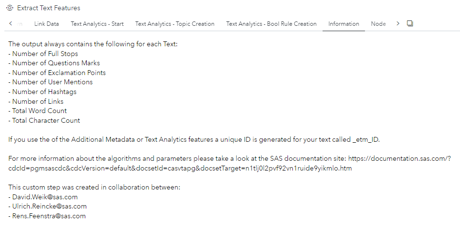

# Extract Text Features

## Description

The **Extract Text Features** custom step enables SAS Studio users to extract additional features from text fields. This steps creates a varying amount of features based on the selected options within the step. At a minimum it generates eight features but it can potentially generate hundreds of features.

The generated features range from simple features based on the occurrence of exclamation points in the text to extracting sentiment and text topics from the text.

For more information about all of the Advanced Text Analytics Features please refer to the [SAS Documentation](https://documentation.sas.com/?cdcId=pgmsascdc&cdcVersion=default&docsetId=casvtapg&docsetTarget=n1tlj0l2pvf92vn1ruide9yikmlo.htm).

## User Interface

* ### Base Metadata ###

   
   
* ### Custom RegEx Pattern ###

   

* ### Link Data ###

   
   
   ### Text Analytics Start ###
   
   
   
   ### Text Analytics Topic Creation ###
   
   
   
   ### Text Analytics Bool Rule Creation ###
   
   
   
   ### Information ###
   
   

## Requirements

2022.10 or later.

For the gathering of Link Metadata you need to provide a Python runtime to the Compute Context containing at least the following three packages: pandas, requests & bs4.

For the Advanced Text Analytics features you need to have a SAS Visual Text Analytics license.

For a demonstration of the usage of this step please check out this [YouTube video](https://youtu.be/Dqk5bRhattk) - the example flow is included [here](extras/Extract-Text-Features-Example.flw).

The video makes use of the train.csv data from this [Kaggle Challenge](https://www.kaggle.com/competitions/nlp-getting-started/data?select=train.csv) - to download the data you need an account with Kaggle.

## Change Log

* Version 1.0 (27112022)
    * Initial version
