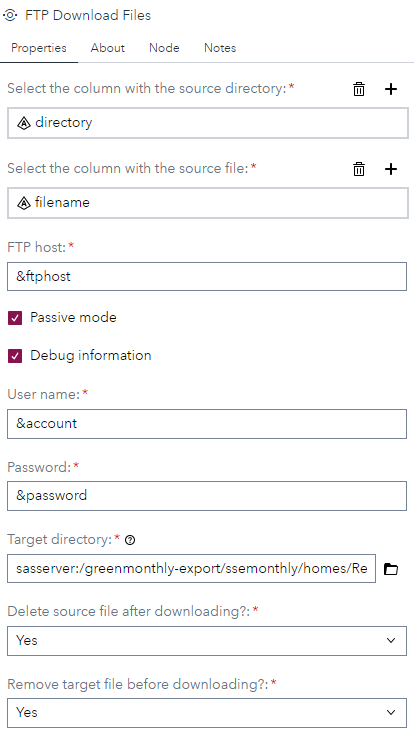
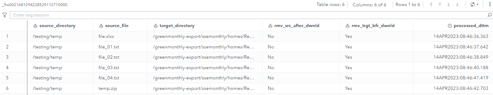

# FTP Download Files

## Description

The "**FTP Dowload Files**" custom steps lets you download files from an FTP server, based on an input table containing the directory and filename.

## SAS Viya version Support

Created and tested on Viya 4, Stable 2023.01

## Important
- The transfer mode is always binary.
- The custom step is created and tested for an FTP server installed on Linux.
- The output table only contains files that are downloaded successfully.

## User Interface

### Tab: Properties

- **directory column**: Select the source table column that contains the FTP directory from which you want to download one or more file from.
- **filename column**: Select the source table column that contains the file name(s), in the specified FTP directory, you want to download.
- **FTP Host**: Specifiy the FTP host name or IP address. As you can see, this also can be a macro variable which can be defined, for example, in an initialization script.
- **Passive mode**: Specifies that the transfer mode to the FTP server is passive.
- **Debug Information**: Here you can set the debug option where the complete process is logged.
- **User name**: Specifies the user name with which you want to connect to the FTP server. 
- **Password**: The password for the user name with which you want to connect to the FTP server. Note that here you can use a SAS encrypted password.
- **Target directory**: Specify the physical target/client directory.
- **Delete source file after download**: Here you can specify that a source file needs to be deleted after it has been downloaded. The default value is **No**.
- **Delete target file before download**: Here you can specify that a target file needs to be delete before a new version is downloaded. The default value is **Yes**

## Usage
Download the .step file, upload it into your environment and start using it, for example, as shown:

Note that the [**FTP Directory Listing**](../FTP%20Directory%20Listing/README.md) custom step can be used to generate the input table for this custom step and that the FTP host-, user name- and password settings are defined as macro variables in the initialization step.

## Output port

The output tables contains, after running the custom step, six columns:
- **source_directory**: The directory from which the file is downloaded from.
- **source_file**: The downloaded file.
- **rmv_src_after_dwnld**: It stands for 'remove source after download'. The value can be 'Yes' or 'No'.
- **rmv_trgt_bfr_dwnld**: It stands for 'remove target file before download'. The value can be 'Yes' or 'No'.
- **processed_dttm**: This is the date and time the file got downloaded.

Note that the table only contains rows for files that got downloaded successfully.

## Change Log

Version 1.1 (14AUG2024): Published externally.

Version 1.0 (14APR2023): Initial version. Published internally.