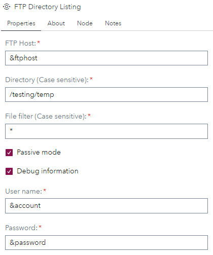
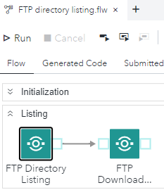

# FTP directory listing

## Description

The "**FTP directory listing**" custom steps creates a table with the FTP directory contents, specified on the properties tab.

## SAS Viya Version Support

Created and tested on Viya 4, Stable 2023.01

## Important
This custom step is created and tested for an FTP server installed on Linux. 

## Typical usage
If you have a requirement to retrieve files from an FTP server, this custom step can be a starting point of your implementation.

## User Interface

### Tab: Properties

- **FTP Host**: Specifiy the FTP host name or IP address. As you can see, this also can be a macro variable which can be defined, for example, in an initialization script.
- **Directory**: Here you can enter the directory on the FTP server for which you want a directory listing. The default value is **/**. Please note that this value is case sensitive.
- **File filter**: Here you can specify the file filter. The default value is **'*'**.
- **Passive mode**: Specifies that a connection to the FTP server is passive.
- **Debug Information**: Here you can set the debug option where the complete process is logged.
- **User name**: Specifies the user name with which you want to connect to the FTP server. 
- **Password**: The password for the user name with which you want to connect to the FTP server. Note that here you can use a SAS encrypted password.

## Usage

Download the .step file, upload it into your environment and start using it, for example, as shown:

Note that the FTP host-, User name- and password settings are defined as macro variables in the initialization step.

## Output port

The output tables contains, after running the custom step, two columns, the directory name and the filename of the file(s) found on the FTP server.

## Change Log

Version 1 (14APR2023): Initial version.