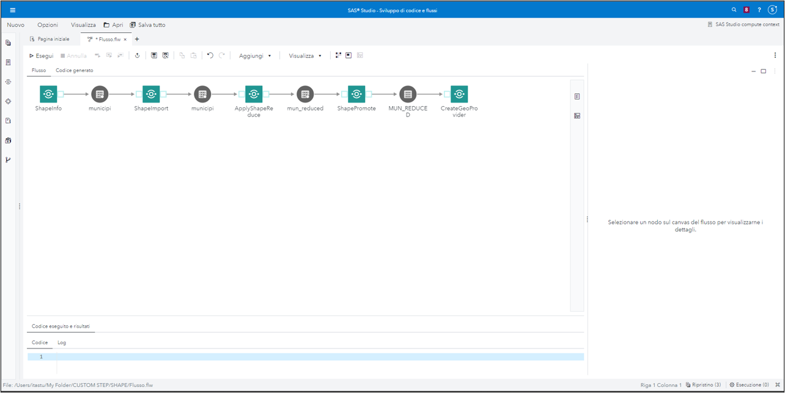
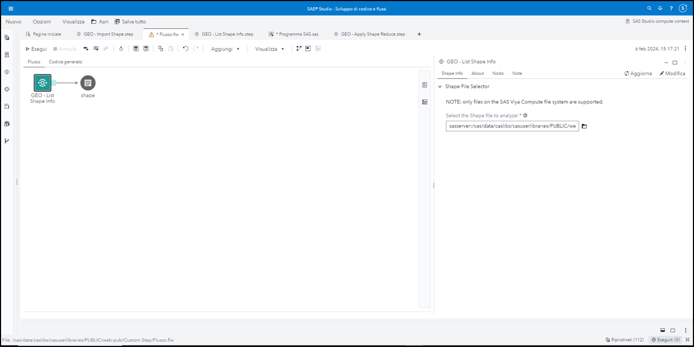
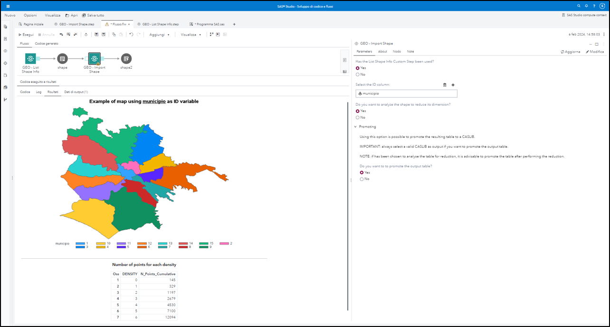
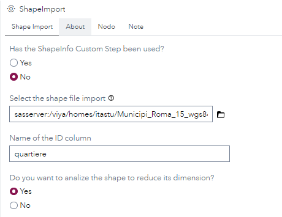
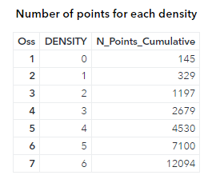
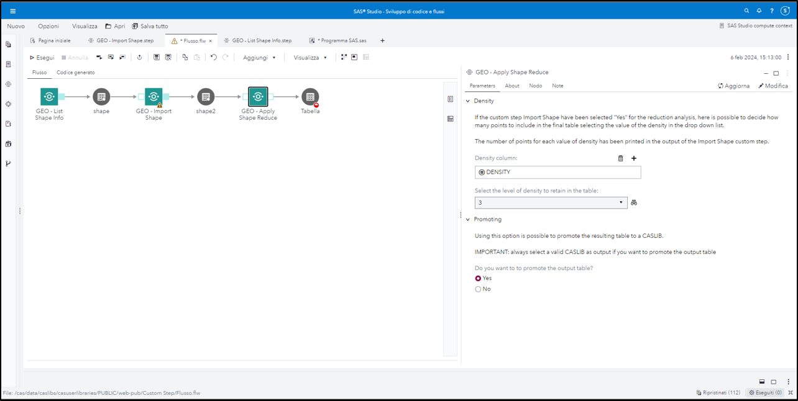
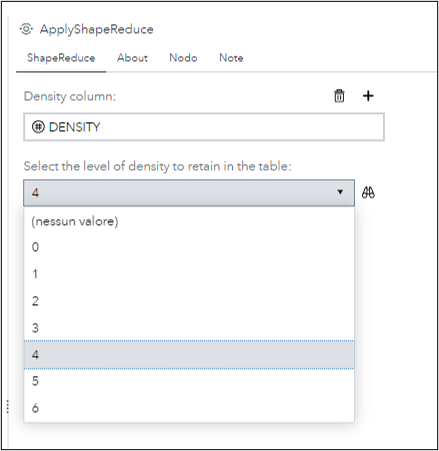
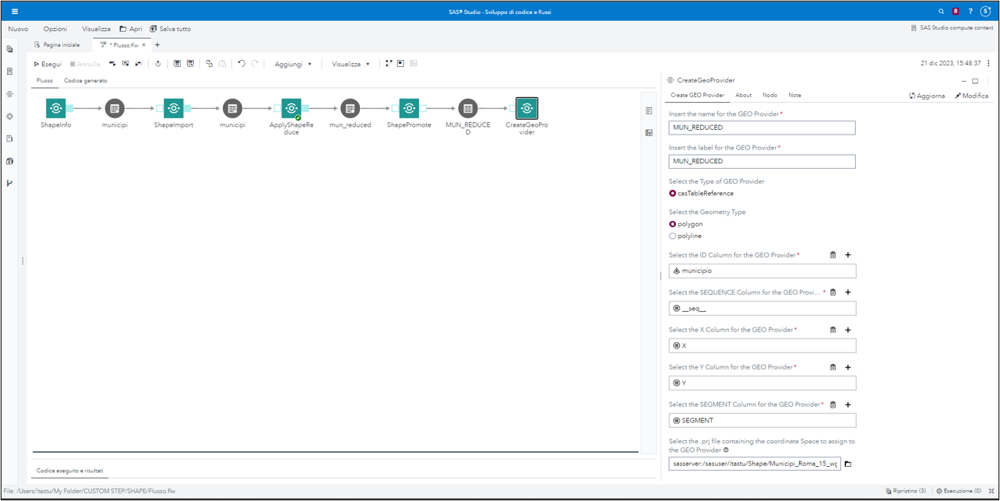

# GEO - Shape Files

## Description

A shapefile refers to a file format used in geographic information systems (GIS) to store geospatial data and consists of several files 
that work together to store this information.
 
In SAS Visual Analytics, shapefiles can be used to enhance geographical visualizations by providing additional geographic information and 
enabling the representation of data on maps.
This folder contains five SAS Studio custom steps which help you having information, importing, reducing, promoting Shape Files, and 
creating GEO PROVIDERS.

## SAS Viya Version Support
Tested in SAS Viya 4, Stable 2022.10

## User Interface

**Refer the "About" tab on each of the individual steps for more details on what they are used for.**

### List Shape Info

This step help you understand the data contained in the Shape File you are reading.
The only parameter required is location of the .shp file.

### Import Shape

This custom step will import data contained in the .shp file and can also analyze it for reduction and can promote the table to a CASLIB.
The output of this step will contain a map based on the ID selected al if requested a table with the analysis for reduction.
The parameter required are:

1. The ID column <ins>**if the List Shape Info custom step has been used**</ins>:

2. The location of the .shp file and the ID column <ins>**if the List Shape Info custom step has not been used**</ins>:

3. If 'Yes' is selected for the question "Do you want to analyze the shape to reduce its dimension?", the custom step will analyze the 
table and print a table with the analysis for 
reduction:

4. Promoting: Using this option is possible to promote the resulting table to a CASLIB.

**IMPORTANT**: always select a valid CASLIB as output if you want to promote the output table.

**NOTE**: if has been chosen to analyse the table for reduction, it is advisable to promote the table after performing the reduction.

### Apply Shape Reduce

To use this step is mandatory to run before it the Import Shape custom step.
Based on the results of the previous step is possible to decide how many points to include in the final table.

**IMPORTANT:**
Remember that by default, SAS Visual Analytics can retrieve up to 250,000 polygon vertices at a time.
So, it’s useful to select a density with less than 250.000 N_Points_Cumulative. This can be view in the output of the Import Shape step:

The only parameter required is the level of density, which can be selected in the prompt of the step:

Promoting: Using this option is possible to promote the resulting table to a CASLIB.

IMPORTANT: always select a valid CASLIB as output if you want to promote the output table.

### Create Geo Provider

This will use the CAS table promoted by the Promote Shape step to create a custom GEO Provider for SAS Visual Analytics.
The parameters needed are:

1. Name for the GEO Provider
2. Label for the GEO Provider

	***User can use name or label freely.***

3. The Type of GEO Provider 

	***The only choice for now is casTableRederence.***
	
4. The Geometry Type, based on the shape file 

	***Is possible to select polygons or polylines.***

5. The ID Column 
6. The SEQUENCE Column
7. The X Column
8. The Y Column
9. The SEGMENT Column

	***For all this columns user can use the prompts to select one of the variables contained in the promoted table.***
	***For some of this prompts the values are already entered, because in most cases the variables have those names, but user is free to change them.***
	
10. The .prj file containing the coordinate Space to assign to the GEO Provider

	***This file is one of the files that make up a Shape File.***

## Requirements

1. Tested on SAS Viya version Stable 2022.10.
2. A SAS Viya 4 environment with SAS Studio Flows.
3. The Import Shape custom step require SAS/GRAPH.
4. To run Create Geo Provider user must have rights to create a GEO Provider in SAS Visual Analytics.

## Change Log

* Version 1.0 (21DEC2023) 
    * Initial version
