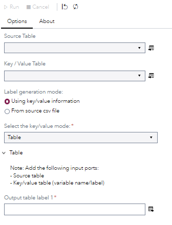
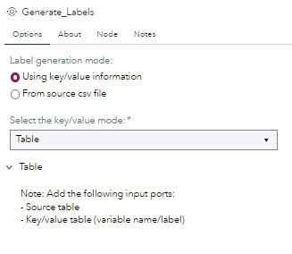
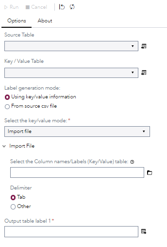
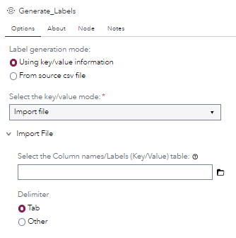
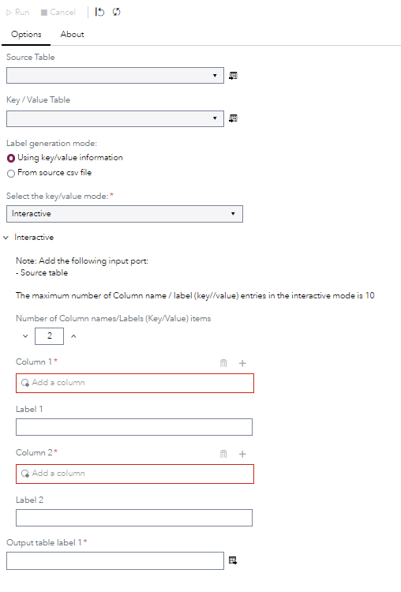
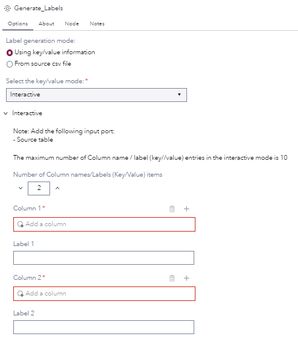
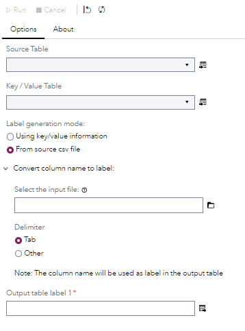
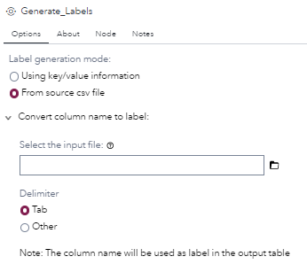
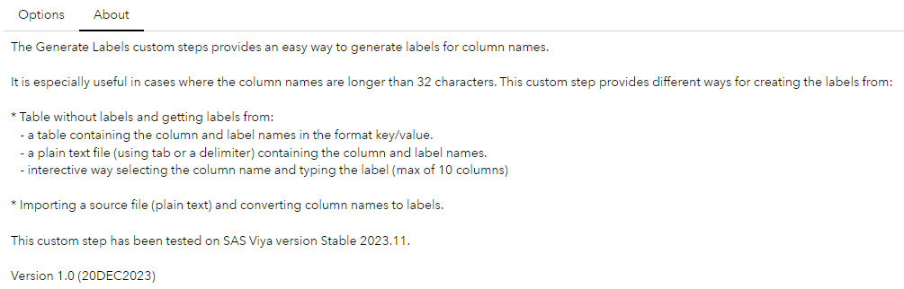

# Generate Labels

## Description

The **Generate Labels** custom steps provides an easy way to generate labels for column names.

It is especially useful in cases where the column names are longer than 32 characters. This custom step provides different ways for creating the labels from:

- **Table without labels** and getting labels from:
   - a table containing the column and label names in the format key/value.
   - a plain text file (using tab or a delimiter) containing the column and label names.
   - interective way selecting the column name and typing the label (max of 10 columns)

- Importing a source file (plain text) and **converting column names to labels**.

## User Interface

* ### Options tab (column/labels table) ###

   | Standalone mode | Flow mode |
   |-----------| --- |                
   |  |  |

* ### Options tab (column/labels file) ###

   | Standalone mode | Flow mode |
   |-----------| --- |                
   |  |  |

* ### Options tab (interactive labels) ###

   | Standalone mode | Flow mode |
   |-----------| --- |                
   |  |  |

* ### Options tab (coverting column names to labels) ###

   | Standalone mode | Flow mode |
   |-----------| --- |                
   |  |  |

* ### About tab ###

   

## Requirements

This custom step has been tested on SAS Viya version Stable 2023.11.

## Usage

## Change Log

* Version 1.0 (20DEC2023) 
    * Initial version