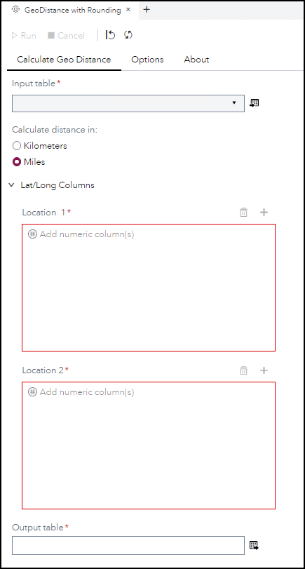
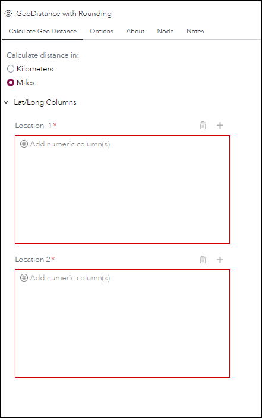
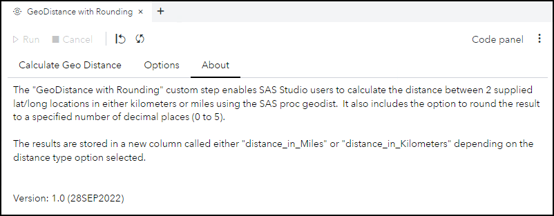
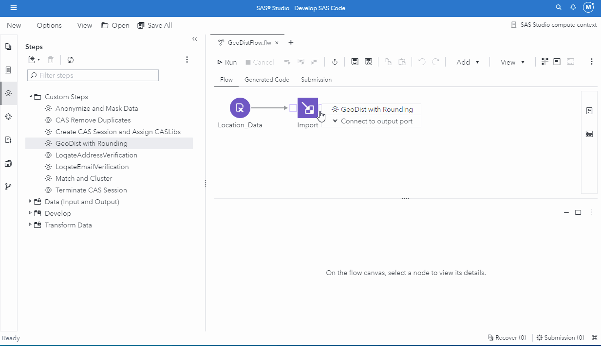

# GeoDistance with Rounding

## Description

The **GeoDistance with Rounding** custom step enables SAS Studio users to calculate the distance between 2 supplied lat/long locations in either kilometers or miles using the SAS proc **geodist**.  It also includes the option to round the result to a specified number of decimal places (0 to 5).

## User Interface

* ### **Calculate Geo Distance** tab ###

   | Standalone mode | Flow mode |
   | --- | --- |
   |  |  |

* ### **Options** tab ###

   

* ### **About** tab ###

   

## Requirements

* SAS Viya 2020.1.5 or later
* Input contains two latitude/longitude columns for calculation of distance between them

## Usage

## Change Log

* Version 1 (16SEP2022)
    * Initial version
