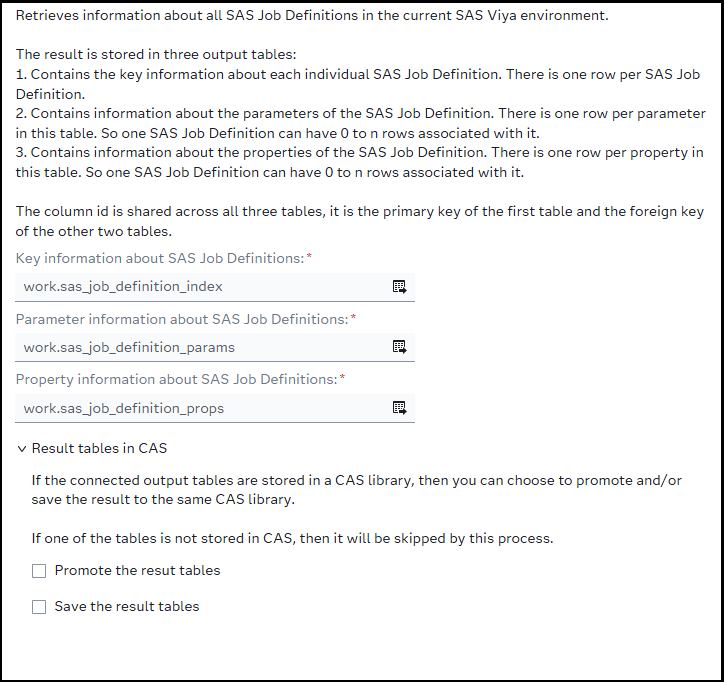
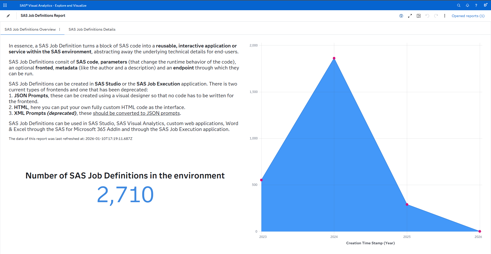
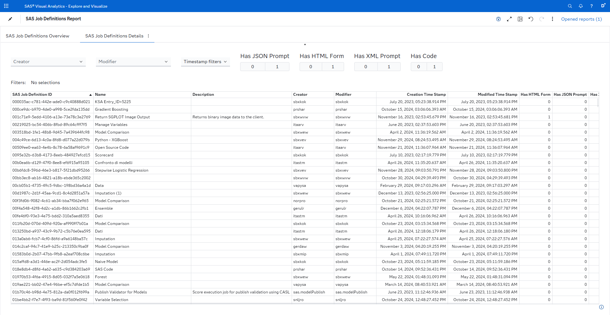

# SAS Job Definition Information

The ** SAS Job Definition Information** custom step looks up all SAS Job Definitions in the current SAS Viya environment via the */jobDefinitions/definitions* API endpoint and then creates three output tables that contain all of the information collected.

This step makes use of the SAS Viya Job Definitions REST API endpoint - see the documentation [here](https://developer.sas.com/apis/rest/Compute/#job-definitions).

This folder also contains a SAS Visual Analytics report to visualize this data - see chapter below.

## User Interface

### Options

## SAS Visual Analytics report

The [SAS Job Definitions Report](./SAS Job Definitions Report.json) file is a transfer package that can be imported using SAS Environment Manager and import a SAS Visual Analytics report of the same name to the /Public folder in SAS Content. This report is build on top of the data that this custom step creates. You can view a demonstration of this report in the video linked below.

Here are two screenshots of the report:

## Requirements

SAS Viya 2025.12 or later.

Please note that this step can only find SAS Job Definitions that you have access to.

## Usage

Find a demonstration of this step and the report in this YouTube video: [Get SAS Job Definition Information |Custom Step](https://youtu.be/hr0Wim6K5v8).

## Change Log
Version: 1.0.   (10JAN2025)
  - Initial Version

