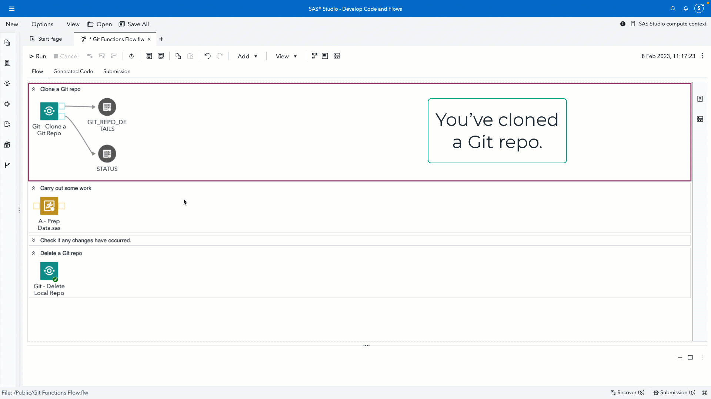
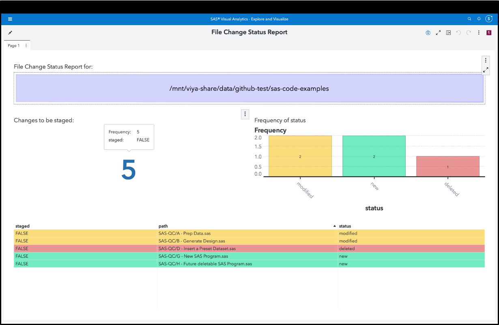
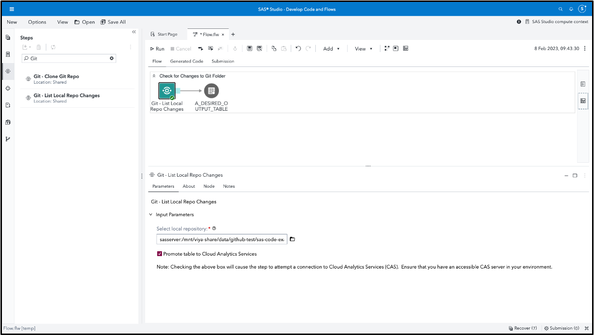

# Git - List Local Repo Changes

This custom step identifies and lists changed files inside a local copy of a Git repository folder.  A change is defined as either a new file created, an existing file deleted, or an existing file getting modified. 

The custom step also informs you if such changes have been "staged", i.e. marked for a future commit to a remote Git repository.

**Git repositories facilitate easy collaborative development of code. Analysts as well as administrators will find this step useful in terms of logging changes and earmarking them for commit to a centralized codebase.** 

**Here's a general idea of how this custom step works (the below is an animated GIF)**

which can be further visualized as follows (note this is optional, details below):

## SAS Viya Version Support
Tested in Viya 4, Stable 2022.11

## Requirements

1. A SAS Viya 4 environment (monthly release 2022.11 or later) with SAS Studio Flows.

2. **Optional: a connection to CAS:** If you choose to use the "Promote to CAS" option, this custom step requires Cloud Analytics Services. Ensure you have access to a CAS server so that the custom step can run successfully.

## User Interface

### Parameters

#### Input Parameters

1. Local repository folder: This should be a folder on your filesystem.  Ensure that this is a Git folder, i.e., it was originally cloned from a Git repository.

2. (Optional) Promote table to Cloud Analytics Services : if checked, this will lead to the output table getting loaded to a CAS (in-memory) table, therefore making it convenient to be viewed in Visual Analytics.  This means that you require the CAS server to be operational (and accessible) at the time of running this custom step.

#### Output ports / tables

1. Git changes table: Connect a table to the output port which will be used to store the list of changed files (if any) along with the type of change (new, modified, deleted) and whether this change has been staged (true/false).  

### Example Visual Analytics Report
While this is not essential for the custom step to run, we also provide an example of a Visual Analytics report template, which can be used to monitor changes across local repositories of Git folders.  Refer this [page](./extras/Import%20Report%20Template.md) to understand how to import the report template into your environment.

### SAS documentation

1. [Understanding Git Integration in SAS Studio](https://go.documentation.sas.com/doc/en/sasstudiocdc/default/webeditorcdc/webeditorug/p0puc7muifjjycn1uemlm9lj1jkt.htm)
2. [Using Git Functions in SAS](https://go.documentation.sas.com/doc/en/pgmsascdc/default/lefunctionsref/n1mlc3f9w9zh9fn13qswiq6hrta0.htm)
3. [GIT_STATUS SAS function](https://go.documentation.sas.com/doc/en/pgmsascdc/default/lefunctionsref/p0yqhk2d71ywe7n1dyhko23hrhmo.htm)
4. [GIT_STATUS_GET SAS function](https://go.documentation.sas.com/doc/en/pgmsascdc/default/lefunctionsref/p08kns1urxcrfyn1uj7k2g26owlf.htm)

## Installation & Usage
1. Refer to the [steps listed here](https://github.com/sassoftware/sas-studio-custom-steps#getting-started---making-a-custom-step-from-this-repository-available-in-sas-studio).

## Change Log
Version : 1.0.   (07FEB2023)

