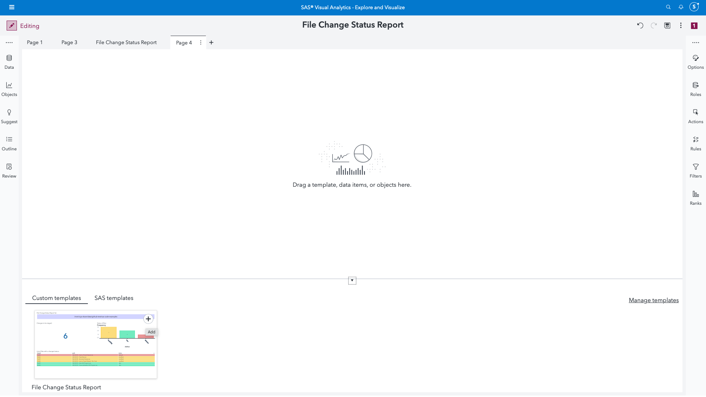

# Importing the SAS Visual Analytics Report Template

To appreciate the Git - List Local Repo Changes custom step better, we also provide an example of a Visual Analytics report template to visualize files with a changed status.

This template can be imported into your preferred Viya environment (you **do not** need to have administrator privileges for the same) and will appear as part of the Custom Templates section within SAS Visual Analytics as shown below.

Click on the + sign to import the report template as a new page and assign the following data elements from the Git status change table which was output from the custom step.

1. For the treemap titled "File Status Change Report for:", assign *folderName* as the variable.
2. For the key-value object titled "Changes to be staged:", assign *Frequency*.
3. For the bar chart titled "Status of files:", assign *status* as the Category and *Frequency* as the measure variable.
4. For the list table below titled "List of files with a changed status:", select any detailed fields you desire. Suggestions are *staged*,*path*, and *status*.

Note that these are only suggestions.  You are free to create a Visual Analytics report customized for your needs, based on the output data.

## Steps to import the Visual Analytics report template

The steps to import the template are provided in the following animated gif.

1. In your SAS Viya application, navigate to Manage Environment on the main menu.
2. Click on Content and navigate to SAS Folders.
3. Click on the import button as shown in the GIF.
4. Upload the [transfer package](./File%20Change%20Status%20Report.json) json found in this folder.
5. Move to the Mapping tab and click on Import.
6. Wait a short while and ensure that the report template has been imported successfully.
7. Verify you are able to access the template from within SAS Visual Analytics (main menu -> Explore and Visualize).

