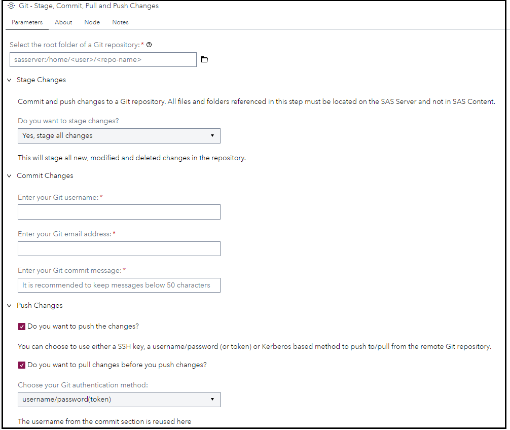
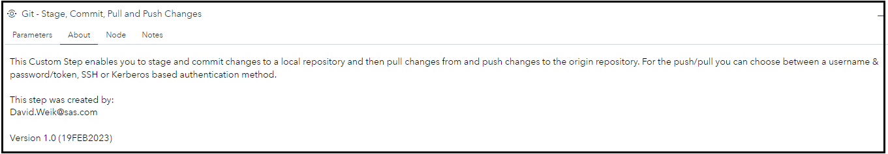

# Git - Stage, Commit, Pull and Push Changes

The **Git - Stage, Commit, Pull and Push Changes** custom step helps you to stage, commit, pull and push changes made in SAS Studio to Git.

Please refer this [page](https://github.com/sassoftware/sas-studio-custom-steps/blob/main/Git%20-%20Clone%20Git%20Repo/Overview%20of%20Git-related%20Custom%20Steps.md) which explains the motivation behind custom steps which surface Git integration functionality.

## Which Git repositories are we talking about?

This custom step can connect to and pull code from public and restricted access (subject to access rights) Git repositories on GitHub or GitLab. While not tested, it can also access code from a corporate Git repository (for example, gitlab.company.com) if the SAS Viya environment is within the same Virtual Private Network (VPN).

## User Interface

### Parameters

### About

## Requirements

SAS Viya 2023.01 or later.

You need a Git repository and the authentication + authorization to make changes and push them to the origin.

## Usage

Find a demonstration of this step in this YouTube video: [Git - Commit and Push Changes |Custom Step](https://youtu.be/o60EvqGxwKs).

## Documentation

The following Git functions are used:

- [Git Status](https://go.documentation.sas.com/doc/en/pgmsascdc/default/lefunctionsref/p0yqhk2d71ywe7n1dyhko23hrhmo.htm)
- [Git Status Get](https://go.documentation.sas.com/doc/en/pgmsascdc/default/lefunctionsref/p08kns1urxcrfyn1uj7k2g26owlf.htm)
- [Git Index Add](https://go.documentation.sas.com/doc/en/pgmsascdc/default/lefunctionsref/n0xgvzmg1knw9an11pjcd59ex35i.htm)
- [Git Commit](https://go.documentation.sas.com/doc/en/pgmsascdc/default/lefunctionsref/p1br7kvpnuu18mn0zx71zjpe6dj6.htm)
- [Git Push](https://go.documentation.sas.com/doc/en/pgmsascdc/default/lefunctionsref/p1pudivtmsz5iqn189rn1lkadar7.htm)

## Change Log
Version : 1.0.   (19FEB2023)

